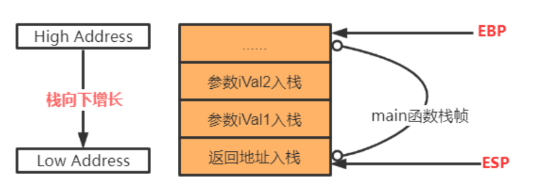

[TOC]


# 零、VS反汇编

这部分是我在学习如何反汇编C代码的过程中学习搜索的内容

## 流程

打断点，然后


打断点运行之后点击：调试，窗口，反汇编。

debug过程中可以看内存帮助理解

## 寄存器解析

EAX 是"累加器"(accumulator), 它是很多加法乘法指令的缺省寄存器。

EBX 是"基地址"(base)寄存器, 在内存寻址时存放基地址。

ECX 是计数器(counter), 是重复(REP)前缀指令和LOOP指令的内定计数器。

EDX 则总是被用来放整数除法产生的余数。

ESI/EDI分别叫做"源/目标索引寄存器"(source/destination index),因为在很多字符串操作指令中, DS:ESI指向源串,而ES:EDI指向目标串.

EBP是"基址指针"(BASE POINTER), 它最经常被用作高级语言函数调用的"框架指针"(frame pointer). 在破解的时候,经常可以看见一个标准的函数起始代码:

> 　	　	push ebp ;保存当前ebp
> 　	　	mov ebp,esp ;EBP设为当前堆栈指针
> 　	　	sub esp, xxx ;预留xxx字节给函数临时变量.
> 　	　	...

EIP寄存器存储着我们cpu要读取指令的地址，没有了它，cpu就无法读取下面的指令（通俗点讲cpu就无法执行。每次相应汇编指令执行完相应的eip值就会增加。

EFL是标志寄存器，它的每一位作用如下：


如一个flag寄存器为： 0000 0206    （16进制）
拆成（2进制)：0000 0000 0000 0000 0000 0010 0000 0110

第六位：ZF位（Zero flag)——使用较多
若结果为0则将其置1，反之置零。
经常与CMP等指令一起用


## 栈的解析




## 关于指针

 取值：mov eax ,[ebp-18h]， mov [ebp-1ch],eax       相当于 ： int a= b；

 取地址：lea ecx , [ebp-18h]，  mov [ebp - 1ch ] , ecx  相当于 ： int *p= &b;


## 反汇编的过程中搜索内容

xor：异或，相同则0，相异为1

lea（load effective address）：这条指令是将源操作数所在的地址传送到目的操作数中去
rep：这条指令意为将紧跟其后的指令重复ecx次。
stos：将eax中的内容放入目的操作数指定的地址。

跳转指令：

> je：相等跳转，标志位为1时跳转。
> jne：当ZF=0，转至标号处执行。
>
> ```
> JE   ;等于则跳转
> JNE  ;不等于则跳转
> JZ   ;为 0 则跳转
> JNZ  ;不为 0 则跳转
> ```
>
> jge：大于等于跳转
>
> A（above）大于，B（below）小于，E（equal）等于，用于比较无符号数
> G（great）大于，L（less than）小于， E（equal）等于，用于比较带符号数


外平栈和内平栈

> push 寄存器 将一个寄存器的 数据入栈 
> *pop 寄存器* 用一个寄存器接受出栈的数据
>
> <u>**外平栈：**</u>
>
> > push edx 
> > call 12345678 
> > return 0x4
>
> 调用函数有1个参数，那么就要push 一个参数,这里edx作为第一个参数。 然后call 函数地址。再retn的时候会 retn 0x4 . retn 4等价于 pop eip, add esp 4. 先出栈eip ，让cpu指向调用call前的指令，再 add esp 4，是让栈顶指针 +4 ，就是像栈底移动4，原因是因为在调用call之前，有一个 push edx，这额操作让esp 发生改变，等价于 mov [esp],edx sub esp ,4，让esp减去了4，所以 retn 0x4，让esp再加上4，达到栈平衡
>
> <u>**内平栈：**</u>
>
> > push eax 
> > push ecx 
> > call 12345678 
> > add esp 8
>
> 这个add esp 8是让栈顶指针加8，因为call 之前 push了2次，eax和ecx长度都是32位，是4字节 4x2 =8 字节，所以最后加8 字节。

# 一、if语句

## 1.1源程序

```c
#include <stdio.h>

int main()
{	
    int i = 1;
	if (i == 1) {
		printf("i是1");
	}
	else {
		printf("i不是1");
	}

	return 0;
}
```

## 1.2反汇编代码

```assembly
#include <stdio.h>

int main()
{
009117B0  push        ebp  
;压栈保存当前（即main）的edp
009117B1  mov         ebp,esp  
;把esp的地址给edp
009117B3  sub         esp,0CCh  
;esp的地址减去0CCh，相当于为main函数栈开辟空间存储main函数的局部变量
009117B9  push        ebx  
009117BA  push        esi  
009117BB  push        edi 
;这三句把三个寄存器压栈，保存三个寄存器的值，等待main函数结束的时候恢复，原来的值不能被破坏
009117BC  lea         edi,[ebp-0CCh]  
;lea：load effective address(加载有效地址)，把ebp-0CCh的地址加载到edi中
009117C2  mov         ecx,33h  
009117C7  mov         eax,0CCCCCCCCh  
009117CC  rep stos    dword ptr es:[edi] 
;这三句做了一件事：将刚刚空出来的地址都填上0CCCCCCCCh
;STOS指令的作用是将eax中的值拷贝到ES:EDI指向的地址. 在这个过程中edi自加，ecx自减
009117CE  mov         ecx,offset _AD7ECB49_if语句@c (091C003h)
009117D3  call        @__CheckForDebuggerJustMyCode@4 (0911212h)  
	int i = 1;
009117D8  mov         dword ptr [i],1  
	if (i == 1) {
009117DF  cmp         dword ptr [i],1  
;cmp比较大小，如果相等则让zf为1
009117E3  jne         main+44h (09117F4h)  
;jne标志位为0就跳转执行
		printf("i是1");
009117E5  push        offset string "i\xca\xc71" (0917D00h)  
;字符串压栈，esp增长4
009117EA  call        _printf (091104Bh)  
;调用_printf
;C语言中的printf函数调用。编译器会自动在每一个变量函数前加_,以便和库函数相区别
009117EF  add         esp,4  
;这个操作叫做“外平栈”，外平栈的retn 后面不跟着数字，而是在call结束以后在后面 add esp 直接增加 栈顶指针
;内平栈的特点是通过retn指令 改变esp，让栈平衡调用call的时候有函数参数，需要push入栈，retn的时候要把栈顶指针esp还原 加地址
	}
009117F2  jmp         main+51h (0911801h) 
;jmp无条件跳转
	else {
		printf("i不是1");
009117F4  push        offset string "i\xb2\xbb\xca\xc71" (0917CF0h)  
009117F9  call        _printf (091104Bh)  
009117FE  add         esp,4  
	}

	return 0;
00911801  xor         eax,eax  
;xor eax,eax常用来代替mov eax，0。windows里函数返回值都是放在eax里返回的。这句话就相当于return 0操作。
}
00911803  pop         edi  
00911804  pop         esi  
00911805  pop         ebx  
;恢复原来寄存器的值，三个寄存器pop退栈
00911806  add         esp,0CCh  
0091180C  cmp         ebp,esp  
;检查栈是否为空
0091180E  call        __RTC_CheckEsp (091121Ch)  
;用来检查缓冲区溢出的，当esi和esp不相等的时候，跳转到esperror处，否则就直接返回函数
00911813  mov         esp,ebp  
;恢复栈顶指针
00911815  pop         ebp  
;恢复ebp，也就是恢复调用main函数之前各个寄存器的状态
00911816  ret
;将返回地址放入eip，退出主函数
```


# 二、循环语句

## 2.1源程序

```c
#include <stdio.h>

int main()
{	
	int i = 0;
	while (i < 3) {
		printf("进入循环体");
		i++;
	}

	return 0;
}
```

## 2.2 反汇编代码

```assembly
#include <stdio.h>

int main()
{	
00821810  push        ebp  
00821811  mov         ebp,esp  
00821813  sub         esp,0CCh  
00821819  push        ebx  
0082181A  push        esi  
0082181B  push        edi  
0082181C  lea         edi,[ebp-0CCh]
00821822  mov         ecx,33h
00821827  mov         eax,0CCCCCCCCh
0082182C  rep stos    dword ptr es:[edi]  
0082182E  mov         ecx,offset _AD7ECB49_if语句@c (082C003h)  
00821833  call        @__CheckForDebuggerJustMyCode@4 (0821212h)  
	int i = 0;
00821838  mov         dword ptr [i],0  
	while (i < 3) {
0082183F  cmp         dword ptr [i],3  
00821843  jge         main+4Dh (082185Dh)  
;jge大于等于则跳转，跳转到(082185Dh)也就是return 0的位置
		printf("进入循环体");
00821845  push        offset string "\xbd\xf8\xc8\xeb\xd1\xad\xbb\xb7\xcc\xe5" (0827B30h)  
0082184A  call        _printf (082104Bh) 
0082184F  add         esp,4  
		i++;
00821852  mov         eax,dword ptr [i]  
00821855  add         eax,1  
00821858  mov         dword ptr [i],eax  
	}
0082185B  jmp         main+2Fh (082183Fh)  

	return 0;
0082185D  xor         eax,eax  
}
0082185F  pop         edi  
00821860  pop         esi  
00821861  pop         ebx  
00821862  add         esp,0CCh  
00821868  cmp         ebp,esp  
0082186A  call        __RTC_CheckEsp (082121Ch)  
0082186F  mov         esp,ebp  
00821871  pop         ebp  
00821872  ret  
```

> dword  双字 就是四个字节
>
> ptr   pointer缩写 即指针
>
> []里的数据是一个地址值，这个地址指向一个双字型数据
>
> 举个例子来看：mov eax, dword ptr [728C6C]是把内存地址728C6C中的DWORD（32位）数据赋给eax。

# 三、Switch语句

## 3.1源程序

```c
#include <stdio.h>

int main()
{
	int i = 1;

	switch (i)
	{
	case 0:
		printf("i是0\n");
		break;
	case 1:
		printf("i是1\n");
		break;
	default:
		printf("i既不是0也不是1\n");
	}

	return 0;
}
```

## 3.2 反汇编代码

```assembly
#include <stdio.h>

int main()
{
004C17F0  push        ebp  
;压栈保存当前edp
004C17F1  mov         ebp,esp  
;把esp的地址给ebp
004C17F3  sub         esp,0D0h  
004C17F9  push        ebx  
004C17FA  push        esi  
004C17FB  push        edi  
004C17FC  lea         edi,[ebp-0D0h]  
004C1802  mov         ecx,34h  
004C1807  mov         eax,0CCCCCCCCh  
004C180C  rep stos    dword ptr es:[edi]  
004C180E  mov         ecx,offset _AD7ECB49_if语句@c (04CC003h)  
004C1813  call        @__CheckForDebuggerJustMyCode@4 (04C1212h)  
	int i = 1;
004C1818  mov         dword ptr [i],1  

	switch (i)
;编译器进行的代码优化，把所有的判断外提了
004C181F  mov         eax,dword ptr [i]  
;把i的值放到eax里
004C1822  mov         dword ptr [ebp-0D0h],eax  
;把eax放到ebp-0D0h的地址上
004C1828  cmp         dword ptr [ebp-0D0h],0  
;比较i与0
004C182F  je          main+4Ch (04C183Ch)  
;相等则跳转到0的情况
004C1831  cmp         dword ptr [ebp-0D0h],1  
;比较i与1
004C1838  je          main+5Bh (04C184Bh)  
;相等则跳转到1的情况
004C183A  jmp         main+6Ah (04C185Ah)  
;都不是就跳转到default的情况
	{
	case 0:
		printf("i是0\n");
004C183C  push        offset string "i\xca\xc70\n" (04C7B30h)  
004C1841  call        _printf (04C104Bh)  
004C1846  add         esp,4  
		break;
004C1849  jmp         main+77h (04C1867h)  
	case 1:
		printf("i是1\n");
004C184B  push        offset string "i\xca\xc71\n" (04C7B38h)  
004C1850  call        _printf (04C104Bh)  
004C1855  add         esp,4  
		break;
004C1858  jmp         main+77h (04C1867h)  
	default:
		printf("i既不是0也不是1\n");
004C185A  push        offset string "i\xbc\xc8\xb2\xbb\xca\xc70\xd2\xb2\xb2\xbb\xca\xc71\n" (04C7BECh)  
004C185F  call        _printf (04C104Bh)  
004C1864  add         esp,4  
	}

	return 0;
004C1867  xor         eax,eax  
}
004C1869  pop         edi  
004C186A  pop         esi  
004C186B  pop         ebx  
004C186C  add         esp,0D0h  
004C1872  cmp         ebp,esp  
004C1874  call        __RTC_CheckEsp (04C121Ch)  
004C1879  mov         esp,ebp  
004C187B  pop         ebp  
004C187C  ret 
```


# 四、数组

## 4.1源程序

```c
#include <stdio.h>

int main()
{
	int n[3]; 
	int i, j;

	for (i = 0; i < 3; i++)
	{
		n[i] = i + 10;
	}

	for (j = 0; j < 3; j++)
	{
		printf("Element[%d] = %d\n", j, n[j]);
	}

	return 0;
}
```


## 4.2 反汇编

```assembly
#include <stdio.h>

int main()
{
00524310  push        ebp  
00524311  mov         ebp,esp  
00524313  sub         esp,0ECh  
00524319  push        ebx  
0052431A  push        esi  
0052431B  push        edi  
0052431C  lea         edi,[ebp-0ECh]  
00524322  mov         ecx,3Bh  
00524327  mov         eax,0CCCCCCCCh  
0052432C  rep stos    dword ptr es:[edi]  
0052432E  mov         ecx,offset _AD7ECB49_if语句@c (052C003h)  
00524333  call        @__CheckForDebuggerJustMyCode@4 (0521212h)  
	int n[3];
	int i, j;

	for (i = 0; i < 3; i++)
00524338  mov         dword ptr [i],0  
;将0赋值给i
	int n[3];
	int i, j;

	for (i = 0; i < 3; i++)
0052433F  jmp         main+3Ah (052434Ah)  
;跳转到比较语句，和3比较
00524341  mov         eax,dword ptr [i]  
00524344  add         eax,1  
00524347  mov         dword ptr [i],eax  
0052434A  cmp         dword ptr [i],3  
0052434E  jge         main+4Fh (052435Fh) 
;和3比较，大于等于3则跳转到本次循坏外面的语句
	{
		n[i] = i + 10;
00524350  mov         eax,dword ptr [i]  
;把i地址里的值赋值给eax
00524353  add         eax,0Ah  
;eax加10（此时eax是数组应该的值）
00524356  mov         ecx,dword ptr [i]  
;把i地址里的值赋值给ecx
00524359  mov         dword ptr n[ecx*4],eax  
;第一次循环，把eax的值赋给ptr n[0]
;第一次循环，把eax的值赋给ptr n[4]
;第一次循环，把eax的值赋给ptr n[8]
;每一个整型占4个字节
	}
0052435D  jmp         main+31h (0524341h)  
;跳转到前面，进行i自加操作
	for (j = 0; j < 3; j++)
0052435F  mov         dword ptr [j],0  
00524366  jmp         main+61h (0524371h)  
00524368  mov         eax,dword ptr [j]  
0052436B  add         eax,1  
0052436E  mov         dword ptr [j],eax  
00524371  cmp         dword ptr [j],3  
00524375  jge         main+82h (0524392h)  
	{
		printf("Element[%d] = %d\n", j, n[j]);
00524377  mov         eax,dword ptr [j]  
0052437A  mov         ecx,dword ptr n[eax*4]  
0052437E  push        ecx  ;ecx（存储数组值）进栈，四个字节
0052437F  mov         edx,dword ptr [j]  
00524382  push        edx  ;edx进栈（存储数组下标）
00524383  push        offset string "Element[%d] = %d\n" (0527D00h)  
00524388  call        _printf (052104Bh)  ;调用printf
0052438D  add         esp,0Ch  ;出栈12个字节（其中有8个是刚刚压栈的内容）
	}
00524390  jmp         main+58h (0524368h)  

	return 0;
00524392  xor         eax,eax  
}
00524394  push        edx  
}
00524395  mov         ecx,ebp  
00524397  push        eax  
00524398  lea         edx,ds:[5243BCh]  
0052439E  call        @_RTC_CheckStackVars@8 (052123Fh)  
005243A3  pop         eax  
005243A4  pop         edx  
005243A5  pop         edi  
005243A6  pop         esi  
005243A7  pop         ebx  
005243A8  add         esp,0ECh  
005243AE  cmp         ebp,esp  
005243B0  call        __RTC_CheckEsp (052121Ch)  
005243B5  mov         esp,ebp  
005243B7  pop         ebp  
005243B8  ret  
```


# 五、函数调用

## 4.1 源程序

```c
#include <stdio.h>

int add(int a, int b)
{
	int i = 7;
	int res = a + b + i;
	return res;
}


int main()
{
	int m = 5;
	int n = 6;
	int ans = add(m, n);
	printf("answer: %d\n", ans);
	return 0;
}
```

> 函数调用栈的基本知识：
>
> 1. 每个线程都有一个自己的函数调用栈
> 2. 栈也是程序申请的一段内存，随着栈的使用而增长。而一般编译的时候也可以指定编译选项设置栈最大值。如果递归调用层数太深，会导致栈溢出。
> 3. 在系统中程序执行的时候栈都是从高地址往低地址增长的
> 4. 函数参数压栈，一般从右向左压栈（比如`__cdecl`函数调用约定）
> 5. EIP寄存器存储当前执行指令的内存位置
> 6. EBP寄存器表明当前栈帧的栈底
> 7. ESP寄存器表明当前栈帧的栈顶

## 4.2 反汇编

main函数：

```assembly
int main()
{
00D71910  push        ebp  
;压栈保存当前函数栈的edp（main之前的函数）
00D71911  mov         ebp,esp 
;把esp的地址给edp
00D71913  sub         esp,0E4h  
;esp地址减去0E4h，相当于为main函数栈开辟空间存储main函数的局部变量
00D71919  push        ebx  
00D7191A  push        esi  
00D7191B  push        edi  
;者三句话把三个寄存器压栈，保存三个寄存器的值
;等待main函数结束时恢复
00D7191C  lea         edi,[ebp-0E4h]  
;把ebp-0E4h的地址加载到edi中，目的是保存局部变量的区域
00D71922  mov         ecx,39h  
00D71927  mov         eax,0CCCCCCCCh  
00D7192C  rep stos    dword ptr es:[edi]  
;这三句做了一件事：将刚刚空出来的地址都填上0CCCCCCCCh
;STOS指令的作用是将eax中的值拷贝到ES:EDI指向的地址. 在这个过程中edi自加，ecx自减
00D7192E  mov         ecx,offset _AD7ECB49_if语句@c (0D7C003h)  
00D71933  call        @__CheckForDebuggerJustMyCode@4 (0D71212h)  
	int m = 5;
00D71938  mov         dword ptr [m],5  
;将5赋值给m
	int n = 6;
00D7193F  mov         dword ptr [n],6  
;将6赋值给n
	int ans = add(m, n);
00D71946  mov         eax,dword ptr [n]  
00D71949  push        eax  
;先将n压栈
00D7194A  mov         ecx,dword ptr [m]  
00D7194D  push        ecx  
;在将m压栈
00D7194E  call        _add (0D71384h)  
;调用add函数
00D71953  add         esp,8  
;外平栈
00D71956  mov         dword ptr [ans],eax  
	printf("answer: %d\n", ans)
00D71959  mov         eax,dword ptr [ans]  
00D7195C  push        eax  
00D7195D  push        offset string "answer: %d\n" (0D77B30h)  
	printf("answer: %d\n", ans);
00D71962  call        _printf (0D7104Bh)  
00D71967  add         esp,8  
	return 0;
00D7196A  xor         eax,eax  
}
00D7196C  pop         edi  
00D7196D  pop         esi  
00D7196E  pop         ebx  
00D7196F  add         esp,0E4h  
00D71975  cmp         ebp,esp  
00D71977  call        __RTC_CheckEsp (0D7121Ch)  
00D7197C  mov         esp,ebp  
00D7197E  pop         ebp  
00D7197F  ret  
```

add函数：

```assembly
#include <stdio.h>

int add(int a, int b)
{
00D71810  push        ebp  
00D71811  mov         ebp,esp  
00D71813  sub         esp,0D8h  
00D71819  push        ebx  
00D7181A  push        esi  
00D7181B  push        edi  
00D7181C  lea         edi,[ebp-0D8h]  
00D71822  mov         ecx,36h  
00D71827  mov         eax,0CCCCCCCCh  
00D7182C  rep stos    dword ptr es:[edi]  
00D7182E  mov         ecx,offset _AD7ECB49_if语句@c (0D7C003h)  
00D71833  call        @__CheckForDebuggerJustMyCode@4 (0D71212h)  
	int i = 7;
00D71838  mov         dword ptr [i],7  
;将7赋值给i
	int res = a + b + i;
00D7183F  mov         eax,dword ptr [a]  
00D71842  add         eax,dword ptr [b]  
00D71845  add         eax,dword ptr [i]  
;通过eax实现三个值相加并存储在eax里
00D71848  mov         dword ptr [res],eax 
;将eax中的求和结果给res
	return res;
00D7184B  mov         eax,dword ptr [res]  
;又反了一遍的原因：eax也一般存储返回值
}
00D7184E  pop         edi  
00D7184F  pop         esi  
00D71850  pop         ebx  
00D71851  add         esp,0D8h  
;将一开始申请的栈空间退出
00D71857  cmp         ebp,esp  
;检查栈是否为空
00D71859  call        __RTC_CheckEsp (0D7121Ch)  
;用来检查缓冲区溢出的，当esi和esp不相等的时候，跳转到esperror处，否则就直接返回函数
00D7185E  mov         esp,ebp  
;将esp指向栈底
00D71860  pop         ebp  
;将原先存储的main函数的edp的地址出栈赋值给edp
00D71861  ret  
```


# 六、一个死循环及其解释

## 6.1 源程序

```c
#include <stdio.h>

int main()
{	

	int i = 0;
	int arr[3] = { 0 };

	for (i = 0; i < 6; i++) {
		arr[i] = 1;
		printf("这是一个死循环！i此时为%d\n",i);
	}

	return 0;
}
```


## 6.2 反汇编

```assembly
int main()
{
00F516F0  push        ebp  
00F516F1  mov         ebp,esp  
00F516F3  sub         esp,0E4h  
00F516F9  push        ebx  
00F516FA  push        esi  
00F516FB  push        edi  
00F516FC  lea         edi,[ebp-0E4h]  
00F51702  mov         ecx,39h  
00F51707  mov         eax,0CCCCCCCCh  
00F5170C  rep stos    dword ptr es:[edi]  
00F5170E  mov         eax,dword ptr [__security_cookie (0F5A004h)]  
00F51713  xor         eax,ebp  
00F51715  mov         dword ptr [ebp-4],eax  
00F51718  mov         ecx,offset _AD7ECB49_if语句@c (0F5C000h)  
00F5171D  call        @__CheckForDebuggerJustMyCode@4 (0F51203h)  

	int i = 0;
00F51722  mov         dword ptr [i],0  
	int arr[3] = { 0 };
00F51729  xor         eax,eax  
;xor eax,eax异或后寄存器清零；执行这句之后eax内容变成了0
00F5172B  mov         dword ptr [arr],eax  
00F5172E  mov         dword ptr [ebp-1Ch],eax  
00F51731  mov         dword ptr [ebp-18h],eax  
;将0赋值给arr[0]和arr[1]/[2]
	for (i = 0; i < 6; i++) {
00F51734  mov         dword ptr [i],0  
00F5173B  jmp         main+56h (0F51746h)  
00F5173D  mov         eax,dword ptr [i]  
00F51740  add         eax,1  
00F51743  mov         dword ptr [i],eax  
00F51746  cmp         dword ptr [i],6  
00F5174A  jge         main+69h (0F51759h)  
		arr[i] = 1;
00F5174C  mov         eax,dword ptr [i]  
;将i赋值给eax
00F5174F  mov         dword ptr arr[eax*4],1  
;将1赋值给arr[0首地址]、[后面4个字节的位置]、[后8个]、后12,后16,等等
		//printf("这是一个死循环！i此时为%d\n", i);
		;为了方便反汇编调试，我注释了这句话
	}
00F51757  jmp         main+4Dh (0F5173Dh)  

	return 0;
00F51759  xor         eax,eax  
}
```

## 6.3 解释

函数执行的时候

```
int i = 0;
int arr[3] = { 0 };
```

这两句，arr的三个数字先进栈，i再进栈。

VS编译器会为数组预留两个空间防止溢出


在VS2017环境中，定义变量之间的间隔最小是8个字节大小的间隔，还可以看出，在栈帧上开辟的第一个变量，会与栈帧底部有四个字节的间隔

下图可以说明，栈底是003EF7E8


在第五个循环的时候，arr[20]就赋给了i头上


# 七、心得体会

​		我个人认为对于软件工程专业来说，汇编语言最大的帮助就是帮助我们从底层理解高级语言是怎么运行工作的，并且帮助我们debug。由于考虑到未来使用汇编编写程序的几率很小，因此我并没有选择用汇编代码直接写一个项目，而是选择了通过反汇编的方式来结合高级语言理解汇编实现。

​		在反汇编的过程中我学到了很多，掌握了更多的调试技巧，通过和同学讨论、查阅博客还学习到了查看内存的方法。总体来说，这次期末项目虽然我做的反汇编没有很难，但是我从一行一行读代码、不懂的去查、问同学的过程中体会到了高级语言实现的底层汇编逻辑，受益匪浅！


# 讲稿

王老师好，我是1854025杨晶，我的汇编语言课程项目做的是反汇编。那么我交上去文档的内容是通过if、while、switch、数组、函数调用、死循环六个小程序依次学习总结的。本次答辩我将从三个方面来讲我的收获。

1. 以main函数为例讲述函数执行前后都做了什么
2. 函数调用的过程中发生了什么
3. 结合反汇编解释之前大一上C语言课上老师提到的一个死循环

