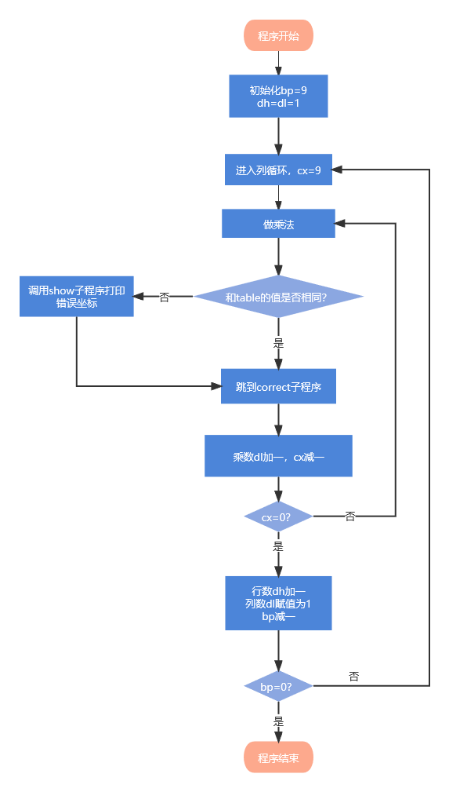
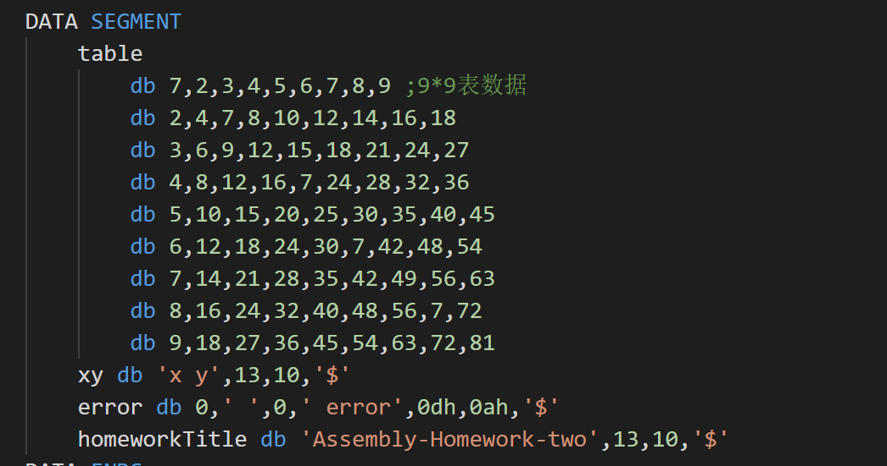
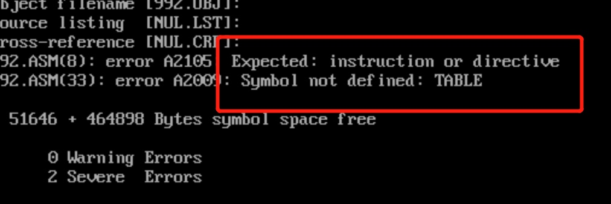

# 程序流程图



# 程序源码

```assembly
Print macro m ;显示一字符串
    mov dx,offset m ;将m的偏移量放到dx里
    mov ah,9
    int 21h ;这两句显示字符串,DS:DX=串地址 ,'$'结束字符串
endm 

DATA SEGMENT
    table db 7,2,3,4,5,6,7,8,9 ;9*9表数据
        db 2,4,7,8,10,12,14,16,18
        db 3,6,9,12,15,18,21,24,27
        db 4,8,12,16,7,24,28,32,36
        db 5,10,15,20,25,30,35,40,45
        db 6,12,18,24,30,7,42,48,54
        db 7,14,21,28,35,42,49,56,63
        db 8,16,24,32,40,48,56,7,72
        db 9,18,27,36,45,54,63,72,81
    xy db 'x y',13,10,'$'
    error db 0,' ',0,' error',0dh,0ah,'$'
    homeworkTitle db 'Assembly-Homework-two',13,10,'$'
DATA ENDS

CODE SEGMENT ;代码段
    ASSUME CS:CODE,DS:data
    START: 
    MOV AX,DATA ;初始化
    MOV DS,AX

    Print homeworkTitle
    Print xy

    mov di,offset table
    mov dx,0101h ;初始化dh和dl都为1
    mov bp,9
again:
    mov cx,9
next: 
    mov al,dl ;乘数默认在al里，al初始化为1
    mul dh  ;被乘数为dh，相乘，乘法结果默认放在dx：ax里，其实就是al里
    cmp al,[di] ;如果al和[di]相等
    ;cmp oprd1,oprd2 为第一个操作减去第二个操作数,但不影响第两个操作数的值,它影响flag的CF，ZF，OF，AF，PF.
    jz yes ;jz是运算结果为0，也就是两个相等的时候跳转·  
    call show;如果不相等 ，则跳转到show子函数展示出来

yes:inc di ;+1 转到表格中下一个数进行比较
    inc dl ;+1 乘数加一
    loop next ;cx为9，所以每个loop跑9次
    inc dh ;+1 下一行比较
    mov dl,1 ;dl再次初始化为1
    dec bp ;-1 bp为行数
    jnz again ;jnz是bp不为0则跳转

    MOV AH,4CH ;退出程序
    INT 21H

show:push dx
    mov si,offset error
    mov ax,dx
    or ax,3030h
    mov [si],ah
    mov [si+2],al
    Print error
    pop dx
    ret

CODE ENDS
END START 
```

# 作业心得

在乘法表纠错作业中我采用了和打印乘法表不一样的循环处理，设置了一个专门的数记录其中一个循环。而不是像打印乘法表中利用栈保存外层循环。

心得在上一个作业里写的差不多了。这里简单记录一个遇到的小小bug

最开始我为了美观，将table这样定义：



然后报错：



后面发现不能这样定义，table后面的db要紧跟在table后面，改了就不报错了。

