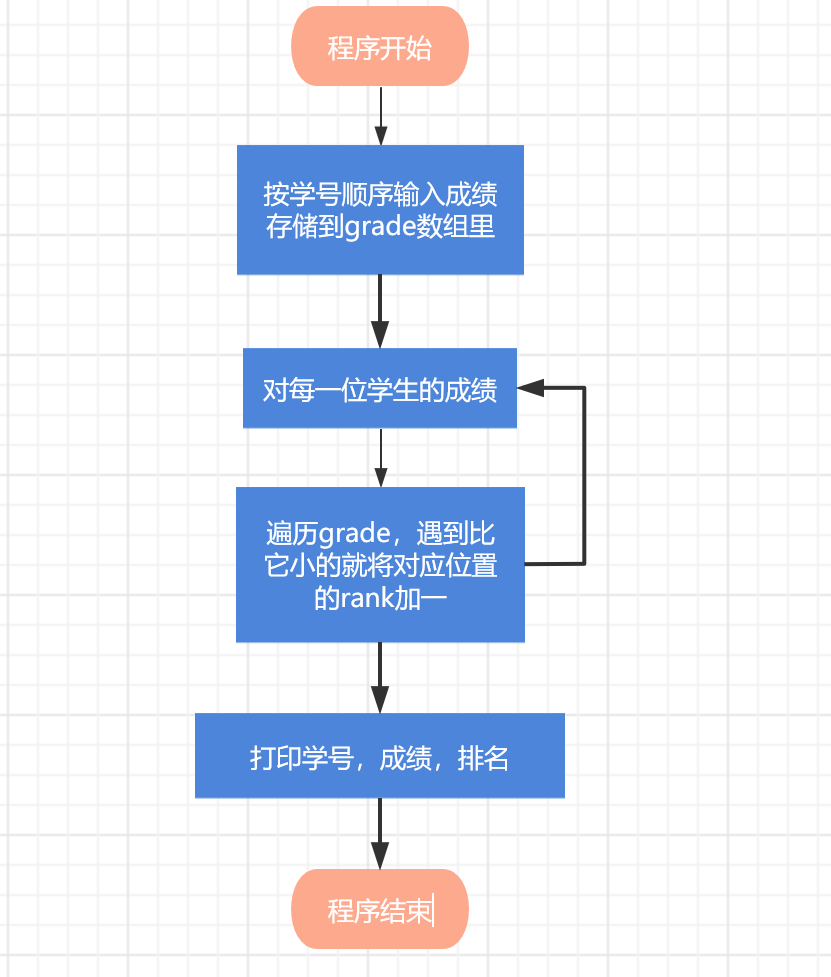
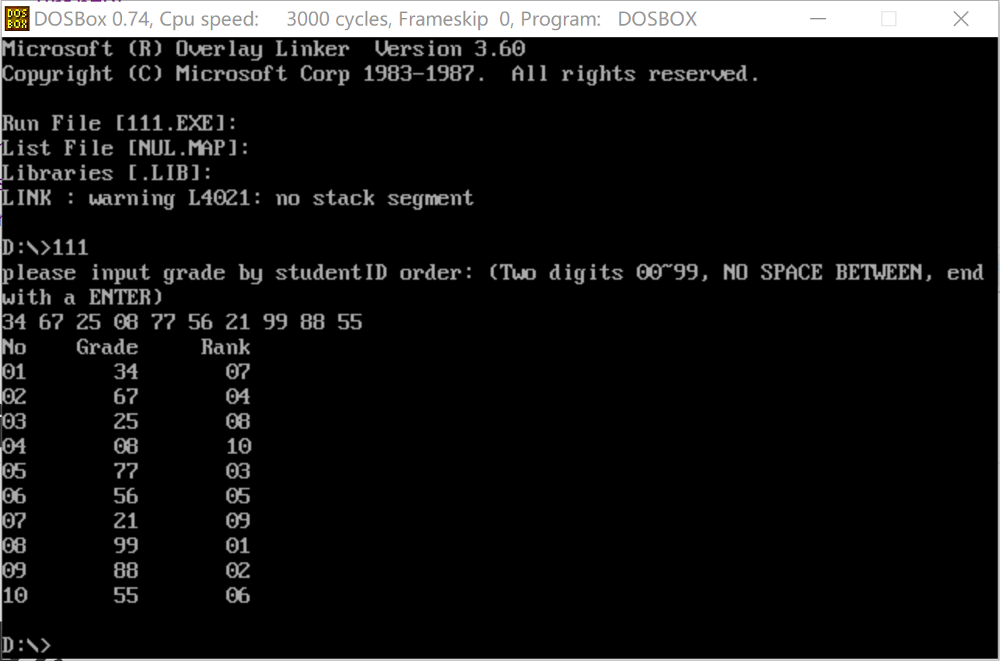

# 流程图




# 源代码

```assembly
Print macro m ;显示一字符串
    mov dx,offset m ;将m的偏移量放到dx里
    mov ah,9
    int 21h ;这两句显示字符串,DS:DX=串地址 ,'$'结束字符串
endm 

PrintDL macro  ;打印dl的内容
    mov ah,2
    int 21h 
endm

datas segment
	mes1 db 'please input grade by studentID order: (Two digits 00~99, NO SPACE BETWEEN, end with a ENTER)$'
	mes2 db 'No    Grade     Rank$'
	mes3 db '       $' 
	grade db 50 dup(?)
	rank  db 50 dup(?)
	num dw ?  ;学生个数
	crlf db 13,10,'$'
datas ends

codes segment
assume cs:codes,ds:datas,es:datas
;在数据移动、搜索、比较这类指令中，ds 对应 si，es 对应 di
start:	mov ax,datas
	mov ds,ax
	mov es,ax;es注释掉后rank无法显示
	;主程序
	Print mes1
	Print crlf
	call input
	call compare
	Print mes2
	Print crlf
	call show
	;主程序结束
	mov ah,4ch
	int 21h

input	proc  ;输入并存储
	lea si,grade ;将grade地址送到si寄存器
	lp:	mov bl,0	
		mov cx,2
	swf:mov ah,1;每运行一次swf接受一个成绩输入
		int 21h
		cmp al,0dh ;检验AL寄存器内的值是不是回车的ascii码
		je exit ;相等时跳转
		sub al,30h
		xchg al,bl ;exchange
		mov dl,10
		mul dl
		xchg al,bl
		add bl,al
		loop swf ;循环两次接受两位输入
	mov dl,20h ;打印空格
	PrintDL
	inc num ;num记录学生个数
	mov [si],bl;存入grade数组
	inc si ;si自加1，指向下一个grade内存
	jmp lp
	exit:ret
input	endp

compare	proc ;比较子程序
		lea di,rank ;将rank的地址送到di
		mov si,-1 
		mov cx,num ;外层循环
	loop1:	mov dx,cx ;将外层循环用dx保存
			mov cx,num 
			mov bx,0 
			mov al,1 ;初始化每一个学生名次都是1
			inc si ;
			mov ah,grade[si]
	loop2:	cmp ah,grade[bx]
			jb  next ;小于的时候跳转到next，将当前学生的名次加一
			jmp loop3	;不小酒直接到loop3，不对名次更改
	next:	inc al
	loop3:	inc bx
			loop loop2
			stosb ;将al寄存器的值(当前学号的成绩排名) al→[es:di]
			;取出来赋给es:di所指向的地址处(rank数组）,并且自动减少/增加
			mov cx,dx ;还原外层循环
			loop loop1
		ret
compare	endp

show	proc ;打印输出子程序
		mov bx,0
		mov cx,num ;循环num次，num为学生个数
	loop4:	inc bx
            mov al,bl
            mov ah,0
            mov dl,10
            div dl
            mov dh,ah		
            mov dl,al
            or  dl,30h		
            PrintDL		
            mov dl,dh
            or  dl,30h		
            PrintDL ;打印学号
            Print mes3
            dec bx
            mov al,grade[bx]
            mov ah,0
            mov dl,10
            div dl
            or al,30h ;把al中的数值转换成相应的ASCII码
            mov dh,ah		
            mov dl,al		
            PrintDL
            or dh,30h		
            mov dl,dh		
            PrintDL ;打印成绩
            Print mes3
            mov al,rank[bx]
            mov ah,0
            mov dl,10
            div dl
            or al,30h
            mov dh,ah		
            mov dl,al;打印排名
            PrintDL
            or dh,30h ;把al中的数值转换成相应的ASCII码		
            mov dl,dh
            PrintDL
            mov dl,0dh;odh是回车的ascii码
            PrintDL
            mov dl,0dh		
            PrintDL		
            mov dl,0ah;是换行的ascii码		
            PrintDL
            inc bx
            loop loop4
            ret
show	endp
codes ends
  end start
```


# 运行演示

注：每输入两位数程序会自动空格隔开，不需要手动打空格。因此如果有个位数成绩需要以0开头，同时最高成绩只能到99。




# 心得体会

在撰写程序的过程中通过查阅资料又学习了很多新的指令（例如stosb、xchg等），同时对proc有了更多的实操学习。感觉受益匪浅。

