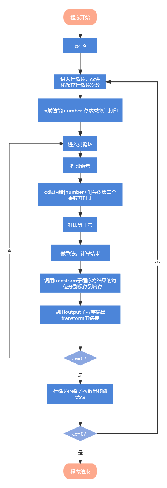
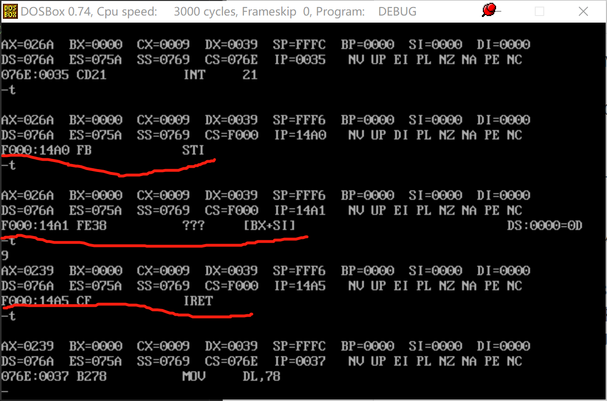

# 程序流程图



# 程序源码

```assembly
Print macro m ;显示一字符串
    mov dx,offset m ;将m的偏移量放到dx里
    mov ah,9
    int 21h ;这两句显示字符串,DS:DX=串地址 ,'$'结束字符串
endm 

PrintDL macro  ;打印dl的内容
    mov ah,2
    int 21h 
endm

DATAS SEGMENT
    crlf db 13,10,'$'
    homeworkTitle db 'Assembly-Homework-one',13,10,'$'
    number dw ?,?,?,?   ;存放乘数和被乘数
    buf db ?,?,?,?      ;缓存转换出来的数字   
DATAS ENDS

CODES SEGMENT
    ASSUME CS:CODES,DS:DATAS
START:
    MOV AX,DATAS
    MOV DS,AX ;将数据地址放到ds里

    Print crlf
    Print homeworkTitle
 
    ;行循环9次
    mov cx,9 ;把9存到cx,循环次数9次
    rowLoop:
        mov [number],cx ;存放乘数，[number]指的是以number内容作为地址指针的内存操作数
        push cx         ;保存外层计数
        push cx         ;乘数进栈

        ;每一行中的列循环 
        colLoop:
            ;打印乘数
            mov dx,[number]        
            add dx,30h     ;转ASCII
            ;数字字符的 ASCII 码与数值本身的对照关系： ‘X’=X+30H
            PrintDL

            ;打印x号
            mov dl,78h   ;78h是乘号的ascii码     
            mov ah,2
            int 21h

            ;打印第二个乘数
            mov [number+1],cx        
            push cx        ;第二个乘数进栈
            mov dx,cx
            add dx,30h
            PrintDL

            ;打印=号
            mov dl,3dh                
            PrintDL
            
            ;计算打印两数相乘的结果
            pop dx           ;取出第二个乘数，POP到DX里面
            pop ax           ;取出第一个乘数
            push ax          ;第一个乘数再次进栈，在下次内层循环中推出再次使用
            ;汇编的乘法乘数默认在al里
            mul dx           ;被乘数为dx，相乘，乘法结果默认放在dx：ax里
            mov bx,10        ;除数
            mov si,2         ;由于最大为81，所以循环2次
        
            ;把各个位转换为数值，如ax中的81，转换为 8,1存在内存中     
            transform:
                mov dx,0        
                div bx            ; 除10法得到各个位上的数值 
                ;div是除,被除数放在dx：ax里，商是16位放在ax中 余数放在dx中
                mov [buf+si],dl   ;将余数（这个位的值）放到内存中
                dec si            ;si自减1
                cmp ax,0          ;商是否为0，为0算法结束
                ja transform       ;ja是比较结果左大于等于右的时候跳转
            
            output:   ;输出transform的结果
                inc si ;si自加1
                mov dl,[buf+si] ;输出dl
                add dl,30h      ;转为ascii
                PrintDL
                cmp si,2    ;比较si和2
                jb output   ;如果si大于等于2就跳到output
                
            mov dl,20h
            PrintDL
        
        loop colLoop              ;内层循环结束
                
            Print crlf      ;输出回车换行

            pop cx
            pop cx           ;将这一行的乘数pop到cx，还原外层计数
        
    loop rowLoop        
    
    MOV AH,4CH
    INT 21H

CODES ENDS
END START
```

# 作业心得

最大的心得就是！果然学习语言还是需要coding！实践出真知！一开始对自己设计汇编程序一头雾水，找了一份网上的代码运行，在debug的过程中不断地-t，-d，也算是理解了底层的一些逻辑。

然后照葫芦画瓢，自己写了一遍。


这次作业还学习到了宏指令的用法，个人感觉类似高级语言中的函数调用，觉得非常亲切，果然语言都是类似的！


例如在debug的时候发现经常出现这种反汇编



查阅资料后得知：反汇编中包含有一些对0F000代码段的调用。0F000代码段翻译到物理内存地址F0000h - 100000h,这个地址范围包含BIOS代码和BIOS中断。


在作业过程中还有一个小bug是，在data segment段

```assembly
homeworkTitle db 'Assembly-Homework-one',13,10,'$'
```

这句话我原本是这样写的

```assembly
title db 'Assembly-Homework-one',13,10,'$'
```

当我把标题命名为title的时候masm会报error：Symbol not defined TITLE。查阅资料也没发现类似错误。但改了名字之后就莫名其妙可以运行了。我猜想可能是由于title关键字原本在汇编中就有相关的含义，所以不能作为变量名。


另外程序利用栈实现了同时实现两个循环，在进入内层循环的时候通过栈保存外层循环的cx值。在下一个作业中我尝试外层的行循环使用单独的寄存器bp存放，不影响列循环。

