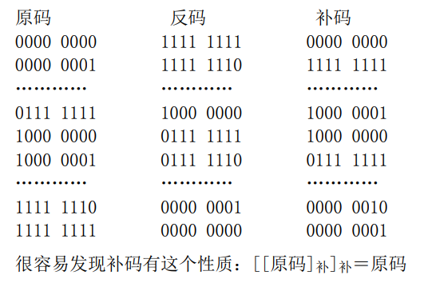
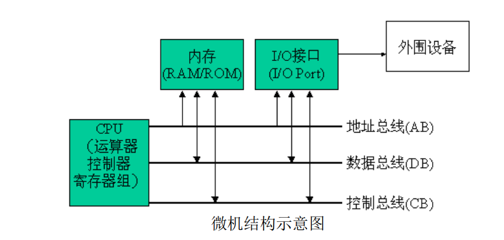
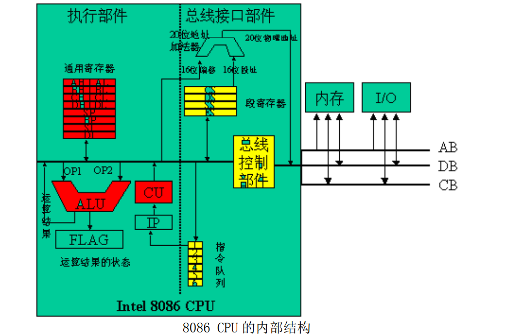
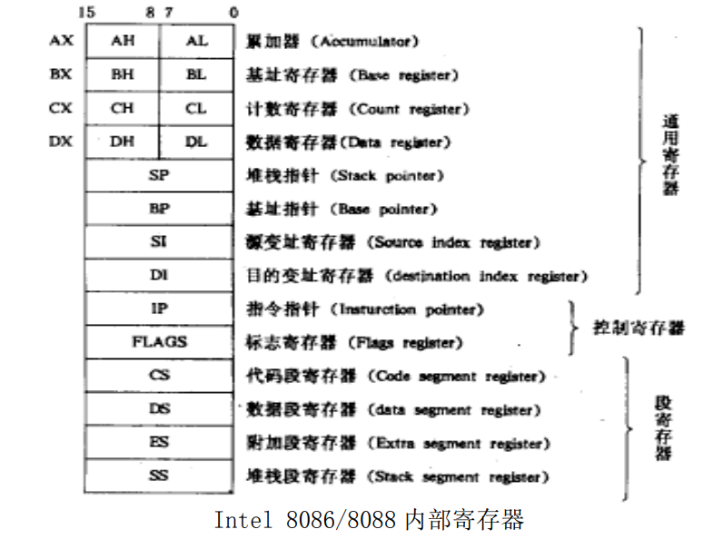

# 常用数制&数据表示

**2 进制数** 

表示方式，xxxxB 

**16 进制数** 

表示方式，** H，0 * *H ，0x** 

## 整数表示

有符号数的表示范围 

数据最高位用来表示符号： 1 表示负，0 表示正。

原码：二进制码字 

反码：原码按位取反 

补码：反码＋1（2^n-原码）——> 求补 

## 字符表示

 **ASCII 码** (ISO 8859-1 或 Latin-1)

一些公式： 

数字字符的 ASCII 码与数值本身的对照关系： ‘X’=X+30H，其中 X=0~9，‘X’表示数字 X 的 ASCII 码 

大写字符的 ASCII 码与数值本身的对照关系： ‘X’=X+37H，其中 X=A~F，‘X’表示大写字符 X 的 ASCII 码

汉字的 GB2312 编码

Unicode 用 4 字节通吃世界所有文字。实际操作上，UCS 因太肥使其无法实用。

**UTF8 和 UTF-16**

UTF-8：为最重要最主流的 Unicode 变种。可能采用 1-3 字节表示一个字符，规定必须根据所在的 Unicode 编码范围按下表选择编码的字节数并进行变换，并且必须选最短的字节。 

**BCD 码** 

BCD 编码是二—十进制编码，采用 4 位二进制数表示一位十进制数。有压缩 BCD 码格式和非 压缩 BCD 码格式。

# x86系列基本结构

## Intel系列处理机

1. 8086/8088：8088 是准 16 位微处理器，内部 16 位数据总线，外部 8 位数据总线，一个总线 周期只能吞吐一个字节；8086 是 16 位微处理器，内部、外部都为 16 位数据总 线，一个总线周期能吞吐一个字。8088 被 IBM 用于第一台微机上的处理器，两者 指令系统、编码格式完全相同，在软件上兼容。 
2. 80286：CPU 可以工作在保护模式，保护模式下，系统可提供虚拟存储管理和多任务管理
3. 80386：划时代产品，32 位处理器，它有 4 种工作模式： 1) 实模式 real mode  2) 保护模式 protected mode：提供支持多任务环境的工作模式，建立保护机制； 3) 虚拟模式 virtual mode  4) 系统管理模式 SMM System Management Mode
4. 80486；Pentium；Itanium

## 计算机软件系统

系统软件：用户使用计算机时，为开发、调试、执行用户程序 必备的。 

用户软件：用户自行编制的程序。 

主要的系统软件：

1. 操作系统：系统软件的核心，主要作用是对系统软硬件资源进行管理，为用户创造方便、有效 和可靠的计算机工作环境。其主要部分是常驻程序，一开机就驻留在内存中，用来接收用户指 令并使 OS 执行相应动作。
2. I/O 驱动：用来对 I/O 设备进行控制或管理。
3. 文件管理程序：用来处理存储在外存储器中的大量信息（外存储器中的信息是以文件的形式进 行存在的），此时常与外存储器的设备驱动相连接使用。
4. 文本编辑程序：用来建立、输入或修改由字母、数字、符号等信息组成的文本。
5. 翻译程序：用来将汇编语言或其它高级语言转变为机器语言的工具，主要包括汇编程序、编译 程序和解释程序等。
6. 链接程序：用来将目标文件和库文件或其它翻译好的子程序链接生成可执行文件。 
7. 装入程序：用来将程序从外存储器装入内存以便程序执行。 
8. 调试程序：系统提供给用户用于监控用户程序的工具。如 debug 程序。
9. 系统/用户程序库：各种标准程序、子程序和一些文件的集合。 

## 微机的基本结构

## CPU 

CPU 按功能分成 BIU 和 EU 两个单元： 

执行部件（EU）： 执行指令，并进行算术逻辑运算，给出程序要访问的内存单元地址。 

1. 运算器（ALU，Arithmetic Logical Unit）：进行算术与逻辑运算； 
2. 控制器（CU，Control Unit）：取指、译码并执行指令； 
3. 寄存器组(Registers)：一些暂时存放数据的临时存储单元，位于 CPU 内部。 

总线接口部件（BIU）： 负责 CPU 与存储器和外设间的信息传送，给 EU 提供数据和指令。

1. 总线控制部件 
2. 段寄存器：存储器寻址 
3. 指令队列：

寄存器与内存储器的不同： 

1. **物理位置的不同**：寄存器位于 CPU 内，一旦 CPU 造好，不可再扩充；而内存是独立于 CPU 之外的独立芯片，可扩充。 

2. **存储速度的不同**：寄存器的存取速度极快，与 CPU 的工作速度相当；而内存的工作速度较 慢。 

3. **容量的不同**：寄存器数量较少，例如 8086CPU 内只有 14 个 16 位寄存器，只能存放少量数据；内存容量很大，适于存储大量数据。 

4. **使用方式的不同**：寄存器通过名字使用，而内存通过地址访问。 

5. **数据存储顺序**：寄存器中的数据按通常顺序存放，而内存中的数据依不同的 CPU 而定，例如 x86 系 列 CPU 按倒字存放原则存放。（后有详细介绍） 

8086 共 14 个 16 位的寄存器，其中 AX、BX、CX、DX 四个寄存器既可当作一个 16 位的寄存器使用，也可当作 2 个 8 位的寄存器使用

**通用寄存器：** 

1. AX：累加器(Accumulator)，作为算术运算的主要寄存器，在乘、除法等指令中用来存放操作数， 另外在端口操作指令 I/O 中，只能使用 AX 或 AL 来与外部设备传送信息。 
2. BX：基址寄存器（Base），常用来表示一块缓冲区(Buffer)的起始地址。 
3. CX：记数寄存器（Counter），若用在移位指令、串处理指令和循环指令（LOOP）中，用来 表示循环次数。 
4. DX：数据寄存器(Data)，在双字乘、除法等指令中用来存放高位字，另外在端口操作指令 I/O 中，对于端口号大于 255 的端口操作，使用 DX 来存放端口地址。 
5. SP：栈顶指针寄存器（Stack Pointer）。用来指示当前栈顶位置（即 SS:SP）。 
6. BP：基址指针寄存器(Base Pointer)，常用来对堆栈中的数据进行寻址（栈段中的某个数据 的偏移量，即 SS:BP）。而 SP 用来指示栈段的栈顶的位置（一个栈只有一个栈顶）。 
7. SI：源变址寄存器(Source Index)，在字符串处理指令（如 MOVSB）中，用来表示预移动的源串的 偏移地址（即 DS:SI）。 
8. DI：目地变址寄存器(Destination Index)，在字符串处理指令（如 MOVSB）中，用来表示所移动 的串的目标偏移地址（即 ES:DI）。在很多编译器中，SI 和 DI 常用来存放 C 语言中的寄存器 变量。

**控制寄存器（专用寄存器）**： 

1. IP：指令指针寄存器（Instruction Pointer），代码段偏移地址，用来指向下一条将被执行的指 令的首地址（即 CS:IP）。 

2. FLAG：标志寄存器，或称程序状态寄存器 PSW（Program Status Word）。反应运行状况。

**段寄存器：**

1. CS：代码段地址寄存器。 
2. DS：数据段地址寄存器。 
3. ES：附加段地址寄存器。 
4. SS：堆栈段地址寄存器。

若仅是存放数据用，可使用 AX、BX、CX、DX、BP、SI、DI 中的任何一个。不要使用其它。

若用寄存器表示内存偏移地址（此时须将内存地址写在[ ]中），[ ]中只能使用 BX、BP、 SI、DI 这四个寄存器。

## 内存

1) 位 bit 0/1 
2) 字节 Byte（通常所说的一个存储单元）
3)  1 Byte=8 Bits

## 机器&汇编语言

**机器语言：**计算机能够识别的语言，计算机是电子设备，他内部信号对应的是电平的 高低和有如，所以机器语言是二进制的数，包括机器指令和数据。 （全是 01 码字！）

**汇编语言：**直接用机器语言编写程序是不现实的，于是有了汇编语 言，是机器语言的助记方式，是一种符号语言，便于理解和记忆。 

那用汇编写的程序怎么让计算机执行呢？ 

将汇编指令翻译成机器指令的过程称为“汇编”（Assembly），其逆过程称为“反汇编” （Unassembly）。汇编一般通过工具 DEBUG（A 命令）或汇编器（如 TASM/MASM 等）进行，反汇编 一般通过 DEBUG（U 命令）或专用工具（如 Sourcer 或 SoftICE 等）完成。

即： 汇编源程序 xxx.asm(编辑)－>目标文件 xxx.obj(汇编)－>可执行文件 xxx.exe(链接) 

## 汇编指令

（标号：） 操作符(操作码) 操作数 1，操作数 2 （；注释） 

操作数的类型：

 DB :其后的每个操作数占用一个字节. 

DW 定义字类型的数:表示其后的每个操作数占用一个字

DD 定义双字类型的数:表示其后的每个操作数占用一个双字

> var1 DB “ABCDE$” 分别定义了 6 个字节：41H、42H、43H、44H、45H、24H。符号地址 var1 代表第一个字节的起始地址。此写法与以下写法等价： 
>
> var1 DB 41H，42H，43H，44H，45H，24H 
>
> var1 DB 41H，“BC”，44H，45H，“$” 
>
> var3 DD 41H，“E”，“FG”，12345678H 分别定义了四个双字：0000 0041H、0000 0045H、0000 4647H、1234 5678H。符号地址 var3 代表 第一个双字的起始地址。 

## 寻址方式

是指在指令中找到操作数的方式。 

1. 立即数寻址方式：指令中的操作数是一个立即数。如 MOV AX，5 中的源操作数 5。 
2. 寄存器寻址方式：指令中的操作数是一个寄存器操作数。如 MOV AX，5 中的目地操作数 AX。 
3. 直接寻址方式：如 MOV AX，[0100H]  中的源操作数[0100H]。 
4. 寄存器间接寻址方式：如 MOV [BX]，AX   中的目地操作数。 
5. 直接变址寻址方式：如 MOV [SI-0100H]，AX 中的目地操作数。 
6. 基址加变址寻址方式：如 MOV [BX+SI]，AX 中的目地操作数。 
7. 相对基址加变址寻址方式：如 MOV [BX+DI-2]，AX 中的目地操作数。

有效地址 EA＝基址＋变址×比列因子＋偏移量

## MOV指令

源、目的操作数不可同时为内存操作数 

源、目操作数不可同时为段寄存器 

不可将一个立即数直接传给段寄存器 如：mov ds,100H 错误，需改为 

mov ax,100H 

mov ds,ax 

若源、目双方宽度均明确，则宽度必须一致 如：mov es,al 错误，而 mov es,ax 正确。 

若双方宽度均不明，则出错

# 栈

