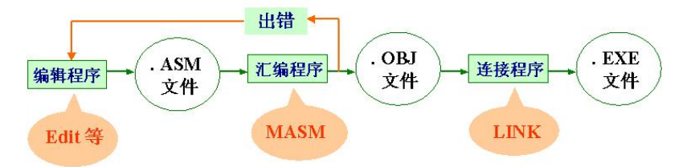
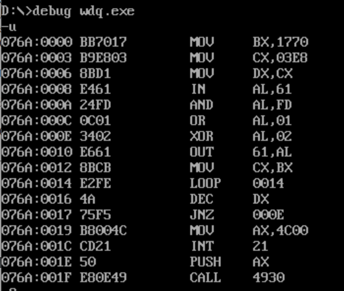

# 汇编程序上机的一般步骤

 


# 汇编程序的结构

## 经典格式

```assembly
STKSEG SEGMENT STACK
 DW 32 DUP(0)
STKSEG ENDS 

DATASEG SEGMENT
 MSG DB”Hello World$”
DATASEG ENDS 

CODESEG SEGMENT
ASSUME CS:CODESEG，DS:DATASEG，SS:STKSEG
MAIN PROC FAR
 MOV AX,DATASEG ;让数据段给AX，数据段是一个数字，不能直接给段基址DS赋值
 MOV DS,AX ;这两句是让ds指向自己定义的数据段
 
 MOV AH,9
 MOV DX,OFFSET MSG 
 INT 21H
 
 MOV AX,4C00H
 INT 21H ;这两句调用了系统中断，退出应用程序
MAIN ENDP
CODESEG ENDS
END MAIN 
 
```


## 简化格式

```assembly
.MODEL SMALL
.STACK 64
.DATA
MSG DB"Hello World$"
.CODE
MAIN PROC FAR
	 MOV AX,@DATA
	 MOV DS,AX
	 MOV AH,9
	 MOV DX,OFFSET MSG
	 INT 21H
	 MOV AX,4C00H
	 INT 21H
MAIN ENDP
END MAIN
```

## 格式说明

1. 程序由段组成。程序至少必须有一个代码段，但数据段和栈段可有可无。 
2. 代码段中可由 0 个或多个过程（PROC）。 
3. 程序最后必须有一条 END 伪指令，指示汇编器程序代码到此结束。
4. 大多数的简单程序可不写栈段，此时汇编时会警告“No Stack”（属正常现象）。
5. 程序中定义的符号地址（变量）一般应放在数据段中。数据段一般应放在代码段之前（变量先定义后使用）。 

# 栈

在 x86 中，当前栈 顶位置由 SP 寄存器指示。对栈的存取只能在栈顶进行。将一个数存入到栈顶的动作称为压栈操作 （push），从栈顶取出一个操作数的操作称为弹栈（pop）。8086CPU 的栈操作都是以字为单位进 行的。 

栈顶在何处(SS:SP)，而不知道栈空间的大小，用户必须自己控制栈的超界问 题

1. PUSH 指令 格式：PUSH 源操作数 
2.  POP 指令 格式：POP 目地操作数

操作数必须是一个 16 位的操作数，不允许使用立即数，并且不允许使用 CS 寄存 器。 

# DEBUG

Debug 是 DOS 操作系统提供的一个程序。

## 主要功能 

1. 观察/修改寄存器中的值（R 命令）
2. 往内存中输入/修改指令（A 命令）、显示内存中的指令（U 命令）
3. 往内存中输入/修改信息（E 或 F 命令）、显示内存中的信息（D 命令）
4. 在内存中对数据或指令进行移动（M 命令）或拷贝（C 命令） 
5. 在内存中单步执行指令（T 或 P 命令）、全速执行指令（G 命令）
6. 将一个文件从磁盘上加载到内存中（L 命令）； 

## DEBUG 的一些约定 

1. 只能为 16 进制数，并且不带后缀 H（区别于会变源程序）； 
2. 若想中止当前的 DEBUG 操作，请按 CTRL+C 键
3. 地址范围表示方式有两种： 方式一：起始地址 结束地址 方式二：起始地址 L 为字节长度 如-D 0:400 4FF 或 –D 0:400 L 100 

## 常用操作

1、显示存储单元的命令 D(DUMP)，格式为： -D[address]或-D[range] 例如，按指定范围显示存储单元内容的方法为： -d100 120 


2、修改存储单元内容的命令有两种。 输入命令 E(ENTER)，有两种格式如下： 

给定的内容表来替代指定范围的存储单元内容。命令格式为： -E address [list] 例如，-E DS:100 F3’XYZ’8D 其中 F3，X，Y，Z,8d 和各占一个字节，该命令可以用这五个字节来替代存储单元 DS：0100 到 0104 的原先的内容。 


3、填写命令 F(FILL)，其格式为： -F range list 例如：-F 4BA:0100 104 F3’xyz’8D 使 04BA：0100~0104 单元包含指定的五个字节的内容。


4、检查和修改寄存器内容的命令 R(register)，它有三种格式如下： 

显示 CPU 内所有寄存器内容和标志位状态，其格式为： -R 例如，-r 

显示和修改某个寄存器内容，其格式为： -R register name 

显示和修改标志位状态，命令格式为： -RF


5、运行命令 G，其格式为： -G[=address1][address2[address3…] 其中，地址 1 指定了运行的起始地址，如不指定则从当前的 CS：IP 开始运行。后面的地址均 为断点地址，当指令执行到断点时，就停止执行并显示当前所有寄存器及标志位的内容


6、跟踪命令 T(Trace)，有两种格式：

逐条指令跟踪 -T [=address] 

多条指令跟踪 -T [ = address ] [ value ] 从指定地址起执行 n 条指令后停下来，n 由 value 指定。


7、汇编命令 A(Assemble)，其格式为： -A[address] 该命令允许键入汇编语言语句，并能把它们汇编成机器代码。


8、反汇编命令 U(Unassemble)有两种格式。 

从指定地址开始，反汇编 32 个字节，其格式为： -U[address]

对指定范围内的存储单元进行反汇编，格式为： -U[range] 


9、退出 DEBUG 命令 Q(Quit)，其格式为： -Q 它退出 DEBUG，返回 DOS。


## 如何编译一个程序

```powershell
masm test.asm

link test.obj

test

debug test.exe
```

反汇编的第一列是机器码（不登场，复杂指令集）

第二列是内容，第三列是反汇编——机器码对应的汇编助记符




debug中放的是16进制，程序中是10进制

# 指令类型

1) （真）指令 能产生机器码的指令叫（真）指令。一种 CPU 的（真）指令条数是一定的，如 MOV 等。学习汇 编语言，主要是学习（真）指令。 
2) 伪指令 不能产生机器码的指令，如 SEGMENT，PROC，DB，END 等。伪指令尽管不能产生机器码，但却 是写汇编程序（.ASM）不能少的。伪指令的作用是指示汇编器（TASM 或 MASM）如何正确地翻译汇 编源程序，以生成正确的机器码。 
3) 宏指令 宏指令也是一种伪指令，只是将高级语言的某些特性融入到汇编程序中，如条件汇编、定义宏 （可带输入参数）等。宏指令的目地是为了提高汇编程序的开发效率。 


# 寻址方式


## 实验：利用不同寻址方式实现加法


