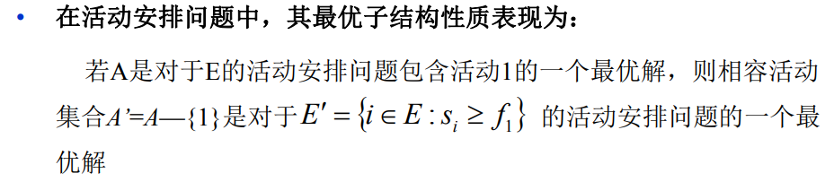
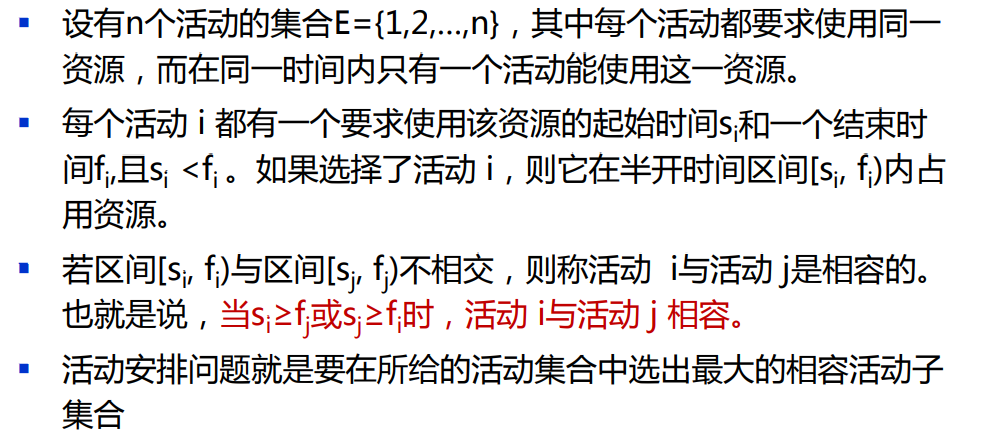
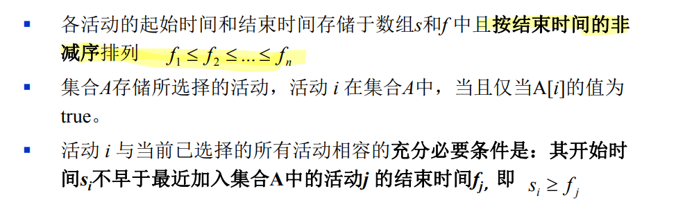
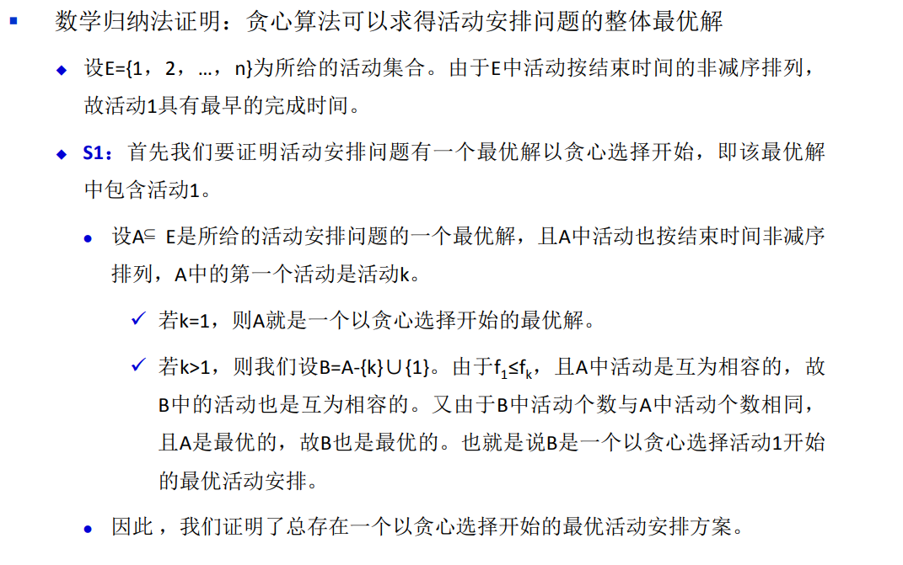
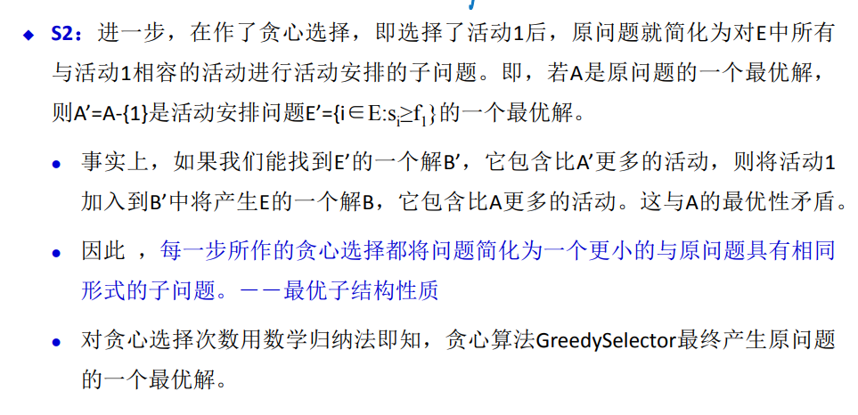
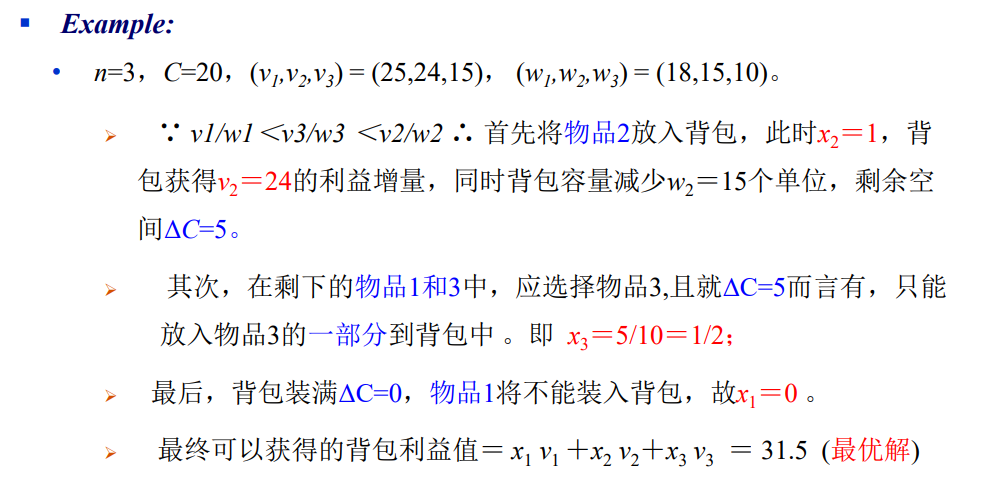
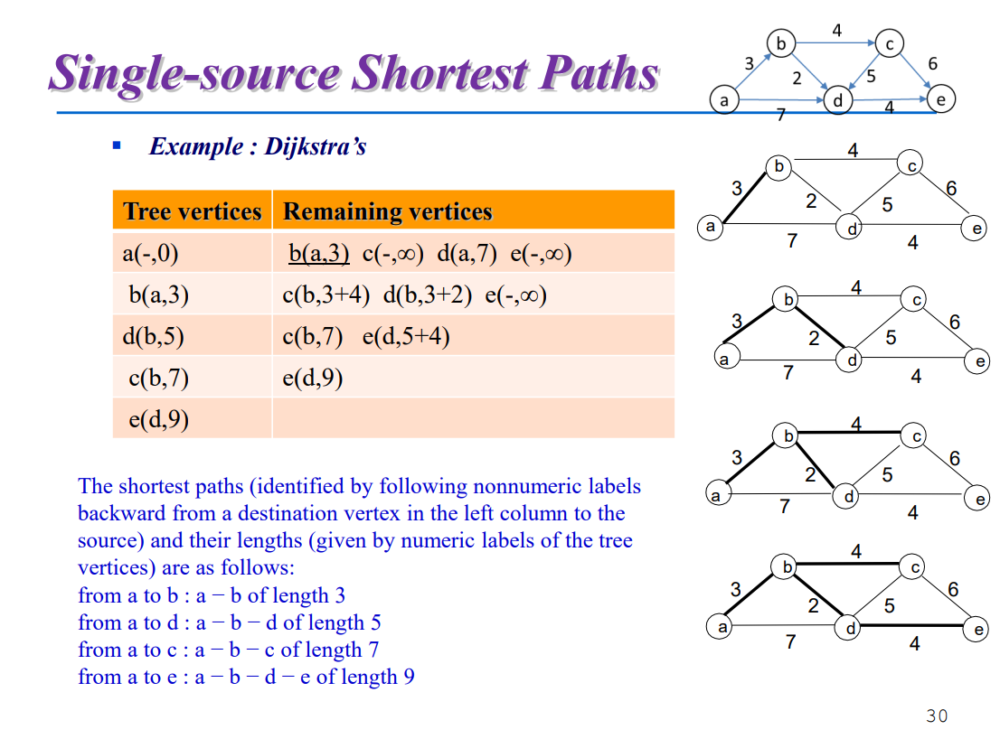
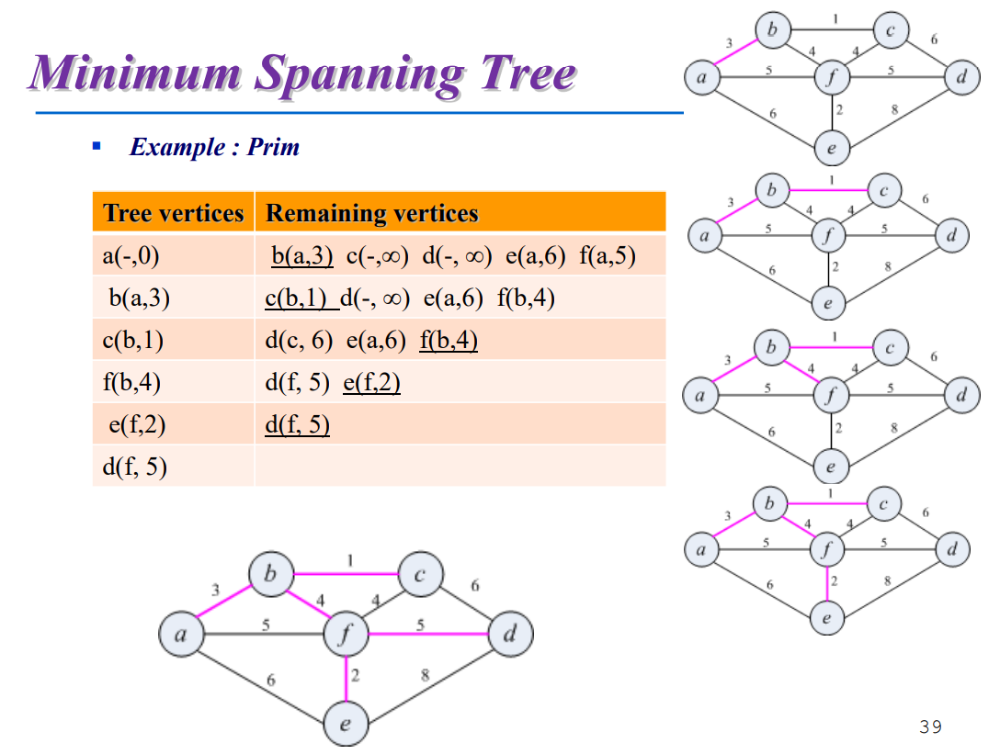
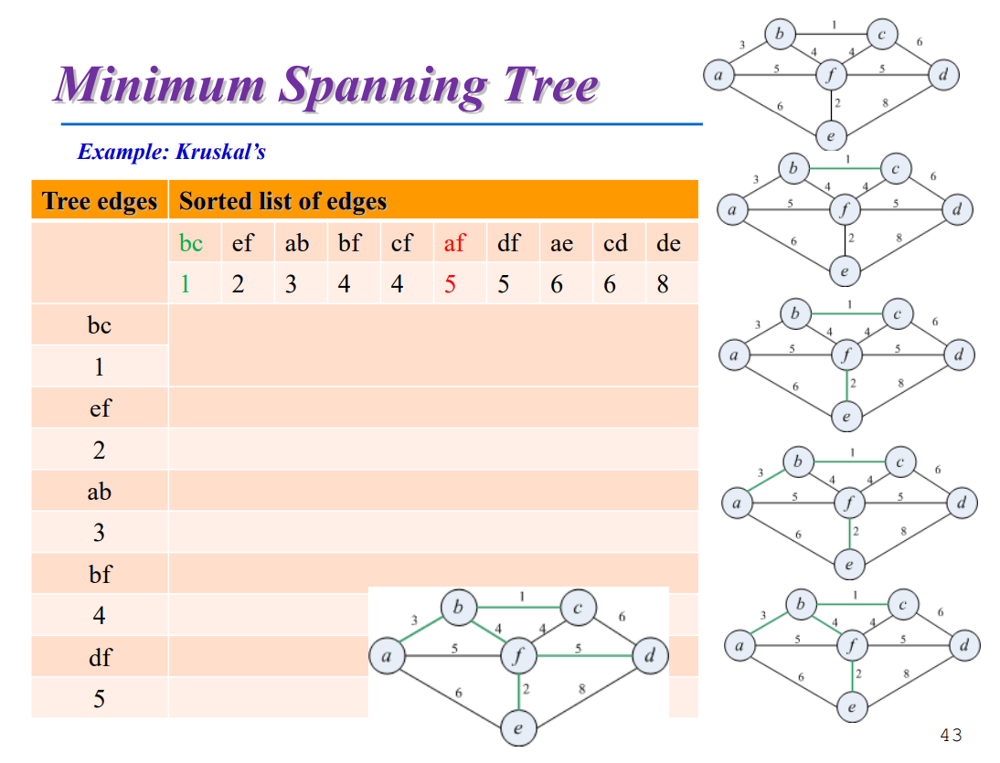

# 概述

## 定义

make the locally best choice at each step.  做每一步的区域最优解以期望最终得到全局最优解。

## 性质

所谓贪心选择性质是指所求问题的整体最优解可以通过一系列局部最优的选择，即贪心选择来达到。这是贪心算法可行的第一个基本要素，也是贪心算法与动态规划算法的主要区别。

|          | 动态规划（DP）                                               | 贪心算法（Greedy Method)                                     |
| -------- | ------------------------------------------------------------ | ------------------------------------------------------------ |
| 子问题上 | 每步所做的选择往往依赖于子 问题的解，只有在解出相关子 问题后才能作出选择。有互相重叠的子问题 | 仅在当前状态下作出最好选择，即局部最优选择，然后再去作出这个选择后产生的相应的子问题，不依赖于子问题的解 |
| 求解方式 | 通常以自底向上的方式解各子问题                               | 通常以自顶向下的方式进行，以迭 代的方式作出相继的贪心选择，每 作一次贪心选择就将所求问题简化 为规模更小的子问题 |
| 相同点   | 问题具有最优子结构的性质。                                   |                                                              |

最优子结构性质 

当一个问题的最优解包含其子问题的最优解时，称此问题具有最优子结构 性质。问题的最优子结构性质是该问题可用动态规划算法或贪心算法求解 的关键特征。

## 基本要素

问题的解是由n个输入的、满足某些事先给定的条件的子集组成。

方法：先对解的度量标准排序，再按需纳入解集。

**对于一个具体问题，要确定它是否具有贪心选择性质，必须证明 每一步所作的贪心选择最终导致问题的整体最优解。**

# 活动安排问题

## 问题描述

## 算法思路

- 每次总是选择具有**最早完成时间**的相容活动加入集合A中。

- 按这种方法选择相容活动**为未安排活动留下尽可能多的时间**。

- 也就是说，该算法的贪心选择的意义是**使剩余的可安排时间段极大化**，以便安排尽可能多的相容活动。

## 最优值结构证明

数学归纳法，首先证明结束时间最早的时间是解的一部分

第二步：接下来递归证明

# 贪心解分数背包问题

在背包利益值的增长速率和背包容量消耗速率之间取 得平衡，即每次装入的物品应使它所占用的每一单位容量能获得当前 最大的单位利益。

将按照物品的单位利益值：vi /wi 比值的非增次序考虑。

最优解证明（略）

# 迪杰斯特拉算法

## 问题描述

单源最短路径问题：找到从一个点出发对所有的顶点**分别的**最短路径。

https://www.bilibili.com/video/BV1zz4y1m7Nq/?spm_id_from=333.788.recommend_more_video.0

## 算法思路

# 最小生成树

## 问题描述

给一个有权重的图，选出一个包含所有顶点的子树（没有环），使得这个子树的所有边加起来最小。

## Prim算法

选点法：把已经选择了的点作为一个集合，接下来选距离这个点最近的点集，并且不能生成环。

## Kruskal算法

选边法：每次都选最小权值的边，如果遇到环，则撤回重选。

