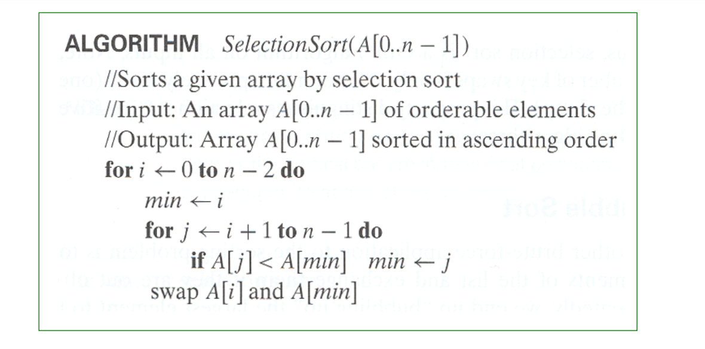
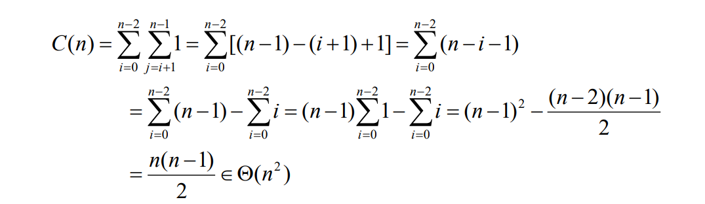
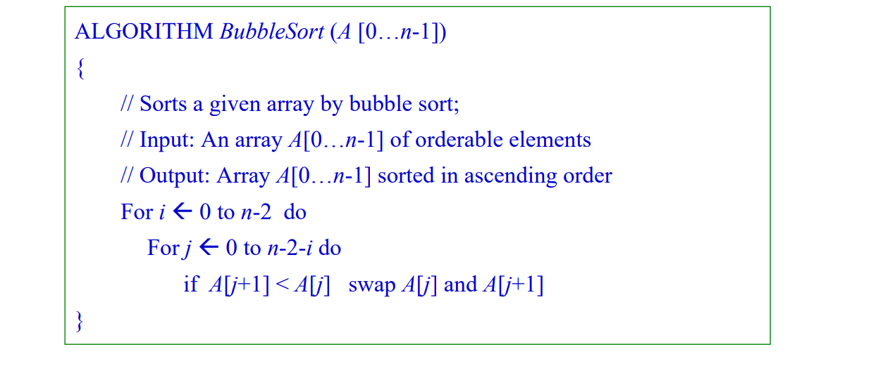
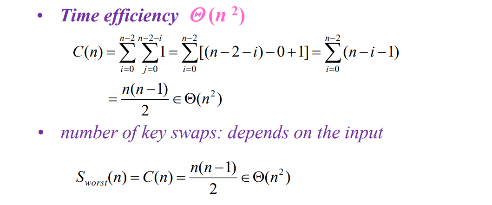

蛮力法是一种简单直接地解决问题的方法，通常直接基于问题的描述和所涉及的概念定义 

蛮力法的优点：广泛适用性和简单性；

蛮力法的缺点：大多效率低

# 选择排序

选择排序：每次找到剩余数组中最小的元素，把它和第一个元素交换

时间复杂度分析：

# 冒泡排序

比较相邻两个数的大小，把大的放后面，直到当前数组最大的换到了最后，重复这个操作

时间复杂度分析

# 穷举查找

顾名思义就是把所有的可能性穷举出来，然后再寻找最优解。

包括旅行商问题，背包问题 和分配问题。

