# 定义&性质

减治法可以分为以下三类：

## 减一个常数

例如求n！或求一个数的幂：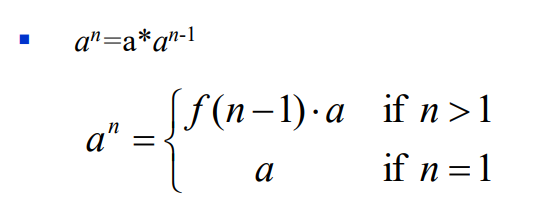

## 除以一个常数

例如求一个数的幂：

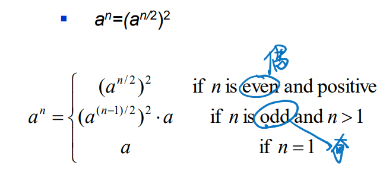

## 非固定类型

欧几里得算法：

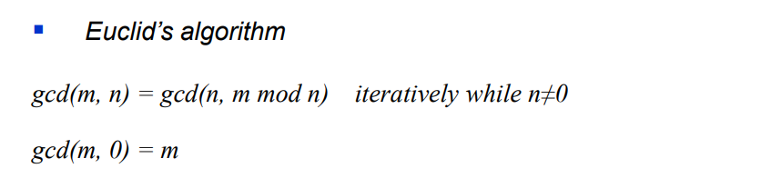

# 插入排序

## 思想

假设前n-1个数已经被排列好了，那只要那把n插入到这n-1个数中合适的位置就行了。这里初始时候假设前1个数已经被排列好。

所属类型：Decrease by One

## 代码

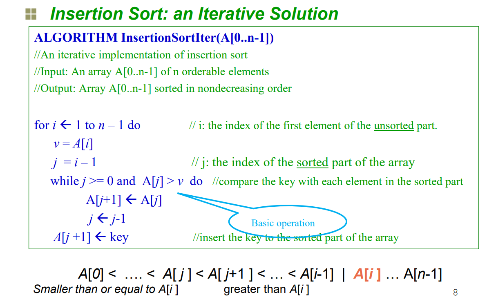

要看懂，把j+1赋值给j是为了给插入的位置腾出空位。

一个例子：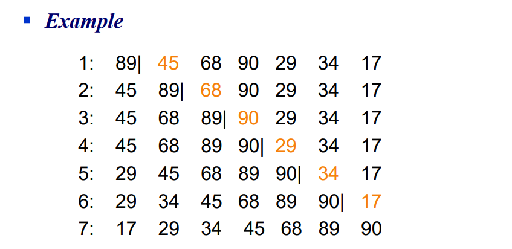

## 效率分析

最坏的情况：每次都要插在最前

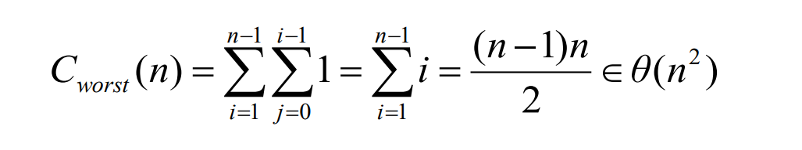

最好的情况：每次都插在最后

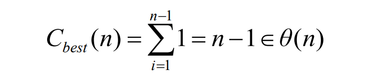

平均情况：

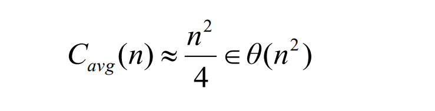

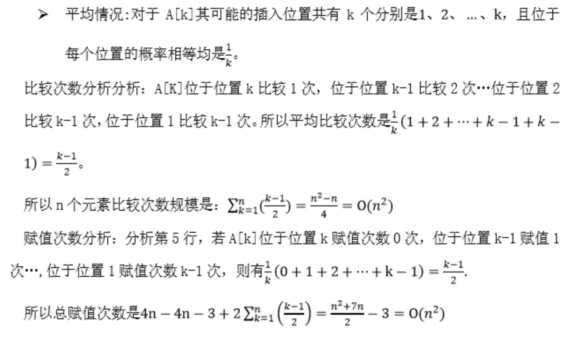

# 拓扑排序

## 问题描述

所属类型：Decrease by One

每个课程都有先修课（用箭头表示，先修指向后修），给出合适的课程排序

## DFS方法

？？？暂时看不懂

## 源删除算法 

找到一个没有入边的顶点，连同它相连的边也删掉，则删除的顺序就是排序的顺序。

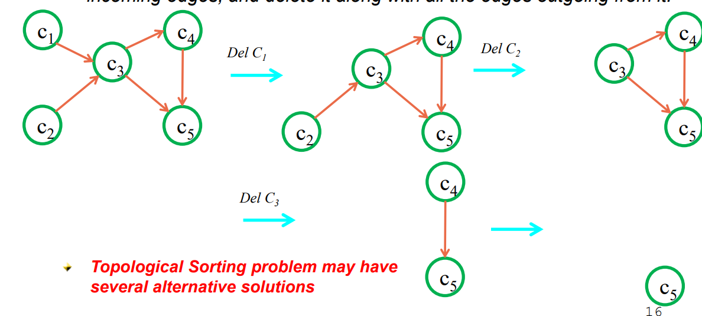

解：1 2 3 4 5

复杂度分析：

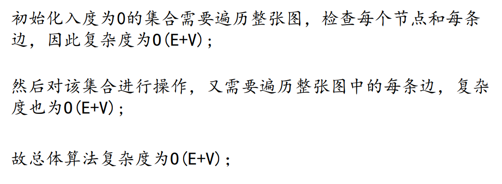

# 二分搜索

所属类型：Decrease-by-a-Constant-Factor

## 思路：

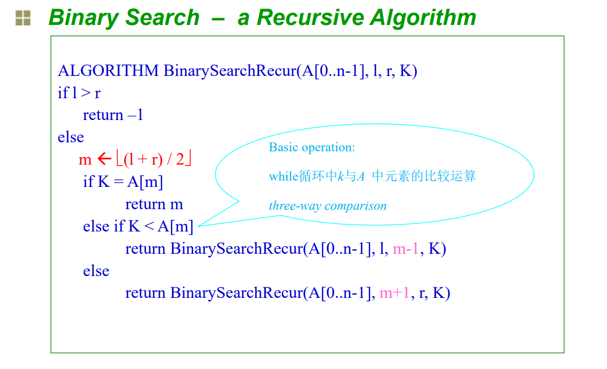

## 效率分析：

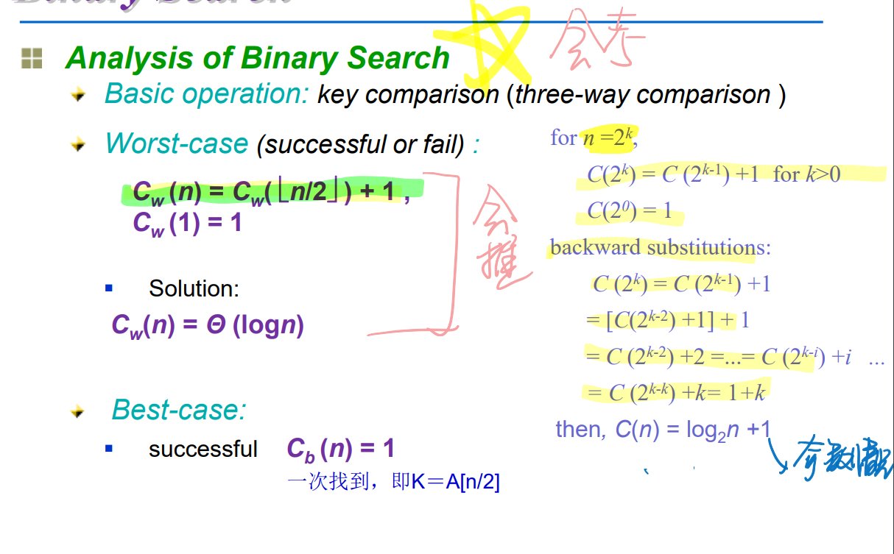

# 假币问题

所属类型：Decrease-by-a-Constant-Factor

## 问题描述

n个硬币有一个假币，比正常币轻，找到它。

## 思路

n如果为奇数，就留一个，然后分两半上称，如果天平一样，这分出去的就是假的，如果不一样，则在轻的一半里。

## 效率分析

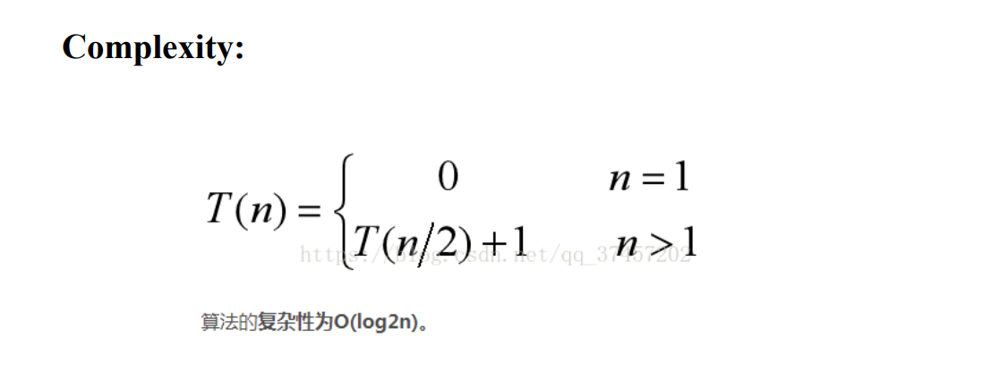

## 代码实现

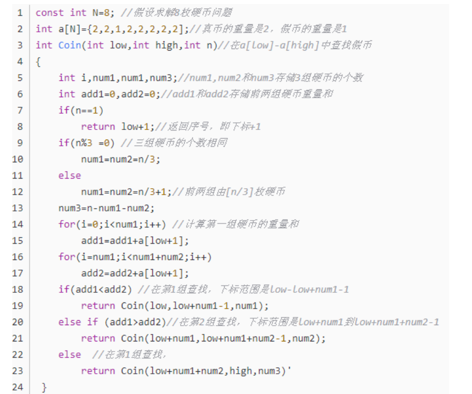

# 俄罗斯农夫算法

所属类型：Decrease-by-a-Constant-Factor

## 思想

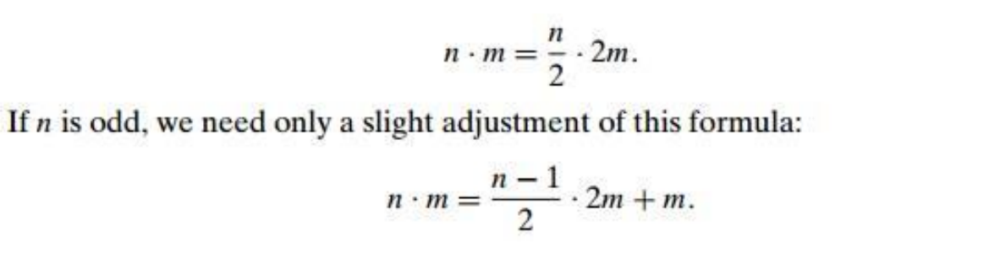

## 例子

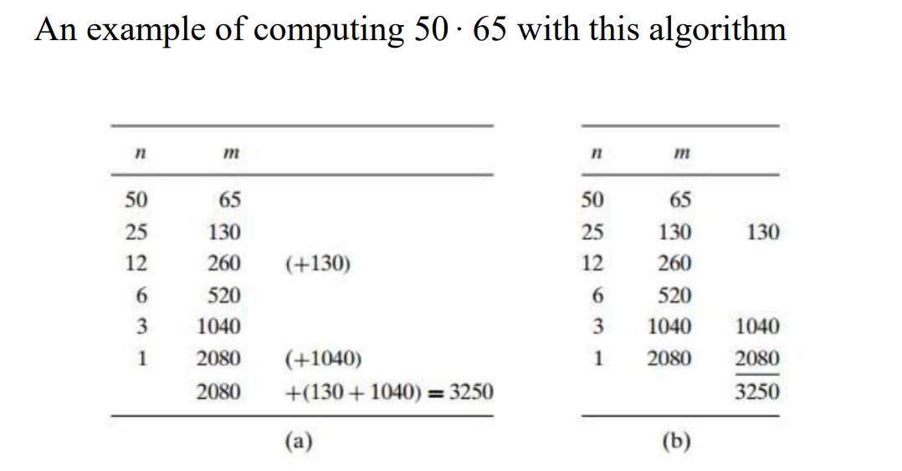

# 总结

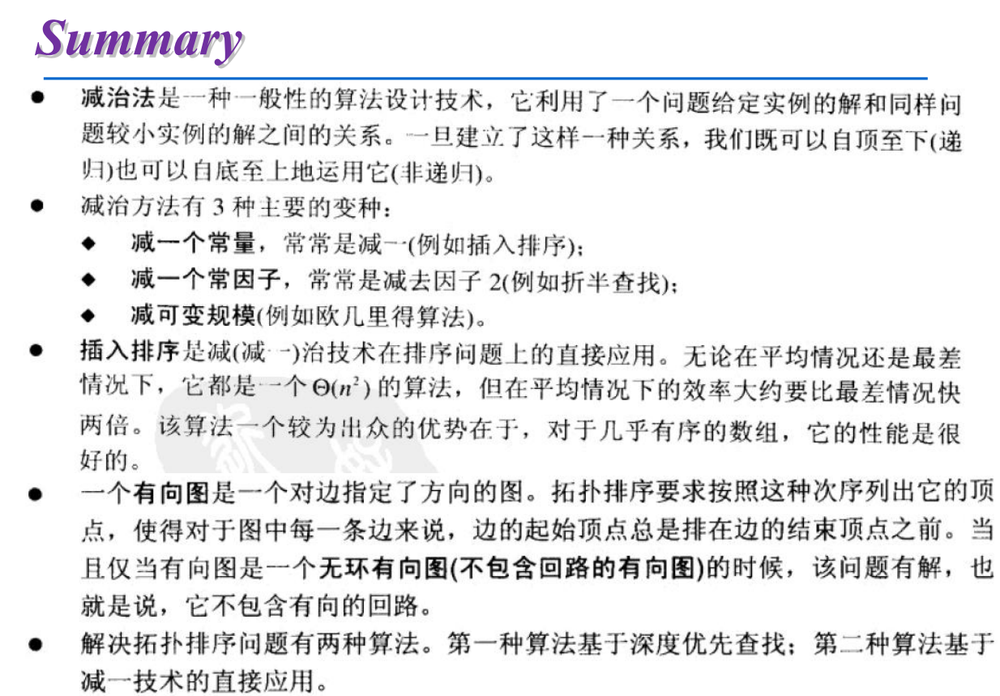

