# 定义

变治法是一种基于变换思想，把问题变换成一种更容易解决的类型。 

变治法的三种类型：实例化简，改变表现，和问题化简

# 预排序

指的是在解决一个问题之前，先对问题中的数组进行排序，以达到简化问题复杂度的目的。

## 排序方法对比

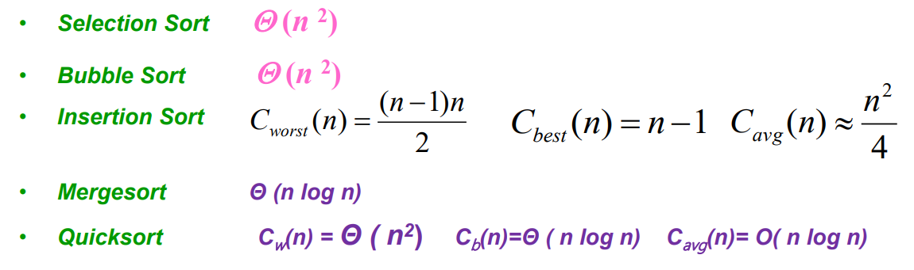

## 判断元素唯一性

### 暴力解法

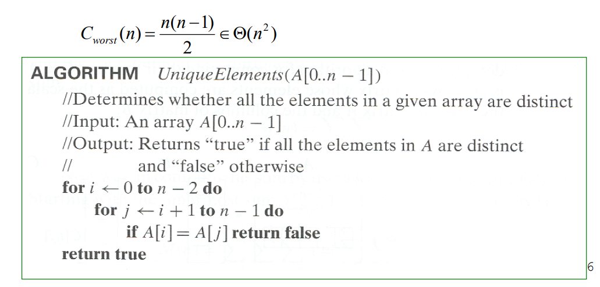

### 预排序解法

第一步：先将数组进行排序

第二步：扫描数组，查看相邻元素是否相同

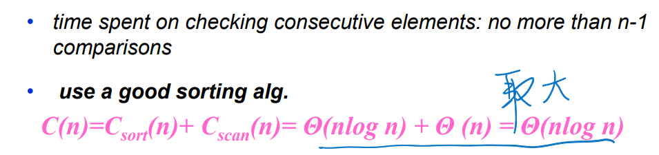

## 找众数

### 暴力法

扫描数组，计算每个元素的出现次数

找到出现次数最多的元素

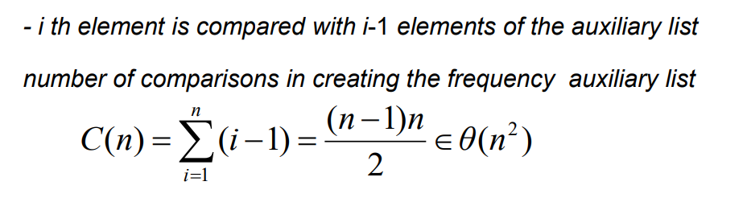

### 预排序

第一步：对数组进行排序

第二步：再到最长的相同子串长度

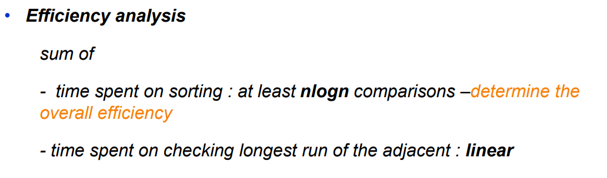

## 查找一个元素

暴力法：顺序搜索 

预排序法：先排序，再进行二分查找

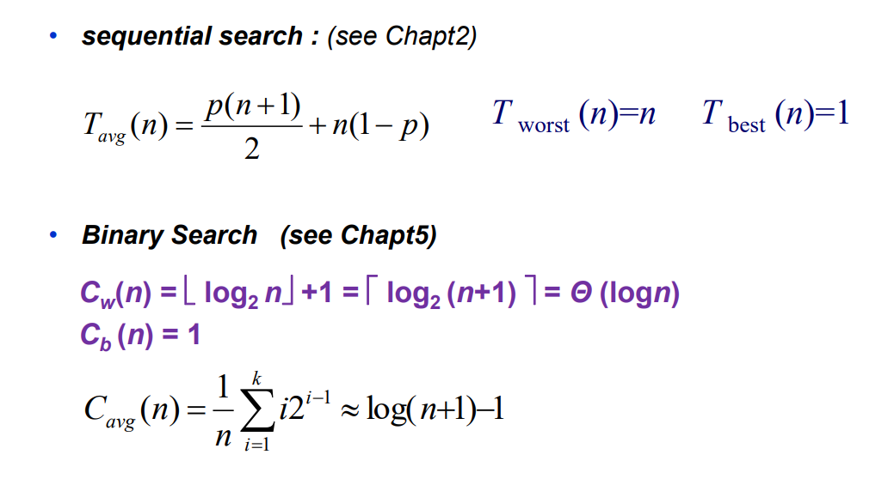

# 高斯消去法

解一个多元线性方程

## 思路简介

第一步：转化为三角方程组

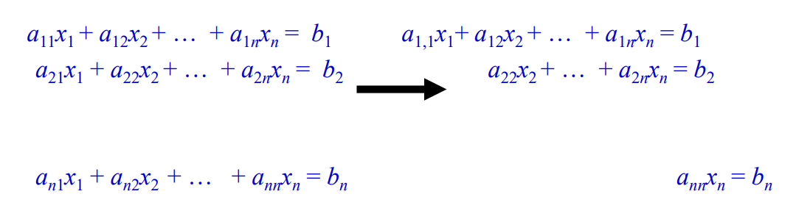

第二步：从后往前解决问题，将最短的方程带入前面的

例子：

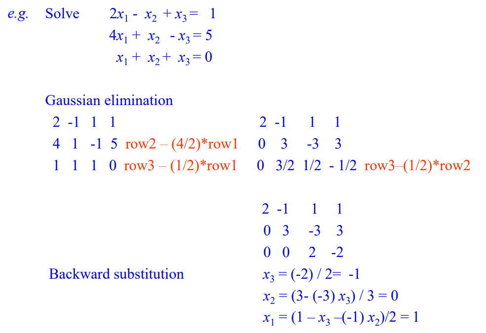

## 代码描述

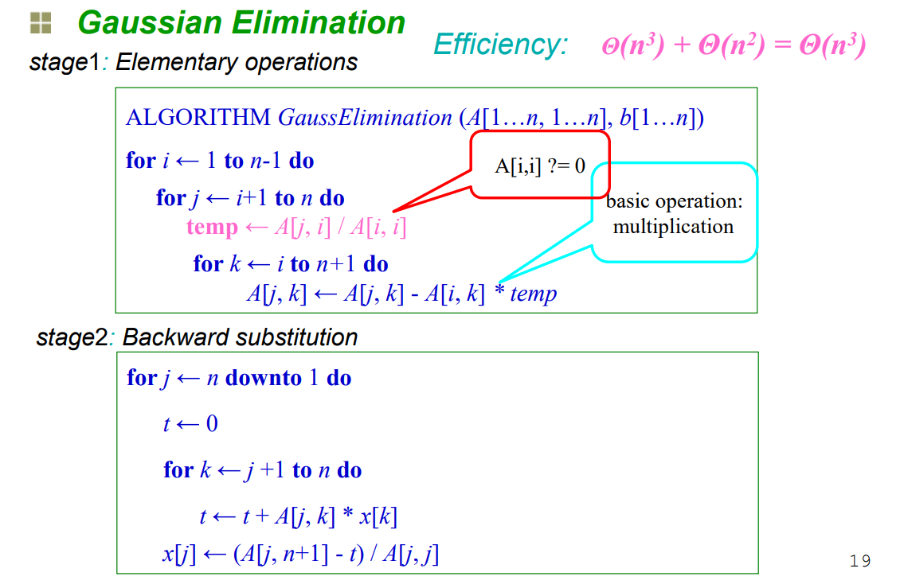

## 效率分析

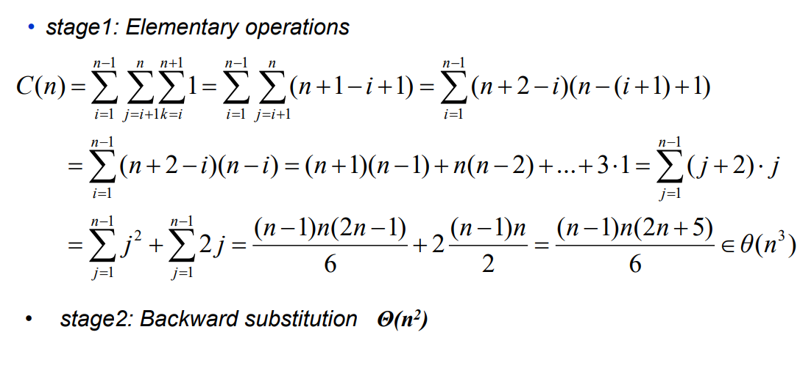

# 堆和堆排序

## 堆的概念

堆是具有以下性质的完全二叉树：每个结点的值都大于或等于其左右孩子结点的值，称为大顶堆；或者每个结点的值都小于或等于其左右孩子结点的值，称为小顶堆。一般讨论大顶堆（最大堆）。

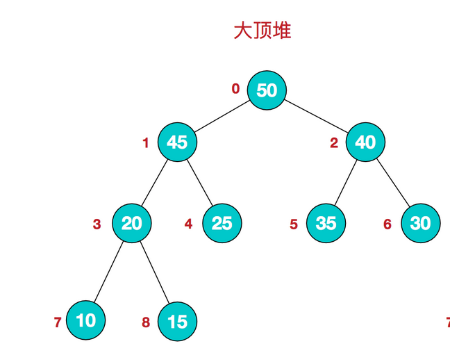

存储结构：

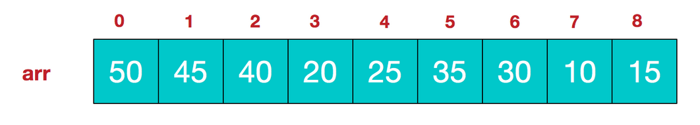

**大顶堆：arr[i] >= arr[2i+1] && arr[i] >= arr[2i+2]**  

## 如何建立一个最大堆

最大堆有一个特点就是**其各个子树都是一个最大堆**，那么我们就可以从把最小子树转换成一个最大堆，然后依次转换它的父节点对应的子树，直到最后的根节点所在的整个完全二叉树变成最大堆。

我们从该完全二叉树中的最后一个非叶子节点为根节点的子树进行调整，然后依次去找倒数第二个倒数第三个非叶子节点...

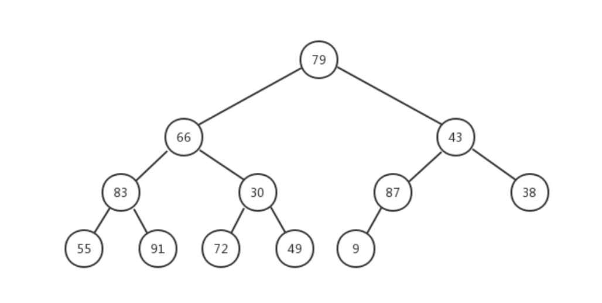

叶子节点：87大于9，所以不需要移动；30小于72，所以移动；91和83换——这一步树的高度为2，最大移动次数为1。

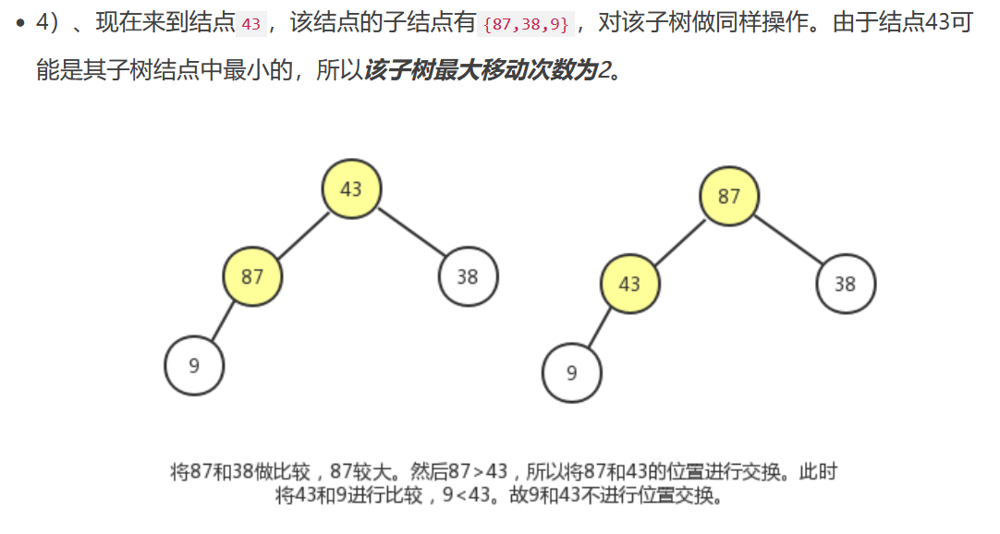

## 堆排序思想

利用最大堆排序：在排列好堆中的数组元素后（即已知堆已经为最大堆的情况下）， 再从剩余堆中连续删除最大的元素。

在最差以及平均情况下，该算法都属于在位的排序算法，时间复杂度⊙(nlogn)

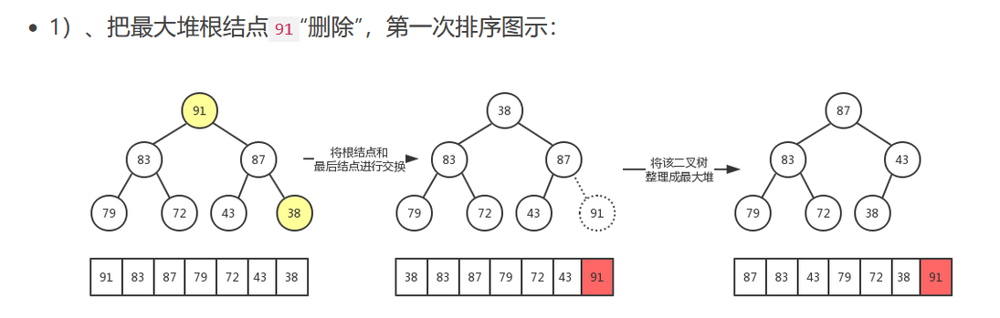

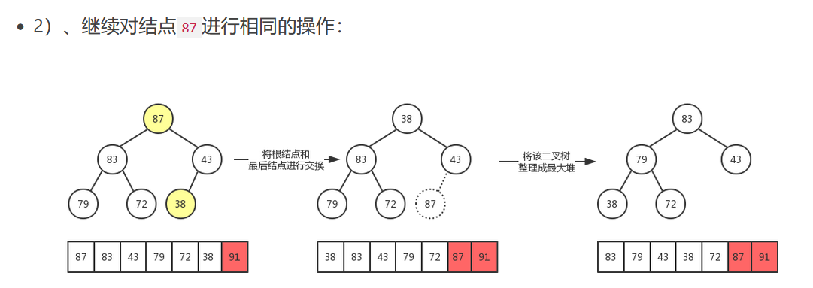

# 霍纳法则

求多项式值的一个快速算法。

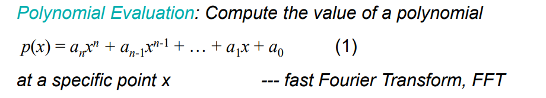

## 暴力法

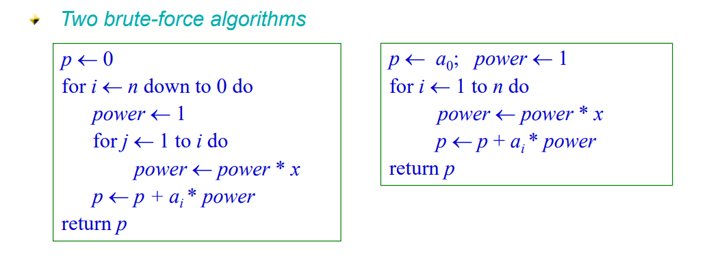

## 简单介绍
假设有n+2个数 , a0,a1,a2,a3,……an 和x组成的一个多项式，形式如下:

a0*x^0+a1*x^1+a2*x^2+a3*x^3+……an*x^n   ，通常都是一项一项的求和然后累加，这样的话要进行n* (n+1)/2 次乘法运算 和 n 次加法运算 ，

而霍纳法则就是一个改进的一个算法。通过变换得到如下式子:

(((……(((an+an-1)*x+an-2)*x+an-3)*x)+……)*x+a1)*x+a0 ，

这种求值的方法便是霍纳法则。(复杂度 为 O(n) )

## 例子

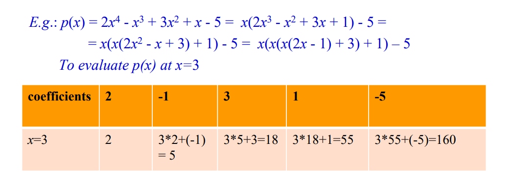

## 代码

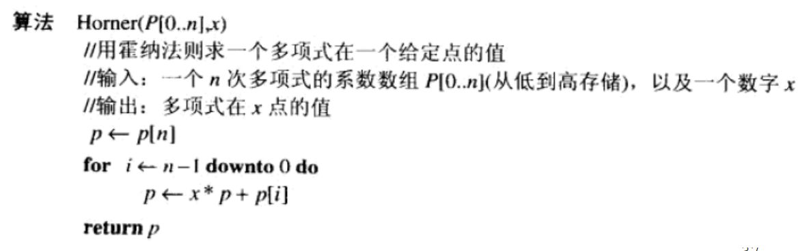

# 问题归约（化简）

## 简介

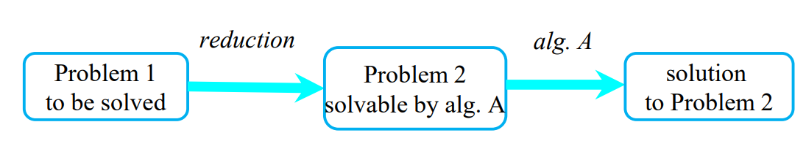

例子：

如果三个点p3在p1和p2连线的左边，那么这个矩阵的值应该是正的

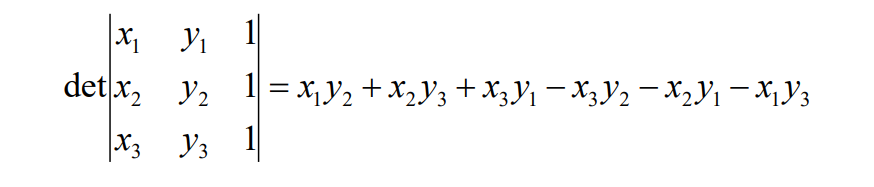

这里就是将一个几何问题转化成了一个行列式正负的问题。

## 线性规划

解决分数背包问题

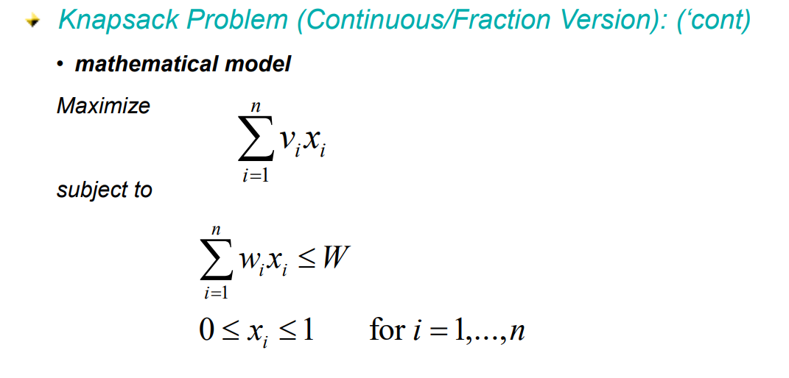

解决0-1背包问题

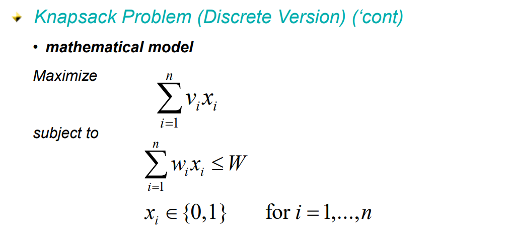

过河问题归约为图问题

# 总结

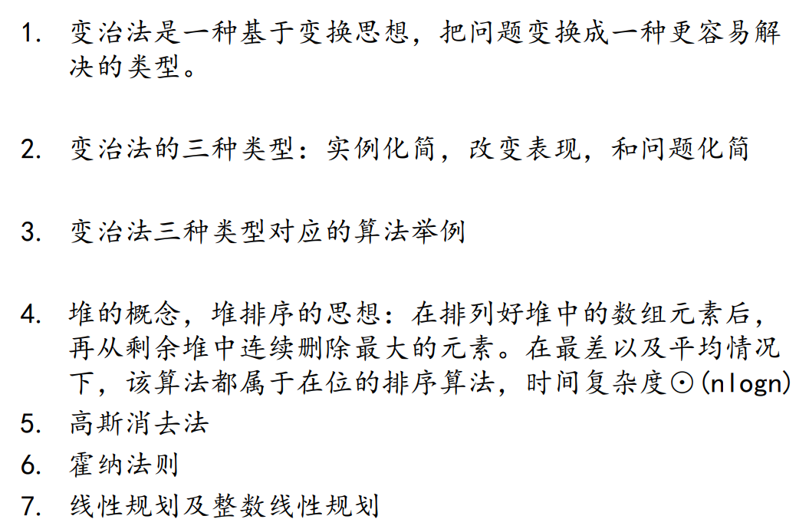

