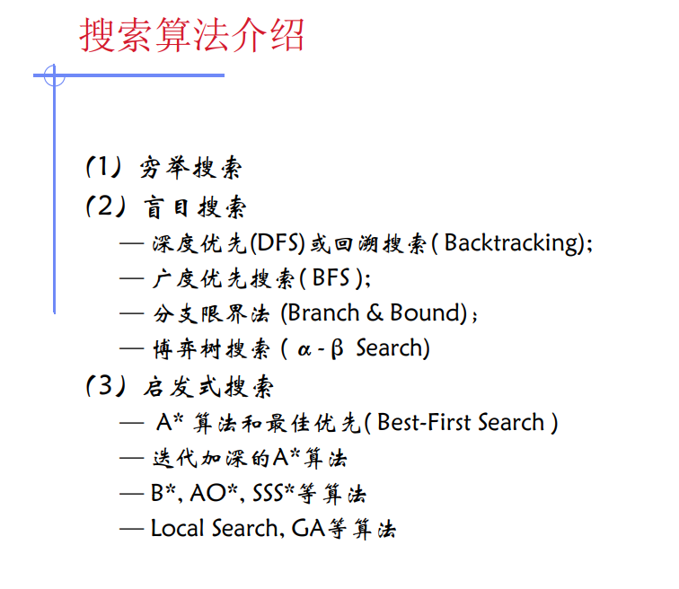


# DFS&BFS

 ## Depth-first search

深度优先步骤分为

1. 递归下去 ：先一条路走到底，直到达到目标。这里称之为递归下去。

2. 回溯上来  ：否则既没有达到目标又无路可走了，那么则退回到上一步的状态，走其他路。这便是回溯上来。

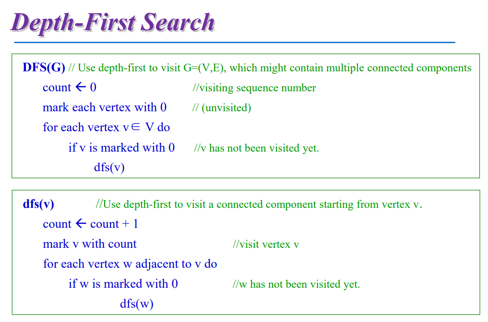

## Breadth-First Search 

广度优先搜索旨在面临一个路口时，把所有的岔路口都记下来，然后选择其中一个进入，然后将它的分路情况记录下来，然后再返回来进入另外一个岔路

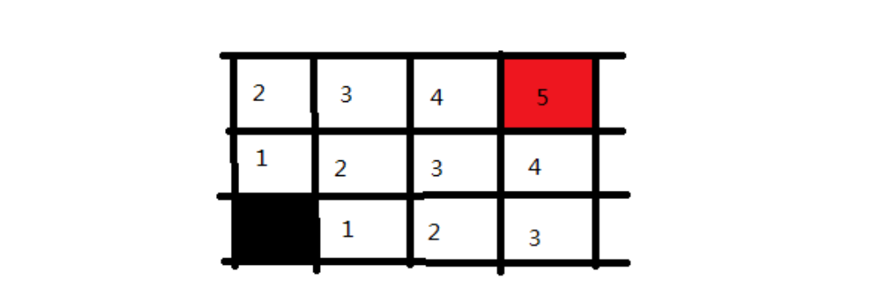

代码

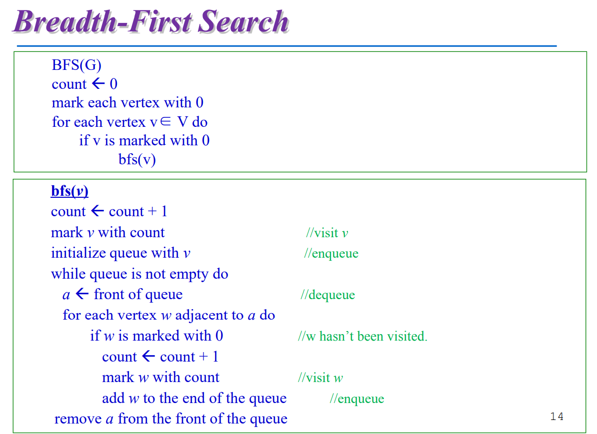


## 对比

**1. 数据结构上的运用**

DFS用递归的形式，用到了栈结构，先进后出。

BFS选取状态用队列的形式，先进先出。

**2. 复杂度**

DFS的复杂度与BFS的复杂度大体一致，不同之处在于遍历的方式与对于问题的解决出发点不同，DFS适合目标明确，而BFS适合大范围的寻找。

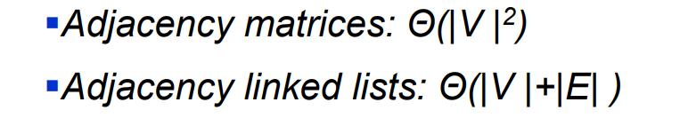

**3. 思想**

思想上来说这两种方法都是穷竭列举所有的情况。


# 回溯搜索

## 基本思想

① 针对所给问题，定义问题的解空间； 

② 确定易于搜索的解空间结构；一般为解空间树。

③ 以深度优先方式搜索解空间，并在搜索过程中用剪枝函数避免无效搜索。

> 剪枝函数： ① 用约束函数在扩展结点处剪去不满足约束的子树； ② 用限界函数剪去得不到最优解的子树。


## 解空间树

三种节点：

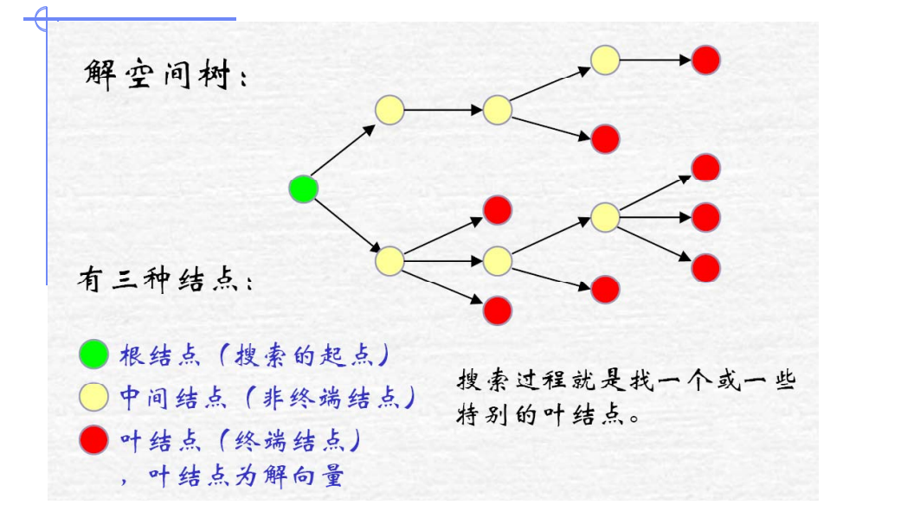

两个种类：

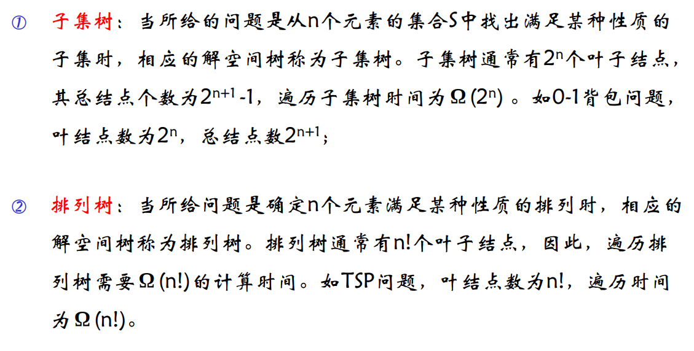


## 代码思路

```c
	/**子集树
	 * output(x)     记录或输出得到的可行解x
	 * constraint(t) 当前结点的约束函数
	 * bount(t)      当前结点的限界函数
	 * @param t  t为当前解空间的层数
	 */
	void backtrack(int t){
		if(t >= n)
			output(x);
		else
			for (int i = 0; i <= 1; i++) {
				x[t] = i;//0/1表示是否取值
				if(constraint(t) && bount(t))
					backtrack(t+1);
			}
	}
```

```c
	/**排列树
	 * output(x)     记录或输出得到的可行解x
	 * constraint(t) 当前结点的约束函数
	 * bount(t)      当前结点的限界函数
	 * @param t  t为当前解空间的层数
	 */
	void backtrack(int t){
		if(t >= n)
			output(x);
		else
			for (int i = t; i <= n; i++) {
				swap(x[t], x[i]);//交换，构造分支
				if(constraint(t) && bount(t))
					backtrack(t+1);
				swap(x[t], x[i]);//还原，构造其他分支
			}
	}
```

## n皇后问题**

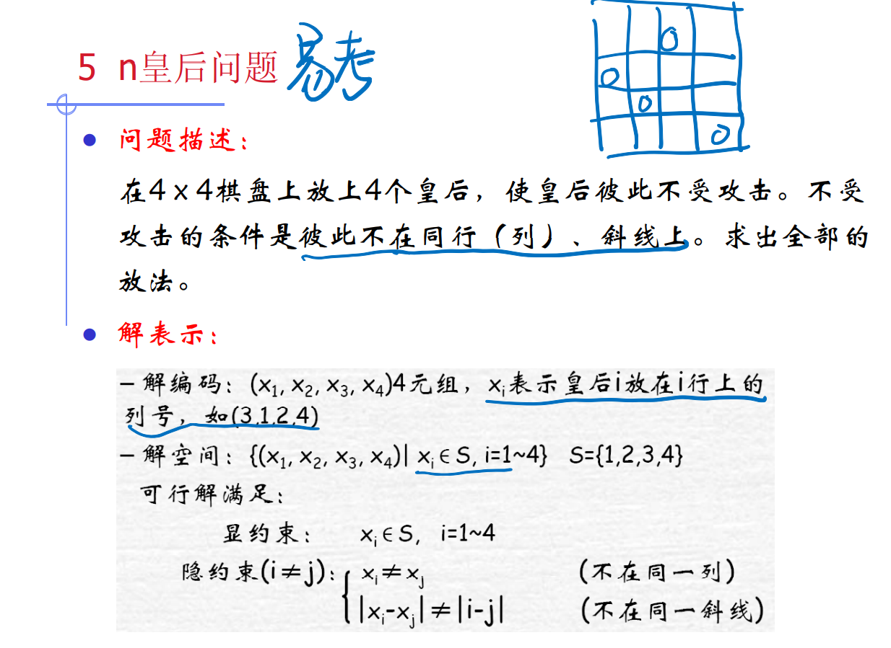


解空间树

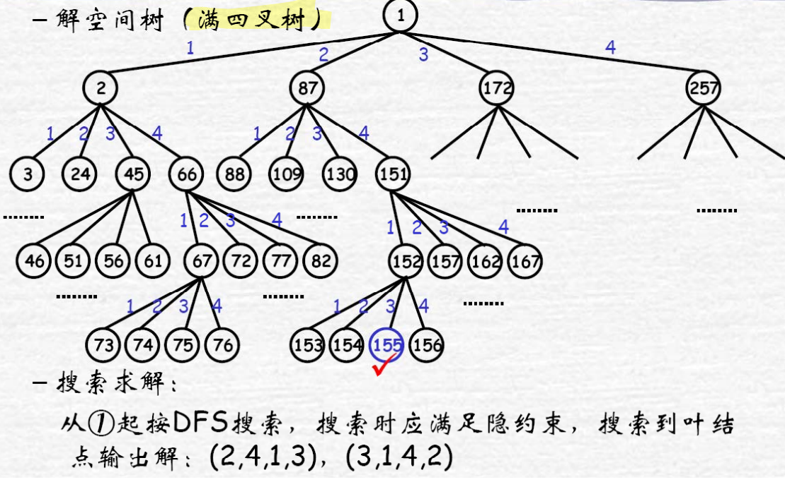

代码：

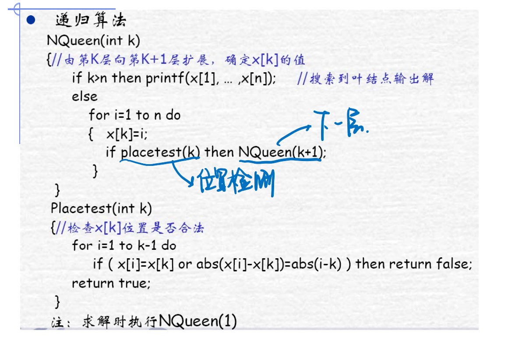

## 背包问题

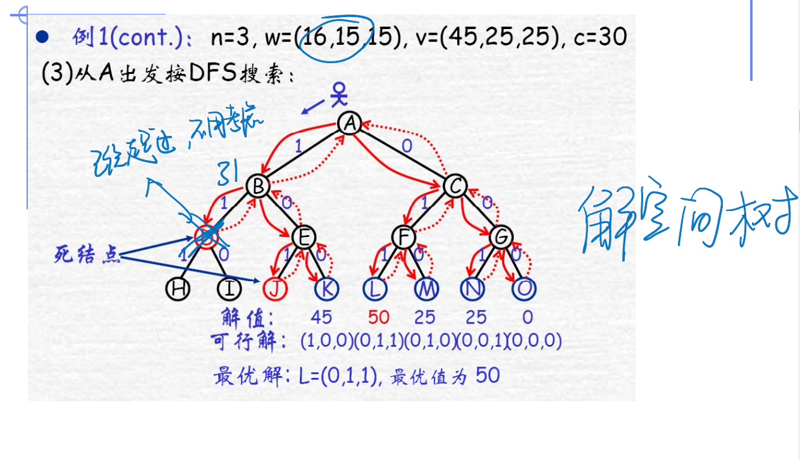

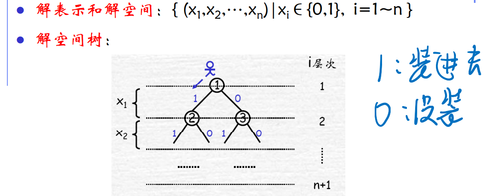

代码

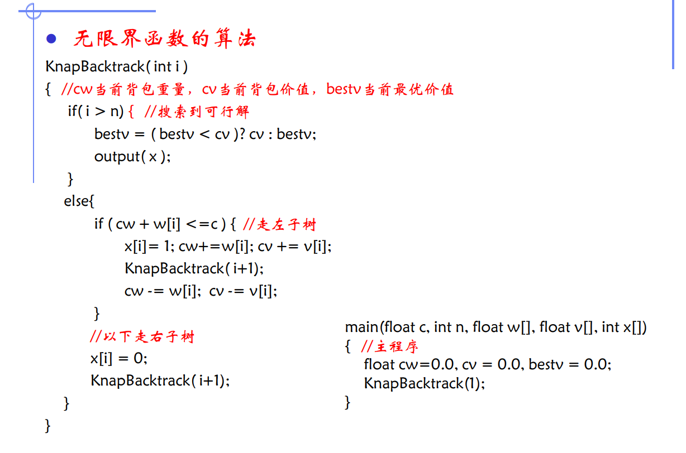


## TSP

最终要回到原来的出发城市

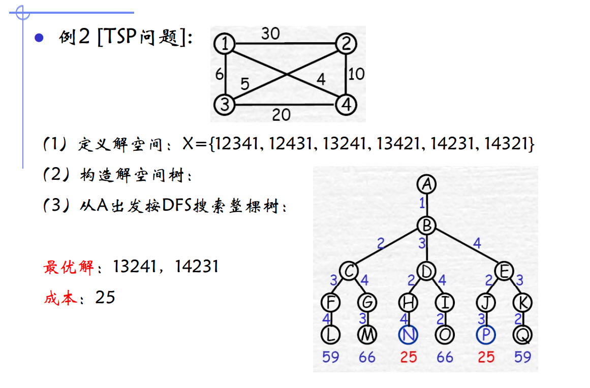

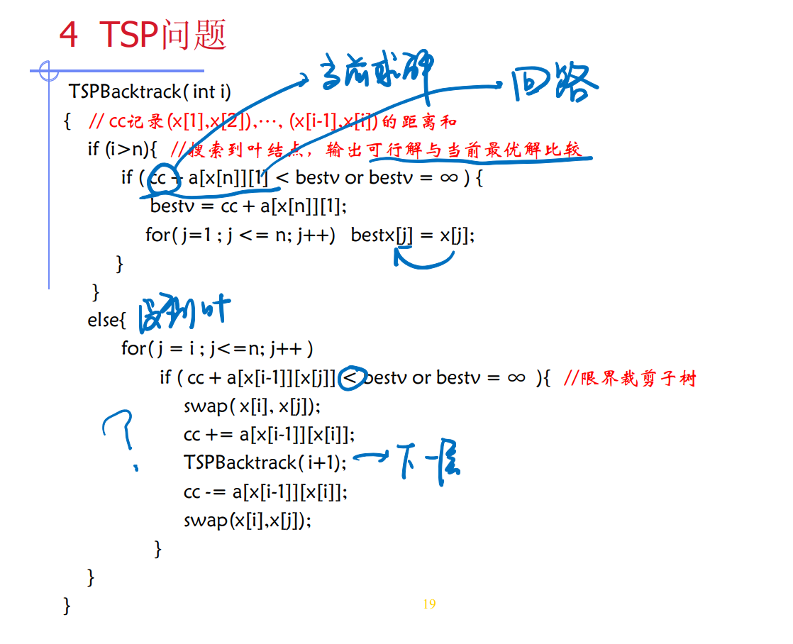


# 分支界限

为了有效地选择下一个扩展结点，以加速搜索的进程， 在每一活结点处，计算一个函数值（优先值），并根据这 些已计算出的函数值，从当前活结点表中选择一个最有利 的结点作为扩展结点，使搜索朝着解空间树上有最优解的 2 分支推进，以便尽快地找出一个最优解。

求解步骤：

定义解空间（对解编码）； 

确定解空间的树结构； 

按BFS等方式搜索： 

​	a. 每个活结点仅有一次机会变成扩展结点； 

​	b. 由扩展结点生成一步可达的新结点； 

​	c. 在新结点中，删除不可能导出最优解的结点；//限界策略 

​	d. 将剩余的新结点加入活动表（队列）中； 

​	e. 从活动表中选择结点再扩展； //分支策略 

​	f. 直至活动表为空；

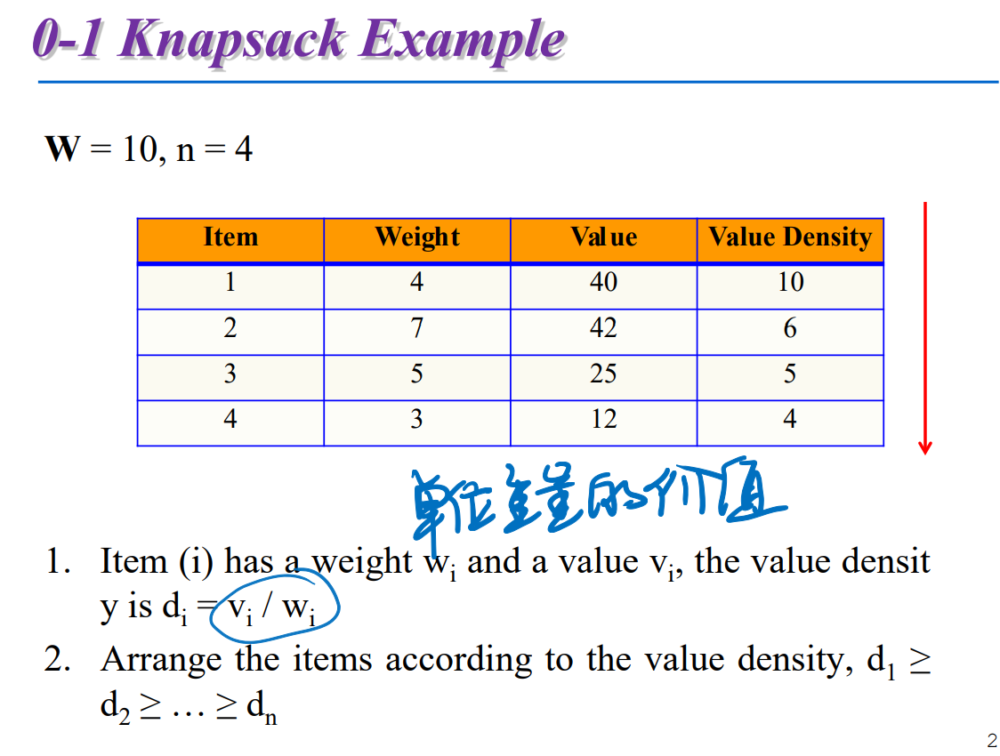


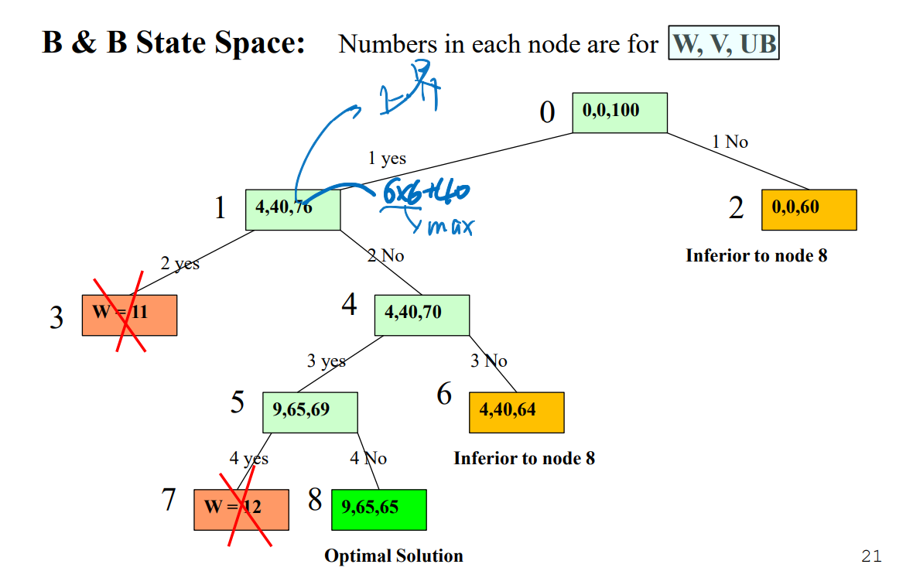

已经选了的重量，目前获得的价值，这种情况下可能获得的最大价值


## 装载问题


# BB和Backtraking

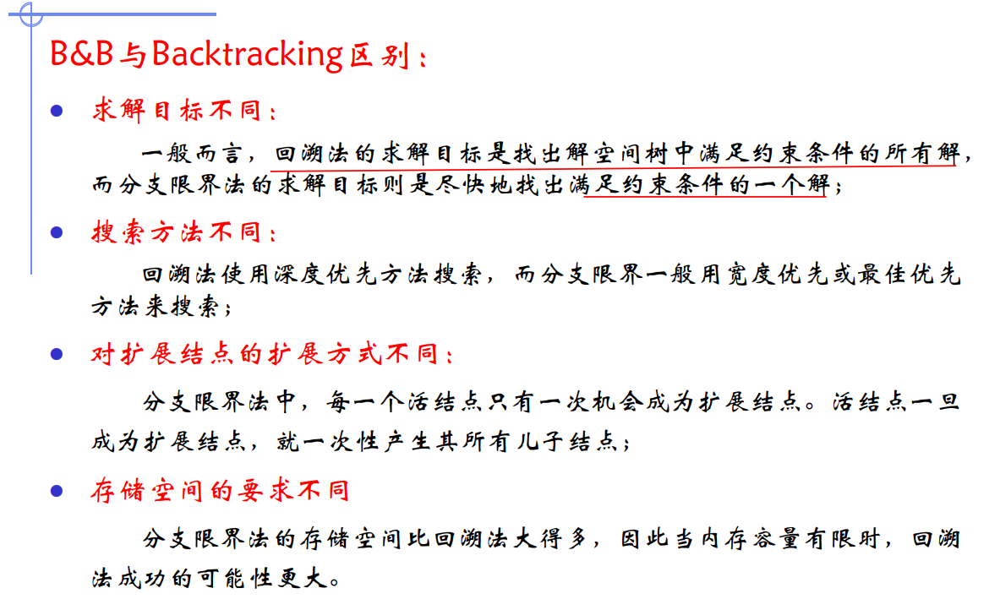

