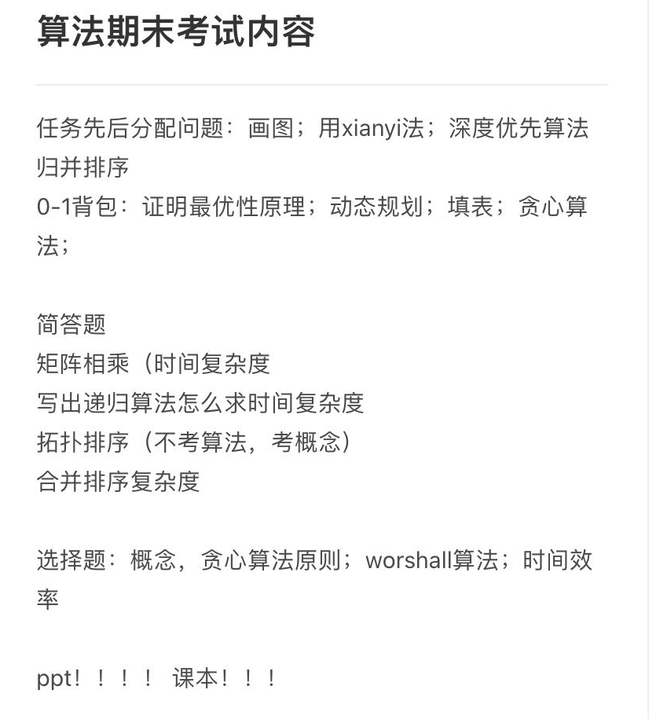

# 算法相关定义

<u>**Algorithm + data structure = program**</u>

算法的定义：在有限时间内，对问题求解的一个清晰的指令序列。算法的每个输入确定了该算法求解问题的一个实例。 

<u>**算法的特点：输入，输出，确定性，有穷性，和可行性。 **</u>

算法可以用自然语言或者伪代码表示，或计算机程序实现。 

一个好的算法常常是不懈努力和反复修改的结果。 

算法操作的是数据，所以数据结构很重要。

# 复杂度分析

## 算法的效率分析

分析框架：

1. 衡量时间效率
2. 衡量输入规模
3. 衡量增长率
4. 最坏、最好、平均情况

### 时间效率

Count the number of times an algorithm’s **basic operation** is executed. 

• Basic operation: the operation that contributes the most to the total running time. 

• For example, the basic operation is usually the most timeconsuming operation in the algorithm’s innermost loop.

### 输入规模

时间效率用输入规模的函数来度量，该函数的计算主要关注算法**基本操作的执行次数**

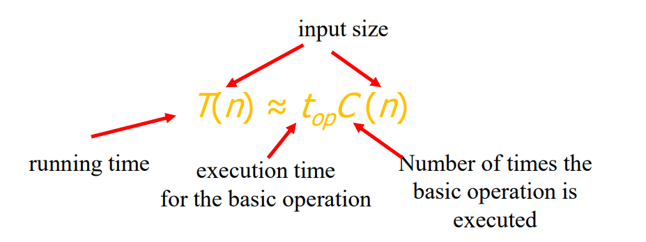

### 增长阶

效率分析框架忽略了乘法常数，而关注于C(n)的增长阶数。

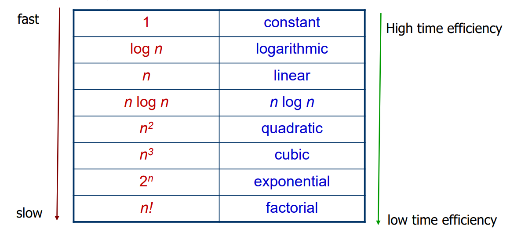

## Worst / Best / Average case

## 渐进表示

Ω(g(n)):  比g(n)增长快(或一致)的函数集合（g的图像在Ω的下面）

Θ (g(n)):  增长速度相同的函数集合

O(g(n)):  比g(n)增长慢(或一致)的函数集合（g的图像在O的上面）

举个例子，5n+20∈O(n), O(1)，同时5n+20∈Ω(n), Ω(n²)

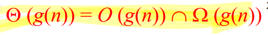

如何比较增长阶数

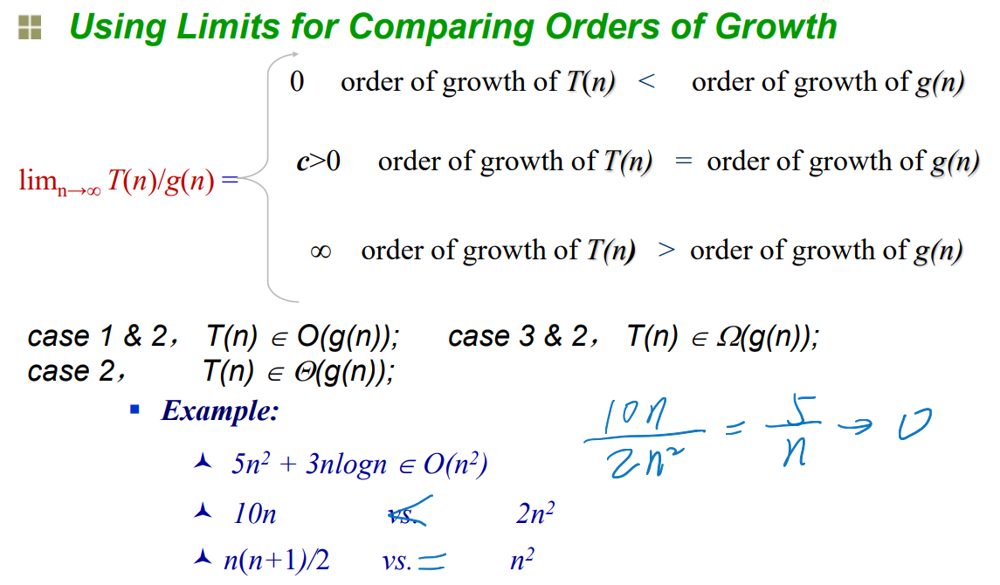

## 递归与非递归算法的效率分析

### 非递归算法分析

例子1：在n个数里找到最大元素

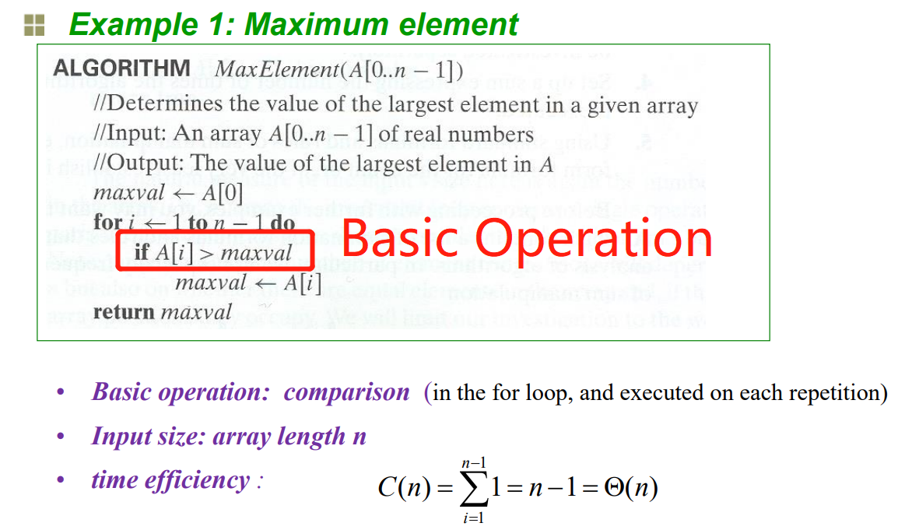

例子2：判断一个数组是否没有重复元素

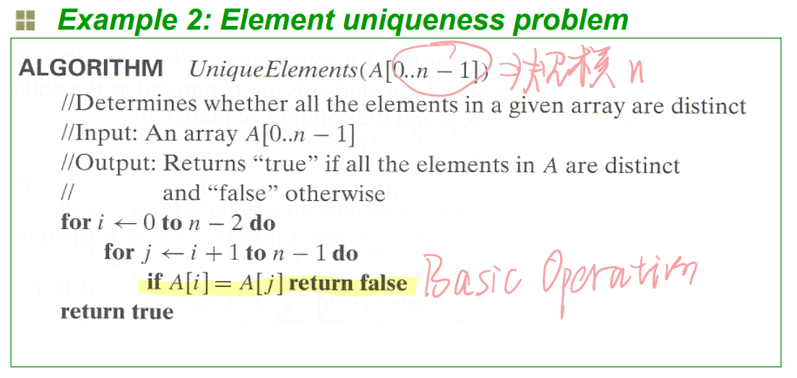

这种算法的时间复杂度：

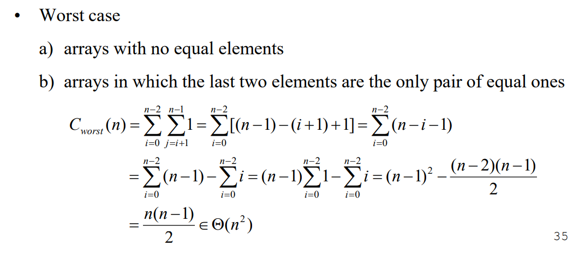

改进算法的时间复杂度：

- 首先快速排序，时间复杂度nlogn
- 然后扫描比较，次数不多于n-1
- 总的来说时间复杂度为nlogn

### 递归算法的时间复杂度

例子1：求n的阶乘

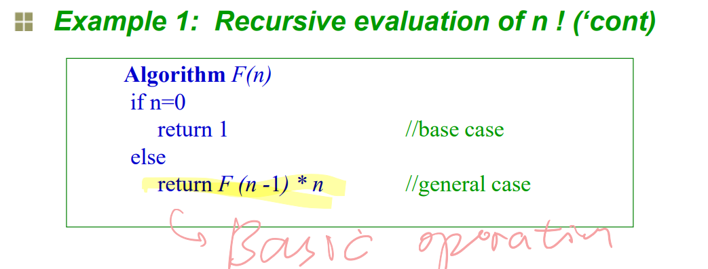

如何求时间复杂度

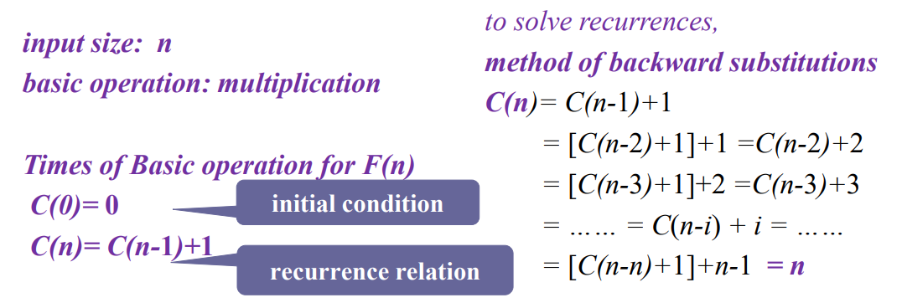

例子2：汉诺塔

问题描述：将n个圆盘从a通过c移到b上，要求过程中大圆盘必须在小圆盘下面

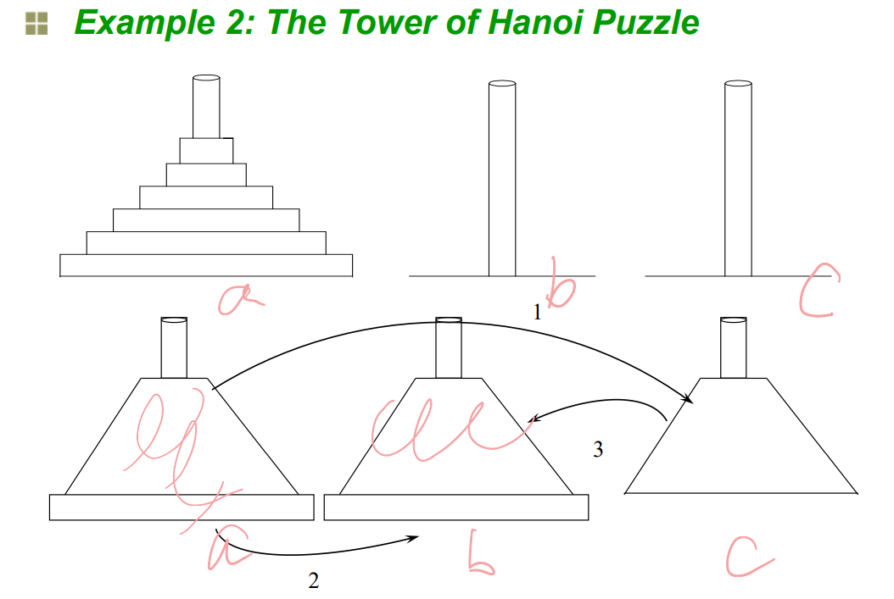

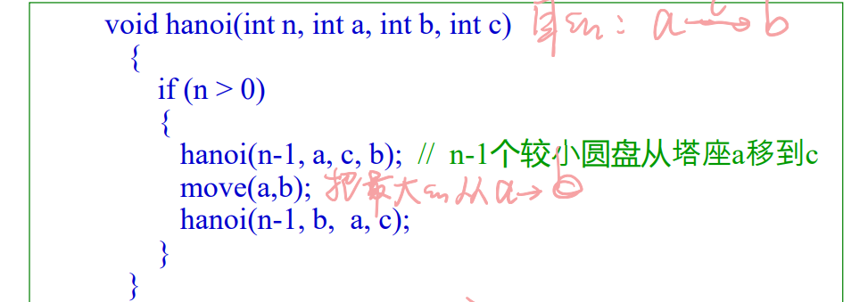

必考知识点来了：

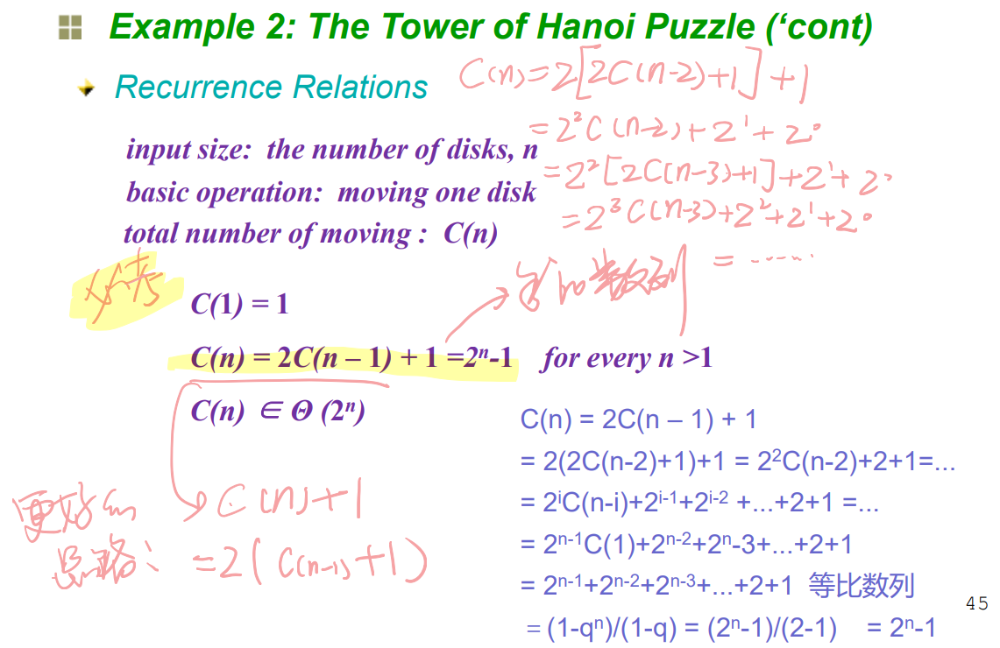

例子3：求一个十进制的二进制数

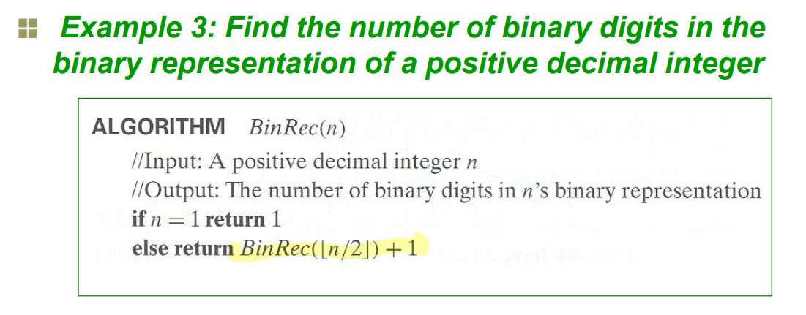

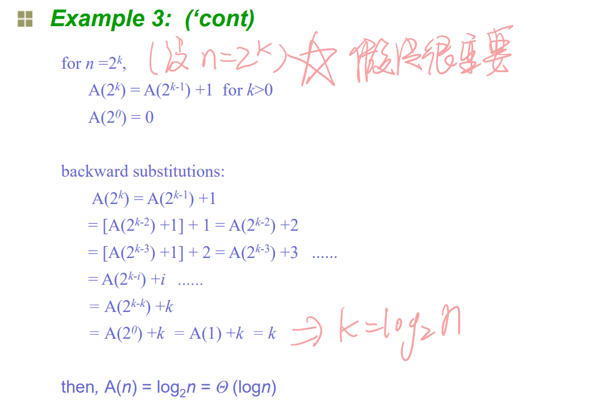

