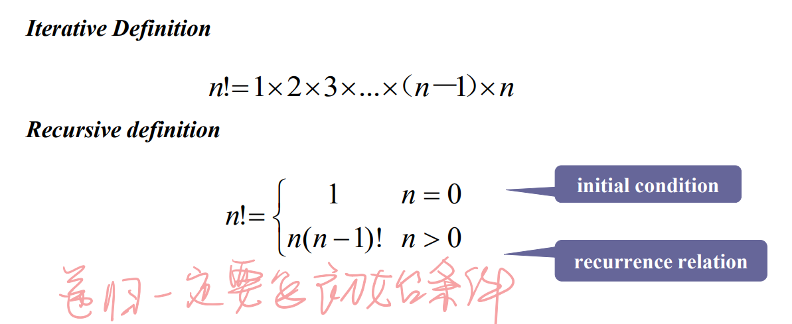
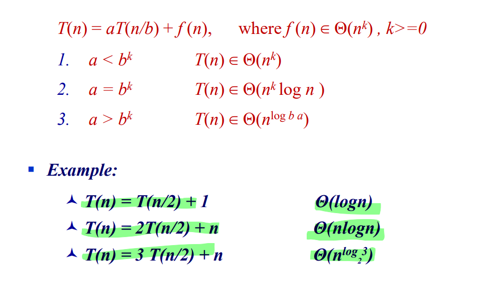

# 递归的定义

递归一定要有初始条件（边界条件）和递归关系式

递归算法一般不是高效的算法。

# 递归的类型

## 减一 

T(n) = T(n-1) + f(n)

例子：求n！

## 减常数因子 

T(n) = aT(n/b) + f (n)

例子：二分搜索

## 减不固定因子

**T(n) = T(n-1) + c**

​			T(n) = (n-1)c + d

**T(n) = T(n-1) + c n** 

​			T(n) = [n(n+1)/2 – 1] c + d 

​			T(n) = T(n-1)+cn =T(n-2)+c(n-1)+cn =... =T(1)+c[2+...+(n-1)+n]

例子：十进制变二进制

