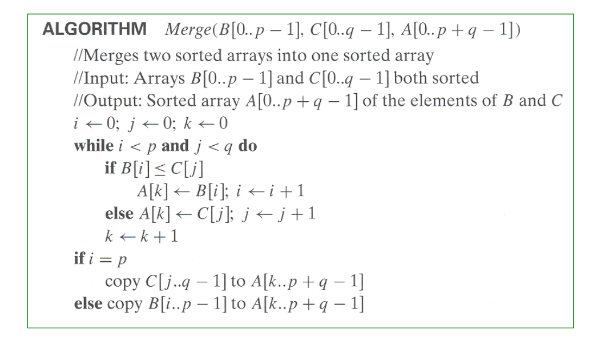

# 定义&性质

定义：简单来说就是“向下分解，向上求解”，步骤分为三步：

- 分：将原先的问题分成若干个小问题。
- 解：解决这若干个小问题。
- 合：必要时将若干个小问题的解合并起来。

性质：

若一个规模为n的问题被划分为了a个规模为n/b的问题。

f(n)为拆解原先问题所需要的时间。

# 大整数乘法

## 问题引入：

假设有两个n位数X和Y相乘

## 暴力法：

用X的n位逐个乘以Y的n位数再错位加起来——效率为n²

## 分治法：

将每个数分为前后两份，则X*Y可以表示为最后一行。

### 第一版分治：

如果n很大，递归；如果n足够小或者为1，直接相乘。

这版的效率为：（和暴力法没区别，毫无改进）

### 第二版分治：

将中间项（AD + BC）等量代换为\+ [ (A + B ) (C + D ) – A* C – B*D] 

（不换成((a+c)(b+d)-ac-bd)的原因是：考虑到a+c,b+d可能得到m+1位的结果， 使问题的规模变大）

这样整个式子变为

只用算三个乘法

效率分析：

# Stressen矩阵相乘算法

## 问题描述：

两个n阶方阵A和B相乘得到C。

## 暴力法：

## 分治法：

### 第一版

将A、B各分为四个小部分

### 第二版

Strassen提出

则：

# 折半查找

## 问题描述

已知一个按**非降次序排列**的元素表a0,a1,…,an-1，寻找给定元素K若是，找不到返回值-1。 

则问题为I=（n，a0~an-1，K）——第一个是待搜索元素个数，第二个是各项元素，第三个是目标元素。

## 中心思想

选取一个中间下标m=(l+r)/2下取整，可得到三个子问题： 

I1=(m,a0 ,…,am-1 ,K) 

I2=(1,am,K) 

I3=(n-m-1,am+1,…,an-1,K)

如果A[M]就是K，则停止搜索；

如果A[M]大于K，则问题转化为I1；

如果A[M]小于K，则问题转化为I3；

一个例子：

迭代版本：

递归算法：

## 效率分析

二元比较树的内容——略

# 合并排序

## 思路

Step1 分：将序列 A[0...n-1] 分为前后两个大小相同的序列B和C

Step2 治：如果B和C的长度是1，则问题直接被解决；如果不是1，则将BC作为原始问题到Step1

Step3 合并：将B和C合并得到排列好的A

## 算法代码

递归部分：

合并部分：

合并时候，小的进入A，同时对应数组自加后移。

某个数组进完之后将剩下的直接copy进A数组

一个例子：

## 效率分析

# 快速排序

## 思想

选择一个元素（一般是第一个元素，或者随机选取<which is better>），将小于这个元素的数放到数组前半部分，大于这个元素的数放到数组后半部分。然后把这个数放在数组中间。

中间两个while要看懂，是选择性空循环，可以结合下面的例子看

## 效率分析

# 棋盘覆盖问题

## 问题描述

## 分治策略

until：

