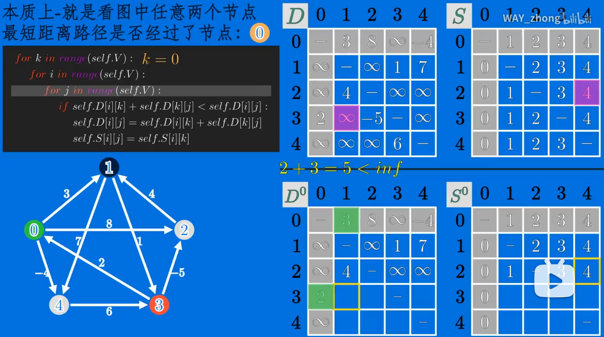

# 引言介绍

## 多阶段决策问题

在研究多阶段决策过程(Multistep Decision Process)的优化问题时，提出 了著名的最优化原理(Principle of Optimality)，**把多阶段过程转化为一系列单阶段问题，逐个求解。**

**多阶段决策问题(MDP)：**求解的问题可以划分为一系列相 互联系的阶段，在每个阶段都需要作出决策，且一个阶段 决策的选择会影响下一个阶段的决策，从而影响整个过程 的活动路线，求解的目标是选择各个阶段的决策使整个过 程达到最优。

用于求解**以时间划分阶段的动态过程的优化问题**，但是一些与时间无关的静态规划(如线性规划、非线性规划)，可以**人为地引进时间因素**，把它视为 多阶段决策过程，也可以用动态规划方法方便地求解。

**Bellman 最优性原理** 求解问题的一个最优策略序列的子策略序列总是最优的，则称该问题满足最优性原理。

思想实质：**分治思想和解决冗余**。

## 与分治法

**与分治法相同点**： 将原问题分解成若干个子问题，先求解子问题，然后从这些子问题的解得到原问题的解。 

**与分治法不相同点**： 经分解的子问题往往**不是互相独立的**。若用分治法来解， 有些共同部分（子问题或子子问题）被**重复计算**了很多次

为了避免重复计算、节省时间 。动态规划法用一个表来记录所有已解的子问题 的答案。

## 解题步骤

① 找出最优解的性质，并刻画其结构特征； 

② 递归的定义最优值（写出动态规划方程）； 

③ 以自底向上或自顶向下的方式计算出最优值； 

④ 根据步骤3计算最优值时的记录信息，构造最优解。（如果只需要求解最优值则这个步骤省略）

设计技巧：阶段的划分，状态的表示，存储表的设计

## 两个重要的适用性质

最优子结构和重叠子问题。

① 最优子结构 

如果问题的最优解是由其子问题的最优解来构造，则称该 问题具有最优子结构性质。 使用动态规划算法时，要用子问题的最优解来构造原问题 的最优解，因此必须考查最优解中用到的所有子问题。 

② 重叠子问题 

使用递归算法的时反复求解相同的子问题，不停的调用函 数，而不是生成新的子问题。如果递归算法反复求解相同 的子问题，就称为具有重叠子问题（overlapping subproblems ）性质。在动态规划算法中使用数组来保存子问题的解， 这样子问题多次求解的时候可以直接查表不用调用函数递 归。E.g.斐波拉契数列中fib(2)的5次调用。

# 计算C(n, k)

## 动态规划表达式

## 记录表

## 代码及复杂度分析

# 最长公共子串

## 问题描述

按同样顺序出现的最长子串

## 最优子结构

## 动态规划方程

i指考虑A串前i元素，j指考虑B串前j元素

## 记录表

## 代码

# 动态矩阵乘法

## 问题描述

ABCD....矩阵相乘，以什么顺序做乘法使得乘法次数最少？

## 动态规划方程

m[i,j]表示矩阵Ai乘到Aj需要的的最小乘法次数。

## 代码和效率分析

效率：n三次方

## 例子

# 0-1背包问题

## 问题描述

## 动态规划方程

V（i， j）指的是i个物品，可承重为j。

## 代码&复杂度分析

## 例子

那么，知道最多可获得的价值，怎么知道背包要放什么东西呢？

# 多阶段决策问题

## 简介

问题的活动过程分为若干相互联系的阶段 

在每一个阶段都要做出决策，这决策过程称为多阶段决策过程 

任一阶段 i 以后的行为仅依赖于i 阶段的过程状态，而与i 阶段 之前的过程如何达到这种状态的方式无关

多阶段决策的最优化问题就是：

在所有容许选择的决策序列中 选择能够获得问题最优解的决策序列——最优决策序列。

## 多段图问题

求由s到t的最小成本路径。

d[i] [j]表示到达第i段第j个节点（编号i，j）所需要的最低成本。

w[i] [j] [k]表示（i，j）到达下一阶段第k个节点需要的成本。

# Warshall算法

Warshall算法是求二元关系传递闭包的一种高效的算法。

**传递闭包：**存在一个有向图，能用布尔邻接矩阵表示（1、0）。存在一个矩阵，它能够给定图的顶点之间是否存在任意长度的有向路径，这种矩阵称为有向图的传递闭包，是我们能够**在常数时间内判断第j个顶点是否可从第i个顶点到达。**

n阶矩阵就求到R^n

其中R的幂次k表示要连接这两个点，需要经过有多少个中间节点

下一个1矩阵由上一个矩阵框起来的行和列计算得出。

这里的计算过程为，以0到1为例：存在（d,a）=1，（a,b）=1，则（d,b）=1

计算过程中1的数量是不断增加的。

# Floyd算法

## 问题描述

Floyd算法可以计算加权连通图的每个顶点到其它所有顶点之间的最短距离，使用矩阵表示。

又称for-for-for算法

其实就是初始化一个距离矩阵，然后看每一个顶点通过k（k从a循环到d）到其他所有顶点的距离是否会更小，如果更小就改变值，再迭代k。

https://www.bilibili.com/video/BV1Mk4y117mP?from=search&seid=6696408842560767555&spm_id_from=333.337.0.0

这里的weight matrix和左边的图是完全等价的。那么如何生成右边的距离矩阵呢——用 Floyed 算法

D^k的第i行第j列元素dij^k等于从第i个顶点到第j个顶点之间所有路径中最短路径的长度，并且路径中的每一个中间节点（如果有的话）的编号不大于k

## 动态规划方程

d[i] [j] = min ( d[i] [j],   d[i] [k] + d [k] [j] )      k=1...n

## 代码

## 例子

第一步：K=0 就是观测最短路径是否经过0（第一个for）

后两个for是比较原来路径与经过节点0的路径哪一个更小，取小的加入D0矩阵。

第二步：迭代

# 最优性原理

**Bellman 最优性原理** 求解问题的一个最优策略序列的子策略序列总是最优的，则称该问题满足最优性原理。

> 证明过程：假设A为Kn最优解，证明A‘(A'为去掉A中第一个答案的A的子集）为子问题Kn-1的最优解。
>
> 一般假设A’不是Kn-1的最优解，B是，然后由此推导出A不是Kn最优解，矛盾。

例2中的第一个数字k表示考虑第k个到第n个物品。

