# 本章不考

出席10%

随堂练习canvas 20%

实验作业 30%——coding，实验平台

考试成绩 40%

# 什么叫编译程序

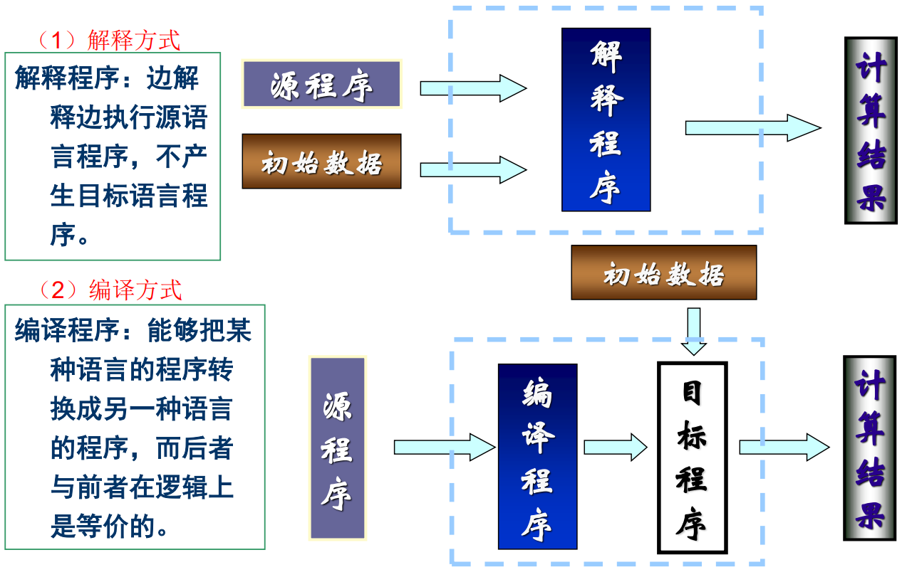

程序执行的两种方式：

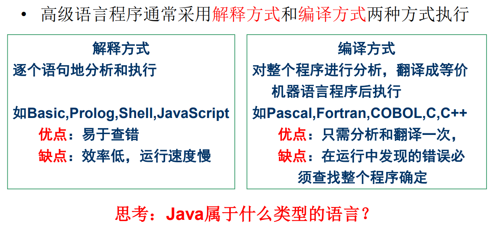

编译就是全文翻译，全部翻译完才执行。 解释就相当于同声翻译，边翻译边执行。

# 编译过程概述

1. 词法分析 
2. 语法分析 
3. 语义分析中间代码生成 （中间码可复用）
4. 优化 
5. 目标代码生成

前端：

后端：中间码》可执行码

## 词法分析

词法分析程序又称扫描程序(Scanner)。

 – 任务：读源程序的字符流、识别单词（也称单词符号，或简称符 号），如标识符、关键字、常量、界限符等，并转换成内部形式。 

– 输入：源程序中的字符流 

– 输出：等长的内部形式，即属性字 <Token-name, Attribute-value>（ 抽象名字 指向符号表 ），当前者唯一时后者可省略

• 在词法分析阶段工作所依循的是语言的词法规则。

 • 描述词法规则的有效工具是正规式和有限自动机。

 • 方法：状态图；自动机DFA&NFA 

例子：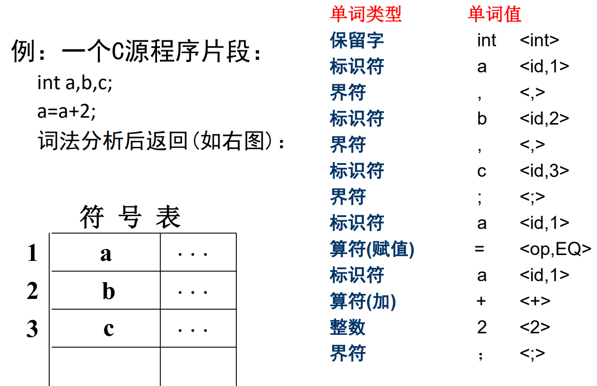

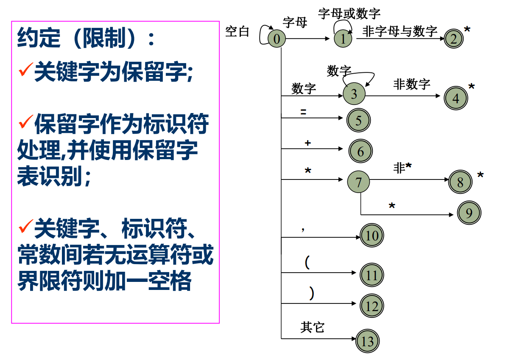

第一个：变量名

第二个：数字

第三个：=......

page18

识别关系运算符

最后一个情况：多读了一个符号，退回去，并且结束识别

page19

判断是不是合法的

做状态转移，取下一个

## 语法分析

语法分析程序又称识别程序(Parser)

任务：读入由词法分析程序识别出的符号，根据给定语法规则， 识别出各个语法单位（如：短语、子句、语句、程序段、程序）, 并生成另一种内部表示。

– 输入：由词法分析程序识别出并转换的符号 

– 输出：另一种内部表示，如语法分析树或其它中间表示。

语法规则通常用**上下文无关文法**描述。 

方法：递归子程序法、LR分析法、算符优先分析法。

上下文无关文法 :arrow_down:

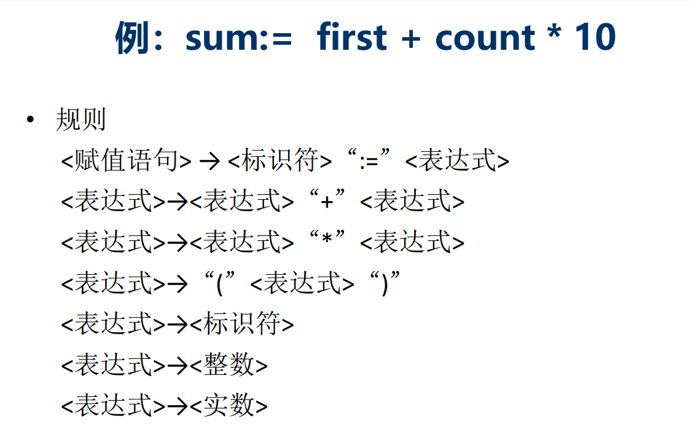

从上到下的分析，语法数:arrow_down:

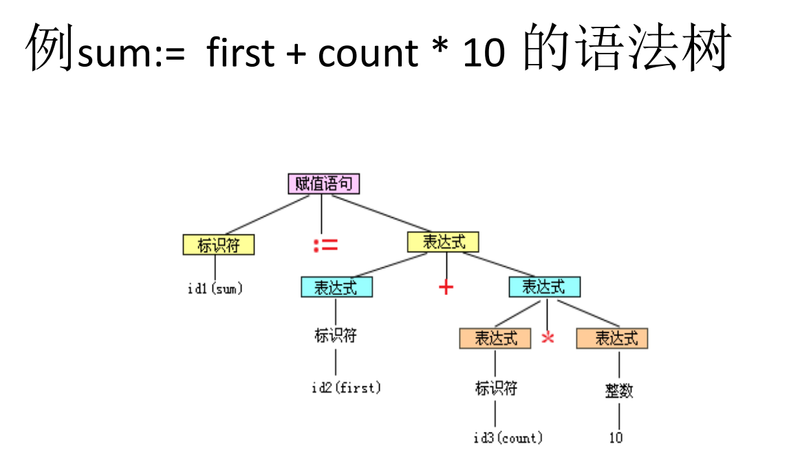

## 语义分析

对语法分析树或其他内部中间表示进行静态语义检查，如果正确则进行中间代码的翻译。 

– 按照语法树的层次关系和先后次序，逐个语句地进行语义处理。 

– 主要任务： 进行类型审查，审查每个算符是否符合语 言规范，不符合时应报告错误。 

​	• 变量是否定义 

​	• 类型是否正确

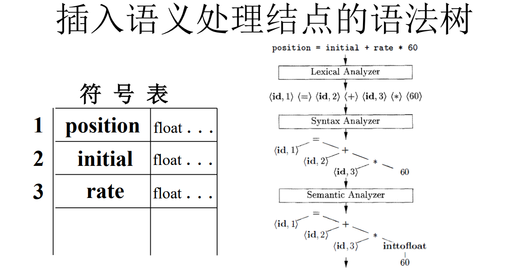

## 中间代码的生成

中间代码是一种独立于具体硬件的记号系统，或者与现代 计算机的指令形式有某种程度的接近，或者能比较容易地变换成机器指令。 

– 任务：将各类语法单位，如“表达式” 、 “语句” 、 “程序”等 翻译为中间代码序列。 

– 输入：句子 – 输出：中间代码序列 

​	• 中间代码的形式：常见的有四元式、三元式和逆波兰式等

​	• 方法：语义子程序；DAG图(有向无环图)；语法制导翻译

四元式=三地址代码

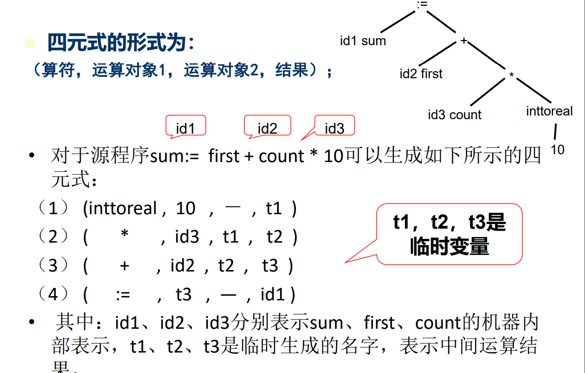

汇编码都在寄存器上执行

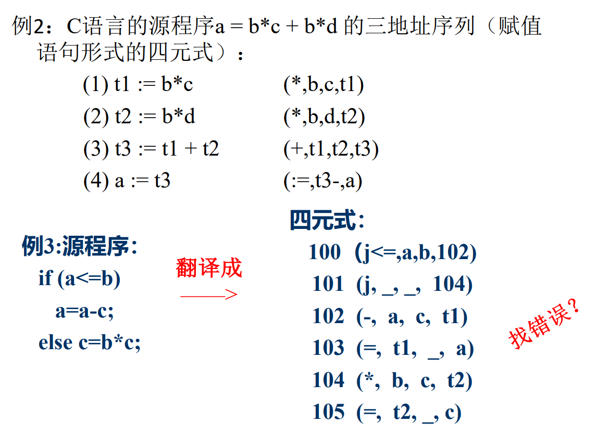

这里else没起作用

要跳转到if后面的语句

## 优化

产生更为高效（省时间和空间）的代码

优化所依循的原则是**程序的等价变换规则** 

其方法有：公共子表达式的提取、循环优化、删 除无用代码等等

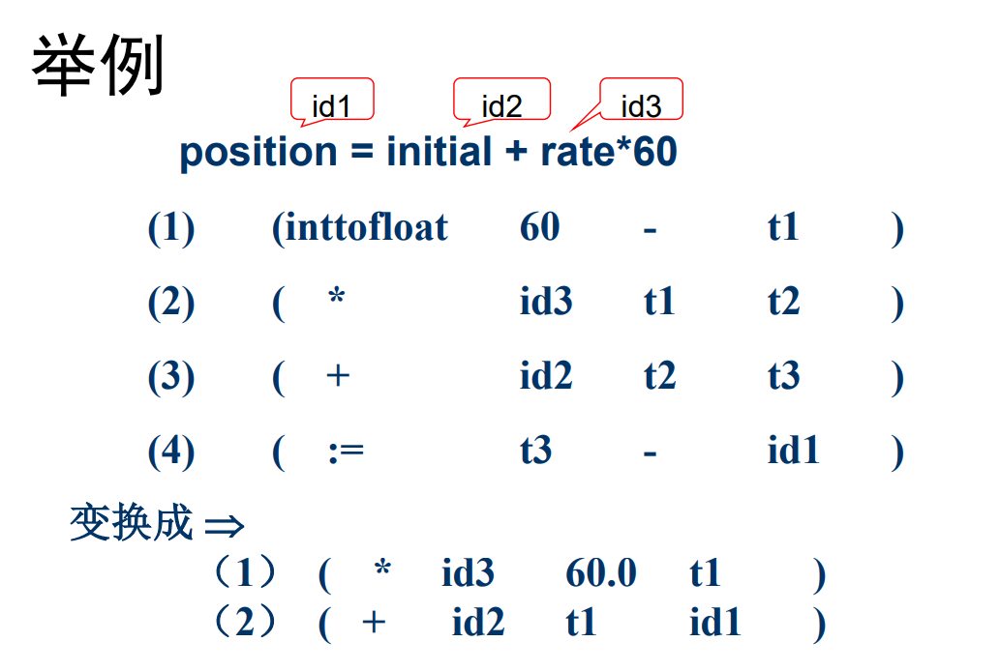

无法预测后面的运算，所以才引入t3

## 目标代码生成

这一阶段的任务：把中 间代码（或经优化处理 后）变换成特定机器上 的低级语言代码。它有 赖于硬件系统结构和机 器指令含义。 

– 与机器相关

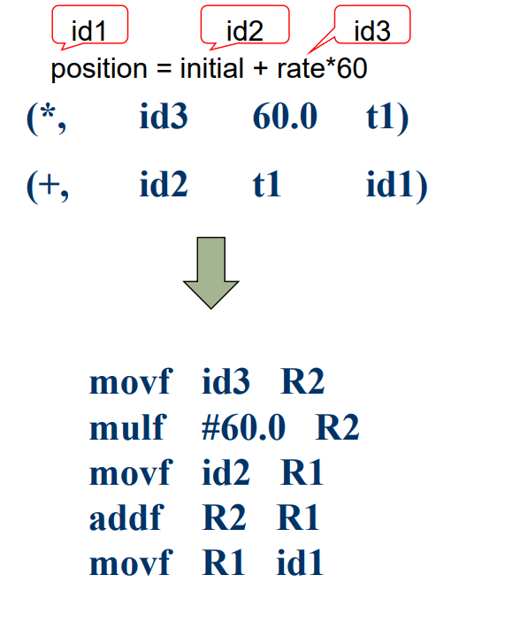

多了三个mov——和寄存器相关

t1需要刷出去保存（因为无法保证不是脏数据，内存》外存）

# 编译程序的结构

前端需要很多个（不同语言一个），后端只要一个

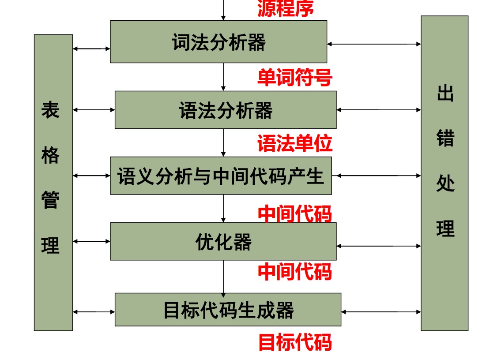

一个编译程序可由一遍、两遍或多遍完成。每一 遍可完成不同的阶段或多个阶段的工作。多遍翻译少占内存，多耗时间，一遍相反。

# 编译程序的生成

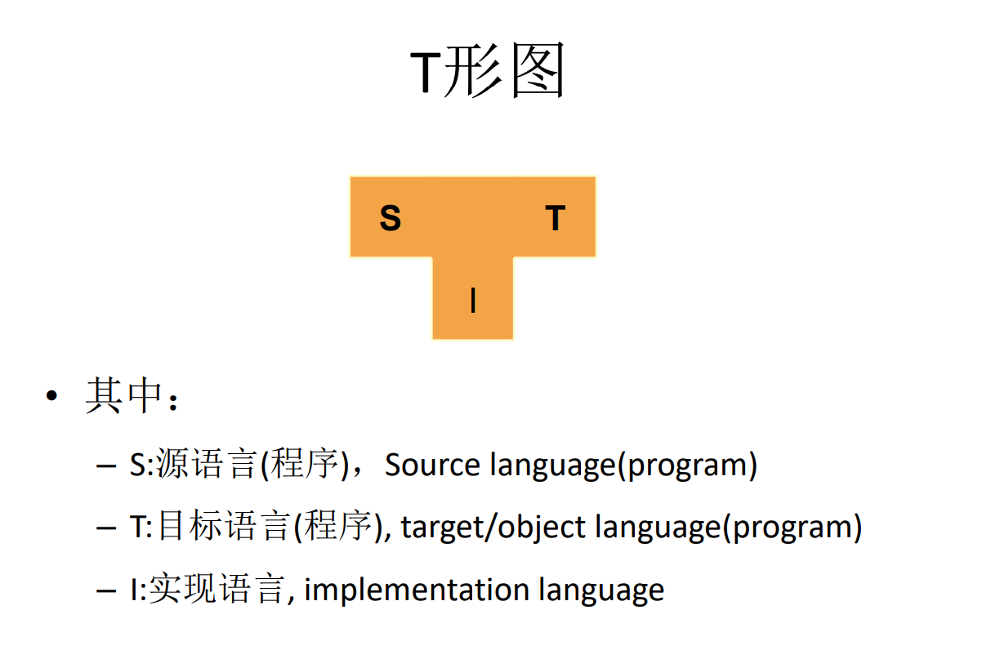

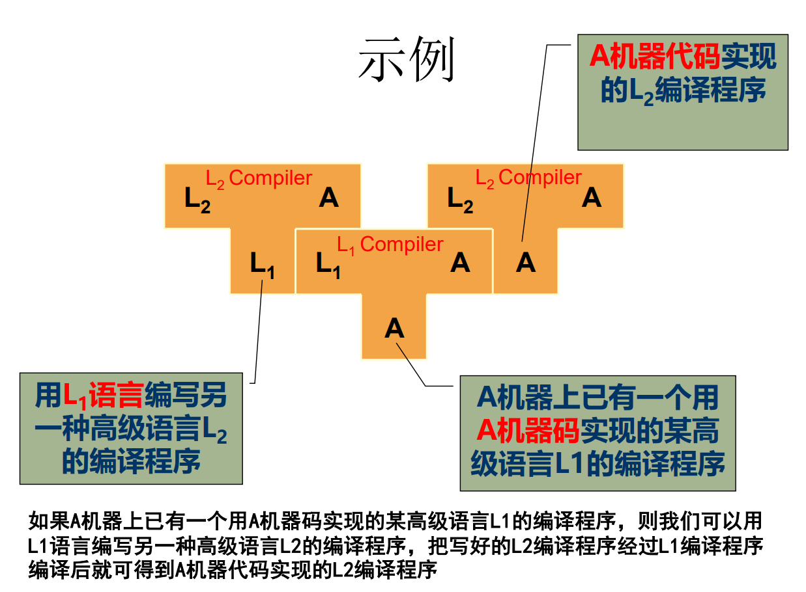

编译系统是一种系统软件，居于计算机系统中最靠 近硬件的一层

