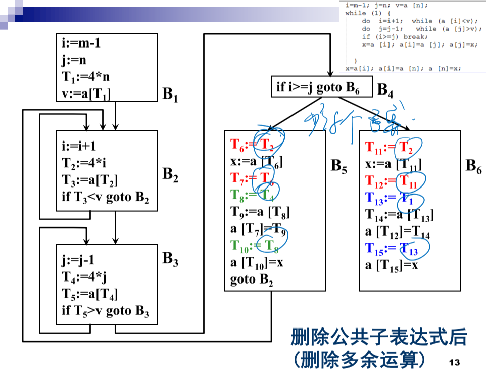

循环优化不用看，划分基本快也不用看，基于DAG完成代码优化了解下。（考试的比ppt例题还简单）

# 概述

## 删除多余运算（公共子表达式）

前：

后：

## 复写传播

原则；尽可能少地使用变量名称

## 删除无用赋值

## 强度削弱

## 删除归纳变量

前：

看第一个框框我们可以发现i，j和T2，T4有线性关系。这里i和j叫做归纳变量。

后：

# 局部优化

## 基本块

指程序中一顺序执行语句序列，其中只有一 个入口和一个出口。入口就是其中第一个语句，出口 就是其中最后一个语句。

一条三地址语句为x:=y+z，则称对x定值并引用y和z。

## 划分基本块

# 循环优化

## 代码外提

每次循环都不发生改变的代码：<u>**必经之路+必执行**</u>的代码

定值到达：A可以传给u，且中间A没有变化

> 例子一：
>
> for I:=1 to 10 do A[I, 2*J] := A[I, 2*J] + 1
>
> 

代码S ( A:=B OP C ) 外提条件（1）:不变运算所在 的结点是L所有出口结点的必经结点.

出循环后不再引用I的值，即使 不在必经结点内也可以考虑外移.

A在循环中其他 地方未再定值,才能把循环不变运算A:=B op C外提;

循环中所有A的引用点 只有S中的A的定值才能到达。

没听

## 强度削弱

## 删除归纳变量

考试必考这部分

