寄存器分配算法。给定中间代码，写目标码，写用了什么寄存器，两个数组的内容是什么。二元&一元；基本块结束的翻译措施：释放，活跃的放内存。

抢寄存器算法（抢b的还是c的？看bc的待用信息）

最后block结束的时候，把活跃的store出去

如何识别待用&活跃信息？

# 主要思想

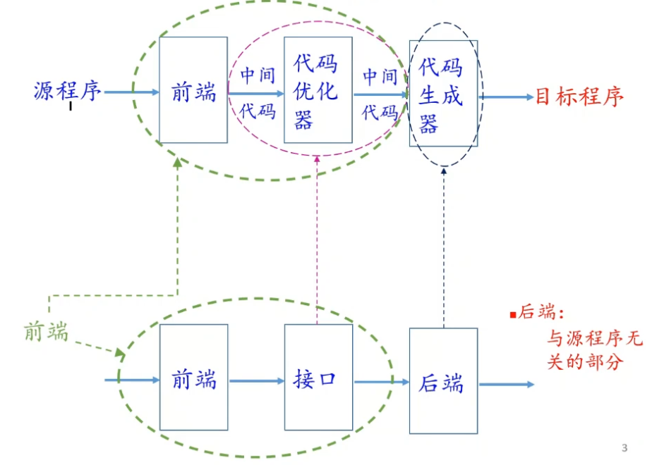

前端：语法&词法分析

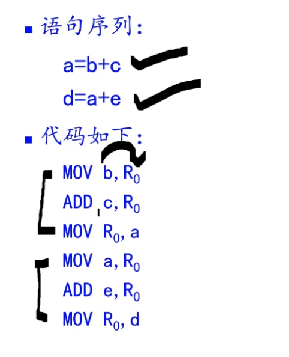

每个三地址码都被翻译成了三句。很简单，但存在多余的指令——比如这里的R0到a，a又到R0

# 目标机器模型

## 四种指令的实现形式

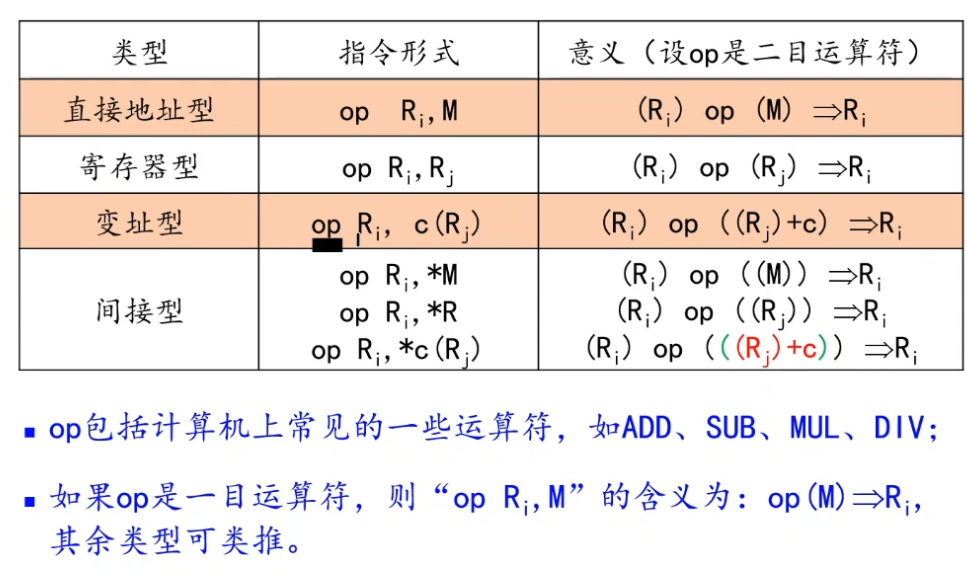

括弧表示取里面的值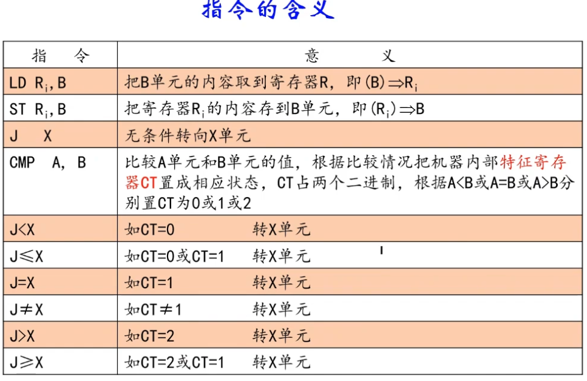

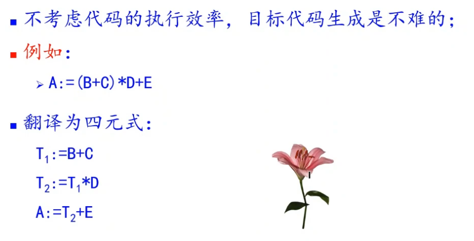

三条三地址代码，要翻译成九条语句：

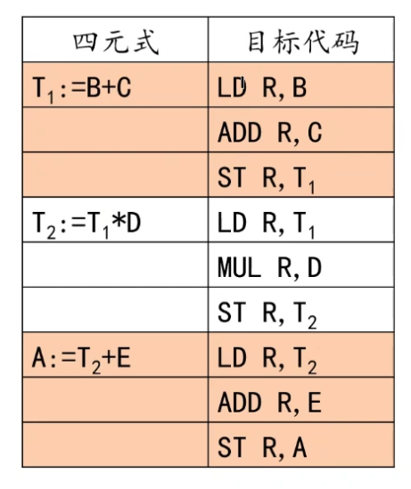

LD和ST本质上都是MOV

告诉i，A在j要被用。

只有寄存器和ALU之间有相连，所以不能够直接ADD a，b。必须要放到寄存器里，才能和ALU有计算。

待用信息：寄存器能不能释放？什么时候可以释放？吧某个寄存器里面的内容释放到内存之后，再给A用，因为A是待用信息。

## 待用信息和活跃信息

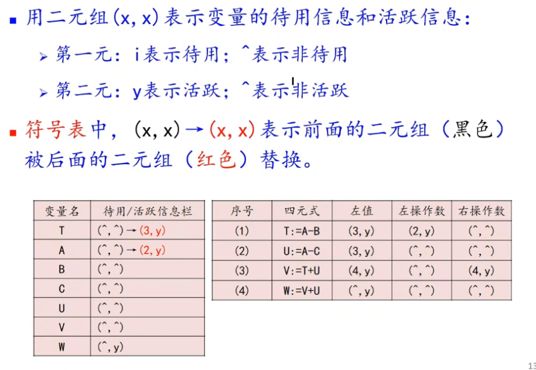

左边是符号表，右边是四元式代码表（在代码表中附加了信息）

首先把变量列出来。

w为y表示w在本代码块出口之后还要被使用。

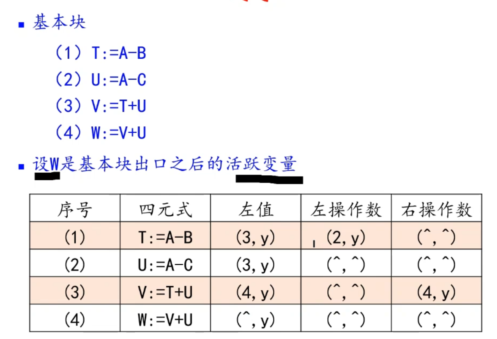

如何计算待用信息和活跃信息？

从底往上扫描

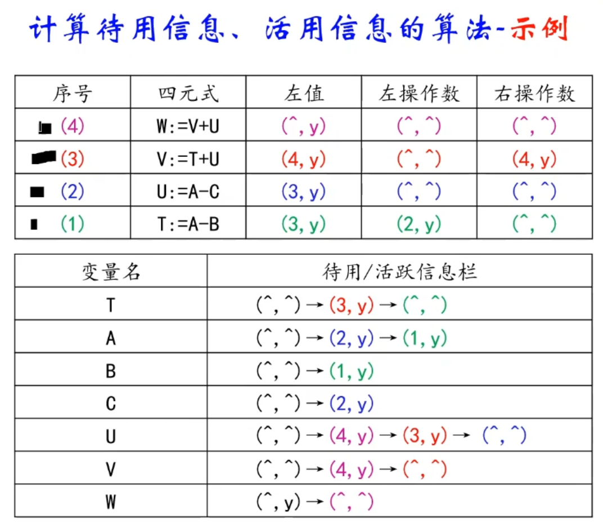

扫描第四句的时候，U和V的信息都要更改，记下来。

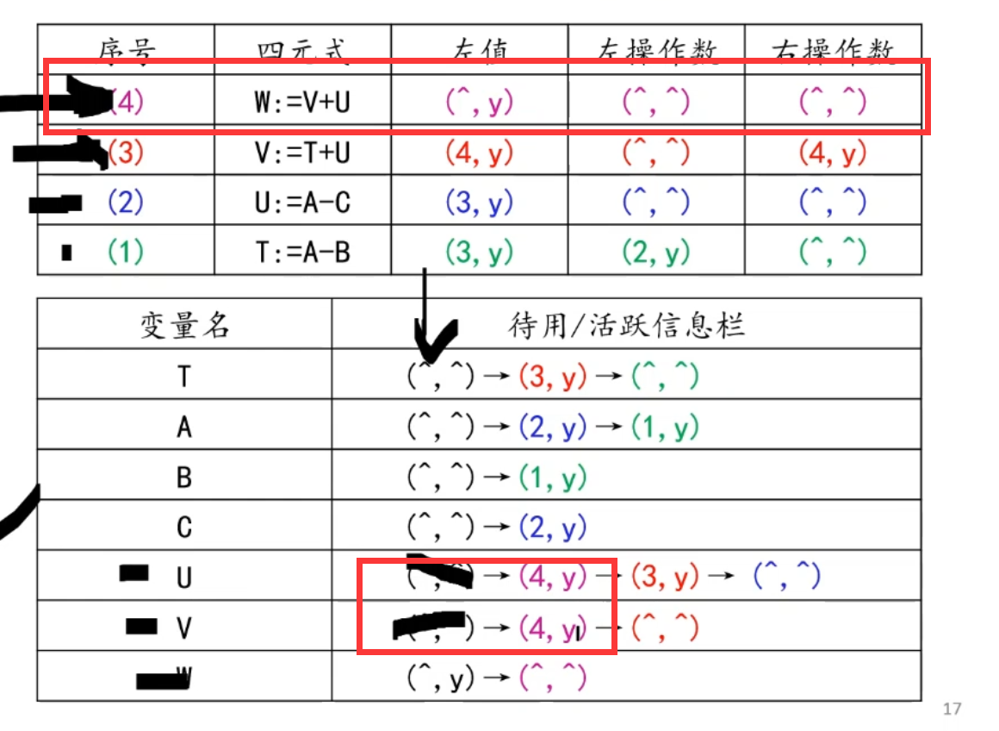

这样再扫描到第三句的时候，见到了U，就立马把四元式表格填上4，y

T最后扫描，要回到初始状态：为了阻挡之前的赋值（也就是说，只有左值需要返回未活跃）

优化这个活动存在于每一步

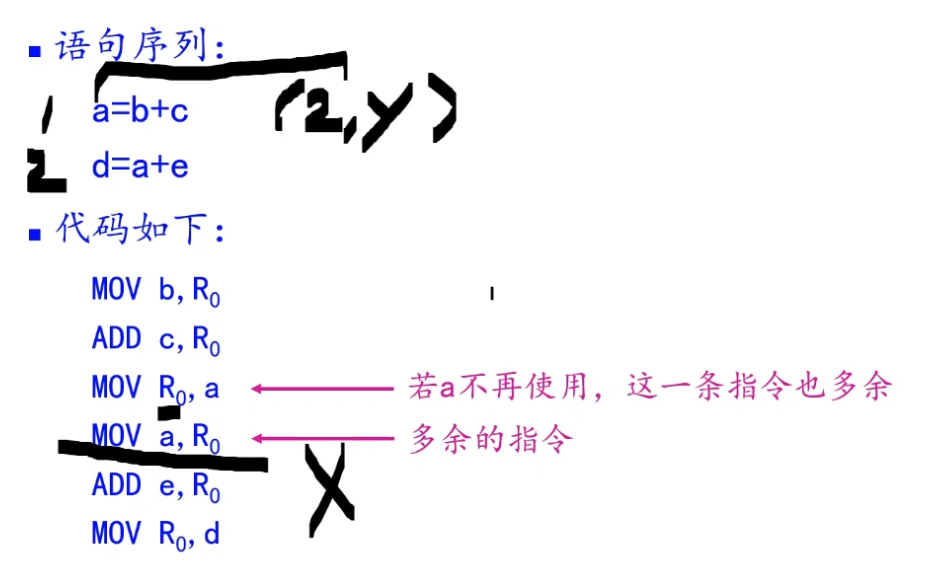

例如这里a在第二步还是活跃的，也就是a还要参与运算，那么目标代码里面第二句MOV就没必要加上去了。直接在寄存器参与计算即可。

## 寄存器描述和变量地址描述

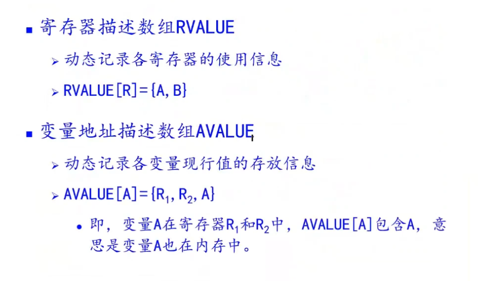

第一个指的是R包含了A和B的最新信息（暗含着A=B）

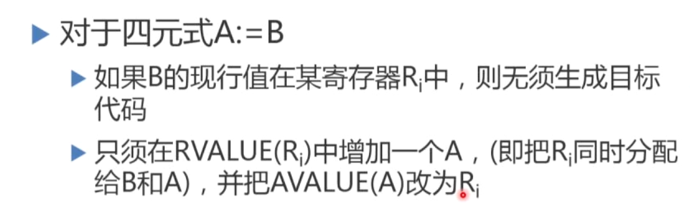

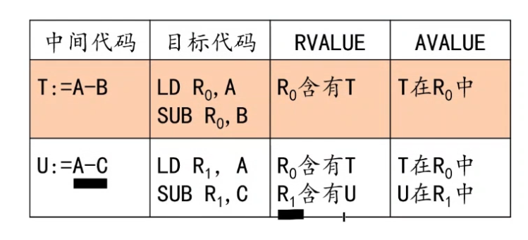

将这个描述信息和待用信息结合，可以做到最简化目标代码，少了很多寄存器和内存之间传输。

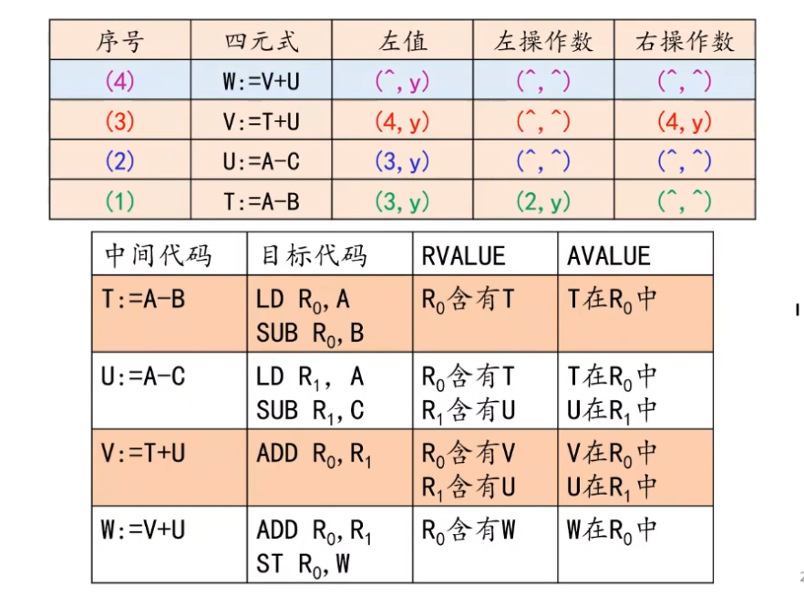

# 寄存器分配算法

