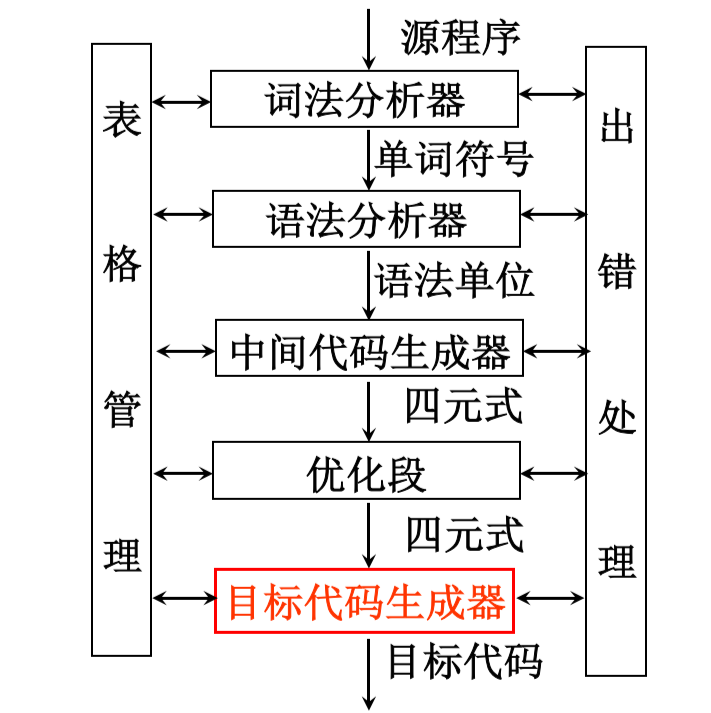
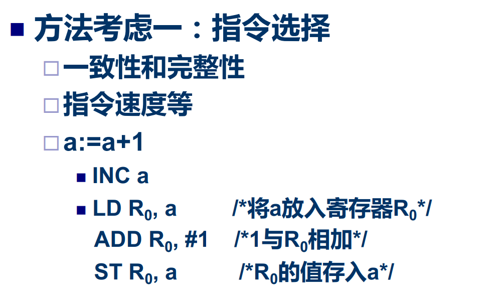
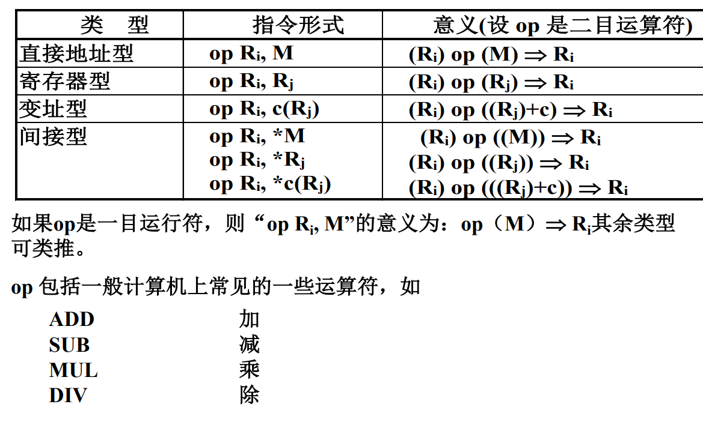
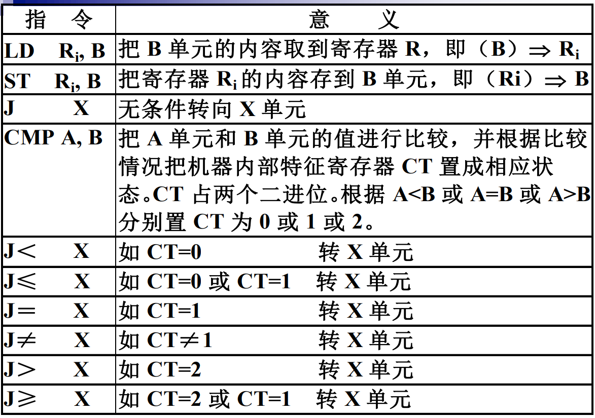

# 基本问题

如何使生成的目标代码较短；

如何充分利用计算机的寄存器，减少目标代码 中访问存贮单元的次数:

如何充分利用计算机的指令系统的特点: 

**代码生成器的输入：**代码生成器的输入包括源程序的中间代码，以 及符号表中的信息

**代码生成器的输出：**能够立即执行的机器语言代码/待装配的机器语言模块/汇编语言代码

# 目标机器模型

> 考虑的抽象计算机模型：
>
> 1. 具有多个通用寄存器，他们既可以作为累加器， 也可以作为变址器
> 2. 运算必须在某个寄存器中进行
> 3. 含有四种类型的指令形式

# 一个简单的代码生成器

