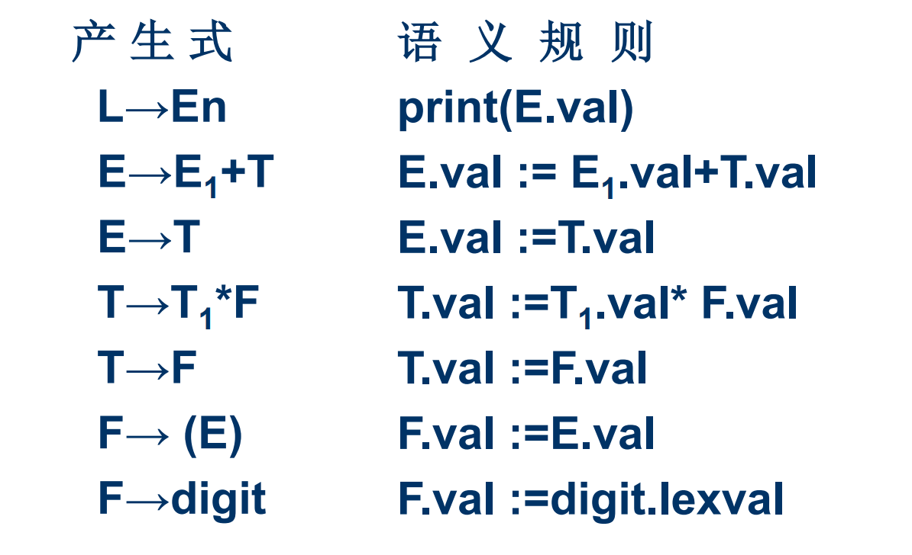
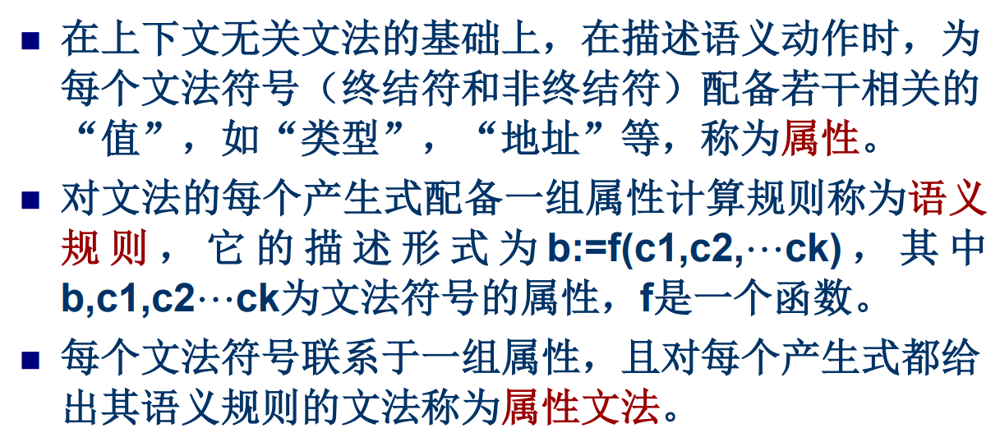
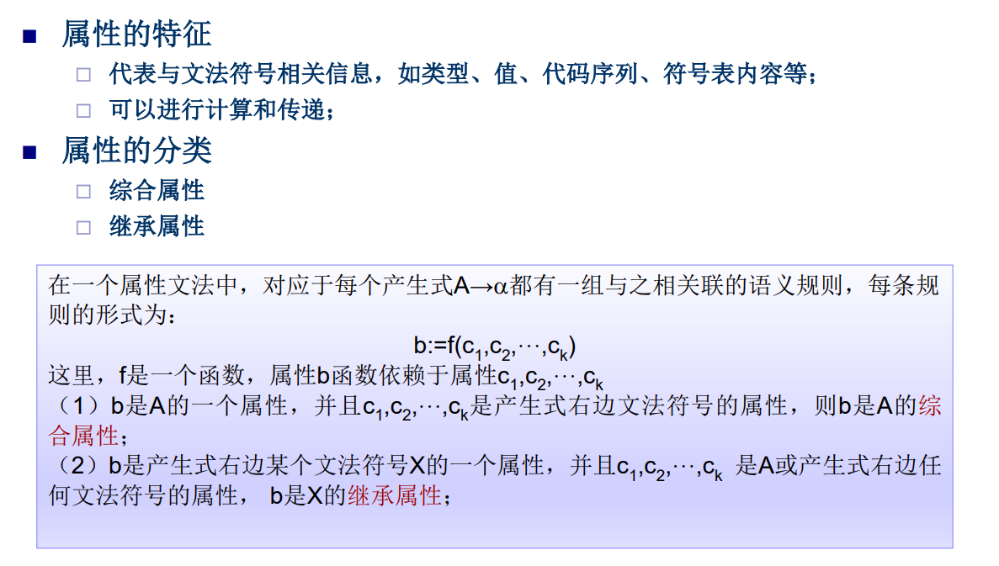
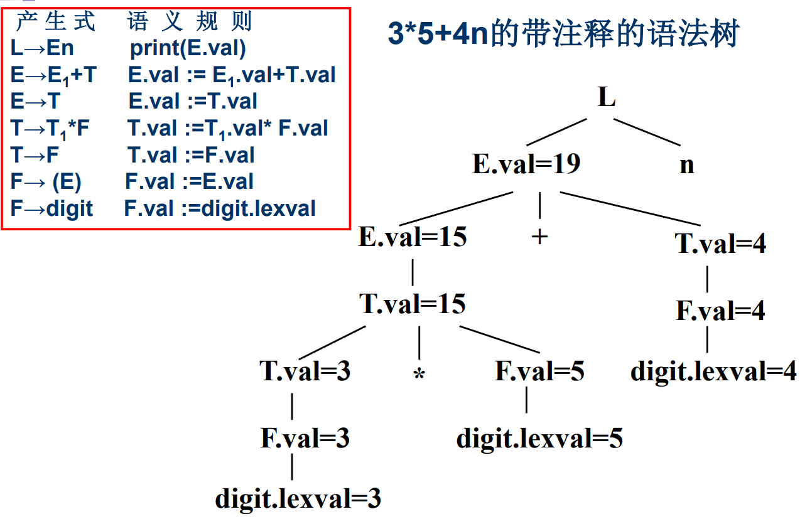
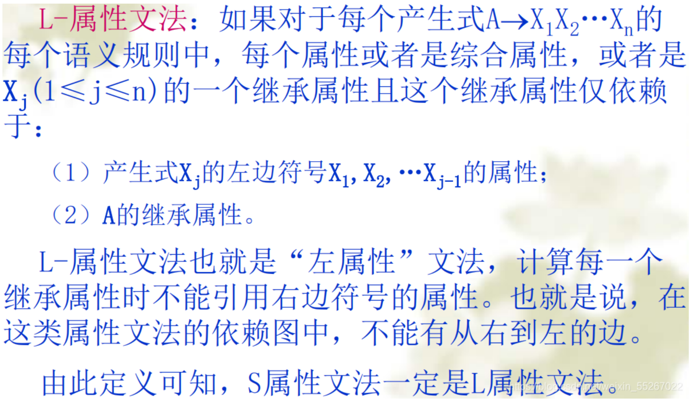
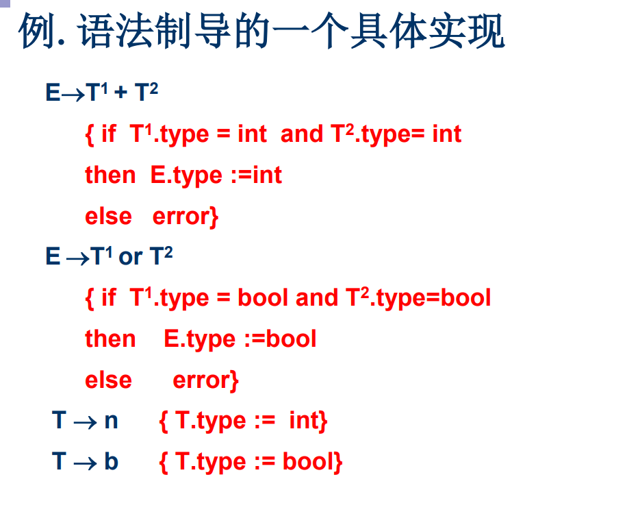

# 属性文法

语法分析的同时生成汇编代码

为每个文法符号定义了语义，val指的是value。为每一个文法符号引入了点什么作为属性。

## 定义

(1)综合属性
	1）用于“自下而上”传递信息
	2）在语法树中，一个结点的综合属性的值，由其子结点的属性值确定
	3）S—属性文法：仅仅使用综合属性的属性文法

(2)继承属性
	1）用于“自上而下”传递信息。
	2）在语法树中，一个结点的继承属性由此结点的**父结点和/或兄弟结点**的某些属性确定

**综合属性包括孩子节点的属性或节点自身的属性**，所以终结符的综合属性就是叶子结点本身的属性，而且它不能有继承属性。

​	终结符只有综合属性，由词法分析器提供 
​	非终结符既可有综合属性也可有继承属性，文法开始符号的所有继承 属性作为属性计算前的初始值 
​	对出现在产生式右边的继承属性和出现在产生式左边的综合属性都必 须提供一个计算规则。属性计算规则中只能使用相应产生式中的文法 符号的属性 
​	出现在产生式左边的继承属性和出现在产生式右边的综合属性不由所 给的产生式的属性计算规则进行计算，它们由其它产生式的属性规则 计算或者由属性计算器的参数提供 
​	语义规则所描述的工作可以包括属性计算、静态语义检查、符号表操 作、代码生成等等。

## S-属性文法

仅仅使用综合属性的属性文法

在语法树中，一个结点的综合属性的值由其子结点的属性值确定

使用自底向上的方法在每一个结点处使用语义 规则计算综合属性的值

## L-属性文法

对继承属性做了限制

L-属性文法支持从上到下、从下到上、从左到右的边。

# 语法制导翻译

直观上说就是为每个产生式配上一个翻译子程序（称语义 动作或语义子程序），并且在语法分析的同时执行它。

语义动作一方面规定了产生式产生的符号串的意义，另一 方面又按照这种意义规定了生成中间代码应做的基本动作。

在语法分析过程中，当一个产生式获得匹配（自上 而下分析）和用于归约（自下而上分析）时，此产生式对 应的语义子程序进入工作，完成既定翻译任务，产生中间 代码。

