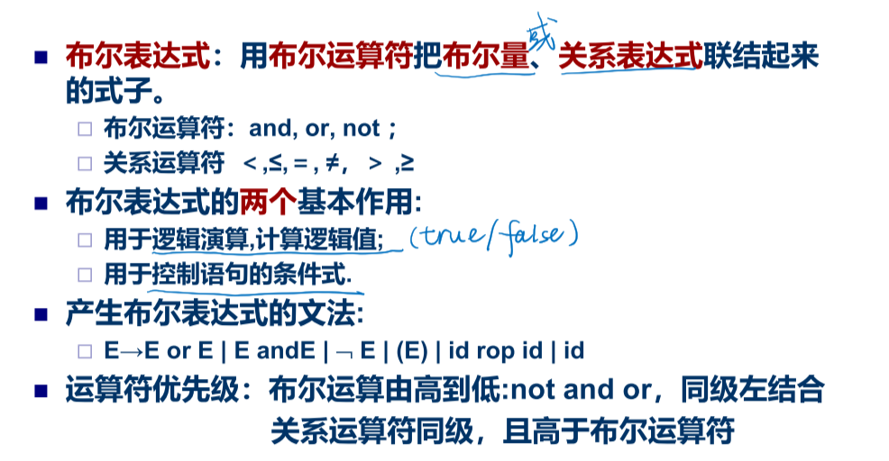
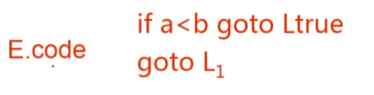
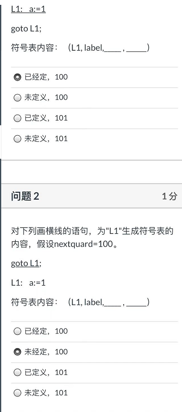

赋值语句、布尔表达式、if  then  else、while

给语句写四元式，语法树也画出来，细节也填写。

了解每一个四元式用哪个产生式归约的。

布尔表达式难点：地址位

一遍扫描，回填。list。

while强制跳转只有这个可以直接填，其他都要回填backpatch。

LR分析法归约的时候调用子程序，完成中间代码生成

# 中间语言

好处： 便于进行与机器无关的代码优化工作 ；易于移植 ；使编译程序的结构在逻辑上更为简单明确；

## 分类

<u>**后缀式：**</u>逆波兰表示。不用括弧。不包含括号，运算符放在两个运算对象的后面，所有的计算按运算符出现的顺序，严格从左向右进行（不再考虑运算符的优先规则，如：(2 + 1) * 3 ， 即2 1 + 3 *（了解）

E1 op E2 这句话翻译的时候后面的程序还不能执行，因此是先执行了E1和E2的翻译语句，再翻译op的

翻译的时候自下而上翻译，比如a+b：是先归约到E1（并执行语义动作），然后读入加号，在读b，b归约到E2（并执行语义动作）

**<u>图表示：</u>**无循环有向图DAG。抽象语法树。（了解）

<u>**三地址代码：**</u>三地址代码可以看成抽象语法树或DAG的一种线性表示。

## 三地址语句

便于代码优化，用三元式表+间接码表（一张指示器表，按运算的先后次序列举）表示中间代码

第一个是x和i做变址，然后把y送到变址的结果单元
第二个是y和i做变址，变址之后把结果送到x里面去
OP为:=的意思是，把后面的送到前面的

优点: 方便优化，节省空间

四元式：只是临时变量要 填入符号表，占据一定存储空间
>  

三元式：使用了指向三元式的指针，优化时修改较难

> 

间接三元式：优化只需要更改间接码表，并节省三元式表存储空间。

> 

# 赋值语句的翻译

绿色的：前面的E1code负责加号前面的子表达式，后面的E2code负责加号后面的子表达式，gen函数负责把两个结果加起来赋值给结果单元

emit指令：这个函数是吧三地址指令送到输出文件里

lookup函数找符号表中存不存在，找到了就返回该标识符在符号表的入口

比如p找到的是a，E.place是T，那么输出就是a := T

# 布尔表达式的翻译

## 定义

## 数值表示法&翻译模式

当翻译这句的时候，E1和E2对应的三地址代码已经翻译完毕在文件里面了
假设E1和E2的place是T1和T2

那么执行这个语义动作的时候，生成一个临时变量比如T赋值给E的place

那么这个时候，emit发送三地址代码进去

这个图，首先在规约的时候，调用E--> id1 relop id2规约的时候（生成语法树就要执行相应的翻译语句，也就是黄色部分第一段，也就是发送四句指令100-103）

接着语法分析移进or，c，<，d，那么c<d就可以进行规约，用E--> id1 relop id2规约，那么你用它做归约，就要给执行相应的语义动作，连续发送四条指令）

当执行到的时候，也就是三个小的归约完，语法分析告诉我们要将后面两个E和中间的and归约，也就是调用黄色最后一段。生成一个三地址代码

现在栈里面有两个E和一个or，继续规约。最后一条代码。

## 条件控制的布尔式翻译

E.true和E.false都只是两个标号，这两个标号放在那段代码前面，就代表跳转到哪段执行

E.true标号放在S1开头，E.false标号放在S2开头。（这两个都是继承属性）

蓝色的四条指令对应上面蓝色的布尔表达式的翻译。逻辑的跳转体现了or

按照上面的规则，有下面的语义规则

E1.false产生一个新标号（第二句），放在E2前面（最后一句）

这里面的“等于”意味着“去哪”
比如E1为真去哪，去E为真的地方

最后一句，整个E的代码，应该是E1的代码，和刚刚产生的E.flase的标号放在E2代码之前。

其他的一些：

一个例子：

先生成语法树，根据自上而下分析，计算继承属性。先把根节点E的true和false写上去，再往下看，看到左边红色的E，在语句EorE中，因此调用中间的产生式进行翻译。

有第一条规则和第条规则，有，根据34句，有

到此，已经自上而下计算好了所有继承属性，下面我们自下而上计算code

根据，我们调用语句绿色的产生语句。

生成两句代码，同理有

现在最小的搞完了，现在来拼接更大的，最后的紫色的是蓝色的和绿色的相连。所以调用蓝色划线部分，也就是说吧E2（也就是绿色的E）的第一句标上E1.true（也就是蓝色E为真的标号L2）。那么紫色框框里面的代码就是E的代码

下面的自己理解：

因此，黑色的E的翻译结果就是

上面的是多遍扫描：先一遍扫描生成语法树，再

## 一遍扫描布尔表达式的翻译

两遍扫描：扫描两遍才知道S.next在哪
一遍扫描：先空着再回填

> (op, b, c, a)指的是 a = b op c
>
> 例如 (j <, b, c, 100)表示如果 b < c 则跳转到100

这里假设真出口为104，假出口为110

一遍扫描的难点：转移地址无法立即知道；需要扫描到特定位置才能回过头来确定。例如这里，必须扫描到or的时候，才知道101跳转要到哪里（102）

再比如，必须扫描到后面，比如这句是if..then...，当扫描到then，才能确定下面要跳转到哪里，也就红色划线的???是什么。

继续往下走，扫描到else，才知道103句的跳转目标（假设是110）

形成的链也是用四元式的第四区段连接起来，然后把truelist指向q，当填q的时候

链尾放上0作为标志。

同一个链表的四元式都是需要回填的四元式，也都是去同一个目标的四元式。

为了知道每段代码的入口地址，引入M，定义为空，有对应的语义动作：记录下一个四元式的下标。

例子一：

E1为真则E为真，如果E1假则看E2（也就是说E1的假出口是E2）

**<u>A的x出口是B，就将B前面放M，把backpatch ( A.x, M.quad )</u>**

这里**M标注的是E2的入口地址**

1. 把E的假出口都填上M的下一句四元式（也就是E2的第一句）

2. E1和E2的真出口都是E的真出口，但暂时不知道是什么，就先merge在一起。

3. E2的假出口就是E的假出口

一定要吧所有的信息全部交给E，不然分析完毕栈里面什么都没了，怎么填呀怎么填呀。

例子二：

1. 如果E1为真就看E2，也就是把E1的真出口都填上E2的入口

2. 如果E2也为真则E为真

3. E1假或者E2假就E假

   

两个简单的语句：

# 控制语句的翻译

## If

N是强制跳转的链表，不知道是什么就先写0。因为S1执行完之后肯定要跳过S2执行后面的语句。

每个产生式的语义动作：

if then 第一句理解简单，第二句注意一下：E为假的出口和S1执行完的出口都是S的出口

加上else的语句就两个回填，M1quad是E的真出口，M2quad是假出口

> 只要有语句就要有nextlist，把三个不知道的nextlist挂在一起

N是强制跳转的链表，不知道是什么就先写0。因为S1执行完之后肯定要跳过S2执行后面的语句。

and优先级高于or

S.nextlist：<u>**S翻译生成的代码中，需要回填的，要跳转到S后继语句的四元式。**</u>

## while

最后一句，在执行完循环体的时候，需要无条件跳转到开头，也就是M1

第一个E是a<b的

## 标号与goto

第一个框框先由标号，后有goto，则L1的地址已填

第二个框框现有goto再有标号，则读到goto的时候先填假地址0，再回填真地址

第三种情况，如果前面有很多goto L1语句，则将这些语句的出口链起来，读到L1的时候再一次性回填。

> 
>
> 

因此goto语句的处理有三个分支

## case

两种翻译方法：

1. 图上第一种是顺序翻译
2. 第二种集成在test里面采用goto翻译

nextquad就是正在扫描的语句的下一句的地址。

nextquad马上要产生的四元式的入口地址是100，所以为100（表示label的地址）

后面的地址就是goto语句的地址，L1未知，所以先填100，等扫

# 过程调用的处理

翻译方法：把实参的地址逐个放在转子指令的前面

Elist是过程表达式参数列表

