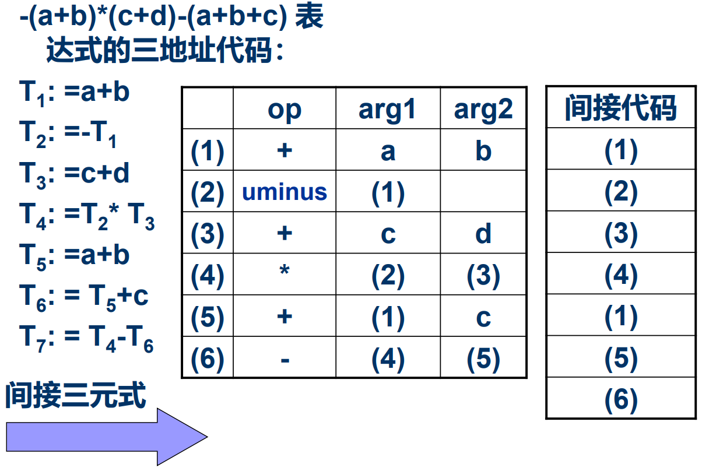

# 中间语言

好处： 便于进行与机器无关的代码优化工作 ；易于移植 ；使编译程序的结构在逻辑上更为简单明确；

## 分类

<u>**后缀式：**</u>逆波兰表示。不用括弧。不包含括号，[运算符](http://baike.baidu.com/view/425996.htm)放在两个运算对象的后面，所有的计算按运算符出现的顺序，严格从左向右进行（不再考虑运算符的优先规则，如：(2 + 1) * 3 ， 即2 1 + 3 *

**<u>图表示：</u>**无循环有向图DAG。抽象语法树。

<u>**三地址代码：**</u>三地址代码可以看成抽象语法树或DAG的一种线性表示。

## 三地址语句

便于代码优化，用三元式表+间接码表（一张指示器表，按运算的先后次序列举）表示中间代码

优点: 方便优化，节省空间

四元式：只是临时变量要 填入符号表，占据一定存储空间
>  

三元式：使用了指向三元式的指针，优化 时修改较难

> 

间接三元式：优化只需要更改间接码表，并 节省三元式表存储空间。

> 

# 赋值语句的翻译

# 布尔表达式的翻译

## 定义

## 数值表示法&翻译模式

## 条件控制的布尔式翻译

# 控制语句的翻译

# 过程调用的处理

