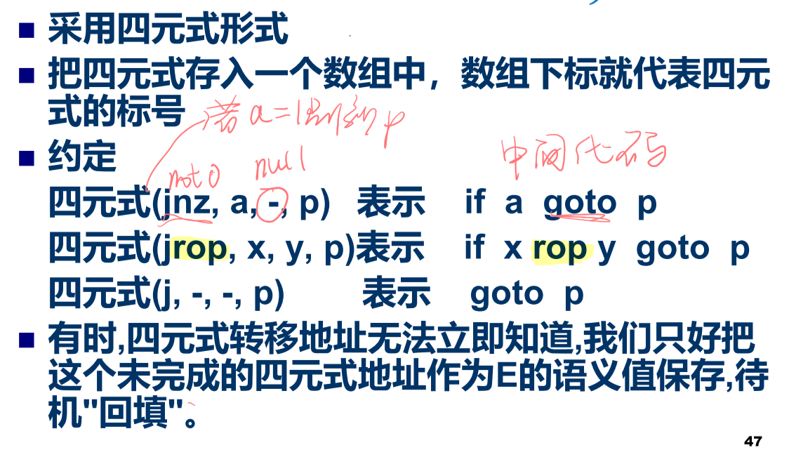

# 中间语言

好处： 便于进行与机器无关的代码优化工作 ；易于移植 ；使编译程序的结构在逻辑上更为简单明确；

## 分类

<u>**后缀式：**</u>逆波兰表示。不用括弧。不包含括号，[运算符](http://baike.baidu.com/view/425996.htm)放在两个运算对象的后面，所有的计算按运算符出现的顺序，严格从左向右进行（不再考虑运算符的优先规则，如：(2 + 1) * 3 ， 即2 1 + 3 *（了解）

**<u>图表示：</u>**无循环有向图DAG。抽象语法树。（了解）

<u>**三地址代码：**</u>三地址代码可以看成抽象语法树或DAG的一种线性表示。

## 三地址语句

便于代码优化，用三元式表+间接码表（一张指示器表，按运算的先后次序列举）表示中间代码

优点: 方便优化，节省空间

四元式：只是临时变量要 填入符号表，占据一定存储空间
>  

三元式：使用了指向三元式的指针，优化 时修改较难

> 

间接三元式：优化只需要更改间接码表，并 节省三元式表存储空间。

> 

# 赋值语句的翻译

# 布尔表达式的翻译

## 定义

## 数值表示法&翻译模式

## 条件控制的布尔式翻译

## 一遍扫描布尔表达式的翻译

两遍扫描：扫描两遍才知道S.next在哪
一遍扫描：先空着再回填

> (op, b, c, a)指的是 a = b op c
>
> 例如 (j <, b, c, 100)表示如果 b < c 则跳转到100

例子一：

E1为真则E为真，如果E1假则看E2（也就是说E1的假出口是E2）

**<u>A的x出口是B，就将B前面放M，把backpatch ( A.x, M.quad )</u>**

这里M标注的是E2的入口地址

1. 如果E1假则看E2（也就是说E1的假出口是E2），也就是把E1.falselist链接的每个四元式的第四区都填为M.quad

2. E1和E2有一个为真则E为真

3. E1为假就看E2，E2为假则为假

   

例子二：

1. 如果E1为真就看E2，也就是把E1的真出口都填上E2的入口

2. 如果E2也为真则E为真

3. E1假或者E2假就E假

   

两个简单的语句：

ppt P54没看懂

ppt P55待看

# 控制语句的翻译

## If

if then 第一句理解简单，第二句注意一下：E为假的出口和S1执行完的出口都是S的出口

加上else的语句就两个回填，M1quad是E的真出口，M2quad是假出口

> 只要有语句就要有nextlist，把三个不知道的nextlist挂在一起

N是强制跳转的链表，不知道是什么就先写0

and优先级高于or

## while

大括号里：

1. S1的下一步填上M1的下一步（也就是E）
2. E的真出口填上M2的下一步也就是S1
3. S的下一步就是E为假时的出口
4. 看不懂

第一个E是a<b的

## 标号与goto

第一个框框先由标号，后有goto，则L1的地址已填

第二个框框现有goto再有标号，则读到goto的时候先填假地址0，再回填真地址

第三种情况，如果前面有很多goto L1语句，则将这些语句的出口链起来，读到L1的时候再一次性回填。

> 
>
> 

因此goto语句的处理有三个分支

## case

两种翻译方法：

1. 图上第一种是顺序翻译
2. 第二种集成在test里面采用goto翻译

nextquad就是正在扫描的语句的下一句的地址。

nextquad马上要产生的四元式的入口地址是100，所以为100（表示label的地址）

后面的地址就是goto语句的地址，L1未知，所以先填100，等扫

# 过程调用的处理

翻译方法：把实参的地址逐个放在转子指令的前面

Elist是过程表达式参数列表

