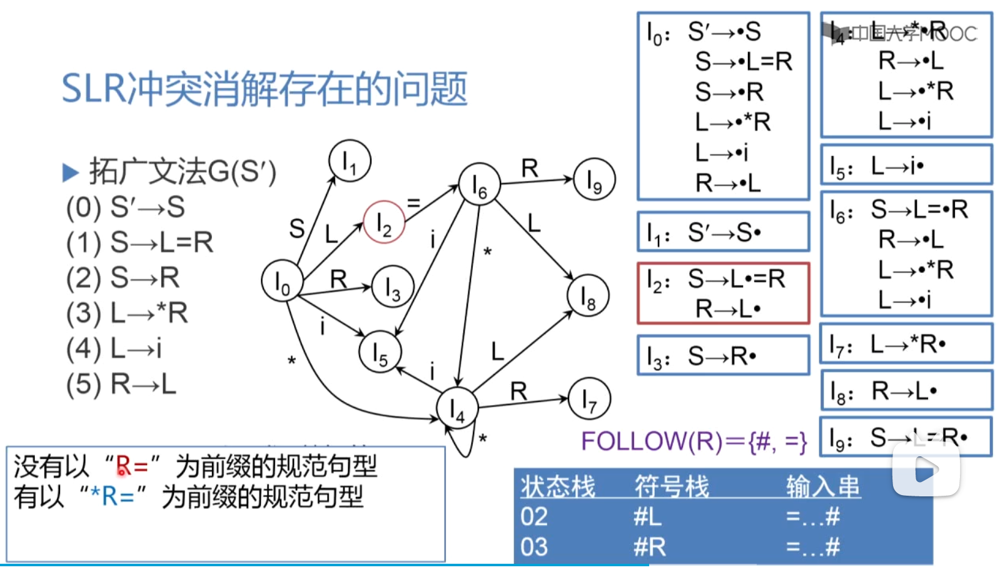
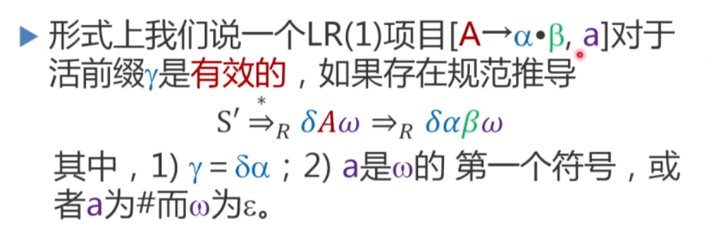
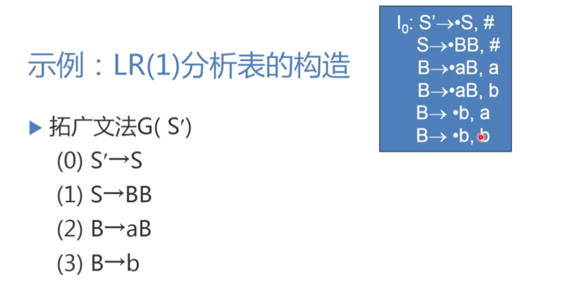
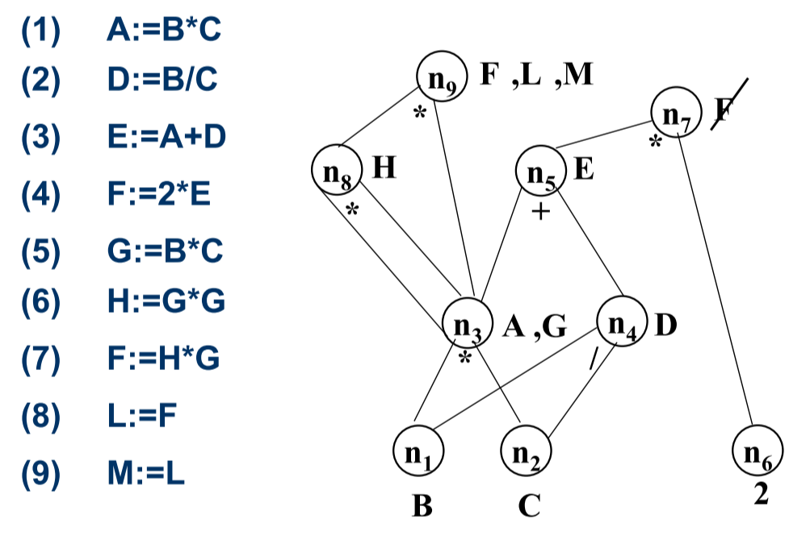

期末考试占40%

五道综合题目：
词法分析20；语法分析20；中间代码35；优化10；目标代码15

# 一、词法分析

考试内容：由正规式构造DFA

## 从正规式构造等价的NFA 

（Thompson算法）

转化成NFA没必要加这么多空字，只是计算机会加

a为任意字符

3，反向指的是闭包

框框指的是原有的状态图

例子

给你词法规则，生成词法翻译器

## NFA和DFA的等价性

（子集法）

DFA就是是NFA的特例，所以NFA必然能接收DFA能接收的语言。

因此DFA到NFA是不用转换的，NFA到DFA是需要转换的。

DFA的计算过程是直线形的，NFA的计算过程是树形的

关键是：如何将树形的计算转换成直线形的计算

一个NFA转化成DFA的例题@

X51之所以在一起，是因为它们空字连接，都是等价的

每一个单元格都要是包含所有等价的

## DFA的化简

（状态等价法）

步骤

例题

3456和012是可区分的，由于一些是普通状态，一些是终态。

第二行是考虑例如3接受a到3,6接受a在3

3456接受a在3663，只在一个子集中。 

45也只落在一个子集上

所以a和b没办法区分I1——由于接受符号迁移到同一个子集，如果迁移到不同子集就可以找到特例，就可以把I1拆分，如果接受a区分，那么就是a和epl可以区分

可区分：找到一个符号串，一部分接受这个符号串可以到一个状态，另一部分到不了那个状态。

再来一个例题：

## 由正规式构造DFA

> 步骤：
>
> 1. 由正规式构造NFA（汤姆森算法）
> 2. NFA转化为DFA（子集法）
> 3. DFA化简（状态等价法）

## 例题

# 二、语法分析

考试内容：LR(0) SLR(0)  LR(1)

使用一个产生式的左边替代右边称为一次归约。

通过不断地读取输入，当读到的内容可以归约的时候就将其归约，最终读到结尾时规约出开始符号S

## LR0

从左到右扫描输入，向前看0个符号，成为LR0分析法。

仍然以 3*（2-1）为例

> 读到 3，看 8，为 F，再看 7，规约成 T
> 读到乘号和左括号不动
> 读到2的时候又8和7和4将其规约为E
> 读到减号不动，读到1由8和7将其规约成T
> 
>
> 此时最右侧符合3，规约成 E，又遇到右括号变成（E），因此规约成 F
> 然后 F到 T，T到 E，E到 S

LR分析法的核心问题：什么时候进行归约，什么时候进行读入。为此我们需要一个状态，来记录一个产生式已经被匹配到什么程度——这就称为一个项目。

项目：描述一个产生式右部的匹配程度。

> 
>
> 产生式的右部点一个点
> 点前面的内容已经在程序中呆着了
> 点后面的内容等着读取输入或等着后面的符号规约
>
> 如上面的句子，如果接下来读到E，那么·就会移到E后面——>移入
>
> 
>
> ·移到产生式最右边的时候，说明一个产生式右部的所有内容都准备好了——>就可以归约

构造程序在各种项目状态间的转换关系

0状态构建：读入s，则等待E，由于E也可以被推导，因此后面增加了三个E开头推导的式子。由于E可以推导出T，因此等待E的同时也在等待T。T可以推导F，因此也在等待F。

这上面任何一个项目有进展的话，都会离开这个状态

这样一系列操作之后就得到一张复杂的分析图：

为了获得表示程序结束的状态，增加一个产生式S'->S放到0状态中，这样0状态接受S就到了16状态。

增加了S'->S的文法称为增广文法。

这样就完成了状态转化图。其中橘色框框的状态表示当前状态可能可以进行归约。

我们去掉除了归约之外的内容：

将图片简化成：

可以转化成一张LR分析表，每一行表示当前状态，每一列表示可以接受的符号。表格内容表示 某一状态接受某个符号时进入几号状态。

ACTION动作表：终结符的接受会伴随着一个输入符号的读取：移入操作s。

GOTO转移表：非终结符的接受会伴随一个状态的转移。

在16填上接受状态accept，另外如果某个状态可以归约，就在那一行每一个空上都填上（r+产生式编号）

出现冲突：当一个规约状态还存在其他项目时，程序无法判断该执行什么操作。

## SLR

使用FOLLOW集限制规约的条件：只有当下一个输入符号属于产生式左部的FOLLOW集时进行规约。

根据FOLLOW集去除表中不合法的操作，分析表就大功告成了。

这种只在规约时向前看一个字符的分析法称为SLR(1)，s表示simple

例子：3*(2-1)$

使用一个栈结构保存已读入的符号和状态。

第一个状态是0，遇到3，查表进入状态4

此时输入符号变为*，4遇到乘号用8号产生式进行规约。

规约成F，此时0号产生式遇到F进入状态3（第一行最后一格）

状态3遇到乘号采用7号产生式将F规约为T

状态0遇到T进入状态2。

2遇到乘号就不规约了，而是移进，转移到状态10。

不断重复上面的操作，最终我们进入状态16，accept。

## LR1

为什么引入LR1：

LR0是无脑归约，当遇到移进归约冲突的时候，引入SLR，也就是只有Follow集跟在后面才移入

例如上面这个图，I2有移进归约冲突，所以不是LR0文法，又因为R的Follow集有=，所以也不是SLR文法。

但我们可以观察得出，但遇到这个冲突的时候是不能做归约的，如果左归约了那么就会出现R=这个前缀，不规范。

上图：也就是说，此时a已经形成，接下来要形成b，当b也形成的时候，此时句子面临的终结符应该是a

上图就是说，如果B能归约到x，且有Bβ，那么B-->x归约项目的展望串就应该是β和a的First集

第一个S'-->S展望串为#，是因为当我们用这个项目进行归约的时候，希望外面没有任何符号，都已经归约完毕

I0项目集：

> 1）规定好的，展望串就是#，由于在等待 S的过程中也在等待 S开头的串
> 2）由于引入的 S（第一句）后面没有符号，所以展望串就是原来的#
> 3）4）第二个项目进来后，·后面有 B，所以关于 B的两个项目也进来。B-->·aB项目归约后，·后面为 B（看第二个项目），而 B的First集合有ab，因此有这两项
> 5）6）同理

注意理解I2，展望信息是看引入这句推导式的推导式，它点后面的后面有什么。比如I2里面后两句是指的是对第一句的第二个B归约，而第二个B后面什么都没有，所以展望串为#（没有符号的时候就继承引入自己的那句）。

画的时候要注意！展望串不一样的不能画在一起！比如一开始错以为I2接受a到I3。

## 例题

看状态4，图I4的展望串告诉我们，面对a或者b的时候就做归约，因此4a和4b表项填入r3（用第三个产生式做归约）

I5告诉我们，状态5面对#时归约。

r后面是产生式的编号，指的是用哪个产生式进行归约。、

状态和符号的数目是一一对应的！几个状态几个符号！

0遇到a，移入a和状态3；3遇到a，移入a和状态3；
3遇到b，移入b和状态4；4遇到a，用三号产生式归约并pop状态4；
pop后，3遇到规约出来的B，移入状态8；

4到5：8遇到a，用二号产生式归约aB出B，pop出aB对应的状态38，3遇到B移入状态8；

例题二：

# 三、语义分析

赋值语句、布尔表达式、if  then  else、while

 注意下面属性多值的：

## 写四元式的要点

1）知道啥时候emit

> 赋值语句1-2句
> 布尔2句
> while do 归约时一句（j, -, -,   )
> if then else，else前emit（j, -, -,   )

2）最后一位先全空着，第二遍再回填

## 画语法树的要点

1）什么时候要加MN

> while后，do后，then后，else前 N后 M，and后，or后

2）从大往小画，先写大框架，再往右后方写里面的内容

3）有nextlist的是S，没有的是E

4）nextlist属性对应的数字，语句是（j，-，- ，x）

5）画完语法树先填MN，好填

6）y：（j，-，- ，x），属性填y，别填x

## 例题

例题2  

# 四、优化

考试内容：基于DAG优化

## DAG表示

## 构建DAG优化步骤

1. 准备节点
2. 合并已知量
3. 寻找公共子表达式
4. 删除无用赋值

## 例题

构造：

优化：

若已知引用内容：

例题2：

# 五、目标代码生成

考试内容：生成目标代码和寄存器描述

## 四种指令的实现形式

括弧表示取里面的值

三条三地址代码，要翻译成九条语句：

LD和ST本质上都是MOV

只有寄存器和ALU之间有相连，所以不能够直接ADD a，b。必须要放到寄存器里，才能和ALU有计算。

待用信息：寄存器能不能释放？什么时候可以释放？吧某个寄存器里面的内容释放到内存之后，再给A用，因为A是待用信息。

## 待用信息和活跃信息

左边是符号表，右边是四元式代码表（在代码表中附加了信息）

首先把变量列出来。

w为y表示w在本代码块出口之后还要被使用。

如何计算待用信息和活跃信息？

从底往上扫描

扫描第四句的时候，U和V的信息都要更改，记下来。

这样再扫描到第三句的时候，见到了U，就立马把四元式表格填上4，y

T最后扫描，要回到初始状态：为了阻挡之前的赋值（也就是说，只有左值需要返回未活跃）

优化这个活动存在于每一步

例如这里a在第二步还是活跃的，也就是a还要参与运算，那么目标代码里面第二句MOV就没必要加上去了。直接在寄存器参与计算即可。

## 寄存器描述和变量地址描述

第一个指的是R包含了A和B的最新信息（暗含着A=B）

将这个描述信息和待用信息结合，可以做到最简化目标代码，少了很多寄存器和内存之间传输。

## 例题

