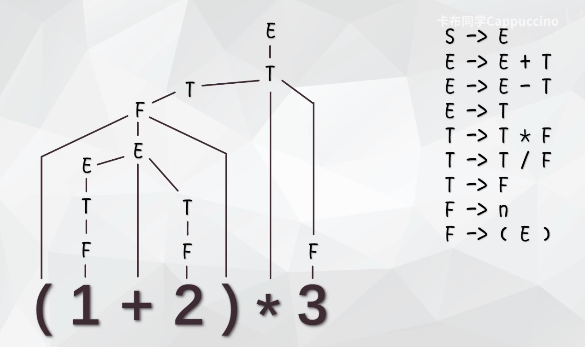
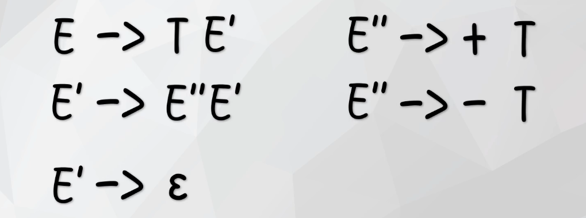
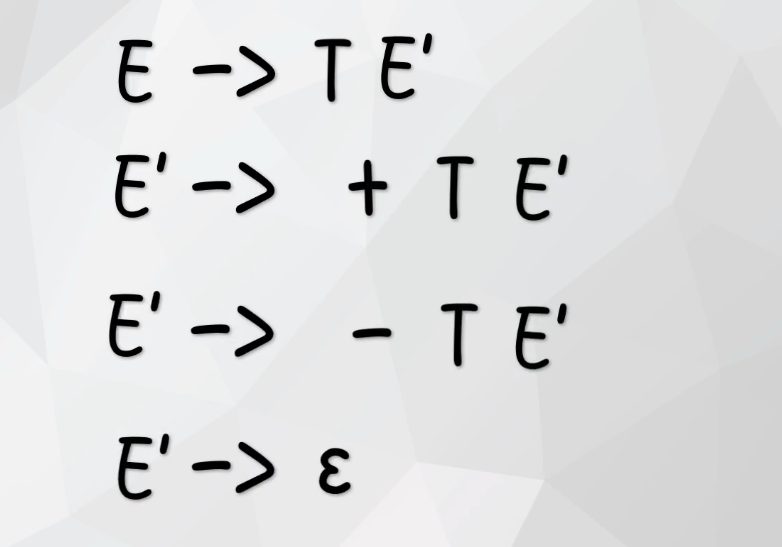
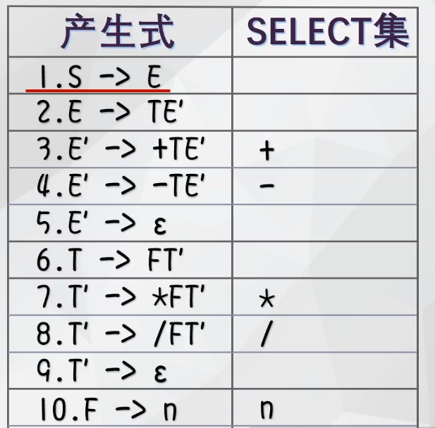
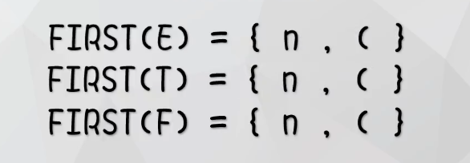
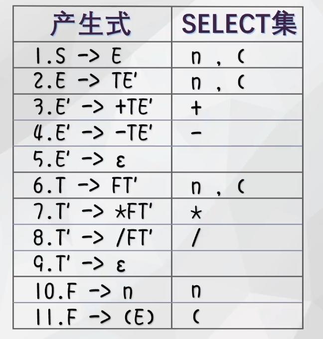

# 文法分析

什么是文法分析？扫描一遍字符串，识别出这是不是一个合法的字符串。

单词：数字、+、-、（、）、/
语法单位：表达式、项、因子

容易得到：

若我们用E表示表达式、T表示项、用F表示因子。S放在开头表示一个合格的字符串。n表示阿拉伯数字。

则上下文无关文法可定义为：终结符+非终结符+起始符号

一个成功分析的上下文无关文法的例子：

# 自顶向下分析

开局一只S，装备全靠推。

推导：使用一个产生式右部替换左部的过程称为一次**推导**

通过不断使用产生式对最左侧的非终结符进行推导，最终推导出与输入相匹配的终结符串的过程就叫做——**自顶向下分析。**

# LL1

那么这么多产生式用哪个推导呢？需要利用输入字符窜的下一个符号。

例如F->n，F-> (E)，当最左侧非终结符为F时，若读取到左括号，那么F就被推导成(E)

从左到右扫描输入，产生最左推导，向前看一个符号的分析方法：**LL（1）分析法。**

②E->E+T，若根据这个表达式，程序读到E，推导成E+T，又继续是读E，又是E+T，则会陷入无限循环：**左递归。**

当②E->E+T和③E->E-T同时出现时，当一个产生式最左边是E则这两个表达式都能推，就会产生**回溯。**

要进行**文法的等价改写**来解决这两个问题。

假设原有②E->E+T和③E->E-T和④E->T

首先我们将2和3产生式提取出左因子

将新的产生式和4合并

把表示循环的部分移到后面，将左递归转换成右递归

引入新的符号空串，代表E‘可以凭空消失

这时E''就可以安全地代入，到此完成产生式的改写

这样就是可以使用LL1分析的文法称为LL1文法

LL1核心环节：分析每一个产生式，看看遇到什么符号时可以用它进行推导。——这些符号就是这个产生式的SELECT集。

这里对于终结符打头的产生式可以很容易写出如下：

引入FIRST集概念：E的FIRST集就是所有能表示为E的非终结符串的开头符号的集合

由2得知给T开头的一定也能给E开头（一式）
由6（二式）
由10、 11（三式）

由于除了2和6，E和T没有其他推导选项，因此有：

则其他式子的SELECT集就可以写成FIRST集合打头的：

再看5，什么时候我们可以让E’凭空消失呢？引入FOLLOW集：E'的FOLLOW集表示所有可能在一个语句中紧跟E'后面的终结符或结束符

即当我们遇到可以跟在E'后面的符号的时候就可以让E'凭空消失
根据2，有第一个式子：能跟在E后面的一定可以跟在E'后面。
根据11和1，有第二个式子，E后面能跟），并且可以作为句子结尾

因此E'的FOLLOW元素就是）和$。故对于5号产生式的SELECT集就是E'的FOLLOW元素

？？？这边没听懂

推导出每个产生式的SELECT集之后我们就可以整理出LL1分析表。

列号为待推导的非终结符，横着的是可能的输入符号，表格内容指的是一个非终结符遇到一个输入符号时候该用哪个式子推导。

一个例题：

第一个输入的是3，此时我们只有起始符号S。S遇到数字用1号产生式推导成E；E遇到数字推导为TE'

T遇到数字时推导为FT‘

F遇到数字推到为数字

此时最左侧输入符号与推导结果一致。

然后最左侧非终结符为T'，遇到乘号变成*FT’——乘号匹配成功。

8:23自底向上方法

# LR0

# SLR

