# 文法分析

什么是文法分析？扫描一遍字符串，识别出这是不是一个合法的字符串。

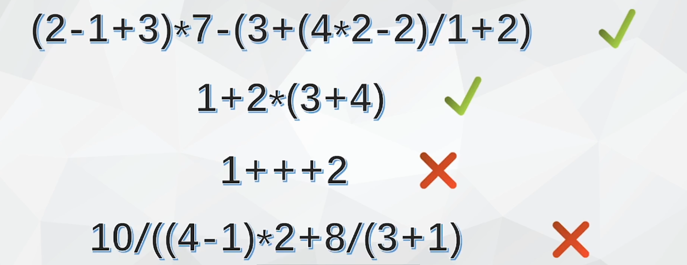

单词：数字、+、-、（、）、/
语法单位：表达式、项、因子

容易得到：
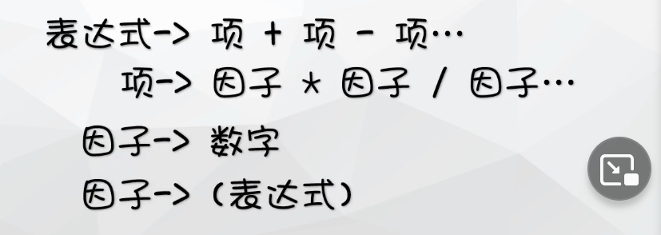

若我们用E表示表达式、T表示项、用F表示因子。S放在开头表示一个合格的字符串。n表示阿拉伯数字。

则上下文无关文法可定义为：终结符+非终结符+起始符号
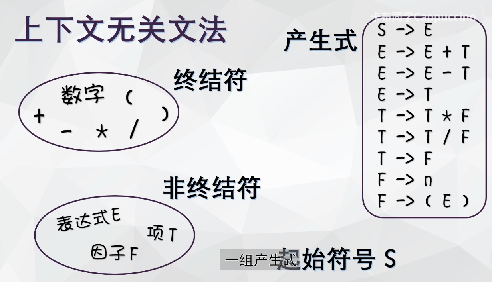

一个成功分析的上下文无关文法的例子：

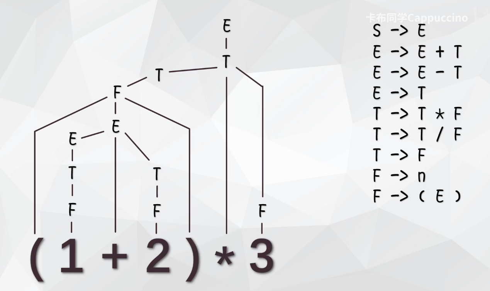

# 自顶向下分析

开局一只S，装备全靠推。

推导：使用一个产生式右部替换左部的过程称为一次**推导**

通过不断使用产生式对最左侧的非终结符进行推导，最终推导出与输入相匹配的终结符串的过程就叫做——**自顶向下分析。**

## LL1

那么这么多产生式用哪个推导呢？需要利用输入字符窜的下一个符号。

例如F->n，F-> (E)，当最左侧非终结符为F时，若读取到左括号，那么F就被推导成(E)

<u>从左到右扫描输入，产生最左推导，向前看一个符号的分析方法：**LL（1）分析法。**</u>

②E->E+T，若根据这个表达式，程序读到E，推导成E+T，又继续是读E，又是E+T，则会陷入无限循环：**左递归。**

当②E->E+T和③E->E-T同时出现时，当一个产生式最左边是E则这两个表达式都能推，就会产生**回溯。**

要进行**文法的等价改写**来解决这两个问题。

假设原有②E->E+T和③E->E-T和④E->T

首先我们将2和3产生式提取出左因子
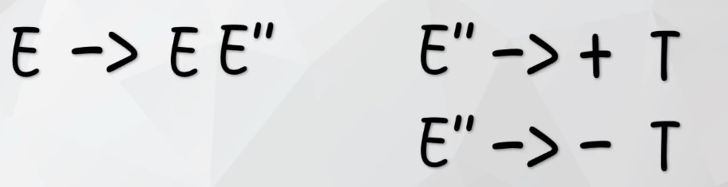

将新的产生式和4合并
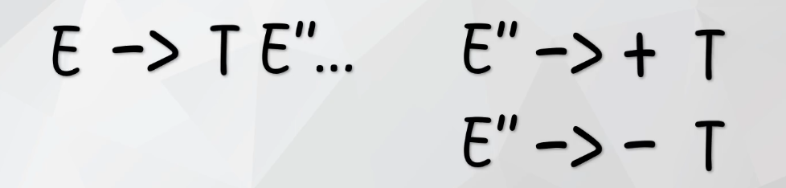

把表示循环的部分移到后面，将左递归转换成右递归
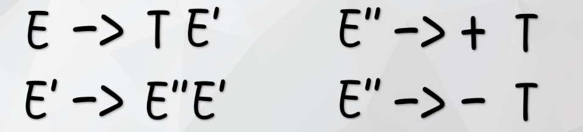

引入新的符号空串，代表E‘可以凭空消失
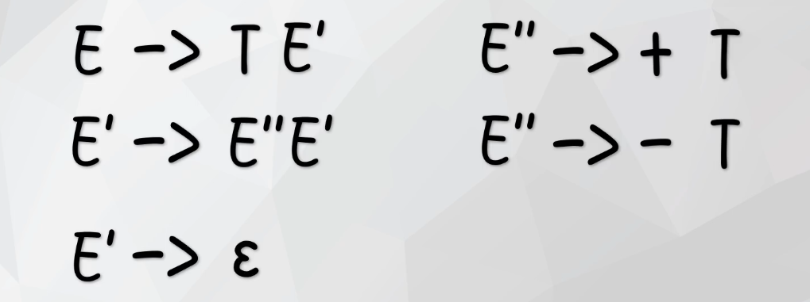

这时E''就可以安全地代入，到此完成产生式的改写
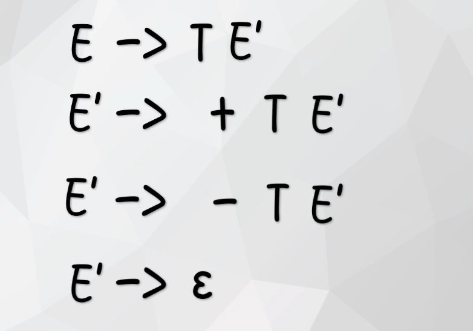

这样就是可以使用LL1分析的文法称为LL1文法

LL1核心环节：分析每一个产生式，看看遇到什么符号时可以用它进行推导。——这些符号就是这个产生式的SELECT集。

这里对于终结符打头的产生式可以很容易写出如下：

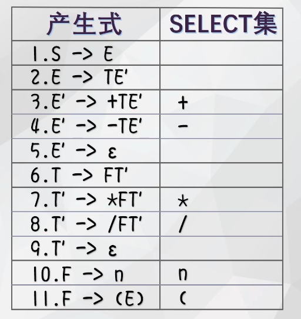

引入FIRST集概念：E的FIRST集就是所有能表示为E的非终结符串的开头符号的集合（看到一个符号后S可以推导出E，则意味着E可以以看到的这个符号开头）

由2得知给T开头的一定也能给E开头（一式）
由6（二式）
由10、 11（三式）

> First集合是：队头属于前

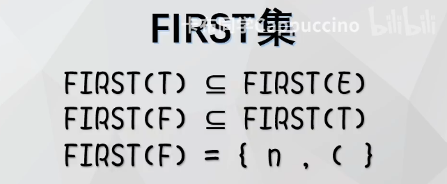

由于除了2和6，E和T没有其他推导选项，因此有：
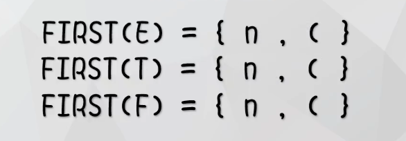

则其他式子的SELECT集就可以写成FIRST集合打头的：
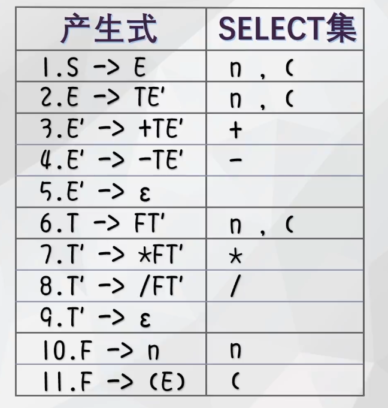

再看5，什么时候我们可以让E’凭空消失呢？

> First 是以它打头（包括它）
> Follow 是后面跟着它（不包括它）

引入FOLLOW集：E'的FOLLOW集表示所有可能在一个语句中紧跟E'后面的终结符或结束符（因为意味着含有E‘的这部分推导完毕了）

即当我们遇到可以跟在E'后面的符号的时候就可以让E'凭空消失
根据2，E能推导出E'结尾的串，因此有第一个式子：能跟在E后面的符号一定可以跟在E'后面。（但由于以E‘结尾的式子不一定是TE’形式，所以能跟在E’后面的符号不一定能跟在E后面）
根据11和1，有第二个式子，E后面能跟），并且可以作为句子结尾

> FOLLOW集是：前属于队尾（前队尾，钱对味）

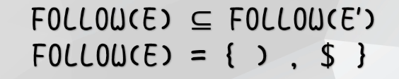

因此E'的FOLLOW元素就是）和$。故对于5号产生式的SELECT集就是E'的FOLLOW元素

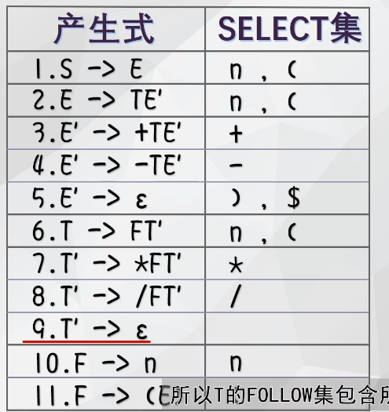

根据9，它的select集就是T'的FOLLOW集
根据6，T’的follow集就是T的
根据234，T的后面可以跟E‘，所以T的Follow集包含所有能给E’开头的终结符，也就是加号和减号。
又由于E‘可以凭空消失，因此E’的FOLLOW集也是T的，也就是）和$

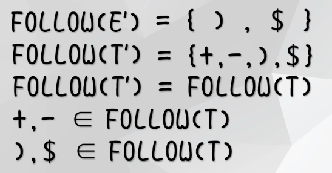

推导出每个产生式的SELECT集之后我们就可以整理出LL1分析表。
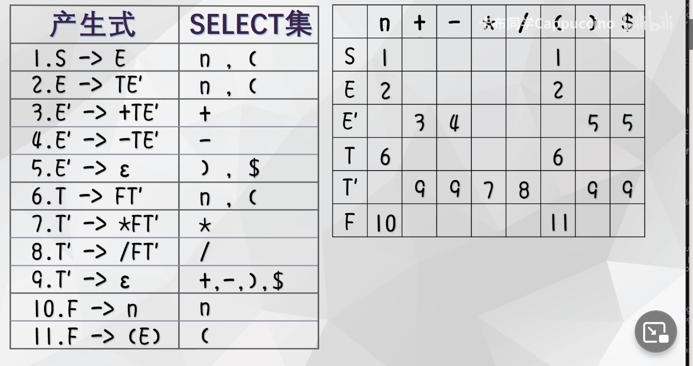

列号为待推导的非终结符，横着的是可能的输入符号，表格内容指的是一个非终结符遇到一个输入符号时候该用哪个式子推导。

一个例题：

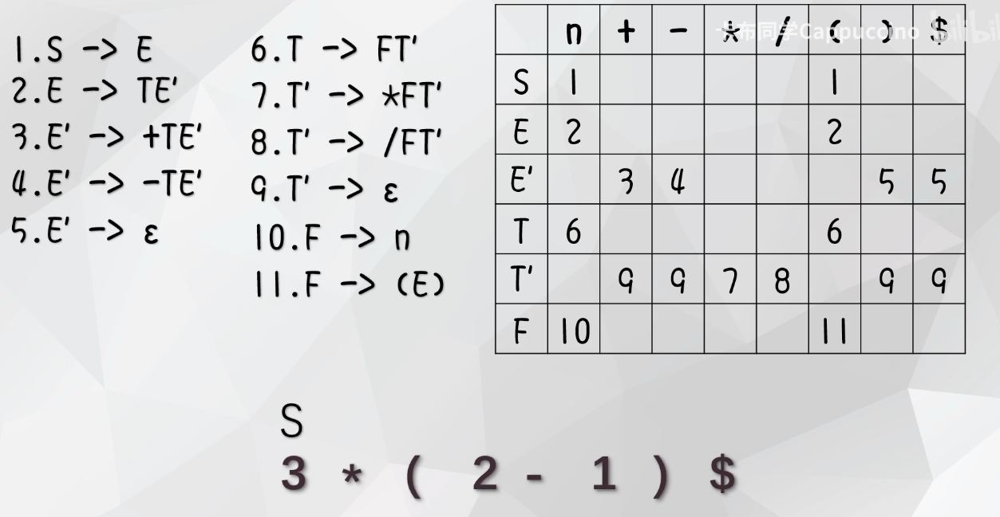

第一个输入的是3，此时我们只有起始符号S。S遇到数字用1号产生式推导成E；E遇到数字推导为TE'

T遇到数字时推导为FT‘

F遇到数字推到为数字，此时最左侧输入符号与推导结果一致。

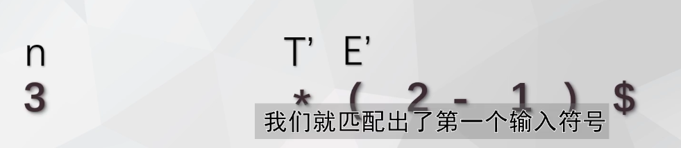

然后最左侧非终结符为T'，遇到乘号变成*FT’——乘号匹配成功。
接下来以此类推就是F遇到左括号......

如果输入一个不合法的字符串，就会在某一步中出现无法推导或者无法匹配的情况：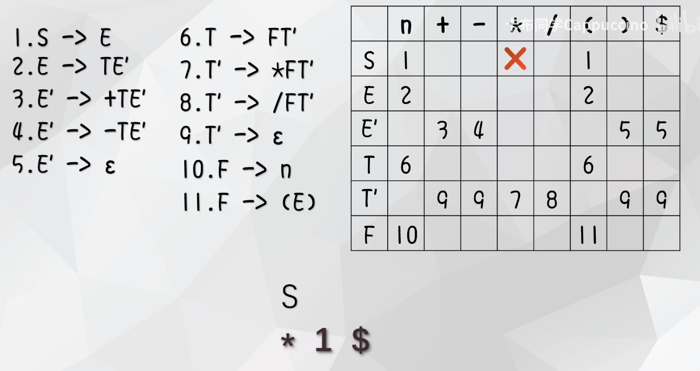

# 自底向上的分析

使用一个产生式的左边替代右边称为一次归约。

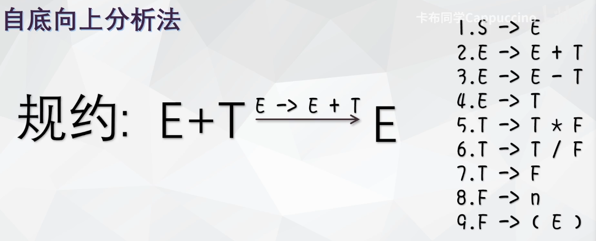

通过不断地读取输入，当读到的内容可以归约的时候就将其归约，最终读到结尾时规约出开始符号S

## LR0

从左到右扫描输入，向前看0个符号，成为LR0分析法。

仍然以 3*（2-1）为例

> 读到3，看8，为F，再看7，规约成T
> 读到乘号和左括号不动
> 读到2的时候又8和7和4将其规约为E
> 读到减号不动，读到1由8和7将其规约成T
> 
>
> 此时最右侧符合3，规约成 E，又遇到右括号变成（E），因此规约成 F
> 然后 F到 T，T到 E，E到 S

LR分析法的核心问题：什么时候进行归约，什么时候进行读入。为此我们需要一个状态，来记录一个产生式已经被匹配到什么程度——这就称为一个项目。

项目：描述一个产生式右部的匹配程度。

> 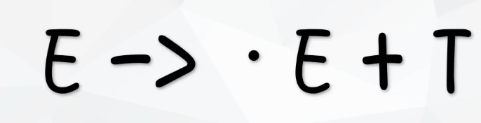
>
> 产生式的右部点一个点
> 点前面的内容已经在程序中呆着了
> 点后面的内容等着读取输入或等着后面的符号规约
>
> 如上面的句子，如果接下来读到E，那么·就会移到E后面——>移入
>
> 
>
> ·移到产生式最右边的时候，说明一个产生式右部的所有内容都准备好了——>就可以归约

构造程序在各种项目状态间的转换关系

0状态构建：读入s，则等待E，由于E也可以被推导，因此后面增加了三个E开头推导的式子。由于E可以推导出T，因此等待E的同时也在等待T。T可以推导F，因此也在等待F。
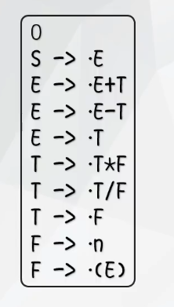

这上面任何一个项目有进展的话，都会离开这个状态

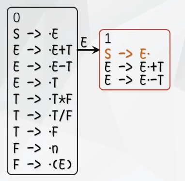

这样一系列操作之后就得到一张复杂的分析图：

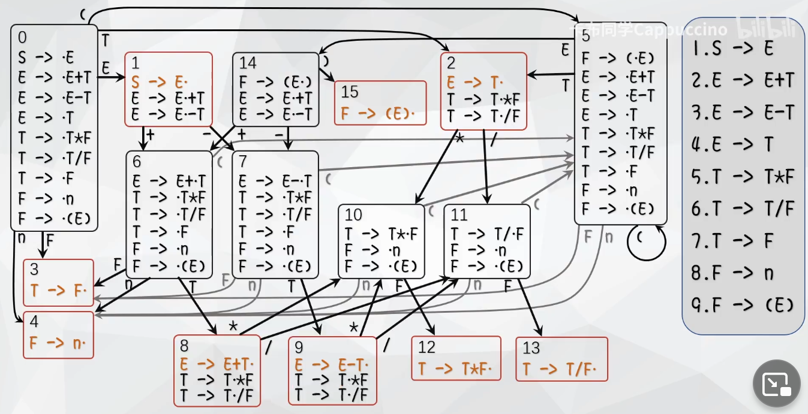

为了获得表示程序结束的状态，增加一个产生式S'->S放到0状态中，这样0状态接受S就到了16状态。

增加了S'->S的文法称为增广文法。

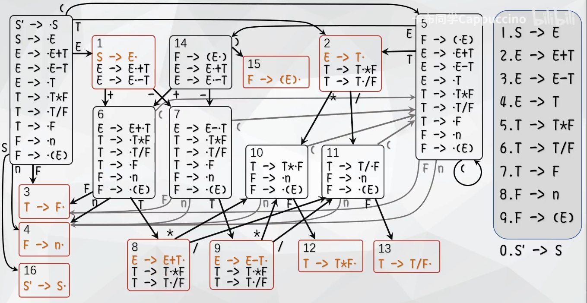

这样就完成了状态转化图。其中橘色框框的状态表示当前状态可能可以进行归约。

我们去掉除了归约之外的内容：

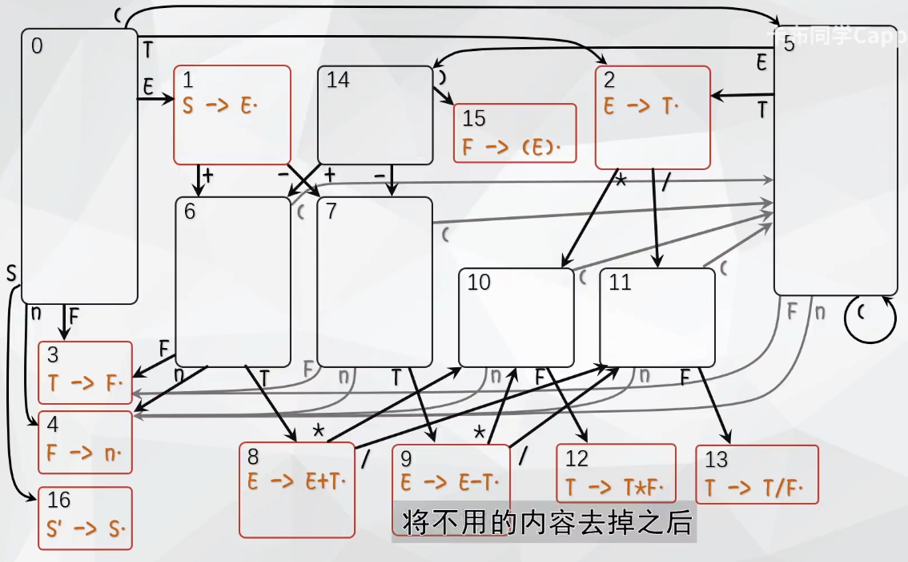

将图片简化成：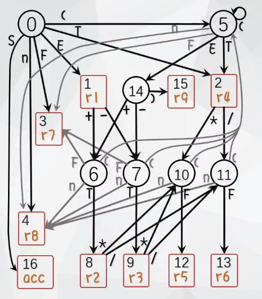

可以转化成一张LR分析表，每一行表示当前状态，每一列表示可以接受的符号。表格内容表示 某一状态接受某个符号时进入几号状态。

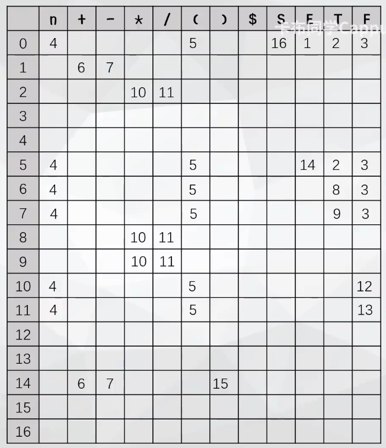

ACTION动作表：终结符的接受会伴随着一个输入符号的读取：移入操作s。

GOTO转移表：非终结符的接受会伴随一个状态的转移。

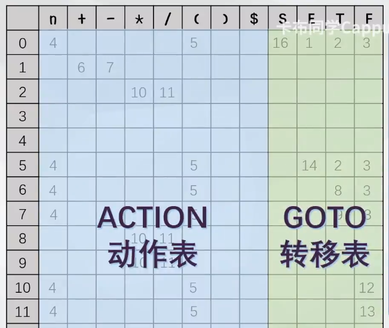

在16填上接受状态accept，另外如果某个状态可以归约，就在那一行每一个空上都填上（r+产生式编号）

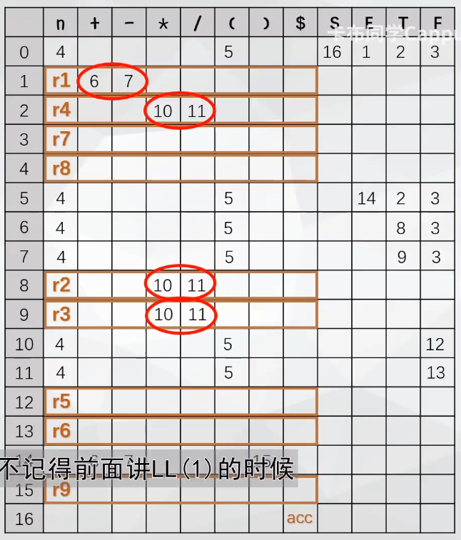

出现冲突：当一个规约状态还存在其他项目时，程序无法判断该执行什么操作。

## SLR

使用FOLLOW集限制规约的条件：只有当下一个输入符号属于产生式左部的FOLLOW集时进行规约。

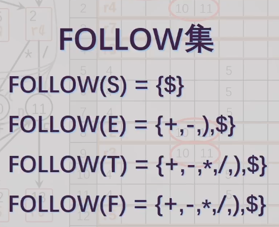

根据FOLLOW集去除表中不合法的操作，分析表就大功告成了。

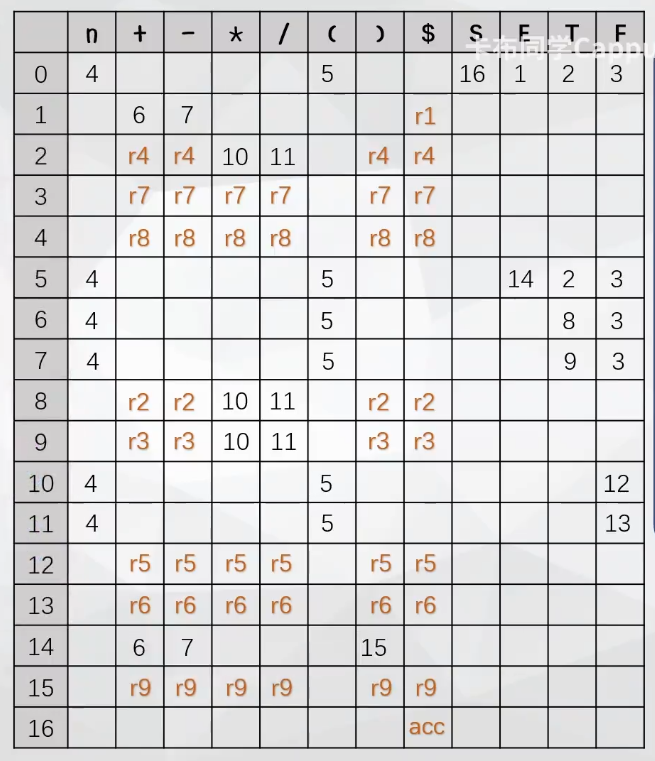

这种只在规约时向前看一个字符的分析法称为SLR(1)，s表示simple

例子：3*(2-1)$

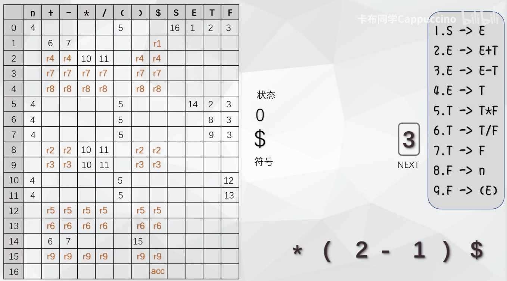

使用一个栈结构保存已读入的符号和状态。

第一个状态是0，遇到3，查表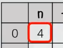进入状态4

此时输入符号变为*，4遇到乘号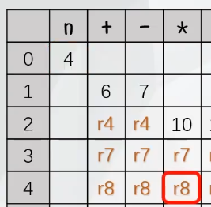用8号产生式进行规约。

规约成F，此时0号产生式遇到F进入状态3（第一行最后一格）

状态3遇到乘号采用7号产生式将F规约为T

状态0遇到T进入状态2。

2遇到乘号就不规约了，而是移进，转移到状态10。

不断重复上面的操作，最终我们进入状态16，accept。
