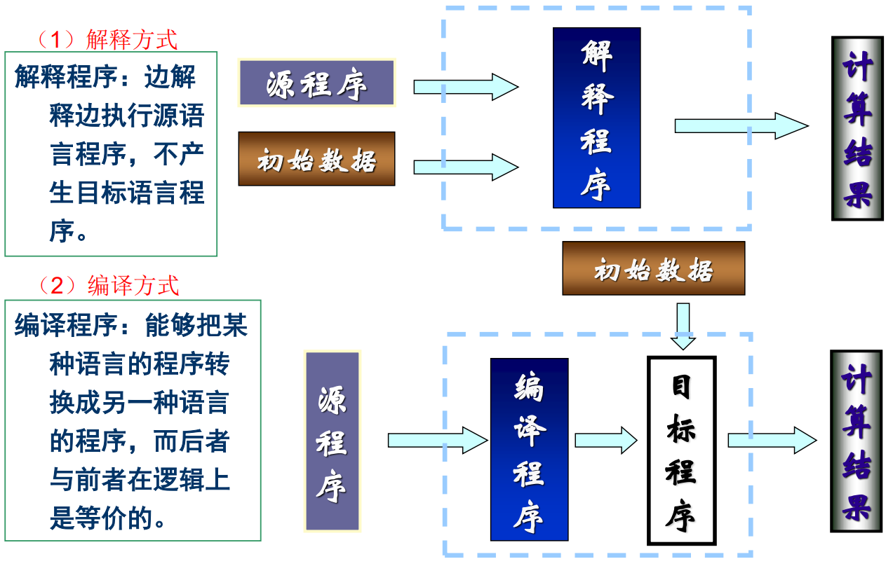
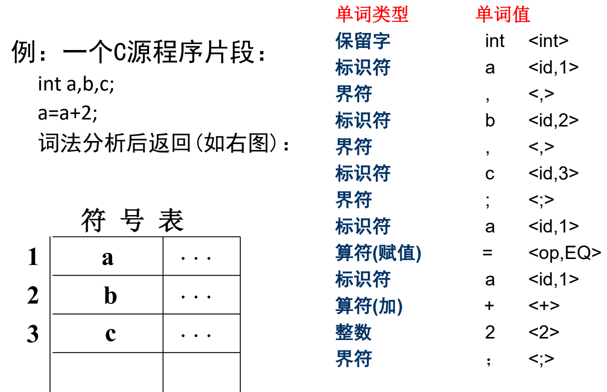
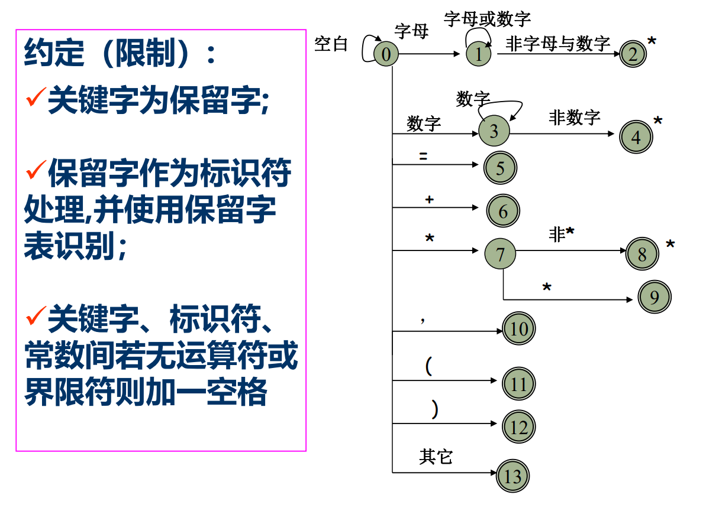

出席10%

随堂练习canvas 20%

实验作业 30%——coding，实验平台

考试成绩 40%

# 程序执行的两种方式

编译就是全文翻译，全部翻译完才执行。 解释就相当于同声翻译，边翻译边执行。

# 编译过程

1. 词法分析 
2. 语法分析 
3. 语义分析中间代码生成 （中间码可复用）
4. 优化 
5. 目标代码生成

前端：

后端：中间码》可执行码

## 词法分析

词法分析程序又称扫描程序(Scanner)。

 – 任务：读源程序的字符流、识别单词（也称单词符号，或简称符 号），如标识符、关键字、常量、界限符等，并转换成内部形式。 

– 输入：源程序中的字符流 

– 输出：等长的内部形式，即属性字 <Token-name, Attribute-value>（ 抽象名字 指向符号表 ），当前者唯一时后者可省略

• 在词法分析阶段工作所依循的是语言的词法规则。

 • 描述词法规则的有效工具是正规式和有限自动机。

 • 方法：状态图；自动机DFA&NFA 

例子：

第一个：变量名

第二个：数字

第三个：=......

page18

识别关系运算符

最后一个情况：多读了一个符号，退回去，并且结束识别

page19

判断是不是合法的

做状态转移，取下一个

## 语法分析

page21&22

上下文无关

从上到下的分析

## 语义分析

四元式=三地址代码

汇编码都在寄存器上执行

page27 例二

else没起作用

要跳转到if后面的语句

## 优化

产生更为高效（省时间和空间）的代码

优化所依循的原则是**程序的等价变换规则** 

其方法有：公共子表达式的提取、循环优化、删 除无用代码等等

page29

无法预测后面的运算，所以才引入t3

## 目标代码生成

page30

多了三个mov——和寄存器相关

t1需要刷出去保存（因为无法保证不是脏数据，内存》外存）

# 编译程序的结构

前端需要很多个（不同语言一个），后端只要一个

# 编译程序的生成

