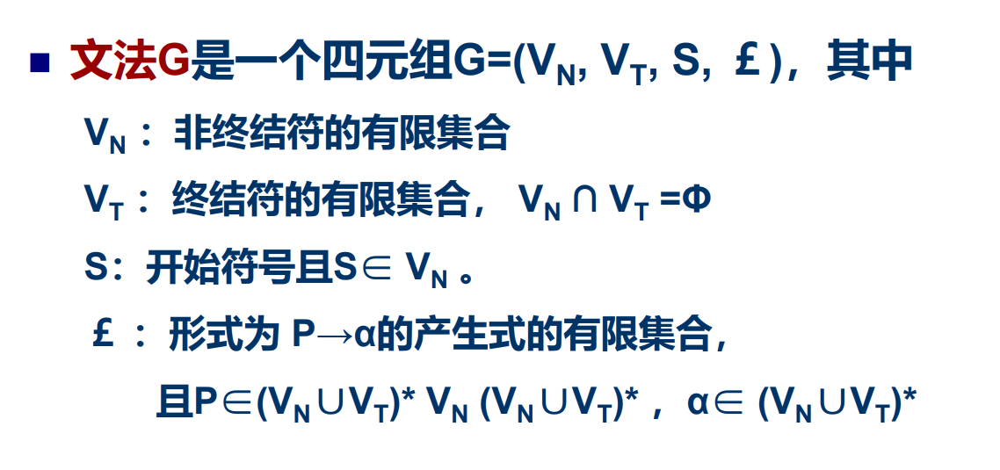
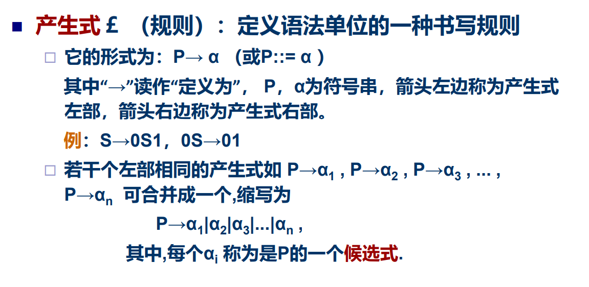
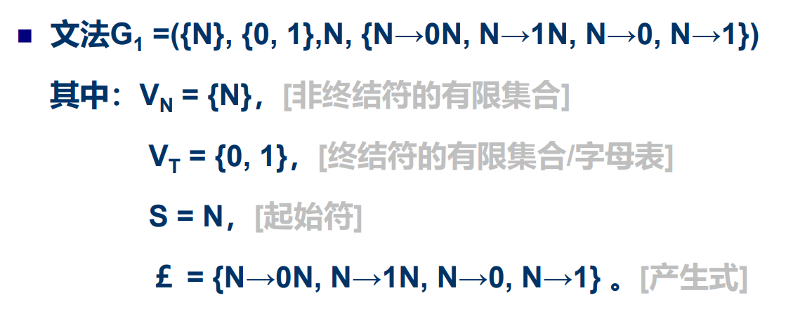
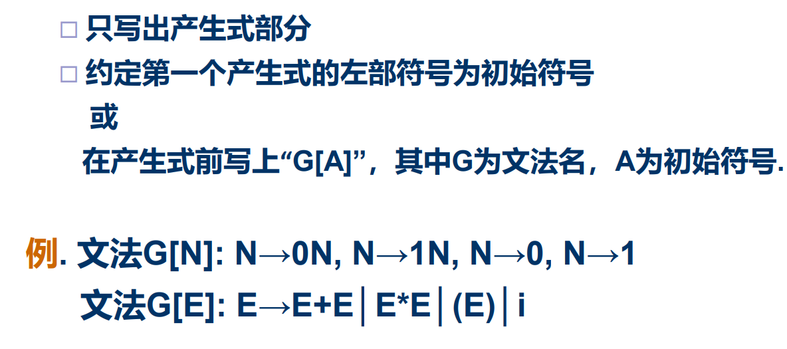
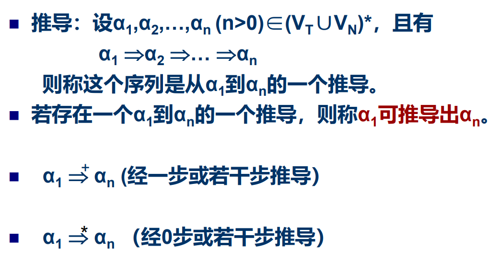
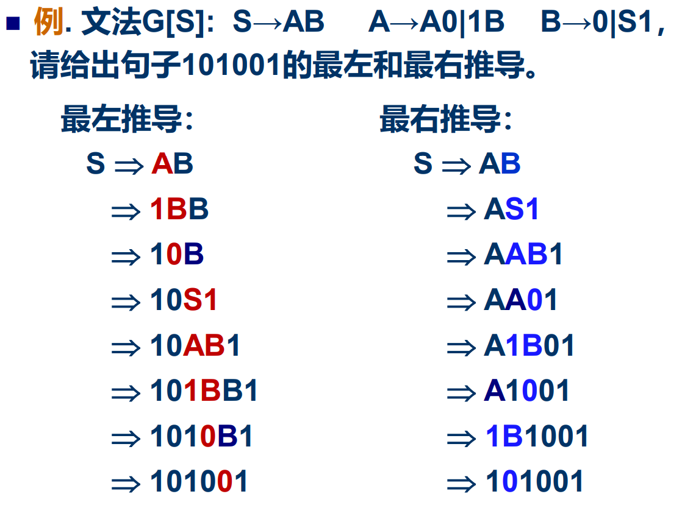
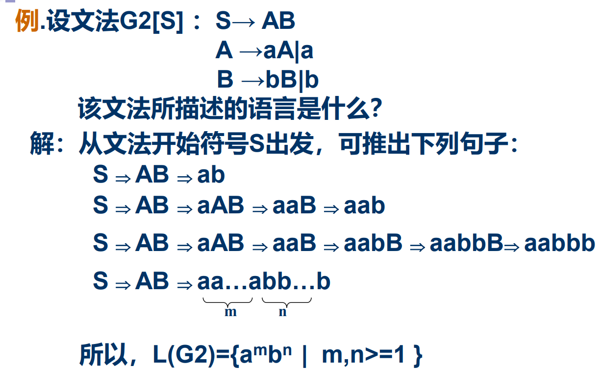
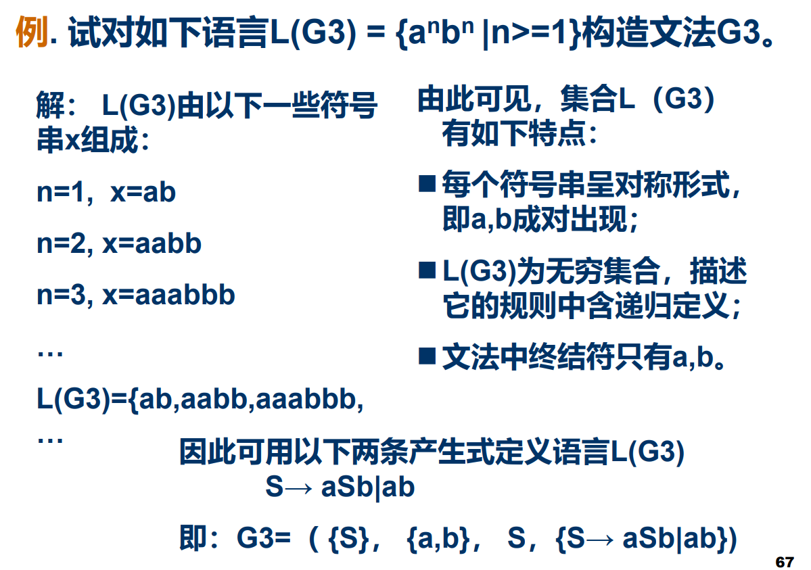

# 形式语言

通过人们公认的符号、表达方式所描述的一种语言，是一种通用 语言，没有国籍之分。 形式语言是某个字母表上的字符串的集合，有一定的描述范围。

## 文法

最后一行*表示闭包。中间有VN的原因是必须包含一个非终结符

例如英语，VT为26个字母

最后一行表示N为0和1组成的字符串

自动机表示：此处有一个图

如果N为001，则N=0N=00N=001

### 简化的文法表达

# 从文法到语言

## 推导与归约

正向推导；反向归约；

若在推导关系中，每次最先替换最左（右） 的非终结符，则称为**最左（右）推导**；  若在归约过程中，每次最先归约最左（右） 的非终结符，则称为**最左（右）归约**。

例题：(也可以用树状推导——最左推导就是左子树优先)

## 句型 句子 语言

如 果E *-> α，则称α是文法G的一个句型（句子中间随意裁剪就是句型）

仅由终结符组成的句型称为句子

文法G所产生句子的全体

例题：A就是若干个a；B就是若干个b

# Chomsky文法体系分类

## 2型文法

也称上下文无关文法

## 3型文法

# 语法树

如果一个文法的句子（句型）存在两棵语 法树,那么,该句子是二义性的。

