# 一、语法分析器的功能

两种分析方法：

最右归约是最左推导的逆过程

## 自上而下分析

试探法

# 二、自上而下面临的问题

根本不能通过试探法解决

## 左递归

### 直接左递归

方法：递归没办法拿掉，因此考虑将左递归转换成右递归

例子：

### 间接左递归

1前面没有直接

2前面有一个产生式，Q有没有以前面的产生式非终结符打头的，有，就带进来。观察有没有直接左递归，没有。

3前面有两个产生式，S有没有以前面的产生式非终结符打头的，有，就带进来。观察有没有直接左递归，有，故消去

观察哪个是产生式的起始符，

## 回溯

试探，穷尽所有的可能性。

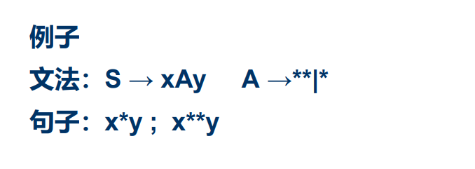

应该做到无回溯：对任非终结符A，用它匹配输入串时能够根据当 前输入，准确地指派一个候选式。

- 若匹配成功，则不虚假； 

- 若匹配不成功，则其它的候选式也不会成功。

即：对每个非终结符的候选式，其任何推导的头符号（终 结符）集合两两不相交。

### First集

*是在箭头上的，注意α是终结符！

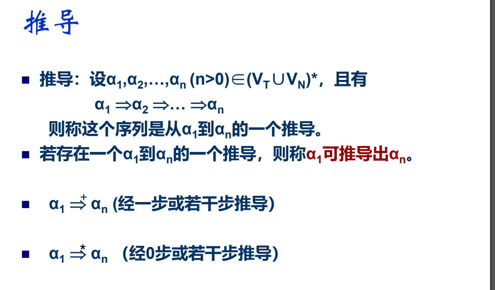

任意一个符号串alpha，

终结符，出现在第一个位置上，

首符集元素互不相同，就不会出现回溯

构造：

注意最后两小点的理解：Yi推导不出来空字，前面都可以推导出空字，所以他们的F集合减去空字也是X的首符集元素

例题：没看懂

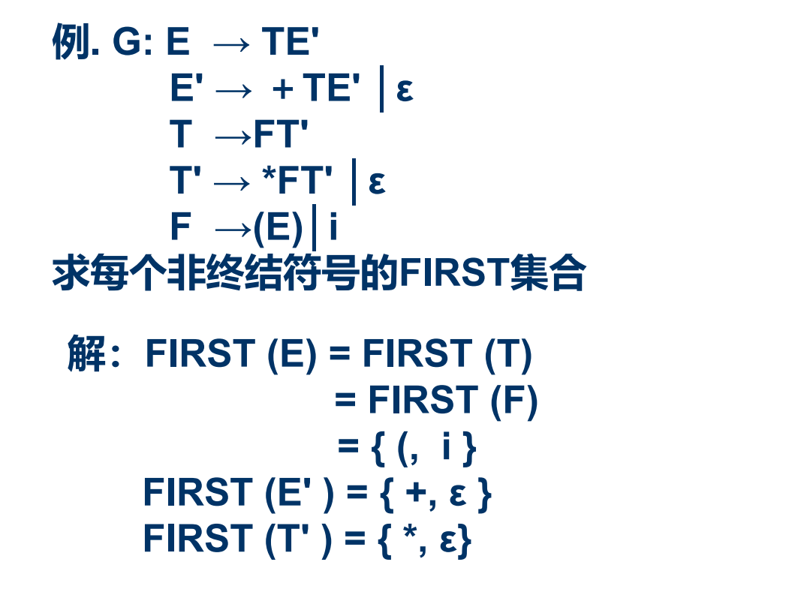

### 回溯的解决方法

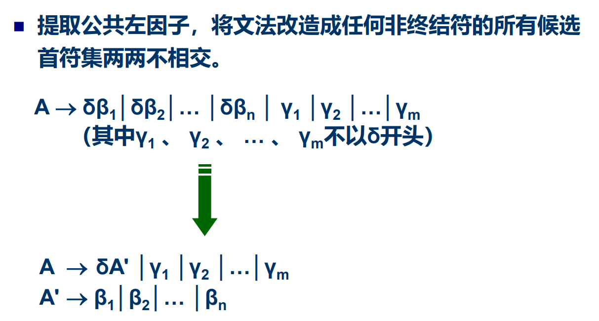

例题：

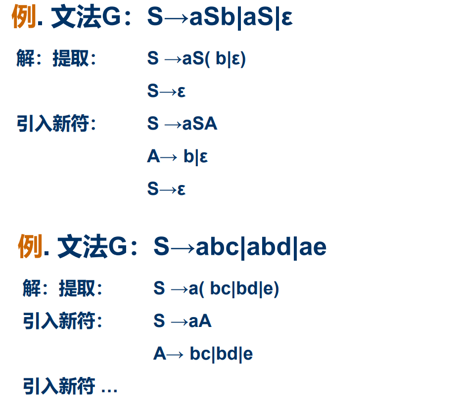

# 三、LL（1）分析法

LL1的意思：一次从左边只移动一个

问题的提出：

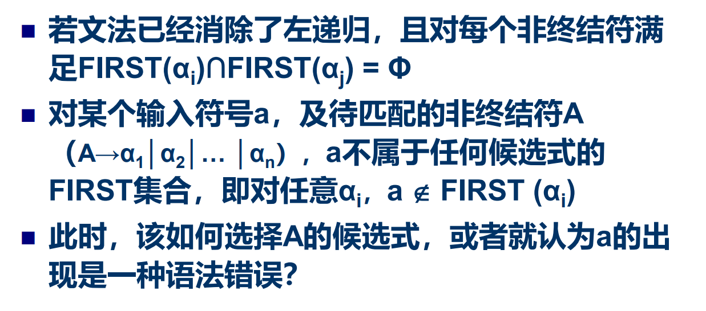

一个例子：

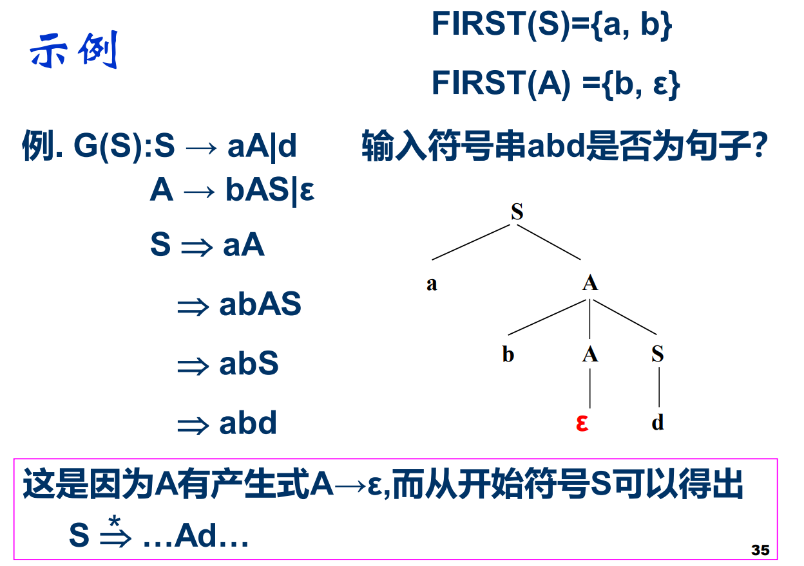

关键在于，A可以推出e

## Follow集

后继符

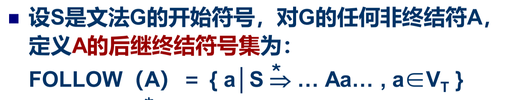

S是文法的起始符，终结符a是A的后继符

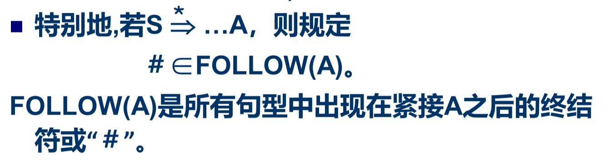

即：如果A后面没有，则认为#跟在后面！就像空对于F

对于S，#都是后继符。

后继符不存在空字——任意一个符号都存在空字。

构造：

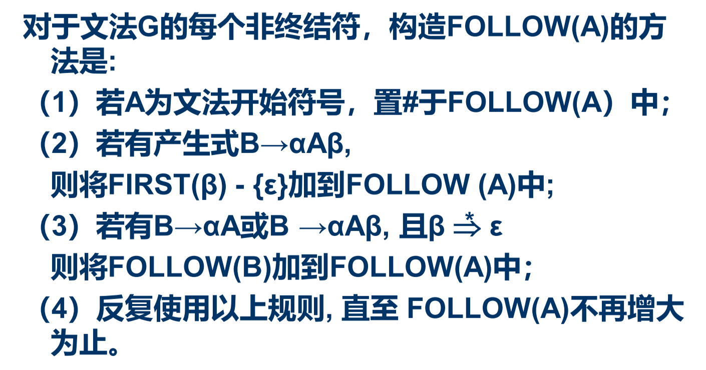

第二个：只看右边

第三个：类似first中的转化

例如S->...B...就有S->...aA..

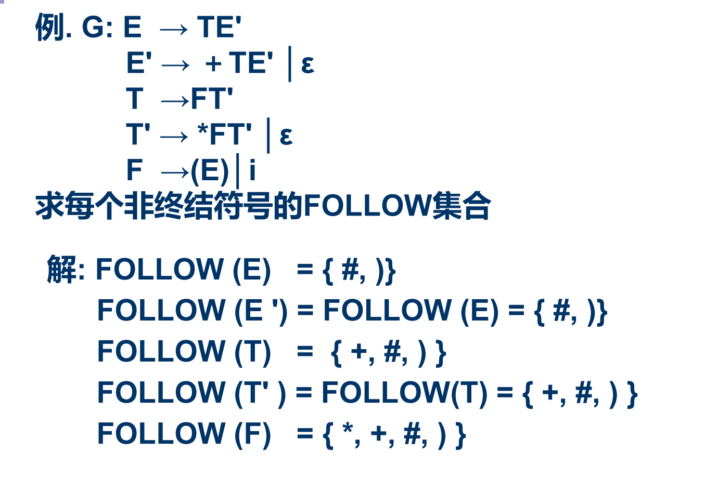

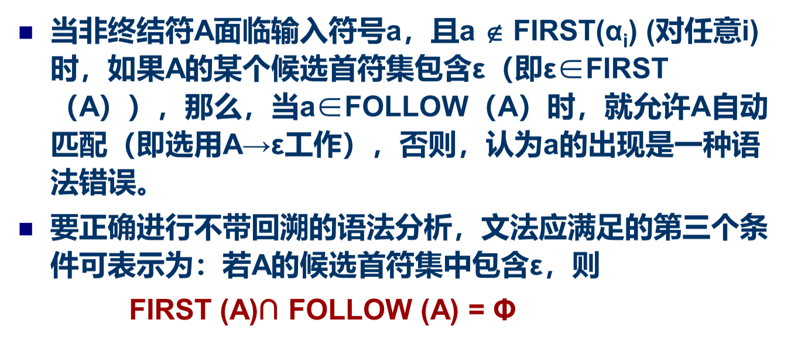

假设交集为a，如果要推导a打头的候选，不知道选候选式还是以follow出现（以空字匹配）——这样又会有回溯

# 四、LL（1）文法 & 分析法

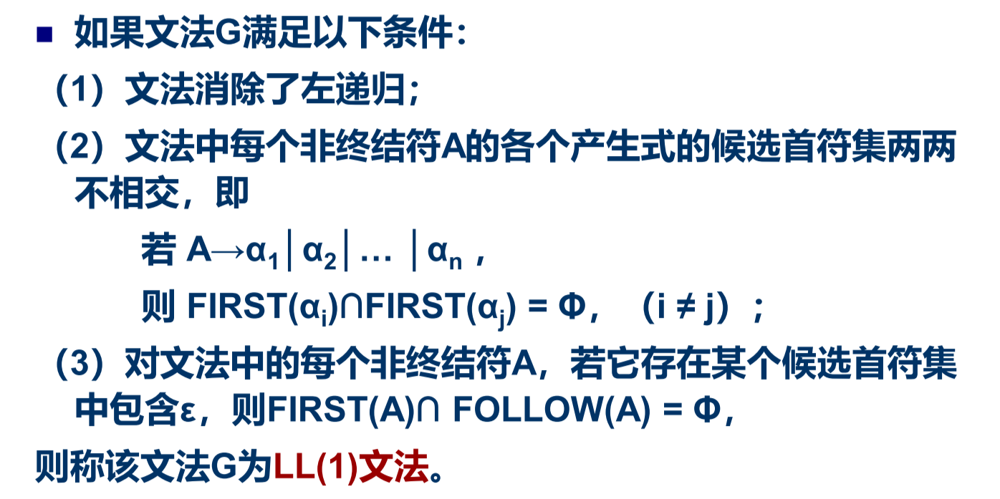

符合LL（1）文法的语句就可以用LL（1）分析法进行分析

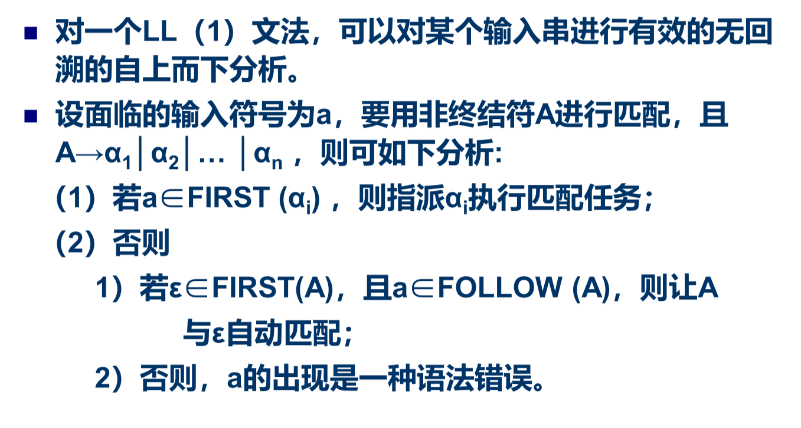

# 五、递归下降分析程序

就是LL（1）分析法的程序

从文法开始符号出发，在语法规则(文法产生式)的支配下进行语法分析。逐个扫描源程序中的字符(单词符号),根据文法和当前输入字符分析到下一个语法成分A时，便调用识别和分析A的子程序(或其自身)，如此继续下去。

程序通用的构造语法：

n个候选式有n+2个分支（一个error一个空字）

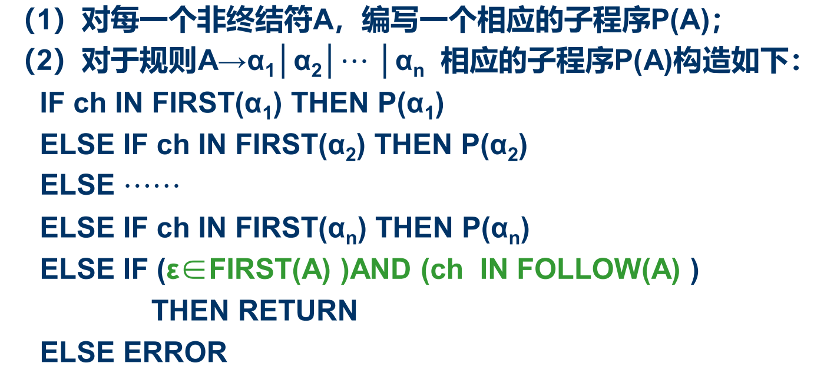

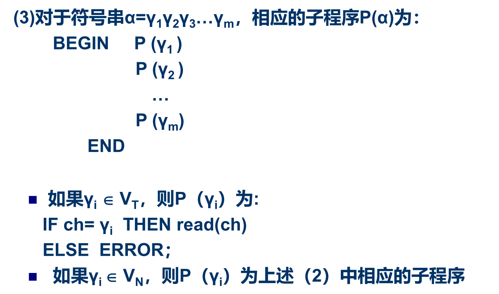

P指的是procedure

最后的终结符就可以read（ch）就行了，没必要像片偏移、t里面包装为P。

# 六、预测分析程序

最重要的是分析表

如果有递归、回溯，就需要预测分析程序。

# 七、LL（1）分析中的错误处理

