# 语法分析器的功能

两种分析方法：

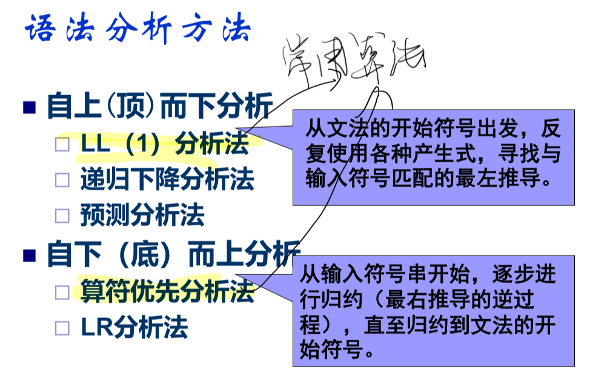

最右归约是最左推导的逆过程

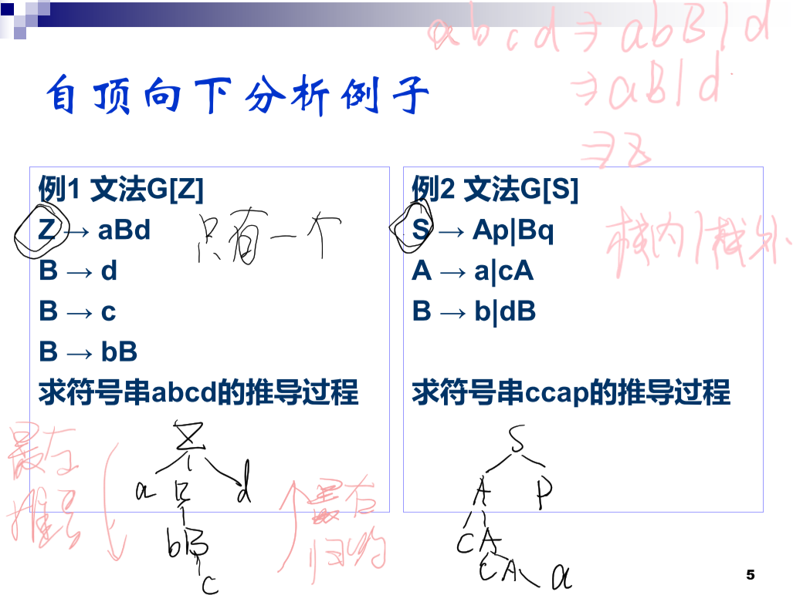

## 自上而下分析

试探法

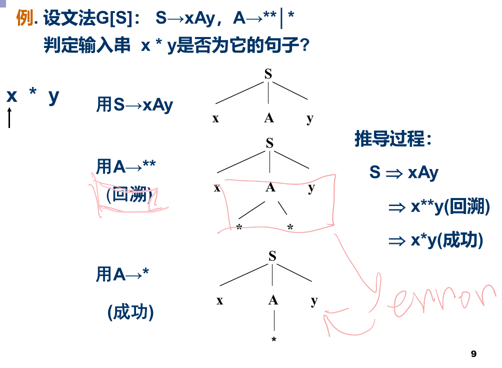

# 自上而下面临的问题

根本不能通过试探法解决

## 左递归

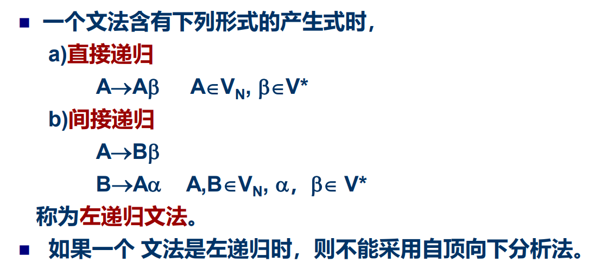

### 直接左递归

方法：递归没办法拿掉，因此考虑将左递归转换成右递归

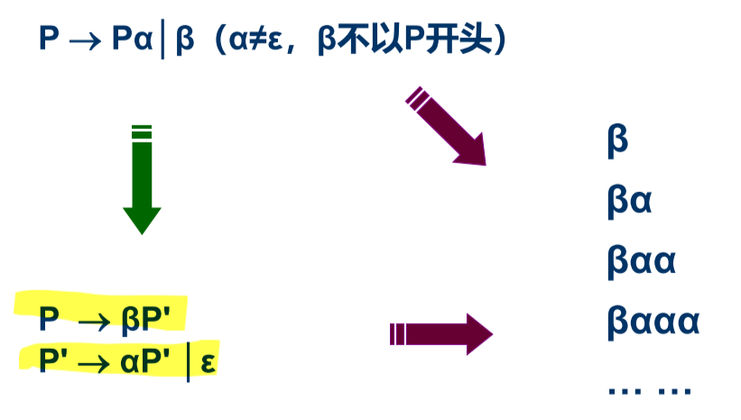

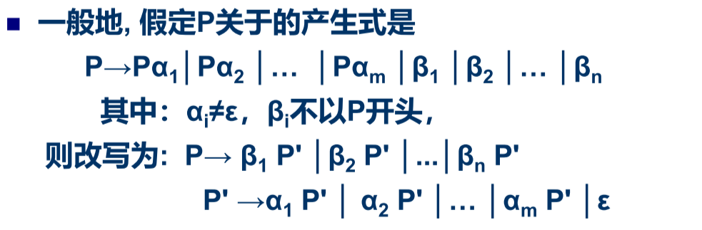

例子：

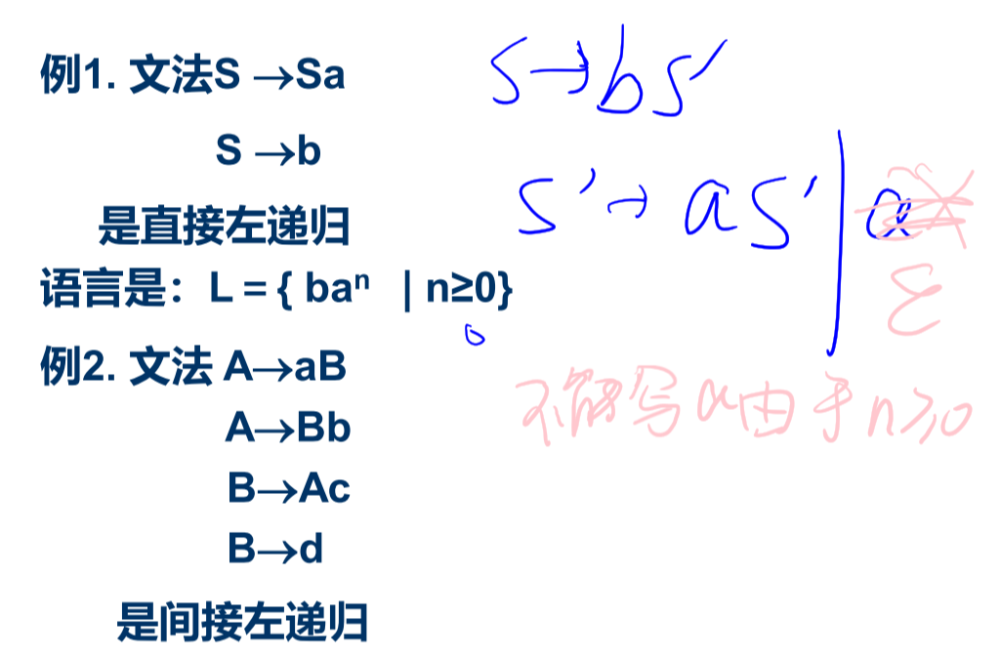

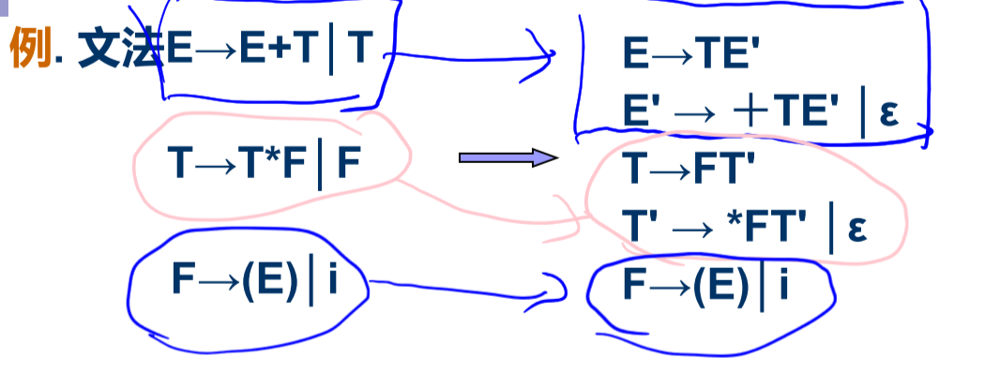

### 间接左递归

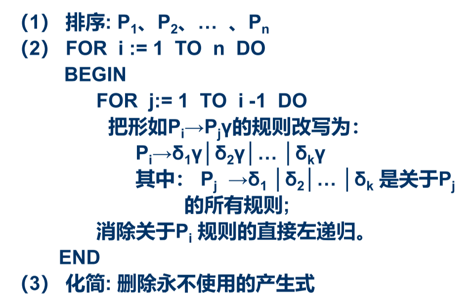

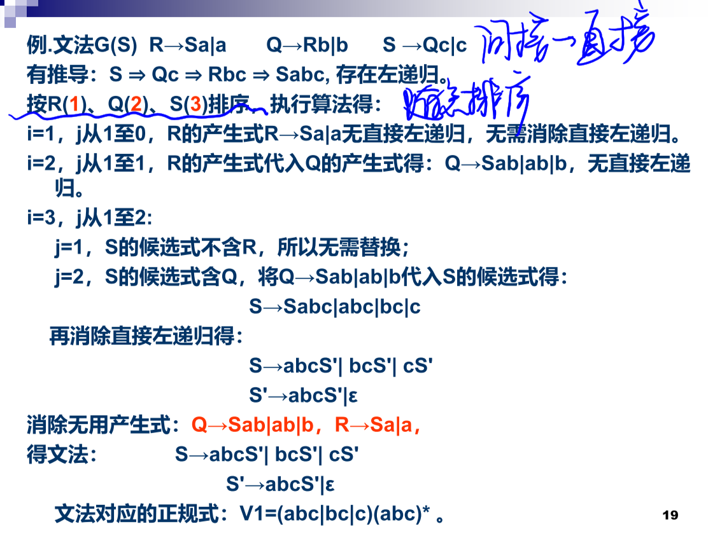

1前面没有直接

2前面有一个产生式，Q有没有以前面的产生式非终结符打头的，有，就带进来。观察有没有直接左递归，没有。

3前面有两个产生式，S有没有以前面的产生式非终结符打头的，有，就带进来。观察有没有直接左递归，有，故消去

观察哪个是产生式的起始符，

## 回溯

试探，穷尽所有的可能性。

### First集

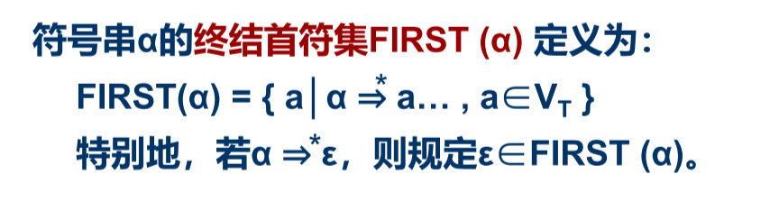

任意一个符号串alpha，

终结符，出现在第一个位置上，

首符集元素互不相同，就不会出现回溯

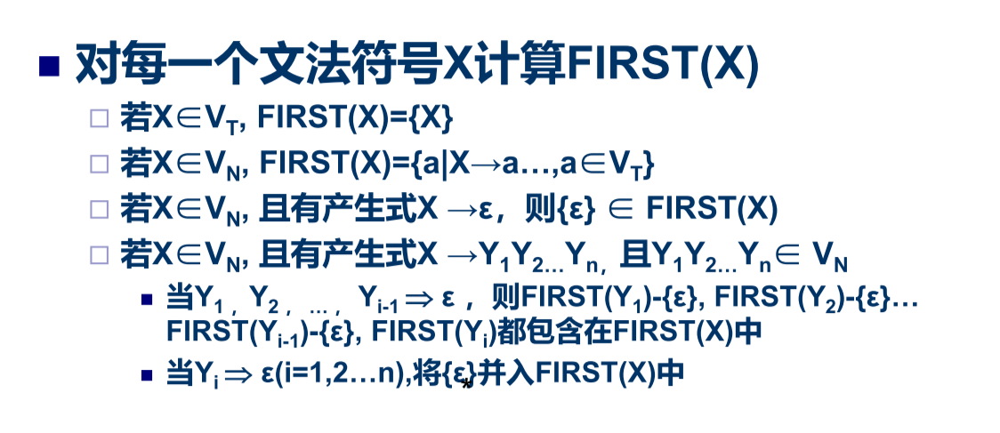

# LL（1）分析法

# 递归下降分析程序构造

# 预测分析程序

# LL（1）分析中的错误处理

