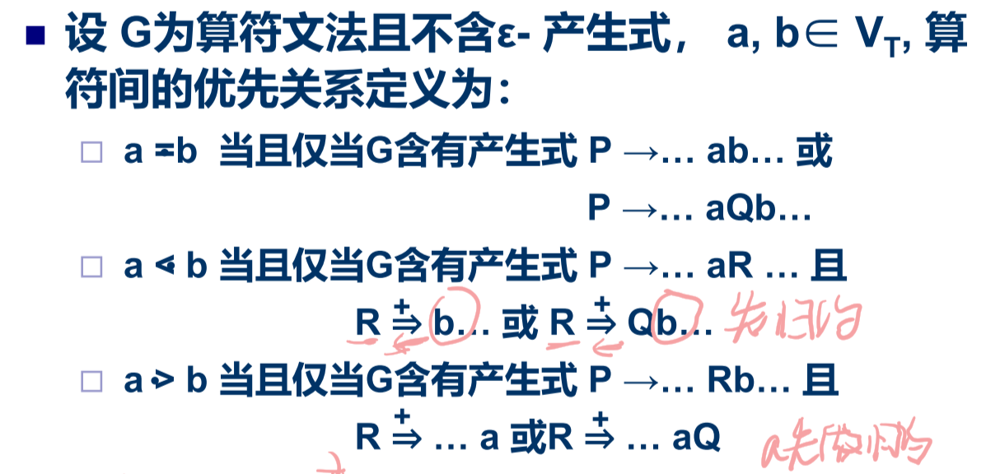
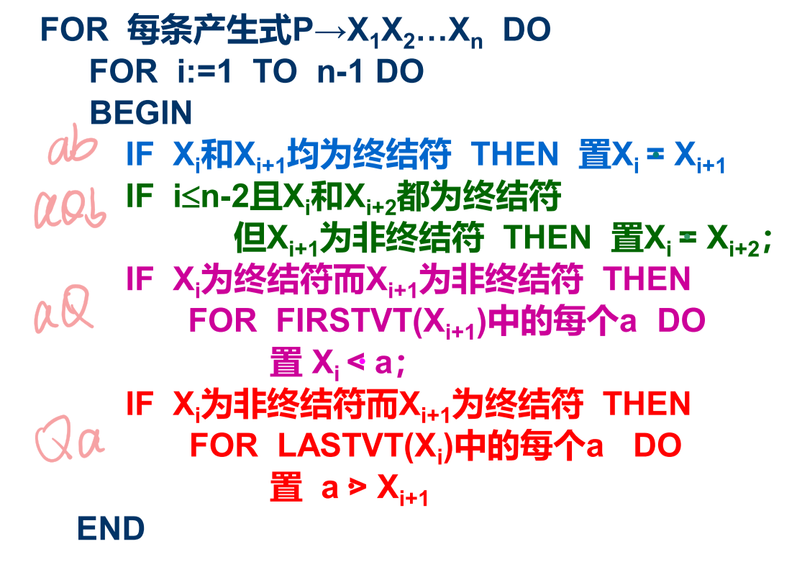
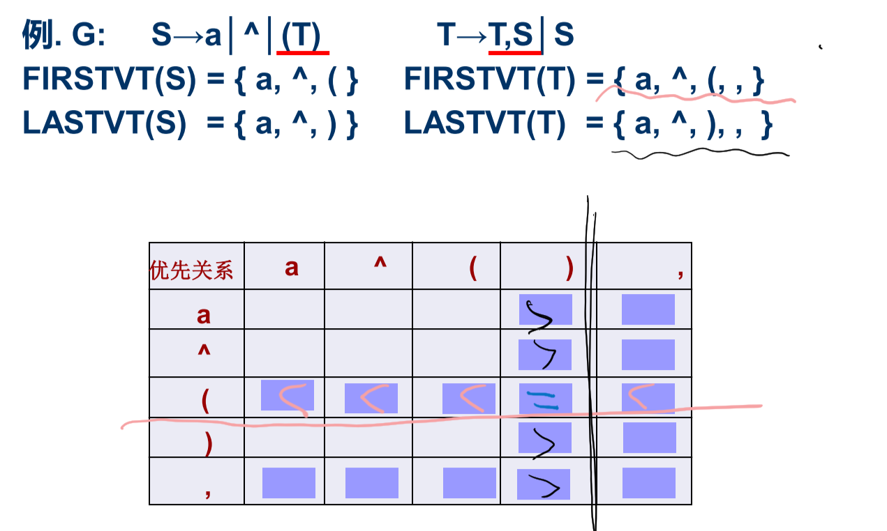
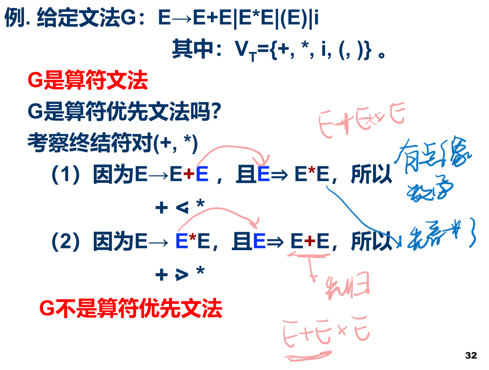
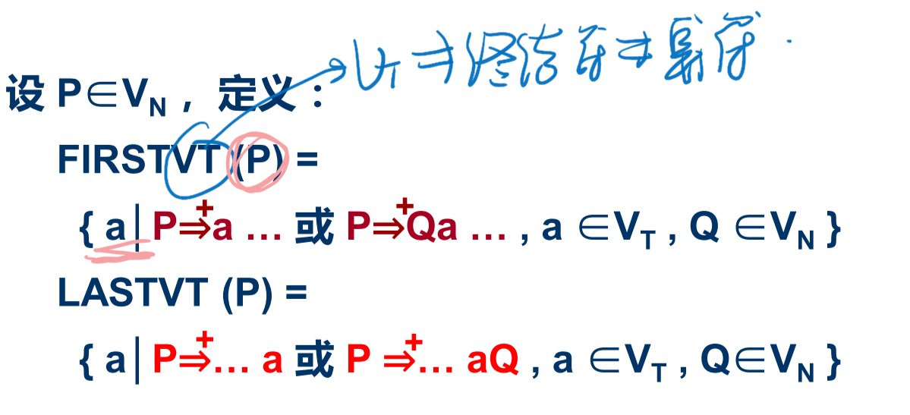
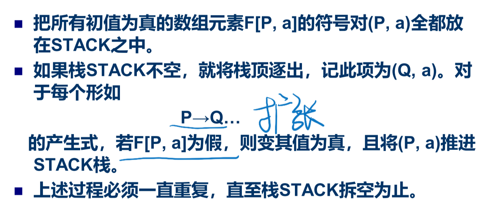
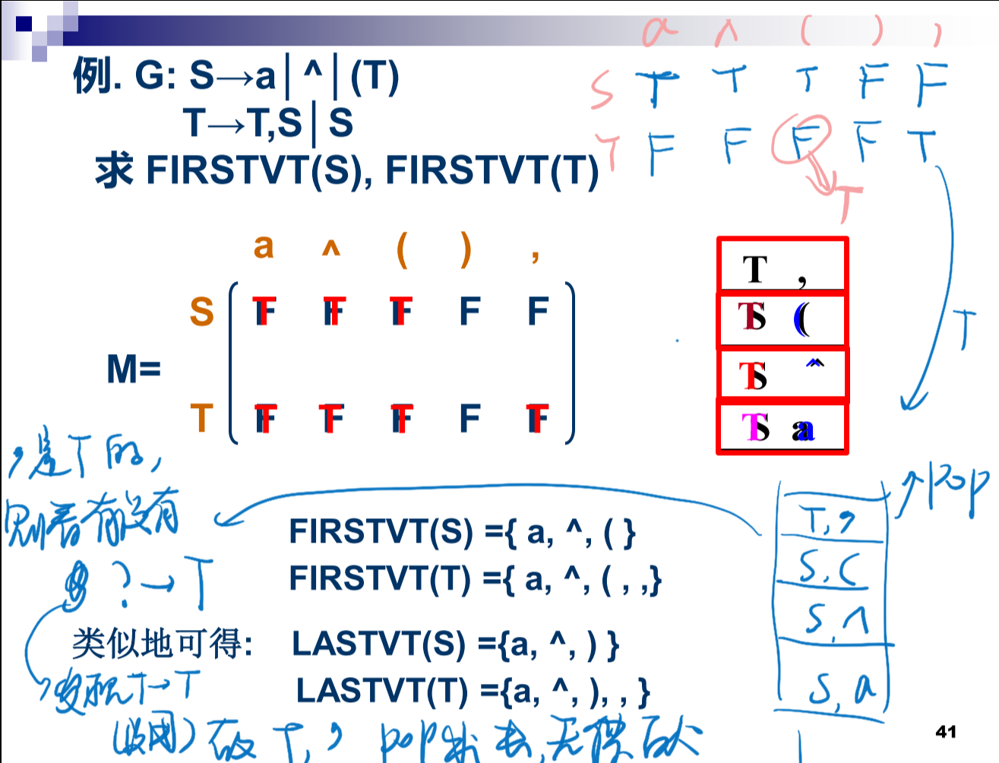

# 一、自下而上分析的基本问题

## 归约

## 规范归约

一直寻找句柄做归约的过程。

什么是句柄？最左边的直接短语。

什么是直接短语？可以一次归约得到的。

## 符号栈&语法树

# 二、算符优先分析

## 算符优先文法&优先表

**算符文法：**

终结符是算符，比较重要。

一个文法，如果它的任一**产生式右部**（即产生的部分）都**不含两个相继（并列）的非终结符**，则称该文法为算符文法。（算符就是非终结符）

**算符优先级:**

算符优先级高的先归约。

没有交换律；不相邻的不讨论优先级

相等的算符以后就一起做规约

优先级高的算符先归约

算符之间的优先级

相同，进栈

小于，？？？？？？

栈内大于栈外，则栈顶归约——怎么归约？栈顶优先级相同的一起归约。

没有优先级的算符永远不可能相邻——编译的时候如果出栈相邻就报错error

**构造优先表的算法：**

例题：

S→a│^│(T) 

扫描到第三个产生式，有（=）

而且因为有T，所以（  <  FIRSTVT(T)（那一行）

（  <   LASTVT(T) 所以那一列

**算符优先文法：**

如果一个算符文法G中的任何终结符对(a, b) 至多满足< > =关系之一，则称 G 为算符优先文法。

## FIRSTVT(P) & LASTVT(P)

FIRSTVT是P能推导出的首个终结符

假设产生式A—>a1a2a3a4...

扫描，若有

1. ...ab.../aQb...      a=b
2. ...aP...     a < FIRSTVT(P)
3. ...Pa...     LASTVT(P) < a

**构造算法**

例题：P41

先全F进矩阵，栈顶拿出来处理。

第二个，（是s的发现有T->S，则（是T的，所以它出栈之后 T, ( 要进栈

LASTVT同理

## 最左素短语

素短语 ：是一个短语，它至少含有一个终结符且除它自 身之外不含有任何更小的素短语。 

最左素短语 ：处于句型最左边的那个素短语。

素短语如果要包括多个算符，它们的优先级应该相等，才能归约。

## 算符优先算法 

## 优先函数

## 出错处理

# 三、LR分析法

## LR分析器

LR分析器的核心是一张分析表 

ACTION[s, a]：当状态s面临**输入符号a** 时，应 采取什么动作. 

GOTO[s, X]：状态s面对 **文法符号X **时，下一 状态是什么 
GO[s, X]定义了一个以文法符号为字母表的DFA

## LR(0)分析表

## SLR分析表

## 规范LR分析表

## LALR分析表

## 二义文法

## 出错处理

66

r打头要reduce归约，是用什么产生式归约

s打头要shift 迁移

goto表是归约完之后状态要往哪里迁移

74

从8先推A

一个状态可以接受终结符就做shift

·位于最后就开始做归约，接受多少字符就退多少步

+）#是E是

