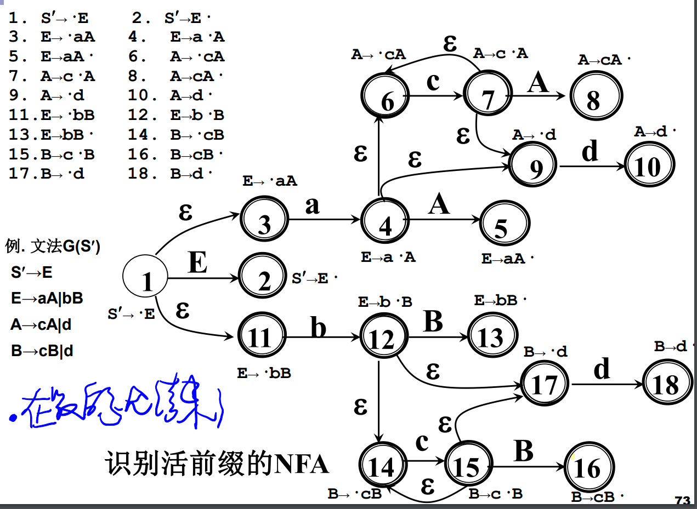

# 短语&直接短语&句柄

## 定义

*是0/n步推导，+是1/n步推导

注意粉色字，是A的短语但不在句型里面，题目里是让给出句型的短语。

## 从语法树理解

短语：句型语法树中每棵子树（某个结点连同它 的所有子孙组成的树）的所有叶子结点从左到右 排列起来形成一个相对于子树根的短语。 （A长出来的全部子树的叶节点）

直接短语：只有父子两代的子树形成的短语。 （一步推导得到）

 句柄：语法树中最左那棵只有父子两代的子树形 成的短语。最左推导就是找句柄。

> 二义性文法的句柄可能不唯一
>
> 给定文法G，如果存在句子s，它有两棵不同的分析树，那么称G是二义性文法

# 规范归约

## 移进-归约法 

使用一个符号栈，把输入符号逐一移进栈，当 栈顶形成某个产生式右部时，则将栈顶的这一 部分替换（归约）为该产生式的左部符号。

## 规范归约

也就是：一直找最左边的可归约串。

## 符号栈的使用

我们用一个栈和输入缓冲区实现规范归约。
初始时栈中为#，输入串为aaa#，最终栈为#S，输入串为#

可归约的串永远在栈顶

## 语法分析的四个操作

# 算符优先文法

## 算符优先关系

Q，R都是非终结符

没有交换律；不相邻的不讨论优先级

相等的算符以后就一起做规约
优先级高的算符先归约

栈内算符和栈外优先级相同，进栈
栈内小于栈外，进栈
栈内大于栈外，则栈顶归约——怎么归约？栈顶优先级相同的一起归约。

没有优先级的算符永远不可能相邻——编译的时候如果出栈相邻就报错error

## 算符文法&算符优先文法

一个文法，如果它的任一**产生式右部**（即产生的部分）都**不含两个相继（并列）的非终结符**，则称该文法为**<u>算符文法</u>**。（**算符就是非终结符**）

如果任意两个终结符a和b至多满足大于小于等于关系之一，则称为**<u>算符优先文法</u>**。

## FIRSTVT&LASTVT

FIRSTVT是P能推导出的首个终结符；LASTVT是P能推导出的最后一个非终结符（可以是一步或多步推导）

如何构建FIRSTVT？

一个构建的例子：

程序如下：

## 优先关系表

假设产生式A—>a1a2a3a4...

扫描，若有

1. ...ab.../aQb...      a=b
2. ...aP...     a < FIRSTVT(P)
3. ...Pa...     LASTVT(P) > a

在后面的大，因为是从左边进栈，满足条件pop出来（也就是实际上右边的先归约）
ps：#小于所有的终结符

程序描述：

一个例子：
横着的粉色和竖着的黑色，）要小于T的FIRSTVT

由于（T），所以有（=），并且
（  <  FIRSTVT(T)，粉色那一行
LASTVT(T) >），黑色那一列

> 1. ...ab.../aQb...      a=b
> 2. **<u>对于产生式形如 A→...aBc...则优先级a=c，a<FIRSTVT(B)，LASTVT(B)>c</u>**

## 最左素短语

素短语 ：是一个短语，它至少含有一个终结符且除它自身之外不含有任何更小的素短语。 

最左素短语 ：处于句型最左边的那个素短语。

**<u>算符优先文法的最左素短语：</u>**

# 算符优先分析算法

## 算法描述

## 程序描述

小于就进栈，大于就归约（归约要往前找，找相等关系，也就是找素短语开始归约）

只看栈顶的终结符，不看非

## 例题

工作完毕时符号栈应该是#N#

# LR分析法

## 定义&原理

LR分析法中的L表示从左向右扫描输入串， R表 示构造最右推导的逆。LR分析法是严格的规范规约。

工作原理：在移进 - 归约过程中寻找句柄 

> 历史: 在分析栈中已移进和归约的符号串
> 展望: 根据当前使用的产生式推测未来可能遇到的输入符号
> 现实: 当前输入符号

LR分析器的核心是一张分析表 

## LR分析表

### ACTION[s, a]

ACTION[s, a]：当状态s面临**输入符号a**(终结符) 时，应 采取什么动作. 

其中移进是s开头，归约是r开头，接受是acc，报错则表中为空。

### GOTO[s, X]

GOTO[s, X]：状态s面对**文法符号X （非终结符）**时，下一 状态是什么 
GO[s, X]定义了一个以文法符号为字母表的DFA

## 看懂分析表

r后面的数字表示用哪个式子（所以我们要对产生式做编号），s后面的数字表示转换到哪个状态。

5状态时候读到下一个字符是*（注意在读的时候输入串字符不能移进！只有s才可以做移进！），查 【 5, * 】 ，发现是r6， 因此i reduce成F，也就是把栈顶的i归约成F，此时状态5就需要pop出去（因为归约不仅仅是符号做归约，状态也要扔出去）。
5抹掉之后栈顶就是0状态，此时0接受F做状态迁移，查goto表，到3

再读字符串是，查【3，*】发现是r4，因此F归约成T，3状态pop出去。0读到T转到2状态。

2状态读到是s7，因此移进*......后面以此类推直到走到acc。

## 构造分析表

此知识点需要学完后面的LR0项目集规范族后看

 

## LR文法

LR文法: 对于一个文法，如果能够构造一张LR分析表, 使 得它的每个入口均是唯一确定，则该文法称为LR文法。

LR(k)文法：对于一个文法，如果每步至多向前检查 k个输 入符号，就能用LR分析器进行分析。则这个文法就称为 LR(k)文法。（大多数程序语言，符合LR(1)文法）

LR(0) 文法：k ＝0，即只要根据当前符号和历史信息进行 分析，而无需展望。

# LR(0)文法

## 定义

k ＝0，即只要根据当前符号和历史信息进行 分析，而无需展望。

文法G 的产生式右部加一个圆点( ·)，称为G的一个**LR(0) 项目**。它指明了在分析过程的某时刻看到产生式的多大部 分。

## 活前缀

为什么呢？因为你遇到句柄肯定就要归约了!

## 识别活前缀的NFA方法

文字描述（难懂）：

一个例子（看图直接理解比较好懂）

假设输入acd

0状态是开始状态，1状态是接收状态。

点·表示当前机器读到哪个字符串，·后面有什么就可以有什么迁移。

在0状态：首先在E之前，因此分析器开始等待接收E以及E能推导出的所有产生式（后面两个式子）
接收a到2状态，分析器开始等待A以及A能推导出的所有产生式；接收c到4状态；接收d到10状态

10状态·在最后，因此从这开始归约：**<u>怎么走进来的就原路返回回去</u>**。

把d退回来到4，此时注意！我们归约出来一个A！（此时栈顶从cd变成cA）因此在4状态的时候我们读入一个A！此时我们要归约cA，首先把A退回去，走到4（的第一条），把c退回去走到2状态（第二句），此时已经退完了，因此开始接受A，往前走到6，此时栈顶为aA。

aA归约，A回去走到2（第一句），再退a走到0（第二句），在零状态归约出来一个E，因此我们读入一个E，从0转变成1.

到此我们归约结束，到达整个语法分析器的接受态。

##  LR(0)项目集规范族

### 定义

构成识别一个文法活前缀的DFA的项目集（状态） 的全体称为文法的LR(0)项目集规范族。

接受：接受状态，移进完毕，需要进行归约。

移进：后面的是终结符，需要继续读

待约：由于下一个是非终结符，是不出现在句子里的，所以叫“待约”

### 依赖定义

> **<u>拓广文法</u>**
>
> 唯一的接受态是目S'→S· ，原来的产生式加上这个新加的产生式是原文法的**拓广文法**（该文法开始符是S'）。
>
> **<u>项目集I的闭包CLOSURE(I)</u>**
>
> 
>
> 上面的转换图的每一个框框就是一个闭包
>
> **<u>状态转换函数GO(I，X)</u>**
>
> 
>
> J那个大括号里面 | 后面的表示前面成立的条件
> 注意计算GO的时候看完了已有的别忘了再算算闭包！！！
>
> 一个例题：很好理解
>
> 
> 计算闭包：等待E同时也在等待E能推导出的表达式
> GO第二个，写第一个之后要计算第一个的闭包：也就是等待A也在等待A能推导出来的式子。

### 构造算法

例题:和前面的一样,只是不断地计算,例如GO(I0,E)=I1表示I0状态接受E到I1

# SLR文法

LR（0）和SLR是两种不同的归约方式，他们的GOTO表是一样的。只有ACTION表不一样，也就是归约的时候不一样。

ACTION表中有冲突（两个以上的reduce选项）用SLR

E——》T·和E——》E·+T 当加号出现都符合

# LR（1）

展望符是继承的，前一个状态是什么语句推导过来的，这个状态的展望符就是那个语句的展望符。

# LALR

同心合并：不看展望符，前面都一样，进行合并

# 二义文法

