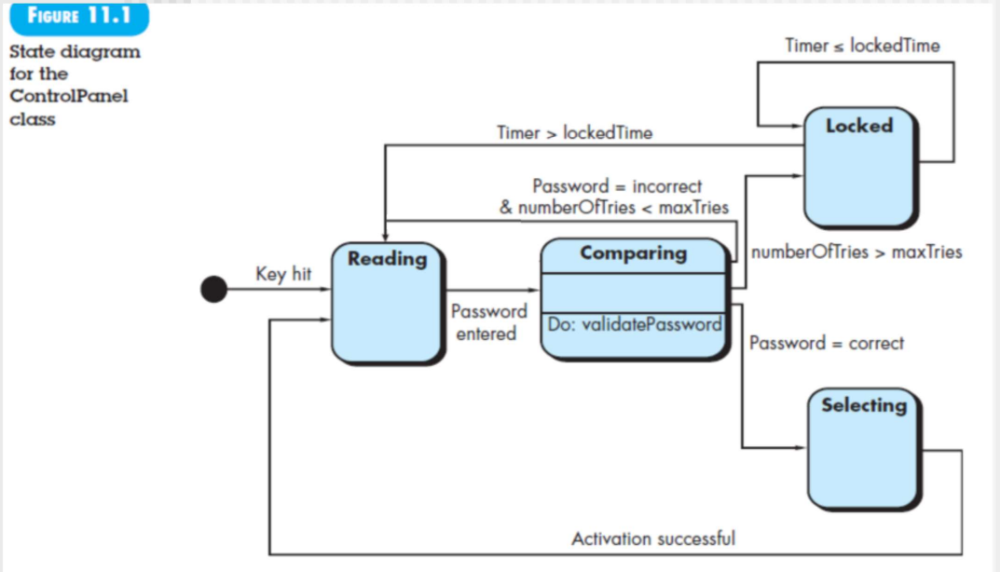
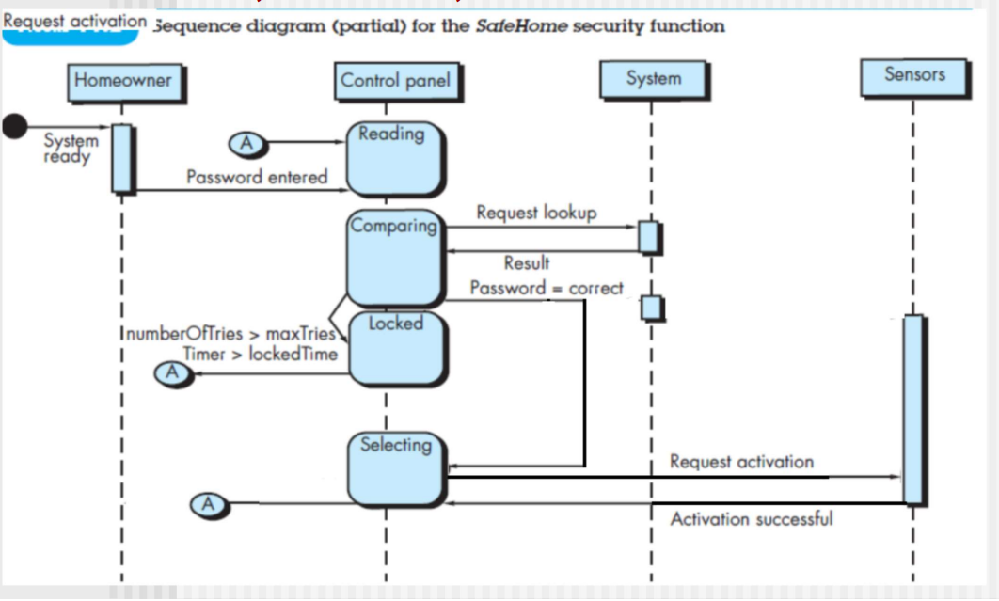
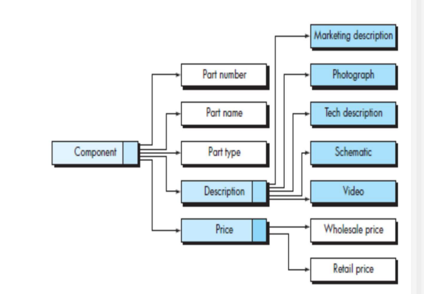

REQUIREMENTS MODELING: BEHAVIOR, PATTERNS, AND WEB/MOBILE APPS

11.1-11.4 讲行为建模

11.5 讲前端在做界面设计之前的需求分析

（下周必须讲完这章）

# 行为建模

 外部事件驱动的系统是指ATM机、打印机等会有系统状态图（附件资料ATM）。

但另一种系统没有系统级别的状态图，但每个类会有状态图，是类方法定义的基础。

只要系统有功能业务类定义，就有类级别的状态图，是类方法定义的基础。。ATM仍然有系统状态图，也有每一个类的状态图（表示类之间的方法）。

>  c写的：每一个系统的主程序main就是依照系统状态图写的。（专门负责调用）
> 面向对象：每个类会有状态图，是类方法定义的基础。

行为建模的基础：状态图 & 时序图

(1) evaluate all use cases to fully understand the sequence of interaction within the system 

> 和系统的交互

(2) identify events that drive the interaction sequence and understand how these events relate to specific objects,

> 方法实现特定功能，一个方法可以造成很多状态变化，不能单独分开

(3) create a sequence for each use case

(4) build a state diagram for the system or classes

(5) review the behavioral model to verify accuracy and consistency.

P6：要调用某个方法来处理的时候才形成事件（例如密码输入完毕）

潜在类也可以用多个状态图：例如控制面板启动时候有一个，报警处理还有一个

箭头上面的是事件，蓝色是状态

考试必考7-8分

Key hit按键盘事件发生，开始读密码

Reading：调用读密码的方法（图上没写出来）（最好加一个自反方法：不断读密码）
compare：比较，调用验证方法
locked：如果密码出错超过一定次数锁定
selecting：选择操作，回到显示状态（例如显示启动成功）

从一个类上升到一个usecase 如下，形成时序图

通过数据建模得到四个潜在类——》行为建模（对方法属性进行分析，上一个图）——》类之间的协作上升到use case构建时序图（生命线是对象，也可以看成类）

use case：时序图：类之间的协作

状态图：类的方法和属性的定义

Analysis patterns are stored in a repository so that members of the software team can use search facilities to find and reuse them.

# 前端分析设计建模

## Content model

界面上的控件	

> 首先找内容对象，可能是一个视频、文本、可激活的事件（内容对象就是一个包含信息的控件，可以结构）
>
> 
>
> 是内容建模的data tree（不能再分解的叫做数据项）
> 第二列下面两个是子内容对象

内容对象是界面设计的基础

## Interaction model

：交互建模，出发不同内容对象进而产生不同交互，实现不同功能

参考泳道图或活动图时序图

找界面原型开发工具

整个交互建模就是不断和后面的类交互的过程

## Functional model

：功能建模

## Navigation model

：导航建模

## Configuration model

：

