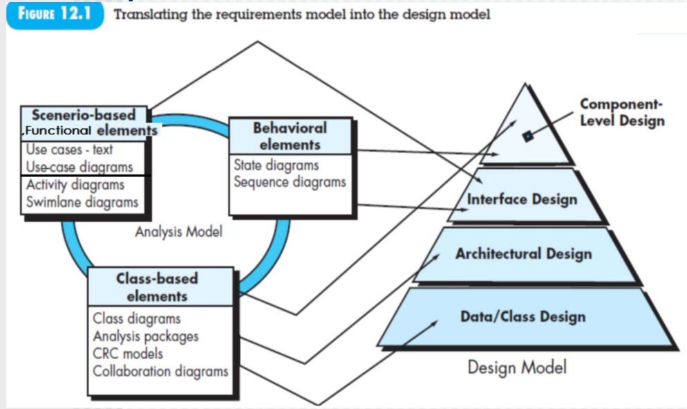
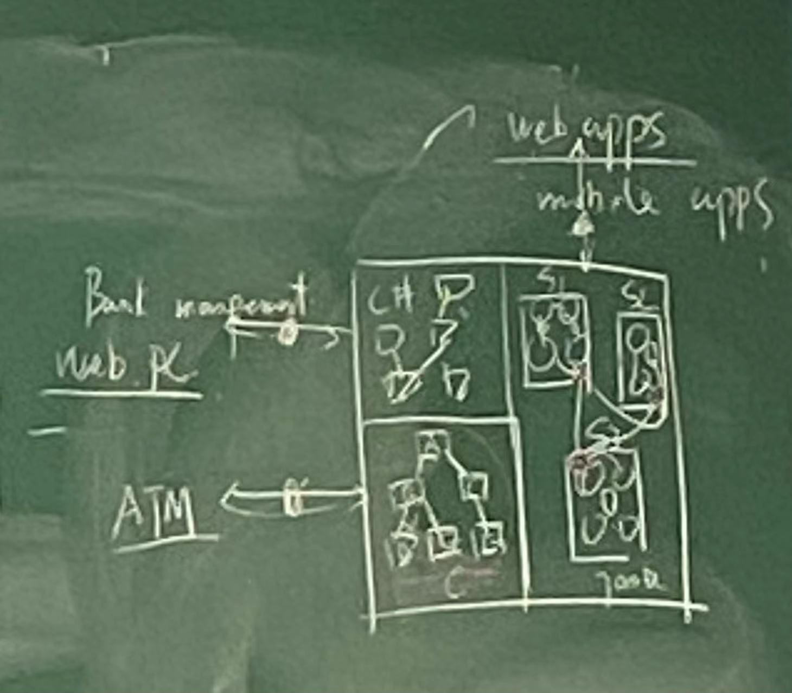
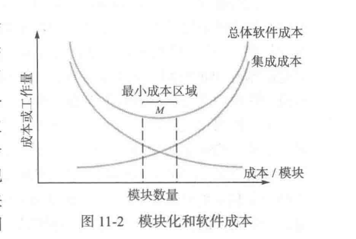

肯定有考题

# 12.1 设计在软件工程上下文的位置

体系结构：

左上角：C#体系结构，与内部管理有接口

左下角：C的体系结构，与ATM机有接口调用

右边：JAVA的体系结构，每一个子系统之间的类有调用关系；一个子系统的类调用另一个子系统的类需要经过控制器，与前端有接口

功能建模：左上

数据建模：下面

行为建模：右上

右边的是软件的体系架构设计

comp：详细设计

arch：概要设计 = 软件架构设计+数据库设计+接口设计

数据字典：数据输入的组合，各种属性的组合（送到后端，识别类调用方法）

https://www.zhihu.com/question/407474596/answer/1344488826

界面：

类外部的接口：以use case为单位

**Component-Level Design:**

**Interface Design：**指User Interface、External Interface、Internal Interface

​		一般把User interface提出去；内部接口是指子系统内部接口、前后端接口、子系统间控制接口、和硬件的接口；内部接口调用依靠状态图设计，类外部接口主要以user case图为单位(即以sequence 图为依据)

​		外部接口指和其他系统交互的接口，不由自己系统维护的接口；

​		所有的界面、界面需要哪些内容，都是从用户接口得到的；界面设计以User Case图为依据；

**Architectural Design:**指software Architectural，一般是软件的架构设计

**Data/Class Design:**数据库设计和数据字典设计；

​		其中数据库表的设计以类图为依据，数据字典就是数据的组合，这些数据和数据库中的字段以及类里的属性对应；和其他系统的接口的数据也叫做数据字典；

​		可能对以前的potential class做细化；

​		和前后端的交互也是数据字典设计的依据

完成类设计最后是在组件设计

# 12.2 设计过程

 an iterative process

FURPS quality attributes：

>  功能性
> 可用性
> 可靠性：失效故障频率&精度&MTTF
> Performance：g processing speed, response time, resource consumption, throughput, and efficiency.（项目性能测试加分）
> Supportability：可扩展性、适应性......

# 12.3 DESIGN CONCEPTS

- 抽象
- 体系结构
- 模式
- 分而治之
- 模块化：E1和E2一起做肯定效率低
  - 
  - 模块数量和成本分析；最上面的曲线高度等于下面两个之和。
- 信息隐藏：不需要知道的就不知道
- 功能独立：高内聚低耦合（调用参数简单）high cohesion, low coupling
- Refinement is actually a process of elaboration（细化）
- ....
- 设计类
  - 业务类Business domain classes（潜在类、分析类变成这个）
  - 界面类User interface classes（导航交互内容功能+数据字典）——> 界面设计工具
  - 控制器类/控制接口类Process classes (control class)：<u>**控制类负责处理数据字典，看看送给那个子系统处理，仅起到传递的作用**</u>
  - Persistent classes (如，被Hibernate持久化到数据库中的类,持久化类的实例对象将保存到数据库或者文件中) 一种衍生类，被很多类包含。将重复的可复用的方法抽象成一个类，方便总体运维，该类向需要的类提供访问接口。
  - System classes(如，Java的主类，有Main()方法) ：也是衍生出来的
  - 每个类的方法应该是独一无二的。低耦合（互相调用的参数简单）

