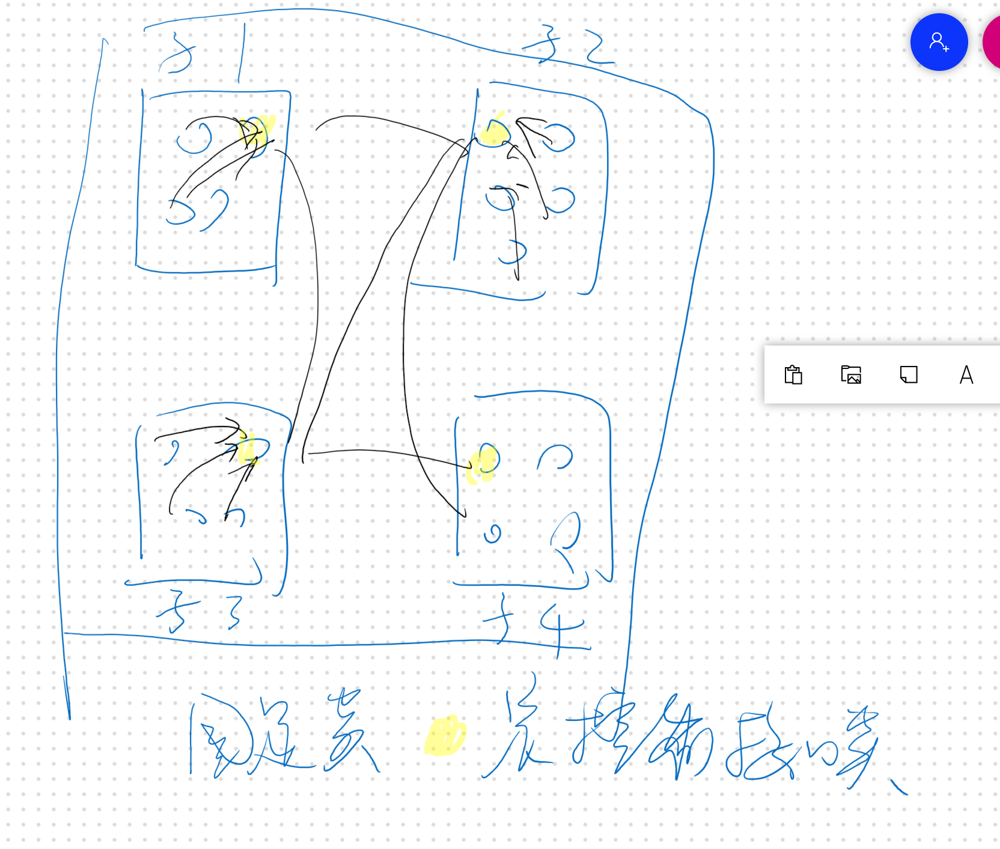
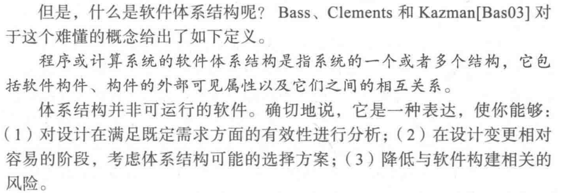
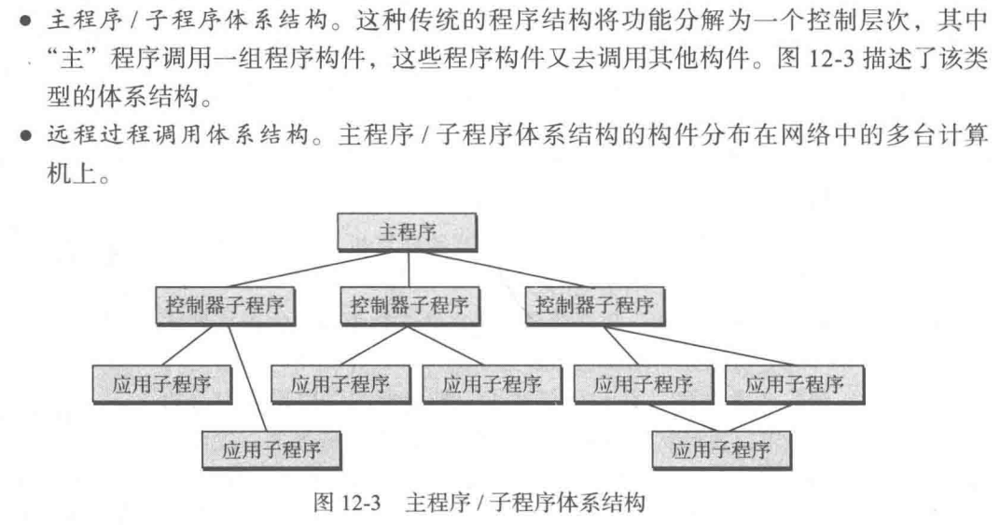

architecture deginm（概要设计，high level degin）包括：

1.软件体系结构设计，就是系统环境图中心的部分。类图的基础上构造子系统，增加控制接口类

系统体系结构：就是系统环境图，运行在什么环境里（上级系统），需要访问什么系统，同等级系统？前端系统？

2.数据库设计

数据库类设计

数据字典设计（交互，功能，导航）——输入什么东西，有哪些控件，数据组织？

3.接口设计：

内部接口：（每个类之间方法的调用，有什么形参shican，子系统类间的调用，有什么参数，参数类型）

外部接口设计：系统环境图里面上下级系统的访问，前后端controlor

用户接口user interface：界面也算接口

> 接口类只有方法没有属性，方法负责完成调用转接逻辑，简单的判断逻辑
>
> 标记一下。比如A1通过C1访问B2

# 12.1 软件体系结构

Architectural design begins with data design and then proceeds to the derivation of one or more representations of the architectural structure of the system

以数据建模（类图）为依据

软件体系结构要标记方法调用接口

# 12.2 体系结构类型

# 12.3 体系结构风格

## 以数据为中心的体系结构

## 数据流体系结构

## 调用和返回体系结构

# 12.6 体系结构设计**重要

系统体系建模的结果如下：

一个例子：

系统体系结构+软件体系结构

接口设计：内部+外部

数据库设计：根据类图

