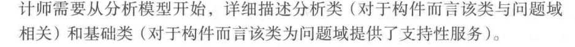
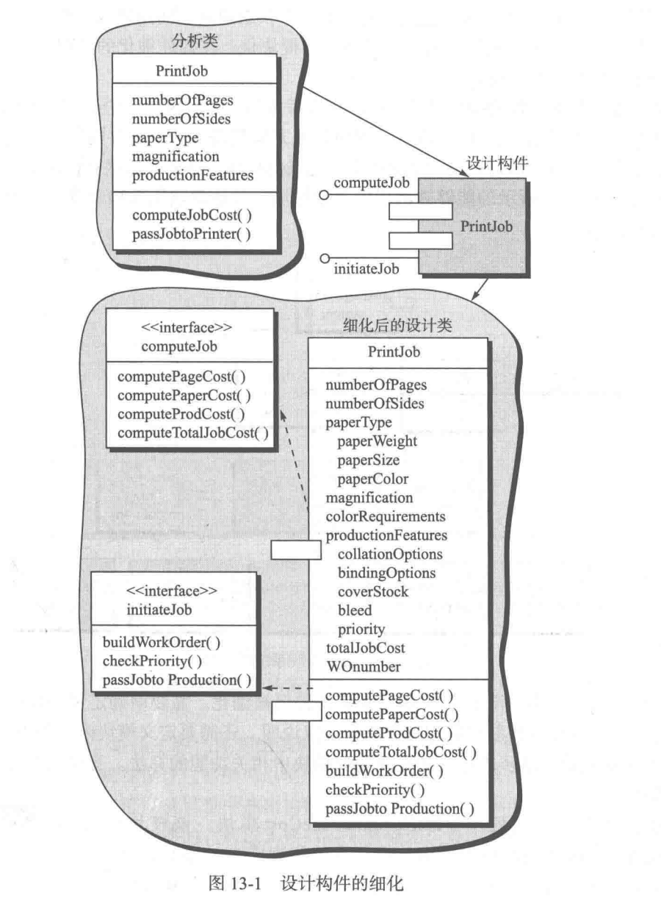
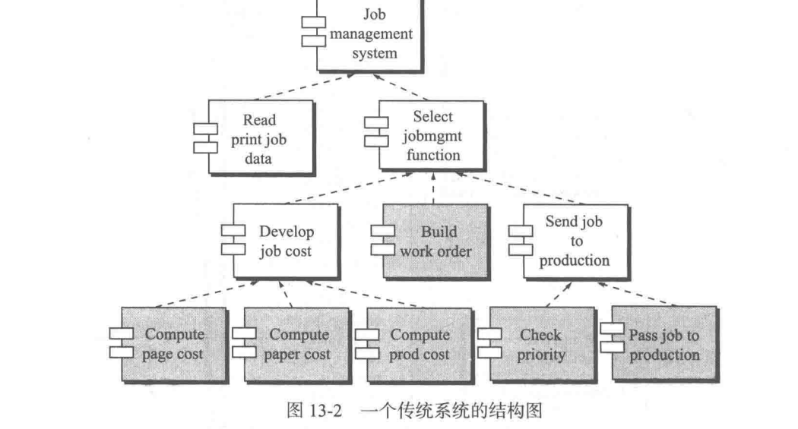
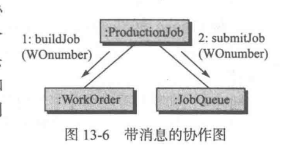

详细设计归约

每个类的方法和数据结构，详细逻辑算法，通信机制不知道——设计出来，以此为依据写代码。

详细设计怎么表示：（分析设计建模有UML标准，设计建模没有）

体系结构：组件之间的组成方式（数据流，callback....上一章的涂鸦是面向对象的体系结构）

本来到分析类，没有组件，但有中间件，数据库啊都可以独立——所以有了组件

# 13.1 什么是构件

组件设计，不仅要有属性也要有方法（本身的方法+和外部交互的方法），也要标记协作

infrastructure基础设施类：前后端接口类，控制接口类，只有属性的常量类，只有方法的类（控制接口类，对数据库操作的类），界面类。

这张图展现了从分析类，到设计类，到详细设计的过程。

PrintJob只列出来和交互的方法，需要调用其他类的（用箭头指向了实现）。内部的方法没有列出来。

callreturn体系：

c语言函数的结构

# 13.3 详细设计过程

步骤一：识别设计类

步骤二：确定基础设施类（需求分析的类图上没有这些东西）

步骤三：细化类

- 定义接口，说明消息细节（类型等）
  - 
  - guard condition：满足某个条件调用（可有可无）
  - 返回值：= 消息名字（参数列表）
  - 一个例子
- 为每个构建确定适当接口
- 细化属性，定义属性和数据结构
  - 
- 详细描述操作数据流
  - 
  - 

步骤四：说明数据源和类

步骤五：细化类和构建的行为表示

- 状态图：系统状态图（面向对象开发可能没有），每个类的状态图
- 看看状态图，检查类的方法属性有没有漏

步骤六：细化部署图（配置图）

- 
- 配置图：怎么运行，怎么部署，网络这么连

步骤七：refactor，看看类啊什么的设计有没有不合理的地方，替换一下。

1.1,1.2

