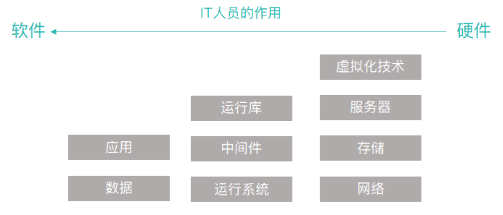
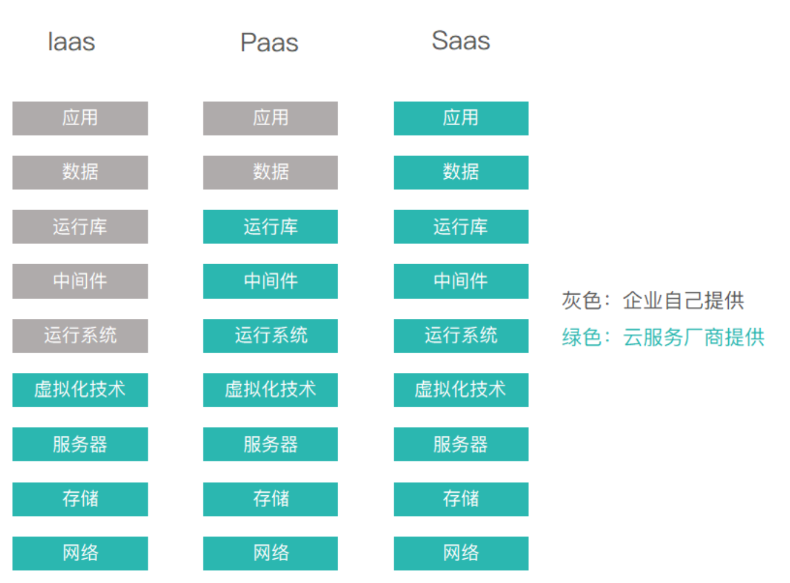

# 软件的本质

工程化——一个框架

过程化——方法工具化（例如多种UML工具）

**Standard Process**:？？？？

1. 需求调研——requirement specification规约说明书

软件：产品和产品交付载体的双重角色。

软件开发过程中需要：估算模型——需要多长时间，多少人，多少钱

error（交付之前）——> failure（交付之后，运行结果不符合顾客需求）

 failure可能是由于一个或多个error导致，且一个error可能导致多个failure

为了发现error：review评审技术 testing测试

运维：后期维护成本大

MS project——微软的一个工具可以估算工作量

## 定义软件

- 代码/程序：通过执行这些程序可以满足预期的特性和需求、功能。
- 数据结构：使得程序可以合理利用信息。
- 软件描述信息/规约：描述程序的操作、使用等。

硬件和软件的生命周期：

硬件：早期故障多（设计问题）最后期由于磨损问题

软件：失效上升可能是由于错误的扩展性，或者修复某个问题带来的副作用。

## 软件应用领域

软件分类：（各个类别可能有交叉）

- 系统软件：操作系统软件（应用软件运行在这之上）。
- 应用软件：解决特定需求的独立应用程序。
- 工程/科学软件：例如matlab
- 嵌入式软件：例如家电内部的，汽车内部的
- 产品线软件：为不同用户提供特定功能
- Web/移动App：
- 人工智能软件：机器人，博弈，模式识别（语音图像），自动驾驶，自然元素处理（文本）

## 遗留软件

1. 老旧的软件 
2.  不断变更以适应需求⸺变得臃肿 
3.  质量差，代码费解、⽂档混乱

由于数据难以移植，风险较大，所以很少选择重新开发。

遗留系统的演化原因：**（会考！！！）**

- 需要进行适应性调整
- 升级以实现商业需求
- 扩展使得可以与更多的系统交互
- 架构需要重新部署来适应新环境（例如下面以前没有mobile）

（前端）web     mobile

中间层n个接口

后端/服务端（后端内部子系统有很多交互）

现在主流的架构已经从SOA架构转向MS架构（独立配置，耦合性低）

# 软件的变更本质

## WebApp

## 移动App

## 云服务***

**1.基础设施即服务 (IaaS ： Infrastructure as a Service)**

把计算基础(服务器、网络技术、存储和数据中心空间)作为一项服务提供给客户。它也包括提供操作系统和虚拟化技术、来管理资源。消费者通过Internet可以从完善的计算机基础设施获得服务。

**2.平台即服务(PaaS：Platform as a Service）**

PaaS实际上是指将软件研发的平台作为一种服务，供应商提供超过基础设施的服务，一个作为软件开发和运行环境的整套解决方案，即以SaaS的模式提交给用户。因此，PaaS也是SaaS模式的一种应用。但是，PaaS的出现可以加快SaaS的发展，尤其是加快SaaS应用的开发速度。

虚拟化，对设备、存储虚拟化，同时负责监控、预测、管理、决策。

**3.软件即服务 (SaaS：Software as a Service)**

是一种交付模式，其中应用作为一项服务托管，通过Internet提供给用户;帮助客户更好地管理它们的IT项目和服务、确保它们IT应用的质量和性能，监控它们的在线业务。

本地部署：相当于在家自己做
IaaS：买好速食披萨回家做着吃
PaaS：打电话叫外卖将披萨送到家里
SaaS：在披萨店吃披萨

另一个回答：

中间的这些，就是利用最右边的基础设施搭建出的平台，从而承载最左边的【应用】和【数据】。

不是所有企业都具有独立开发一个软件的资本（钱、人、力缺哪个都不行）。

所以，云服务产生了。

## 产品线软件

