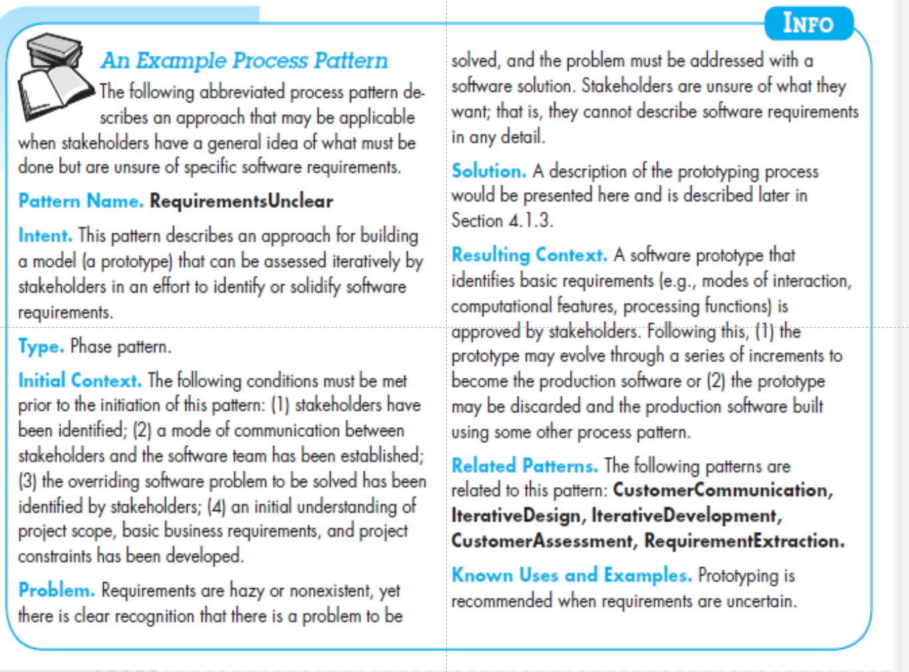

# 3.1 通用过程模型

standard process??

线性

迭代

演化：迭代，螺旋上升

并行：comm和plan并行推进

# 3.2 定义框架活动

针对特定的问题，开发人员和利益相关者，哪些动作适合与框架活动？

例如communication activity中最重要的action打电话，包含的task set为

3和4存在迭代

# 3.3 明确任务集

9.29 satrt

需要选择最能满足最适合开发团队特点的task set

下图是communication阶段的一个action：elicitation

7 用户场景：use case图

9 增量交付：第一次交付发现问题，再改进再次交付（迭代）

11 法律限制、权限限制

上面的步骤并不是线性的，是迭代进行的

**非功能需求：non-function**

1. **性能需求**

   算法，后台架构，数据库设计（冗余，将访问频率最高的表放在不同的table space里），微服务调用依赖关系，前后API接口，前端本身（要适当分担一些后端的任务）

2. **安全需求**

   加密方式？

coding这个activity的action：看成一个action

1. understand component design：理解详细设计
2. 找到核心复杂算法，定义数据结构，完成算法逻辑
3. 选择特定的IDE，并且实现代码
4. 自测试（做好了unit testing甚至可以裁掉）
5. 重构
6. SQA：software quality assurance 检查日志规范、接口、变量名
7. review：group review
8. code finish：0工作量

# 3.4 过程模式

本章最重要 process patterns——一般是公司内部管理

patterns：已证实有用的，抽象成一个模板步骤

代码变量不能用拼音

## process patterns的描述模板

### Pattern name

名字，英语

### Force 环境

所需要的实施环境，硬件，网络，版本管理工具

### Type 三种类型

1. stage pattern ：解决和activity相关的
2. task pattern：指action或者task的
3. phase pattern：the sequence of framework activities，涉及到整个的框架，各种activity都会涉及

### Initial Context

实施启动条件——之前的活动？进入状态？

### Problem

这个模式能解决什么问题

### Solution

如何实现？

### Resulting Context

接口，就是一个出口条件，那些信息能够提交给接下来的

### Related Pattern

有同级的也有上下级关系

### 已知example：

prototype medol：phase pattern帮助搞清需求，过程模型的一种，是一个迭代的模型。做需求，给大家看，再改，再迭代。

调研需求很重要！！！

## 一个实例

BS和CS

- BS:(Browser/Server,浏览器/服务器模式),web应用 可以实现跨平台，客户端零维护，但是个性化能力低，响应速度较慢。
- 
- 
- CS:(Client/Server,客户端/服务器模式),桌面级应用 响应速度快，安全性强，个性化能力强，响应数据较快
- 
- 

# 3.5 Process Assessment& Improvement

对做的过程进行评估&改进

ISO：International Standard Organization

CMM/CMMI

CMMI的全称为Capability Maturity Model Integration，即能力成熟度模型集成。CMMI是CMM模型的最新版本。

**是一个软件开发过程的质量的评估改进的框架**

## CMM

实施CMM的企业很多

CMM是由美国卡内基梅隆大学软件工程研究所1987年研制成功的，是国际上最流行最实用的软件生产过程标准和软件企业成熟度等级认证标准。

其所依据的想法是：只要集中精力持续努力去建立有效的软件工程过程的基础结构，不断进行管理的实践和过程的改进，就可以克服软件生产中的困难。

五个级别：

要达到什么level就要把那个level的KPA以及前面的做到最好。——staged model阶段式模型框架

连续式框架：continues，持续改进，慢慢提高的过程，并不是在这一级就做到最好。

## CMM1：Initial

无政府状态

## CMM2：Repeatable

评估师，主任评估师——给项目做评估

可重复级：做的很多东西、经验可以在其他项目重复使用，例如git配置管理。

KPA：key process area 关键过程域——告诉我们what to do

How to do：1.指南或者模板   2.tools工具   3.监控（做的怎么样）

课后作业：自己研究MS project工具

## CMM3：Defined

定义级

对项目再adjusted & tailor

tailor：delete/edit/modify

七个KPA：

1. 组织过程聚焦：对过程进行全面建模
2. 对过程进行定义：对过程tailor
3. Training Program培训计划：业务培训。例如写高铁，高铁调度啊都要学。
4. 集成的项目管理：配制管理员不可能一直在做配置管理。对零散的工作也要会处理。
5. 产品工程：针对不同的用户和时间做管理，都有模板工具监控
6. 协同开发：很多人一起开发，如何merge、协调
7. 与同行对比：review（大家一起检查代码）

需求工程：requirement elimination+requirement modeling

得到两个归约：Rs，RAs  specification

数组下标，指针什么的，在review中很难发现，很可能到单元测试才能发现

## CMM4：Managd

1. 质量管理：在整个开发过程中，all review的成本+revoke返工 成本+测试成本（unit intergration+？ ）
2. 定量管理：缺陷的数量，规模size，工作量，schedule（工作具体安排，MS project）

项目知识库：假设199个项目。有一个项目发现了100个缺陷，其中由于需求工程引起的有十个。则占总的8%。

现在要做第200个项目——要求：需求归约达到公司平均水平/要提升2%。——》how to do? 要管理

质量管理主要是对缺陷管理

LoC：lines of code 最早的项目规模评估依据，现在不用了——因为现在很多复用和继承。现在用Function Point / Use Case Point（FP/UCP）

## Optimizing

1. Process Changing  Management：
2. Technology CM：例如开发用sql server，后来发现不行要换
3. Defect Prevention：找root cause——eg 是详细设计还是概要设计出了问题。通过这个，缺陷数下降，质量提高。

ISO的评估适用于contract project

# 总结

