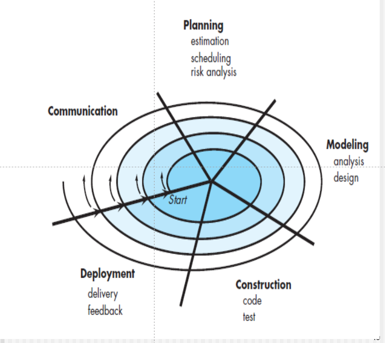

过程模型：

迭代程度：迭代层次（回到这层，上一层）

# 瀑布模型

## 特点

1. 按照general/standard process顺序开发，很少迭代：planing是umbrella可以去掉
2. 过程明确，需求清晰
3. 不主张迭代，但也有迭代
4. 用户需要很长时间才能得到成品
5. 某阶段受阻，整个项目都会到blocking states

也叫线性、顺序liner，sequential。因此是一个很经典的模型。

如果需求更改不多，可以使用

## V-model

左——》右：箭头表示以什么什么为依据（单元测试以代码和详细设计为依据）

详细设计ComDes需要流程图，接口，所以使用drawer单元测试。因此单元测试是以CD为基础

对某个代码进行单元测试，需要写几个drawer（每个相当于一个简单的主函数），有对应源代码的输入接口，有输出。作用：1，提供输入界面； 2，提供调用功能  3，返回并显示结果

每个drawer做的任务都很小

InteTest

一个可能做得好，合在一起不一定

AD：概要设计 high level desgin

三个主要组成

1，软件体系结构设计，2，数据库的设计，3，接口设计

systest

已经集成完毕，放在一个真实的系统中进行测试（考虑环境，比如网络、设备等等）

待整理路由

这个V不完整，上面的Rm包括两部分 ：

requirements model

1.  Requirement elicitation需求调研：得到结果是Requirement Specification（需求归约，为主），有文字描述+use case图
2.  requirement analysis modeling：得到结果是Requirement Analysis Specification（sp第三阶段，通过activity图来抽象系统的流程）

AT：验收测试

# 增量过程模型

incremental

特点：

1. 项目主要需求明确（可以先发布核心功能）
2. 每一次增量都是一个mini瀑布模型
3. 每个增量之间可能存在stagger（交错）和parallel
4. 每一次发布都是完全能运行的版本，第一次是核心版本（core product），后续是增强

为什么用

1. 瀑布开发时间太长了
2. 先占领市场
3. 技术原因（新技术还没搞出来，所以先发布没这个技术的部分）

# 演化过程模型

evolutionary model

evolutionary：是迭代演化的

对很大的项目，线性不行，而增量模型的第一版周期可能也很长

市场要求。需求细节不断深入了解增加。

## 原型模型

prototype medol：( phase pattern ) <u>**帮助搞清需求**</u>，过程模型的一种，是一个迭代的模型。做需求，给大家看，再改，再迭代。

使用情况：需求不清楚/需求在特定环境（特定的操作系统、数据库、网络）运行不确定是否合适

在需求清楚之后可以使用其他开发模型例如瀑布或者增量继续开发。

paradigm：model泛型

fuzzy：模糊的

## 螺旋模型

spiral model特点：

1. 适合大项目
2. 风险比较高的项目：每一圈跟踪风险
3. 需求经常变更的项目
4. 要求迭代

每一圈都可以用不同的model

每圈的交点都是arc point milestone

重点；

