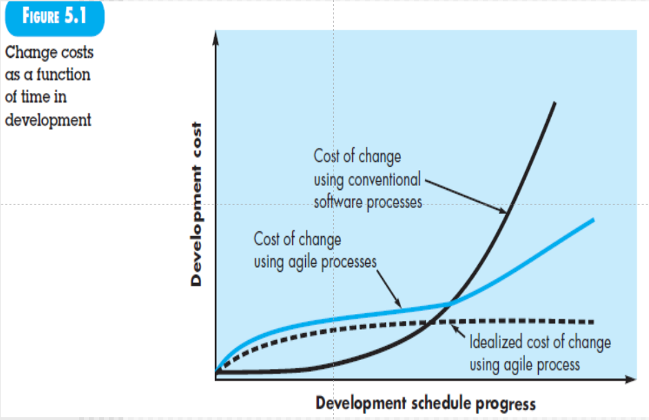
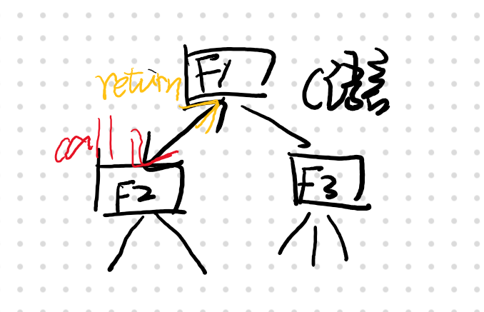

# Agile概念

适应需求、技术不断地变化

1. 看重团队结构、协作态度
2. 快速交付，不看重中间产品
3. 可使用非正式的开发方法，中间建模尽量简单
4. 和利益相关者在一个敏捷开发团队（命运共同体），roles、responsibility随时调整

横坐标：开发过程中需求不断变化

虚线：需求变化控制在一个理想范围内

蓝色：上升的一个重要原因——regression testing回归测试（这一版和上一版本的修改会有牵连——相关用例）

5.3要看，会提问

# XP极限编程extreme programming

重要！:arrow_down_small:

适合比较大，周期长，风险高的项目

## planning

用户故事：这里story就是requirement，描述将要开发的软件所需要的输出、特性以及功能。故事的单位unit是use case。

权值/优先级value：给故事划分优先级priority，选优先级高的在本次迭代实现

Acceptance test：验收测试，主要看客户需求，需求归约。可以做测试用例的设计（虽然还没code，但需求明确就可以做）

Iteration plan：迭代计划关注两个方面——duration + mini-milestone

## design

> **CRC (Class-Responsibility-Collaborator) **卡建模是一种简单且有效的面向对象的分析技术。XP中用于确定与当前软件增量相关的类。
>
> 它由三部分组成： 
>
> 1. **类 (Class) ：**一个类代表许多类似的对象。而类名在CRC卡的顶部。 
> 2. **职责 (Responsibility)** ：职责是类的方法和属性 （用户的姓名生日）。类需要知道或做的任何事物。这些职责是类自身所知的知识，或类在执行时所知的知识。
> 3. **协作 (Collaborator) ：**协作是类和其他类有交互。指为获取消息，或协助执行活动的其他类。在特定情形下，与指定的类按一个设想共同完成一个(或许多)步骤。例如我需要知道你的成绩，需要getGPA，那么我们俩就有协作关系。

提取业务类====》抽象子系统====》确定调用关系（抽象类负责交互（接口类））

九个类，三个子系统，互相之间可能有调用。

第一次要划分子系统

每一次迭代需要把新增加的类的调用关系标记出来

最终得到软件的体系结构图（模块结构图）（一个树）《体系结构设计、数据库设计、接口设计》

非面向对象的架构：

Spike：某个算法特别复杂，应该拿出来做特定环境下的验证

## coding

团队不是直接开始code，而是先开发包含所有故事的单元测试

refactoring重构，自反，为了代码的质量

pair programming结对编程，尤其是关键性的复用性高的项目。两个人一起写，一起查，一起review

continuous integration集成测试，结对编程之后需要和团队其他人的集成起来

smoking testing：功能基本可以实现，最初来源于汽车行业（保证发动机冒烟）

## test

以类做单元测试，写一个脚本，把类放进去，直接等结果

continues inter：集成测试

# Scrum

适合迭代周期小的，最多4周。  

见pdf文档

