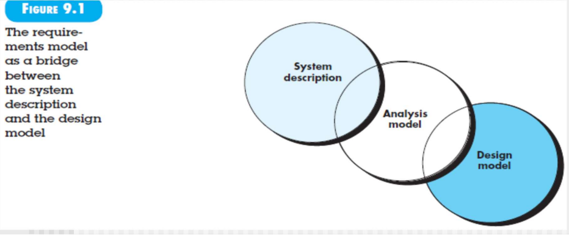
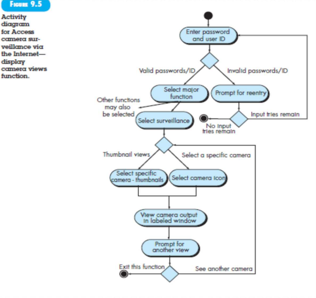
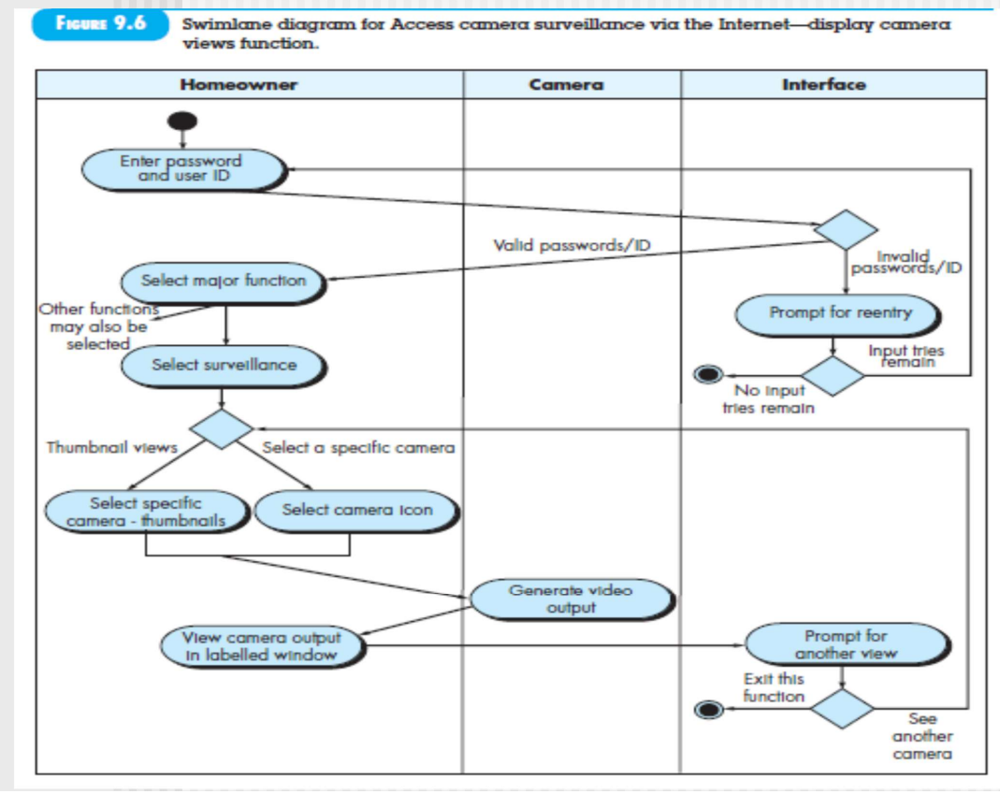

这一章主要讲需求建模和功能建模

use case/activity/swim lane——如何从功能角度细化use case图

# 9.1 REQUIREMENTS ANALYSIS

从左上到右下：客户需求——》需求归约+需求分析归约——》设计建模

Domain Analysis：找到通用的业务类，提取出来定义方法属性。类似pattern
（that are broadly applicable so that they may be reused. /used by many people working on similar but not necessarily the same applications）（属于是umbrella activity：为了提高生产质量）

# 9.2 SCENARIO-BASED MODELING

# 9.3 UML MODELS THAT SUPPLEMENT THE USE CASE

## Activity Diagram

## Swimlane Diagram

两个异常情况就有两个sequence diagram

类图回来再构建swimland

