[TOC]

# 考题类型

答题的时候，简答题，要答到点子上。

六个大题，做快一点

1选择题（10*3，基本上是多选题）

2（10分）分析题

3（10分）分析题

4（10分）举例分析题

5 （10分）看图分析题

6 （30分）应用题：一页纸的需求，把需求看懂，别急着做。

第一小题：构建use case图
第二小题：定义某个类的状态图
第三小题：构建类图，分析类图。提取类之间的聚合、关联、依赖关系。
第四小题：选择两个业务类组件进行详细设计。定义属性方法。最好将某个类的某个方法用活动图展示一下更好。
第五小题：非功能需求

# ch1 软件的本质

## 1.1.1 定义软件

- 代码/程序：通过执行这些程序可以满足预期的特性和需求、功能。
- 数据结构：使得程序可以合理利用信息。
- 软件描述信息/规约：描述程序的操作、使用等。

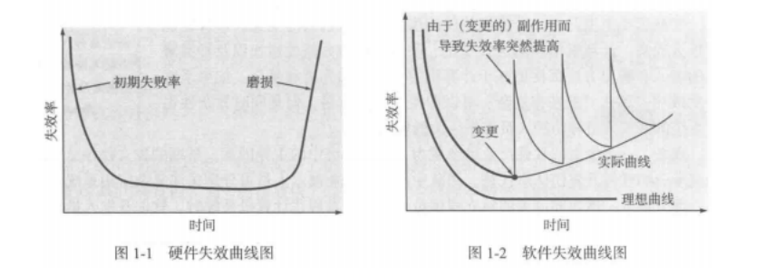

硬件：早期故障多（设计问题）最后期由于磨损问题

软件：失效上升可能是由于错误的扩展性，或者修复某个问题带来的副作用。

## 1.1.2 软件分类

- 系统软件：操作系统软件（应用软件运行在这之上）。
- 应用软件：解决特定需求的独立应用程序。
- 工程/科学软件：例如matlab
- 嵌入式软件：例如家电内部的，汽车内部的
- 产品线软件：为不同用户提供特定功能
- Web/移动App：
- 人工智能软件：机器人，博弈，模式识别（语音图像），自动驾驶，自然元素处理（文本）

## 1.1.3 遗留软件:a:

legacy software 

1. 老旧的软件 
2. 不断变更以适应需求⸺变得臃肿 
3. 质量差，代码费解、⽂档混乱

由于数据难以移植，风险较大，所以很少选择重新开发。

遗留软件特点：生命周期长、业务关键性、质量差

遗留系统的演化原因：

- 需要进行适应性调整
- 升级以实现商业需求
- 扩展使得可以与更多的系统交互
- 架构需要重新部署来适应新环境（例如下面以前没有mobile）

## 1.2.3 云服务:a:

**1.基础设施即服务 (IaaS ： Infrastructure as a Service)**

把计算基础(服务器、网络技术、存储和数据中心空间)作为一项服务提供给客户。它也包括提供操作系统和虚拟化技术、来管理资源。消费者通过Internet可以从完善的计算机基础设施获得服务。

**2.平台即服务(PaaS：Platform as a Service）**

PaaS实际上是指将软件研发的平台作为一种服务，供应商提供超过基础设施的服务，一个作为软件开发和运行环境的整套解决方案，即以SaaS的模式提交给用户。

主要功能为：对虚拟机池资源状态进行**监测、预警、优化决策。**

因此，PaaS也是SaaS模式的一种应用。但是，PaaS的出现可以加快SaaS的发展，尤其是加快SaaS应用的开发速度。

虚拟化，对设备、存储虚拟化，同时负责监控、预测、管理、决策。

**3.软件即服务 (SaaS：Software as a Service)**

是一种交付模式，其中应用作为一项服务托管，通过Internet提供给用户;帮助客户更好地管理它们的IT项目和服务、确保它们IT应用的质量和性能，监控它们的在线业务。

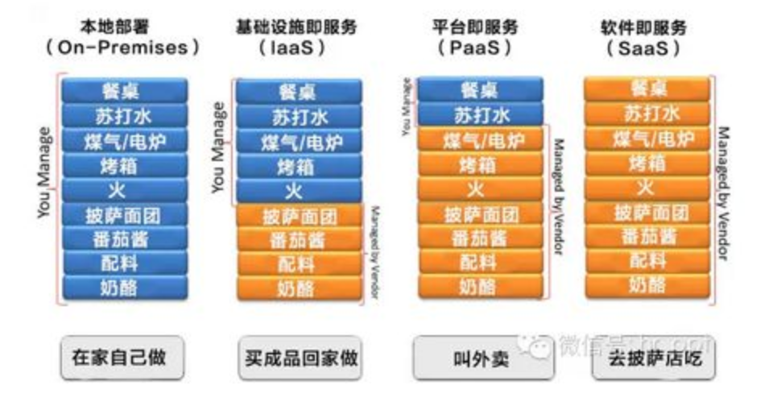

# ch2 软件工程

## 2.1 软件工程的定义:a:

软件工程是：1）将系统化的、规范的、可量化的方法应用于软件的开发、运行和维护，即将工程化方法应用于软件；2）对1中所述方法的研究。

## 2.2 软件过程Process

软件过程是工作产品构建时所执行的一系列活动、动作和任务的集合。

活动(activity)主要实现宽泛的目标(如与利益相关者进行沟通)，与应用领域、项目大小、结果复杂性或者实施软件工程的重要程度没有直接关系。

动作(action,如体系结构设计)包含了主要工作产品(如体系结构设计模型)生产过程中的一系列任务。

任务( task)关注小而明确的目标，能够产生实际产品(如构建一个单元测试)。

## 2.2.1 过程框架

1. comunication：requirement modeling

2. Planing：umbrella 

3. Modeling：archtecture & componet desgin

4. Construction：coding & testing

5. Deployment：dilivery & mantainance & feedback

软件工程的通用过程框架定义了五种框架活动——沟通、 策划、建模、构建以及部署。此外,一系列普适性活动——项目跟踪控制、风险管理、质量保证、配置管理、技术评审以及其他活动一贯穿软件过程始终。

**沟通**的过程中是与利益相关者进行沟通，获取产品的需求。

**策划**则是根据所有已有的和已收集到的信息进行策划筛选为下一步建模做准备。

**建模**阶段则对具体的需求进行建模和设计，这一阶段将对软件进行详细的建模，为构建构成的代码实现提供基础。

**构建**过程则是根据建模实现整个系统，包括对系统的编码和测试。以便于生成一个可运作的原型系统部署交付给用户。

**部署**阶段，则将系统交付给用户评估，由用户给出具体的反馈意见。

## 2.2.2 普适性活动 Umbrella activity:a:

<u>**Umbrella activity和Framework activity有什么关系？？**</u>

**软件工程过程框架活动由很多普适性活动来补充实现。通常，这些普适性活动贯穿软件项目始终，以帮助软件团队管理和控制项目进度、质量、变更和风险。**

​		导致changing的三个原因：1）correct纠错、2）适应性修改：法律 adapt、3）enhance：增加性能，功能增强

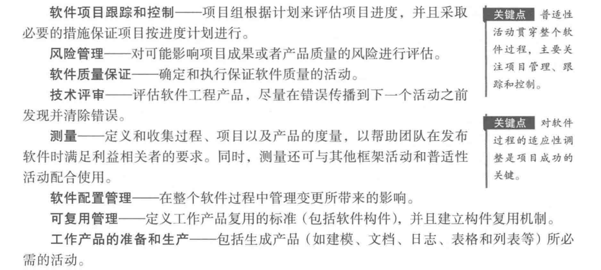

# ch3 软件过程结构

Standard process:

Requirement Elistation==》Requirement Analysis Modeling==》Architecture Design（High Level Design）Modelinf==》Component Design Modeling==》Coding ==》Unit testing==》Intergration testing==》System testing==》Acceptance testing==》Delivery

## 3.1 Process flow

线性过程流和迭代过程流：

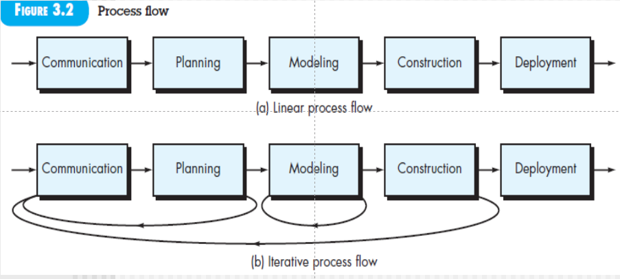

演化过程流和并行过程流：

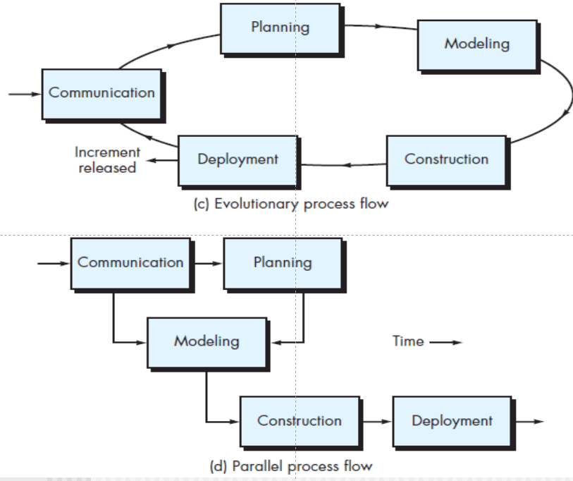

## 3.4 过程模式 Process Pattern:a:

Pattern name 模式名称

Force 环境驱动力

Type 类型

> stage pattern步骤模式：解决和activity相关的、task pattern。比如建立沟通。
>
> task pattern任务模式：指action或者task的。比如需求收集。
>
> phase pattern阶段模式：the sequence of framework activities，涉及到整个的框架，各种activity都会涉及）。比如螺旋模型和原型开发。

Initial Context 启动条件

Problem 解决的问题

Solution 解决方案

Resulting Context 执行后的结果（出口条件，那些信息能够提交给接下来的）

Related Pattern 相关模式

Example 已知应用和实例

## CMM

**CMM1：Initial 初始级**

无政府状态

**CMM2：Repeatable 可重复级**

评估师，主任评估师——给项目做评估

可重复级：做的很多东西、经验可以在其他项目重复使用，例如git配置管理。

KPA：key process area 关键过程域——告诉我们what to do

How to do：1.指南或者模板   2.tools工具   3.监控（做的怎么样）

**CMM3：Defined 已定义级 **

定义级

对项目再adjusted & tailor

tailor：delete/edit/modify

**CMM4：Managd 已管理级** 

1. 质量管理：在整个开发过程中，all review的成本+revoke返工 成本+测试成本（unit intergration+？ ）
2. 定量管理：缺陷的数量，规模size，工作量，schedule（工作具体安排，MS project）

**CMM5：Optimizing 优化级** 

1. Process Changing  Management：
2. Technology CM：例如开发用sql server，后来发现不行要换
3. Defect Prevention：找root cause——eg 是详细设计还是概要设计出了问题。通过这个，缺陷数下降，质量提高。

# ch4 过程模型:a:

这一章考题多

## 4.1.1 瀑布模型&V模型

> **特点：**
>
> 1. 按照general/standard process顺序开发，很少迭代：planing是umbrella可以去掉
> 2. 过程明确，需求清晰
> 3. 不主张迭代，但也有迭代
> 4. 用户需要很长时间才能得到成品
> 5. 某阶段受阻，整个项目都会到blocking states

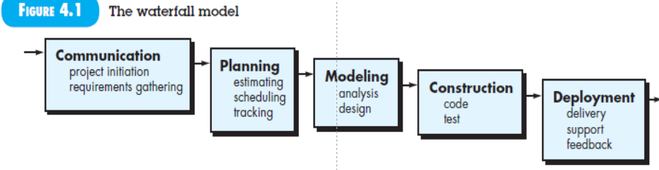

V-model是瀑布模型的一个变体

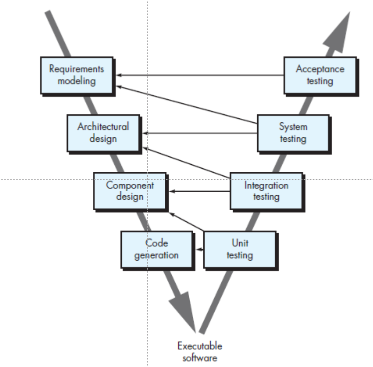

箭头指向谁表示表示以谁为依据（单元测试以代码和详细设计为依据）

## 4.1.2 增量过程模型

Incremental model

特点：

1. 项目主要需求明确（可以先发布核心功能）
2. 每一次增量都是一个mini瀑布模型
3. 每个增量之间可能存在stagger（交错）和parallel
4. 每一次发布都是完全能运行的版本，第一次是核心版本（core product），后续是增强

为什么用

1. 瀑布开发时间太长了
2. 先占领市场
3. 技术原因（新技术还没搞出来，所以先发布没这个技术的部分）

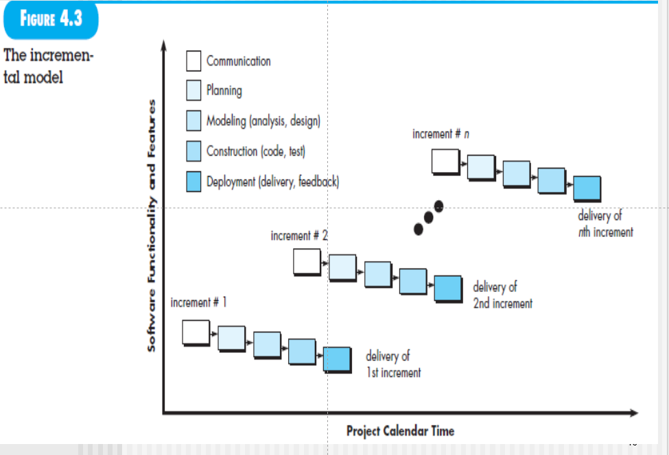

## 4.1.3 演化过程模型

Evolutionary：是迭代演化的

对很大的项目，线性不行，而增量模型的第一版周期可能也很长

市场要求。需求细节不断深入了解增加。

1）**原型模型prototype medol**

prototyping paradigm：( phase pattern ) <u>**帮助搞清需求**</u>，过程模型的一种，是一个迭代的模型。做需求，给大家看，再改，再迭代。

采用原型开发可以快速产生一个原型并不断迭代，可以帮助开发人员理解需求，并不断迭代演化，直至开发出满足用户需求的产品。

paradigm是泛型，意思就是model

使用情况：需求不清楚/需求在特定环境（特定的操作系统、数据库、网络）运行不确定是否合适。

<u>**在需求清楚之后可以使用其他开发模型例如瀑布或者增量继续开发。**</u>(不能通过原型模式开发一个完整的项目，它只负责搞清楚需求)

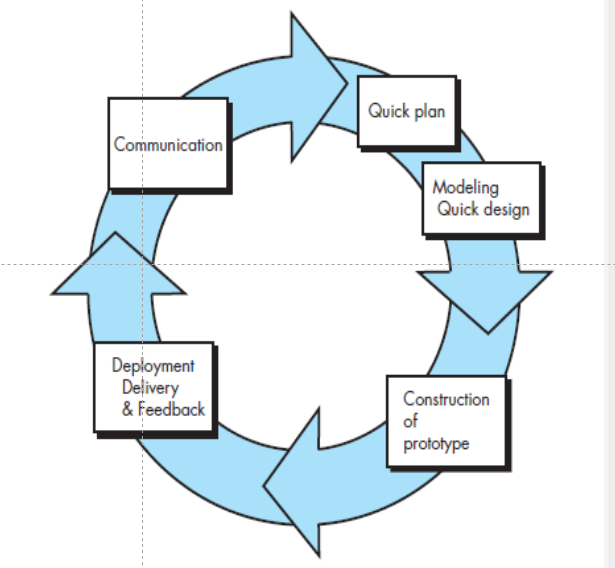

2）**螺旋模型** Spiral model

Spiral model特点：

1. 适合大项目
2. 风险比较高的项目：每一圈跟踪风险
3. 需求经常变更的项目
4. 要求迭代

每一圈都可以用不同的model，每圈的交点milestone

# ch5 敏捷开发

## 5.1-5.3 敏捷

适应需求、技术不断地变化

1. 看重团队结构、协作态度
2. 快速交付，不看重中间产品
3. 可使用非正式的开发方法，中间建模尽量简单
4. 和利益相关者在一个敏捷开发团队（命运共同体），roles、responsibility随时调整

横坐标：开发过程中需求不断变化

虚线：需求变化控制在一个理想范围内

蓝色：上升的一个重要原因——regression testing回归测试（这一版和上一版本的修改会有牵连——相关用例）

## 5.4 极限编程 :a:

eXtreme Programming：包含策划、设计、编码和测试。适合比较大，周期长，风险高的项目。

**planning**

用户故事：这里story就是requirement，描述将要开发的软件所需要的输出、特性以及功能。故事的单位unit是use case。

权值/优先级value：给故事划分优先级priority，选优先级高的在本次迭代实现

Acceptance test：验收测试，主要看客户需求，需求归约。可以做测试用例的设计（虽然还没code，但需求明确就可以做）

Iteration plan：迭代计划关注两个方面——duration + mini-milestone

**design**

> **CRC (Class-Responsibility-Collaborator) **卡建模是一种简单且有效的面向对象的分析技术。XP中用于确定与当前软件增量相关的类。
>
> 它由三部分组成： 
>
> 1. **类 (Class) ：**一个类代表许多类似的对象。而类名在CRC卡的顶部。 
> 2. **职责 (Responsibility)** ：职责是类的方法和属性 （用户的姓名生日）。类需要知道或做的任何事物。这些职责是类自身所知的知识，或类在执行时所知的知识。
> 3. **协作 (Collaborator) ：**协作是类和其他类有交互。指为获取消息，或协助执行活动的其他类。在特定情形下，与指定的类按一个设想共同完成一个(或许多)步骤。例如我需要知道你的成绩，需要getGPA，那么我们俩就有协作关系。

提取业务类====》抽象子系统====》确定调用关系（抽象类负责交互（接口类））

九个类，三个子系统，互相之间可能有调用。

第一次要划分子系统

每一次迭代需要把新增加的类的调用关系标记出来

最终得到软件的体系结构图（模块结构图）（一个树）《体系结构设计、数据库设计、接口设计》

非面向对象的架构：

Spike：某个算法特别复杂，应该拿出来做特定环境下的验证

**coding**

团队不是直接开始code，而是先开发包含所有故事的单元测试

refactoring重构，自反，为了代码的质量

> 可以在以下面对代码进行重构： 
>
> 1.重命名：对类，接口，方法，属性等重命名，以使得更易理解
>
> 2.抽取代码：将方法内的一段代码抽取为另一个方法，以使得该段代码可以被其他 方法调用，这是重构中很重要很常用的，此举可以极大的精炼代码，减少方法的 代码行数 
>
> 3.封装字段：将类的某个字段转换成属性，可以更加合理的控制字段的访问 （类如银行的分局号也为一个属性，卡号是另一个属性，用户只访问卡号）
>
> 4.抽取接口：将类的某些属性，方法抽取组成个接口，该类自动实现该接口
>
> 5.提升方法内的局部变量为方法的参数：这主要是在写代码的过程中会使用到 
>
> 6.删除参数：将方法的一个或多个参数删掉 
>
> 7.重排参数：将方法的参数顺序重新排列

pair programming结对编程，尤其是关键性的复用性高的项目。两个人一起写，一起查，一起review

continuous integration集成测试，结对编程之后需要和团队其他人的集成起来

smoking testing：功能基本可以实现，最初来源于汽车行业（保证发动机冒烟）

**test**

以类做单元测试，写一个脚本，把类放进去，直接等结果

continues integration：集成测试

## 5.5.1&附件 Scrum :a:

**Scrum定义和目的**

Scrum 是一个敏捷开发框架，是一个增量的、迭代的开发过程。在这个框架中，整 个开发周期包括若干个小的迭代周期，每个小的迭代周期称为一个 Sprint，每个 Sprint 的建议长度 2 到 4 周。

- 增量+迭代的开发过程
- 首要目的：尽早、持续交付有价值的软件

**角色**

- product owner：PO
- scrum master：SM
- team：团队

**Work products**

- 故事列表backlog
- 发布燃尽图burn down chart

**Scrum过程**

- ⼀个开发周期分成多个Sprint（⼩的迭代周期），由backlog决定这个sprint做什么，最后交付⼀个增量。

**过程：**
  开发调研
  ⼯作量估算
  发布计划会议
  sprint计划会议
  sprint过程：每日站会
  sprint评审会议
  sprint回顾会议

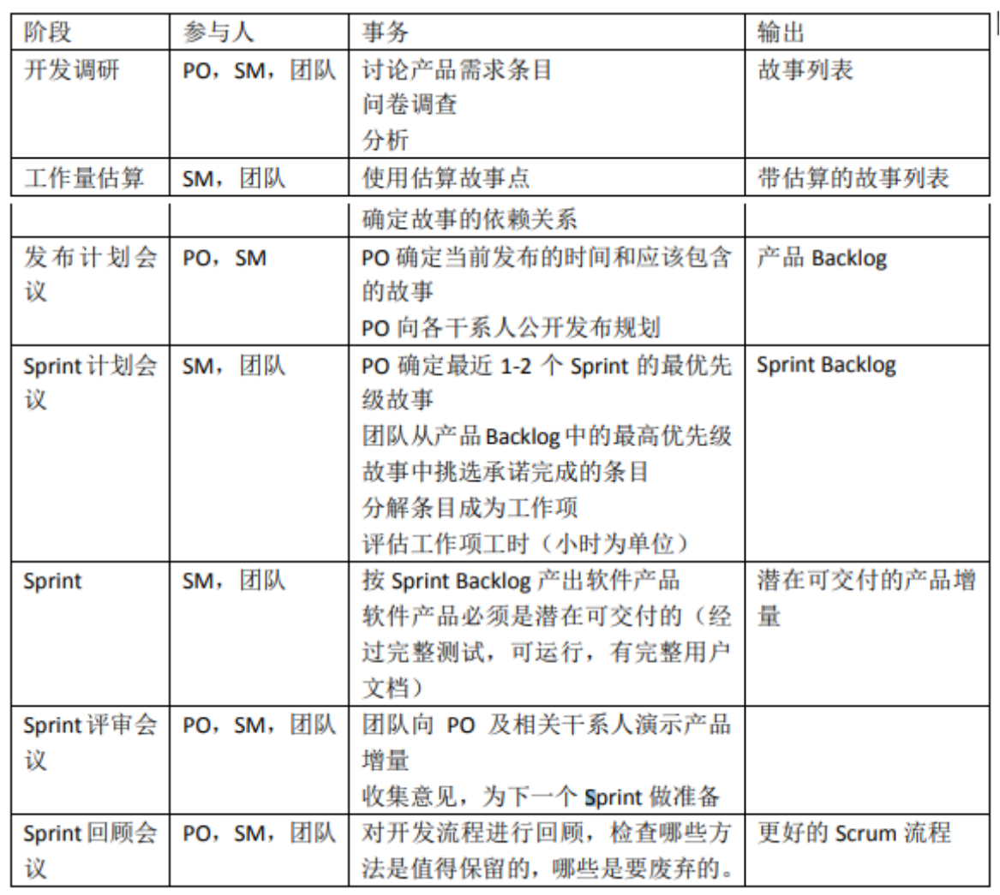

**待定项(backlog)：**项目需求或特性的优先级列表。待定项中可以随时加入新项(这就是变更的引入)。产品经理根据需要评估待定项并修改优先级。

**冲刺(sprint)：**由一些工作单元组成，是达到待定项中定义的需求所必需的，并且必须能在预定的时间段( time-box)内(一般情况下为30天)完成。冲刺过程中不允许有变更(例如积压工作项)。冲刺给开发团队成员的工作提供了短期但稳定的环境。

**Scrum例会：**团队每天召开的短会。每个人都回答三个问题：上次例会后做了什么、遇到了哪些困难、下次例会前计划做什么。

**演示：**一向客户交付软件增量， 为客户演示所实现的功能并由客户对其进行评价。演示不需要包含所有功能，但是规定该时间段内的可交付功能必须完成。

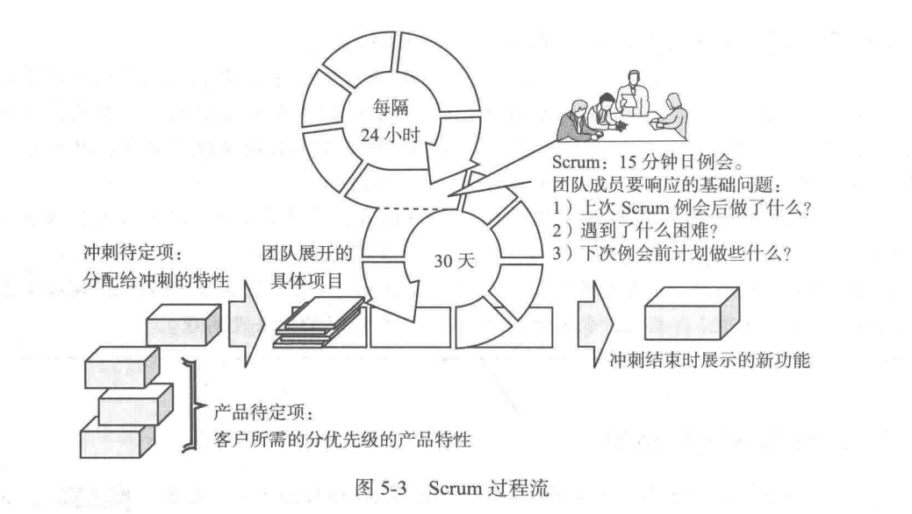

# chX 指导原则

这部分中文教材里没找到

见笔记ch7指导原则，看一遍。

软件工程半衰期：software development knowledge has a 3-year half life:half of what you need to know today will be obsolete within 3 years. 

每个人员都要关注项目的这些方面：

① Interfaces：user/Internal/external 系统与外界的接口、组件间的接口、人机交互接口

> 接口设计有三个重要的元素：（1）用户界面；（2）和其他系统、设备、网络、信息生成者或者使 用者的外部接口；（3）各种设计构件之间的内部接口；

② Conventions and templates: Pattern
③ Layering: 例如MVC，层次抽象
④ Algorithmic complexity.
⑤ Hashing.
⑥ Caching.
⑦ Concurrency.
⑧ Cloud computing.
⑨ Relational databases.

# ch7理解需求 RE

中文教材ch7 对应英文教材&笔记ch8 requirement elistation

Requirements engineering 包括七个task: inception, elicitation,elaboration, negotiation, specification, validation, and management. 七个之间可能存在并行关系。

## 需求工程七个步骤

**1）启动Inception：**明确项目要解决的问题，构建团队和协调机制

**2）诱导Elicitation：**先写出一两页需求，讨论后补充需求；创建用例图、系统架构

**3）Elaboration 细化：**expand and refine

开始做Requirement Analysis Modeling

解析每个用户场景以提取分析类。定义了每个分析类的属性，并确定每个类所需的服务。确定了类之间的关系和协作，并产生了各种补充图。

类建模：对于离散的对象研究归属聚合继承等关系。

行为建模：（事件驱动是指ATM机、打印机等）状态图（附件资料ATM）。大多数系统没有系统级别的状态图，但每个类会有状态图，是类方法定义的基础。

**4）Negotiation 协商：**相关人员对需求进行优先级排序

**5）Specification 明确：**可以用文档、图表等确定

**6）Validation 校验：** examines the specification to ensure that all software requirements have been stated unambiguously 检查规范，以确保所有的软件需求都已明确声明。常用方法：technical review

**7）Management管理：**of activities that help the project team identify,control, and track requirements and changes to requirements at any time as the project proceeds.在项目进行过程中，帮助项目团队识别、控制和跟踪需求以及需求变更的活动

# ch8 基于场景需求建模 RAM(1)

对应英文教材&笔记ch9 requirement analysis modeling(1)

从左上到右下：客户需求——》需求归约+需求分析归约——》设计建模

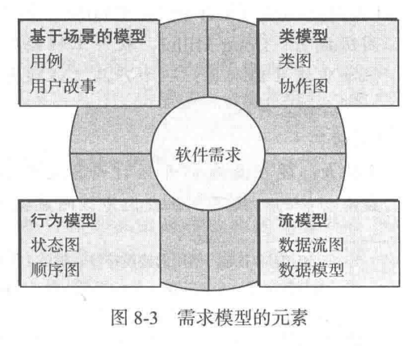

## 8.1.3 领域分析Domain Analysis:a:

Domain Analysis：找到通用的业务类，提取出来定义方法属性。类似pattern
（that are broadly applicable so that they may be reused. /used by many people working on similar but not necessarily the same applications）（属于是umbrella activity：为了提高生产质量）

目标：查找特定领域广泛应用的设计类和设计模式，以便能够复用。

软件域分析是指**识别、分析和详细说明**某个**特定应用领域的共同需求**，特别是那些在该应用领域内**被多个项目重复使用**的..... (面向对象的域分析是)在某个特定应用领域内，根据通用的对象、**类、部件和框架**，识别、分析和详细说明公共的、可复用的能力。

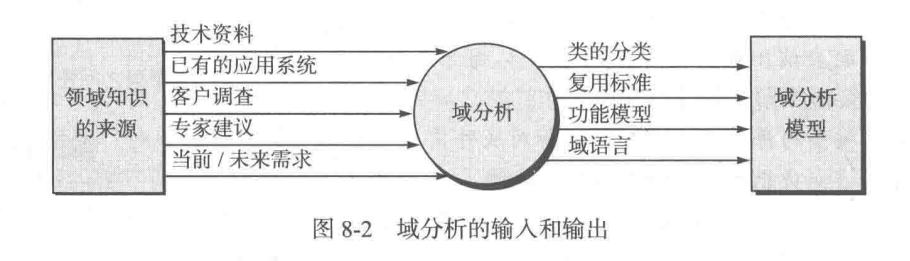

## 8.2.3 用例图 :a:

书本P85

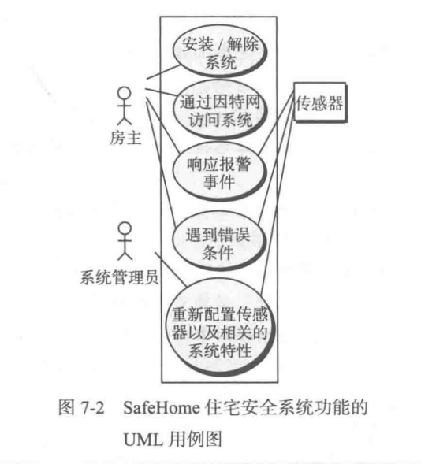

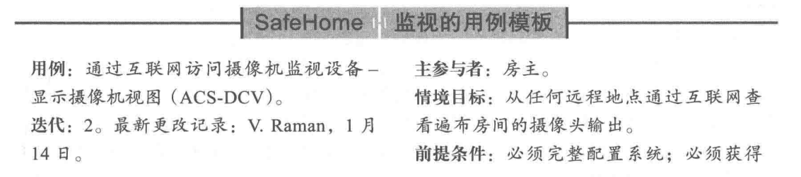

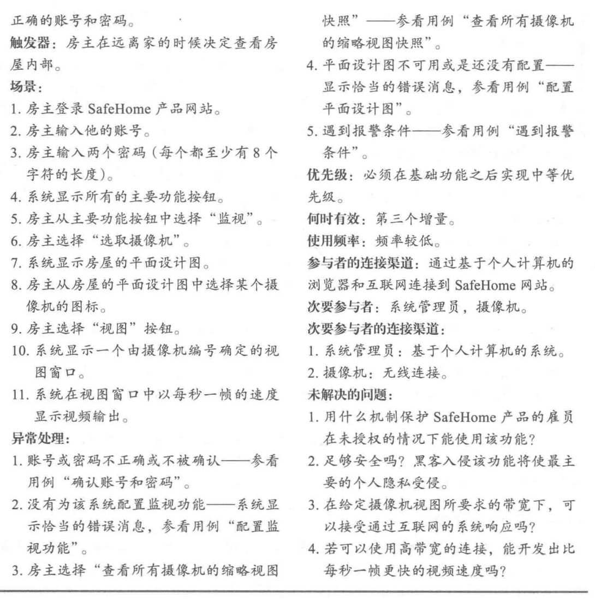

​		用例图主要回答了两个问题：1、是谁用软件。2、软件的功能。

<u>**包含关系 include**</u>

包含关系描述的是一个用例需要某种功能，而该功能被另外一个用例定义，那么在用例的执行过程中，就可以调用已经定义好的用例。

它有助于将来实现系统时，确定哪些功能可以重用，在编写代码时就可以实现代码的重用，缩短开发周期。

- 如果两个以上用例有大量一致的功能，则可以将这个功能分解到另一个用例中，其他用例可以和这个用例建立包含关系（如之前介绍的饮料自动售货机）。
- 一个用例的功能太多时，可以使用包含关系建立若干个更小的用例。（如学生管理系统的用例图）

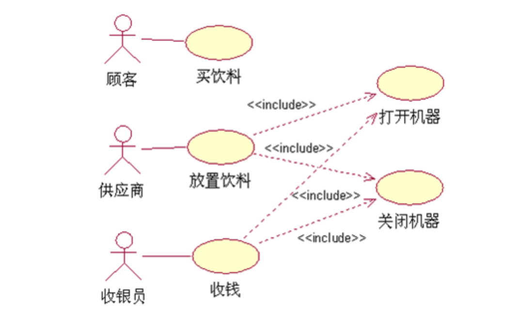

图书管理员处理借书或者还书时的用例图，借书与还书都要考虑是否有overtime的书。

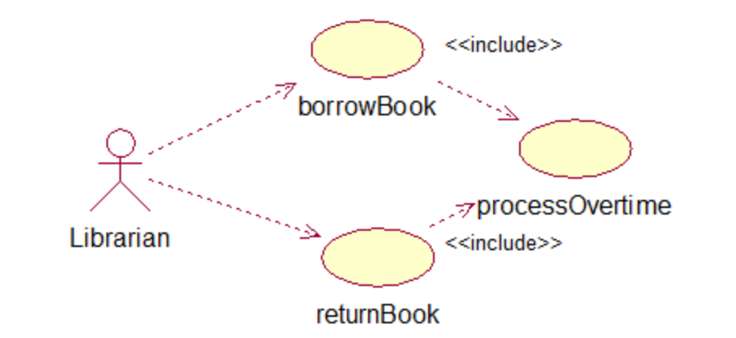

<u>**扩展关系 extend**</u>

用一个用例（可选）扩展另一个用例（基本例）的功能。将一些常规的动作放在一个基本用例中，将可选的或只在特定条件下才执行的动作放在它的扩展用例中。

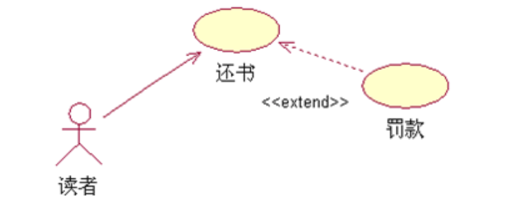

一个use case一个活动图，每个活动图对应多个时序图（登录成功，登录失败）

## 8.3.1 活动图

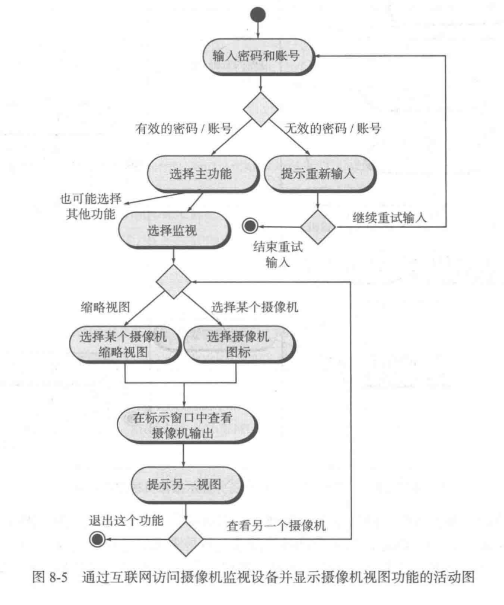

## 8.3.2 泳道图

UML泳道图是活动图的一种有用的变形，表示用例所描述的活动流，同时指出哪个参与者或分析类负责由活动矩形所描述的活动。每个类职责由纵向分割图中的并行条表示。三种分析类一房主、摄像机和接口一对于图8-5所表示的活图。

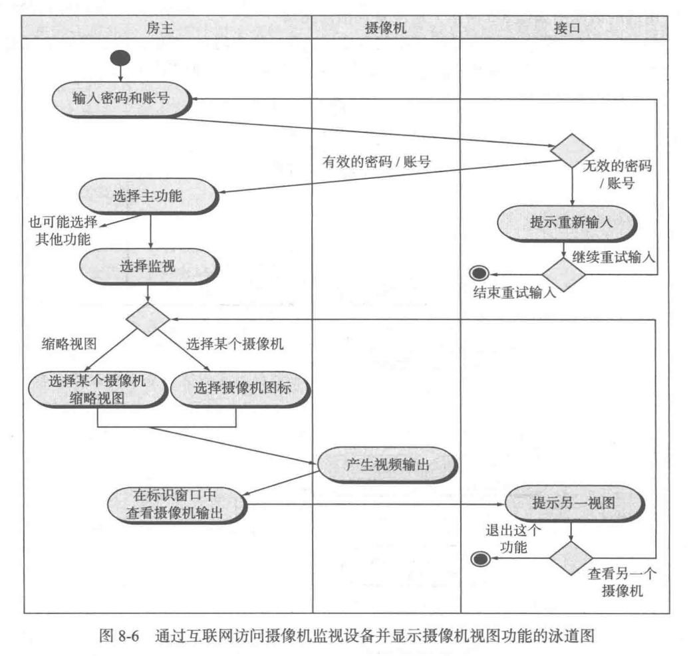

# ch9 基于类需求建模RAM(2):a:

对应英文教材&笔记ch10

黑色：方法。 	蓝色：属性。

## 类图构建

类图构建完了再构建swimlane（一个swimlane对应一个use case）

根据用例图抽象成类，描述类的内部结构和类与类之间的关系，是一种静态结构图。

常见的有以下几种关系: 泛化/继承（Generalization）, 实现（Realization），关联（Association)，聚合（Aggregation），组合（Composition），依赖(Dependency)。

强弱顺序： 泛化/继承 = 实现 > 组合 > 聚合 > 关联 > 依赖

>  权限 属性名：类型 [ = 默认值 ]
>
>  private：-
>  public：+
>  protected：#
>  default：~
>
>  权限 方法名称 (参数列表 ) [ : 返回类型]

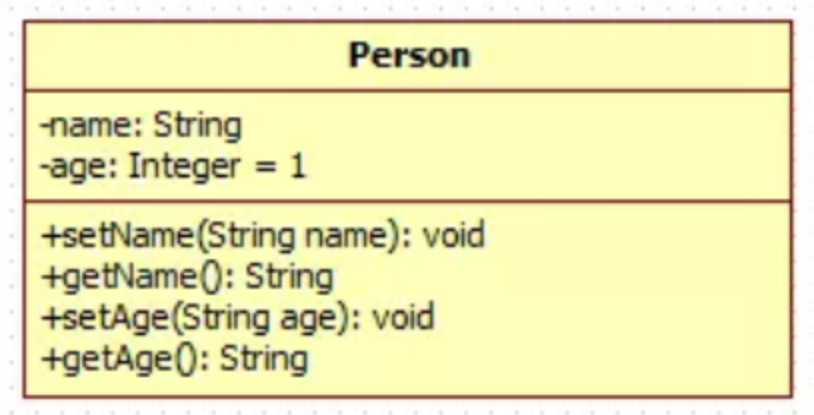

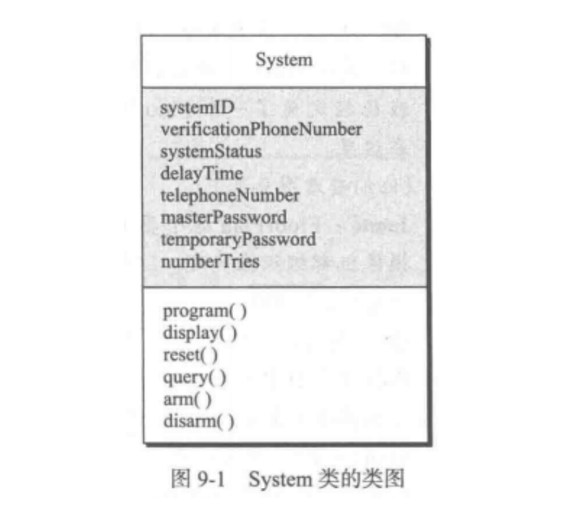

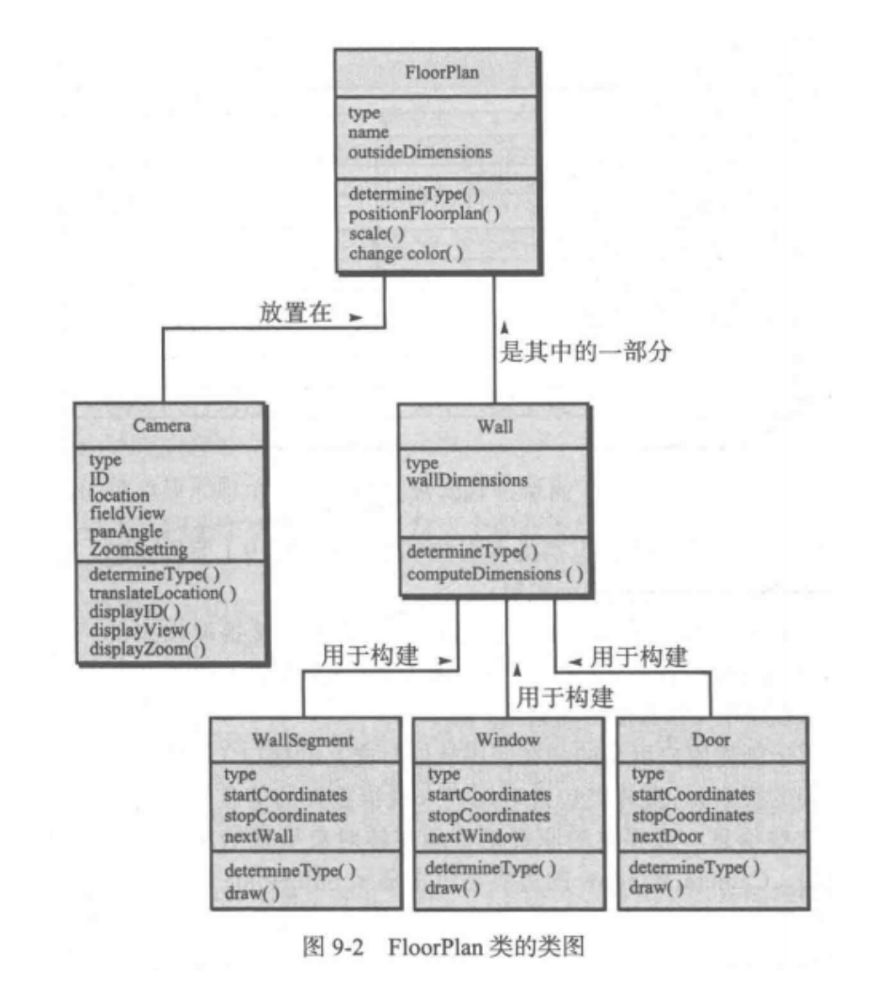

## 类的分类

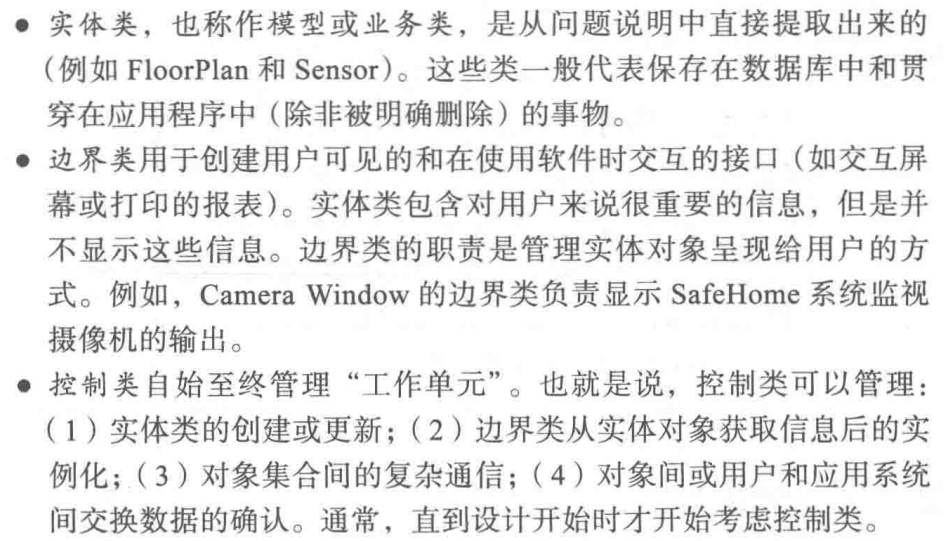

**entity实体类**

​    实体类是用于对必须存储的信息和相关行为建模的类。实体对象（实体类的实例）用于保存和更新一些现象的有关信息，例如：事件、人员或者一些现实生活中的对象。实体类通常都是永久性的，它们所具有的属性和关系是长期需要的，有时甚至在系统的整个生存期都需要。

​    实体类的找寻相对简单点，这里就不再做具体的叙述了。

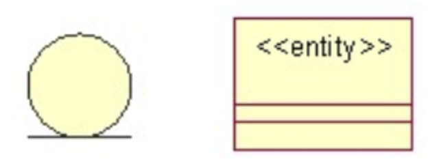

**boundary边界类**

 边界类是系统内部与系统外部的业务主角之间进行交互建模的类。边界类依赖于系统外部的环境，比如业务主角的操作习惯、外部的条件的限制等。它或者是系统为业务主角操作提供的一个GUI，或者系统与其他的系统之间进行一个交互的接口，所以当外部的GUI变化时，或者是通信协议有变化时，只需要修改边界类就可以了，不用再去修改控制类和实体类。业务主角通过它来与控制对象交互，实现用例的任务。

​		边界类调用用例内的控制类对象，进行相关的操作。

​		一个系统可能会有多种边界类：

- **用户界面类** - 帮助与系统用户进行通信的类

- **系统接口类** - 帮助与其他系统进行通信的类

- **设备接口类** - 为用来监测外部事件的设备（如传感器）提供接口的类

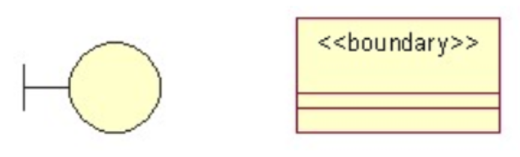

**control控制类**

​    控制类用于对一个或几个用例所特有的控制行为进行建模，它描述的用例的业务逻辑的实现，控制类的设计与用例实现有着很大的关系。在有些情况下，一个用例可能对应多个控制类对象，或在一个控制类对象中对应着对个用例。它们之间没有固定的对应关系，而是根据具体情况进行分析判断，控制类有效将业务逻辑独立于实体数据和边界控制，专注于处理业务逻辑，控制类会将特有的操作和实体类分离，者有利于实体类的统一化和提高复用性。

   当业务主角通过边界类来执行用例的时候，产生一个控制类对象，在用例被执行完后，控制类对象会被销毁。

   控制类的特点：

- 独立于环境

- 和用例的实现关联

- 使用关联实体类，操作实体类对象

- 专注于业务逻辑的实现

  当然如果用例的逻辑较为简单，可以直接利用边界类来操作实体类，而不必再使用控制类。或者用例的逻辑较为固定，业务逻辑固定不会改变。也可以直接在边界类实现该逻辑。

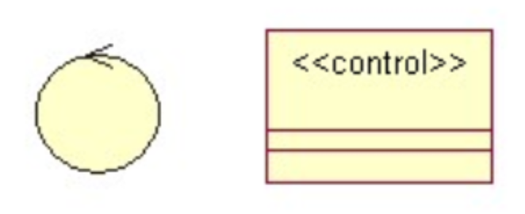

## 类的关系

**泛化（继承）关系**

定义：是一种继承关系，表示一般与特殊的关系

表示形式：子类指向父类。实线三角形头

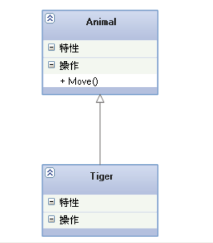

**实现关系**

定义：是一种类与接口的关系，表示类是接口所有特征和行为的实现。

表示形式：虚线三角形箭头，类指向接口

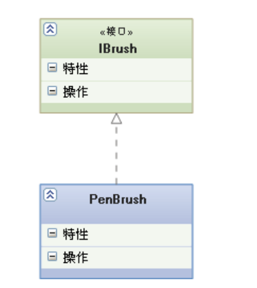

**关联关系**

定义：是一种拥有的关系，它使一个类知道另一个类的属性和方法；如：老师与学生，丈夫与妻子关联可以是双向的，也可以是单向的。双向的关联可以有两个箭头或者没有箭头，单向的关联有一个箭头。

表示形式：实线（箭头）

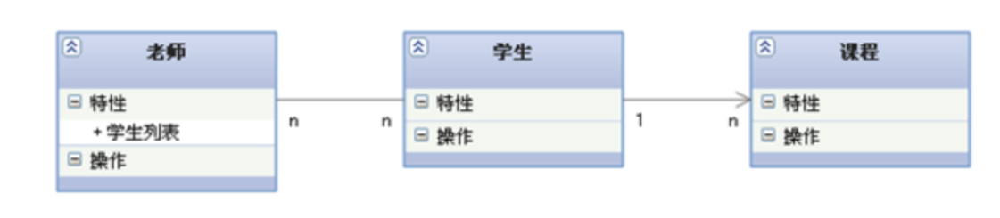

**聚合关系**

定义：是整体与部分的关系，且部分可以离开整体而单独存在。如车和轮胎是整体和部分的关系，轮胎离开车仍然可以存在。

聚合关系是关联关系的一种，是强的关联关系；

表示形式：空心菱形实线箭头，箭头指向部分

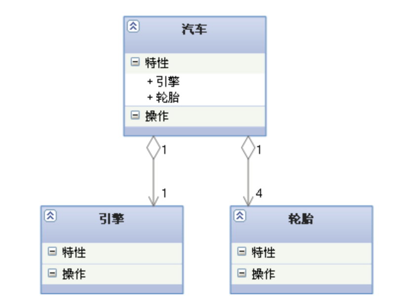

**组合关系**

定义：是整体与部分的关系，但部分不能离开整体而单独存在。

表示形式：实心菱形实线箭头，箭头指向部门。组合关系是关联关系的一种，是比聚合关系还要强的关系，它要求普通的聚合关系中代表整体的对象负责代表部分的对象的生命周期。

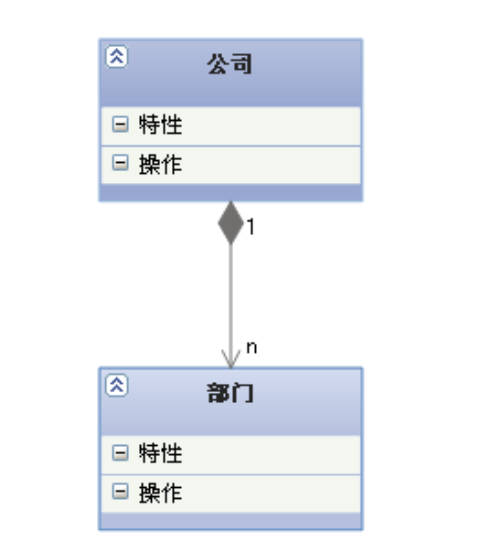

**依赖关系**

定义：是一种使用的关系，即一个类的实现需要另一个类的协助，所以要尽量不使用双向的互相依赖

表示形式：带箭头的虚线，指向被使用者       

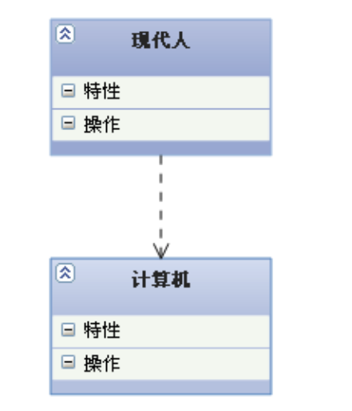

例子：

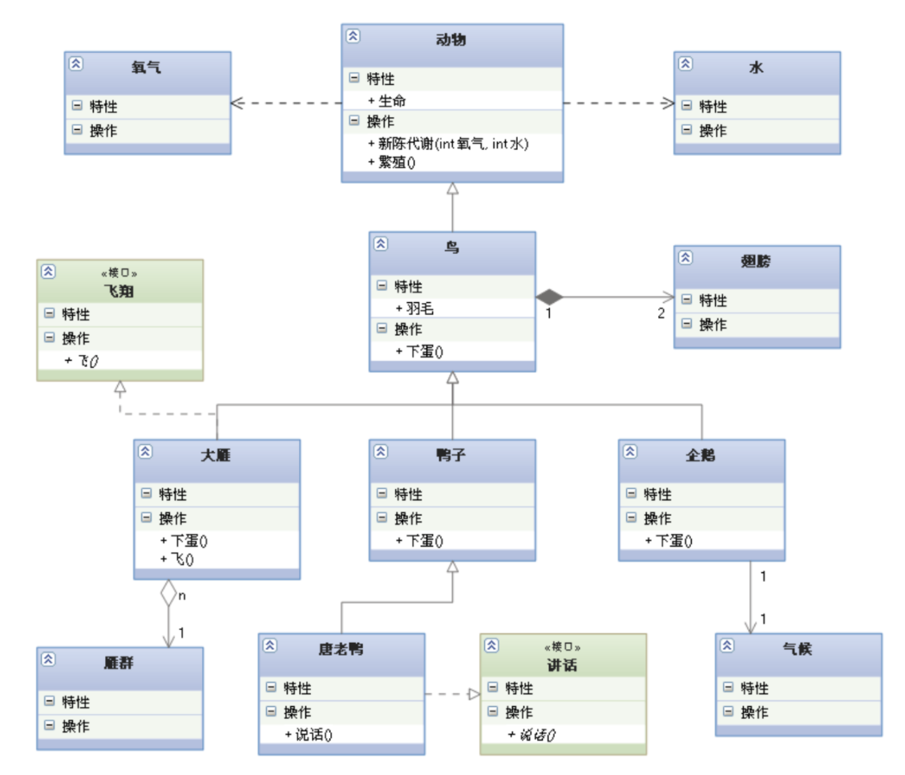

# ch10 基于行为模式需求建模RAM(3)

对应英文教材&笔记ch11

## 状态图:a:

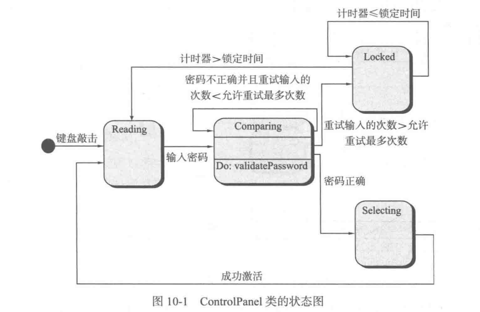

箭头上面的是事件，蓝色是状态。考试必考7-8分。

Key hit按键盘事件发生，开始读密码

Reading：调用读密码的方法（图上没写出来）（最好加一个自反方法：不断读密码）

compare：比较，调用验证方法

locked：如果密码出错超过一定次数锁定

selecting：选择操作，回到显示状态（例如显示启动成功）

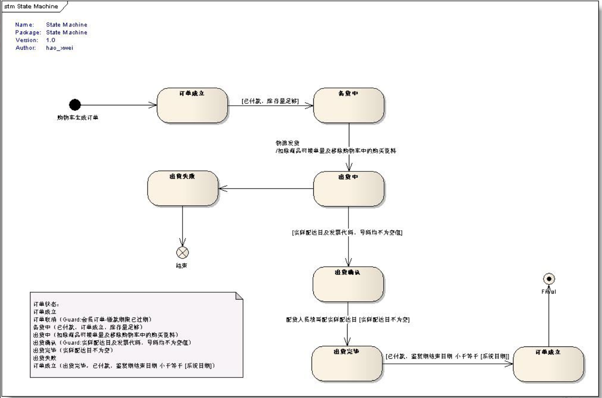

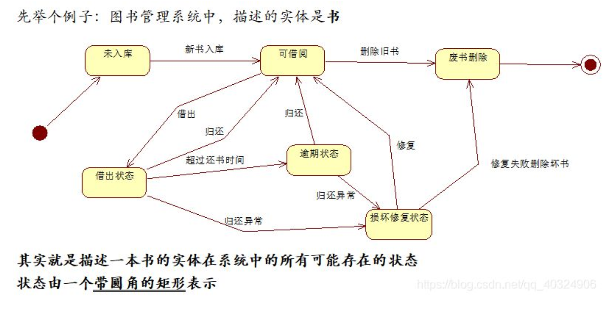

## 顺序图

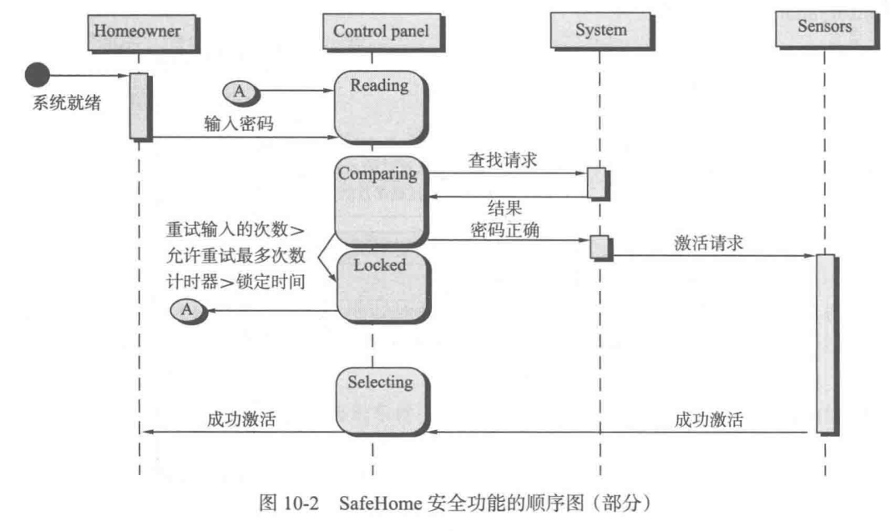

## 前端分析建模

> 黑体字来自以前的学长整理的笔记，引用部分来自dqfPPT

Content model内容建模：要找到内容对象， 可能是文本，图片，声音。 这些对象可能有树状的关系,按一下就到一个界面，然后到另一个界面，最后到叶子，最开始是root, 最下层就是leaf。对象是嵌套的。

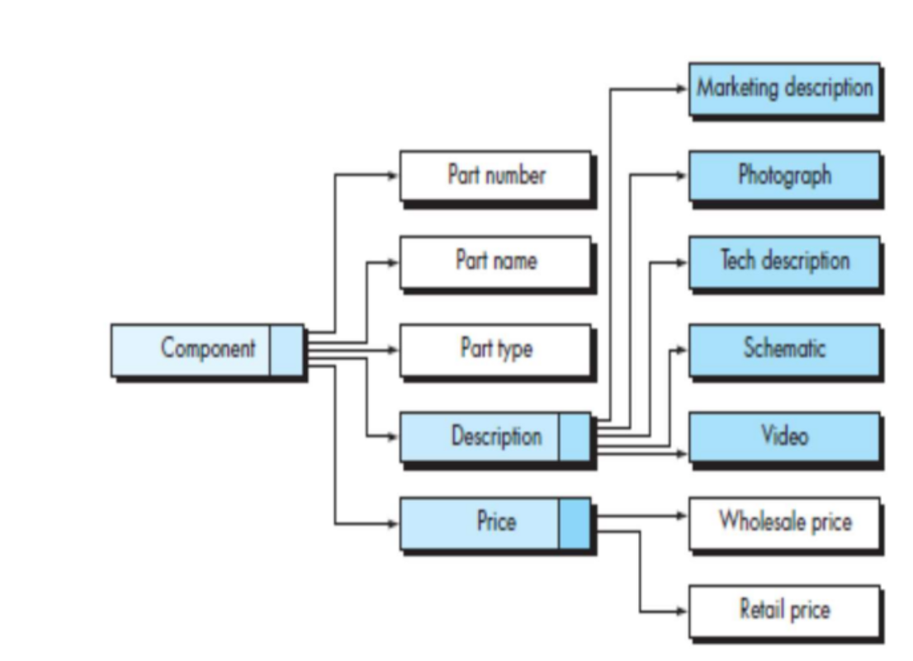

> PPT中标红&举例的部分：
>
> 通过检查对内容的直接和间接引用的场景描述，可以从用例直接确定内容对象。
>
> 例如，一个支持SafeHome的WebApp在www.safehomeassured.com上建立。一个用例: Purchasing Select SafeHome Components，描述了购买SafeHome组件所需的场景，并包含下面的句子:
>
> 我将能够得到每个产品组件的描述性和定价信息。
>
> 在许多情况下，一个简单的内容对象列表，加上每个对象的简要描述，就足以定义必须设计和实现的内容的需求。
>
> 可以为由多个内容对象和数据项组成的任何内容创建数据树。此外，数据树是内容设计的基础。

Interaction model交互建模：首先要找到内容对象，不同的内容对象之间通过交互，完成不同的功能。交互建模借用时序图， 每个时序图的生命线不是对象了，可以理解为界面层。

> 感觉PPT没讲什么
>
> 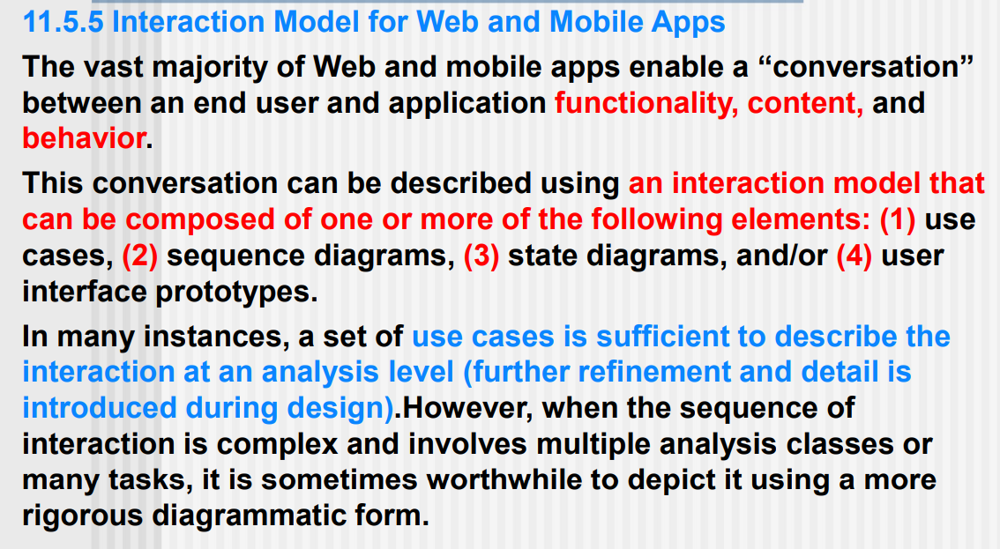
>
> 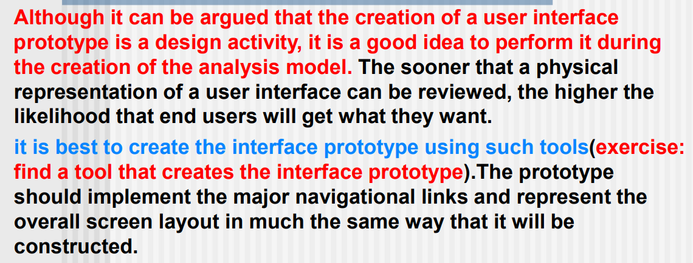

Functional model功能建模：要实现功能的逻辑是什么，例如退货，首先要找到订单，如果订单没有过期就可以退，首先要通过退货的活动图，把退货功能的流程图画出来，然后找到退货功能要涉及到哪些内容对象的交互。活动图又用到了。

> PPT中标红&举例的部分：
>
> 无论功能的广度如何，都应该分析功能需求，并在必要时建模。
>
> 用户可观察的功能包括由用户直接发起的任何处理功能。例如，一个金融移动应用程序可能实现各种金融功能(例如，计算抵押贷款支付)。这些函数实际上可以使用分析类中的操作来实现。
>
> 这些操作操作类的属性，并且涉及到类之间的协作，以完成一些必需的行为。

Navigation model导航建模：内容对象放在一起，形成一个内容对象流,就是导航建模，完成一个特定的功能。

> 导航通常局限于相对简单的按钮列表和基于图标的菜单。
>
> 对于WebApps和越来越多的基于平板电脑的移动应用程序来说，导航建模更加复杂，并且经常考虑每个用户类别将如何从一个WebApp元素(例如，内容对象)导航到另一个。

# ch11 设计概念

对应英文教材&笔记ch12

软件设计在软件工程过程中属于核心技术，并且它的应用与所使用的软件过程模型无关。一旦对软件需求进行分析和建模，软件设计就开始了。软件设计是建模活动的最后一个软件工程活动，接着便要进入构建阶段(编码和测试)。

## 需求建模和设计的关系

需求模型的每个元素(第8~ 10章)都提供了创建四种设计模型所必需的信息，这四种设计模型是完整的设计规格说明所必需的。软件设计过程中的信息流如图11-1所示。由基于场景的元素、基于类的元素和行为元素所表示的需求模型是设计任务的输入。使用后续章节所讨论的设计表示法和设计方法，将得到数据或类的设计、体系结构设计、接口设计和构件设计。

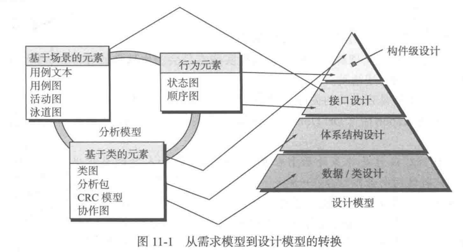

> the information domain，数据建模，主要是类图
> the functional domain, 功能建模，活动图，泳道图
> and the behavioral domain. Design，行为建模，状态图，时序图

**数据设计或类设计**（基于数据建模）将类模型(第9章)转化为设计类的实现以及软件实现所要求的数据结构。CRC图中定义的对象和关系，以及类属性和其他表示法描述的详细数据内容为数据设计活动提供了基础。在软件体系结构设计中也可能会进行部分类的设计，更详细的类设计则将在设计每个软件构件时进行。

**体系结构设计**（基于数据建模）定义了软件的主要结构化元素之间的关系、可满足系统需求的体系结构风格和模式以及影响体系结构实现方式的约束。体系结构设计表示可以从需求模型导出，该设计表示基于的是计算机系统的框架。

**接口设计**（基于行为建模和功能建模）描述了软件和协作系统之间、软件和使用人员之间是如何通信的。接口意味着信息流(如数据和控制)和特定的行为类型。因此，使用场景和行为模型为接口设计提供了大量的信息。

> 简单地说，接口是一组描述类的部分行为的操作，并提供了这些操作的访问方法。
>
> 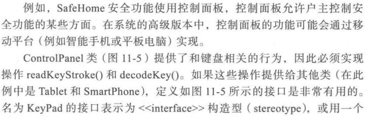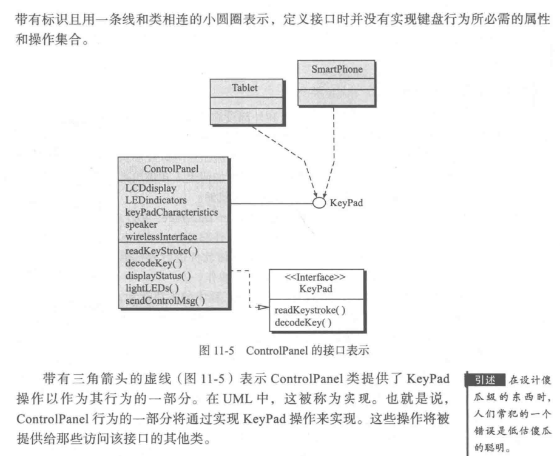

**构件级设计**（基于数据建模和行为建模）将软件体系结构的结构化元素变换为对软件构件的过程性描述。从基于类的模型和行为模型中获得的信息是构件设计的基础。

概要设计 = 软件架构设计+数据库设计+接口设计

# ch12 体系结构设计（概要设计）

对应英文教材&笔记ch13

## 三方面内容

1.软件体系结构设计，就是系统环境图中心的部分。类图的基础上构造子系统，增加控制接口类

系统体系结构：就是系统环境图，运行在什么环境里（上级系统），需要访问什么系统，同等级系统？前端系统？

2.数据库设计

数据库类设计

数据字典设计（交互，功能，导航）——输入什么东西，有哪些控件，数据组织？

3.接口设计：

内部接口：（每个类之间方法的调用，有什么形参shican，子系统类间的调用，有什么参数，参数类型）

外部接口设计：系统环境图里面上下级系统的访问，前后端controlor

用户接口user interface：界面也算接口

## 不同的风格

以数据为中心的体系结构

数据流体系结构

调用和返回体系结构

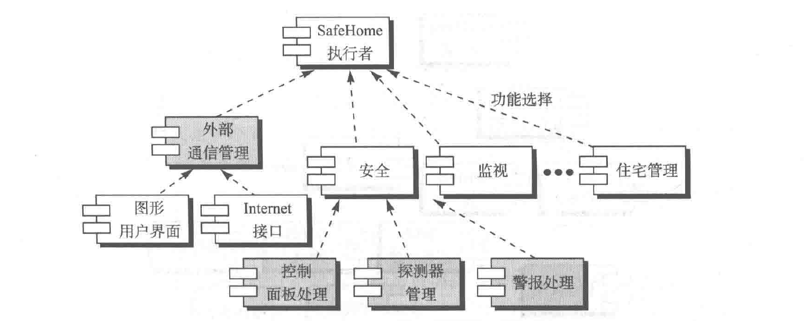

面向对象体系结构

层次体系结构

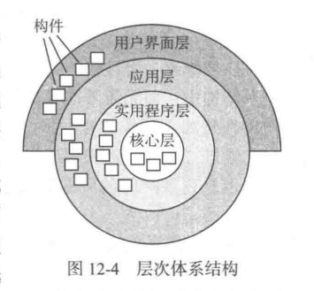

## 12.6 体系结构环境图

Architectural Context Diagram对软件与其外围实体的交互方式进行建模。

下面带阴影的方框是指接口，每一个外部实体都通过接口与目标系统进行通信。

一个例子：

# ch13 构件设计（详细设计）

对应英文教材&笔记ch14

什么是构件？
系统中模块化的、可部署的和可替换的部件，该部件封装了实现并对外提供一组接口。
由于构件驻留于软件体系结构的内部，因此它们必须与其他的构件和存在于软件边界以外的实体进行通信和合作。
在面向对象软件工程环境中，构件包括一个协作类集合。构件中的每 个类都得到详细阐述，包括所有属性和与其实现相关的操作。作为细节设 计的一部分，必须定义所有与其他设计类相互通信协作的接口。
为此，设 计师需要从分析模型开始，详细描述分析类(对于构件面言该类与问题域 相关)和基础类(对于构件而言该类为问题域提供了支持性服务)。 

每个类的方法和数据结构，详细逻辑算法，通信机制不知道——设计出来，以此为依据写代码。这张图展现了从分析类，到设计类，到详细设计的过程。

## 13.3 详细设计过程:a:

步骤一：识别问题域中的设计类

步骤二：确定基础设施类（需求分析的类图上没有这些东西）

> infrastructure基础设施类：前后端接口类，控制接口类，只有属性的常量类，只有方法的类（控制接口类，对数据库操作的类），界面类。

步骤三：细化类

- 定义接口，说明消息细节（类型等）
   一个例子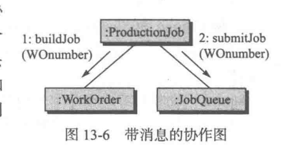
- 为每个构建确定适当接口
- 细化属性，定义属性和数据结构
   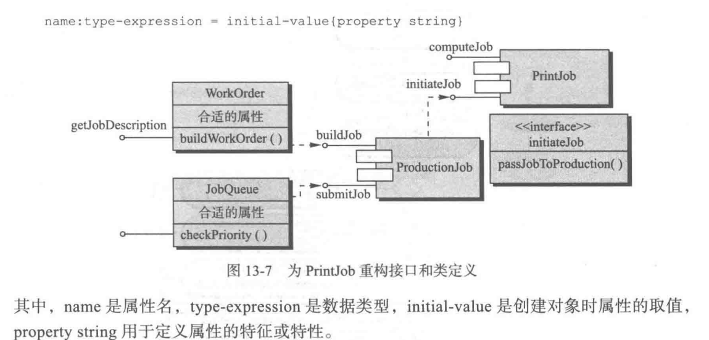
- 详细描述操作数据流
   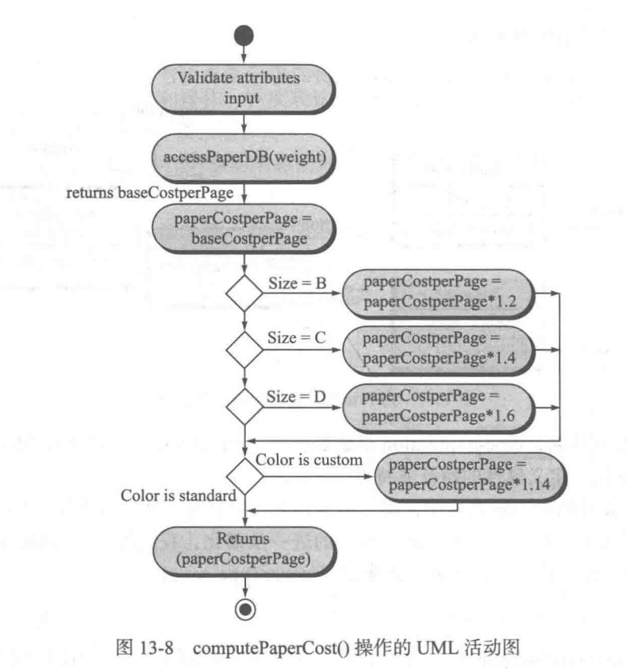

步骤四：说明持久数据源和管理这些数据源的类

步骤五：细化类和构件的行为表示

- 状态图：系统状态图（面向对象开发可能没有），每个类的状态图
- 看看状态图，检查类的方法属性有没有漏

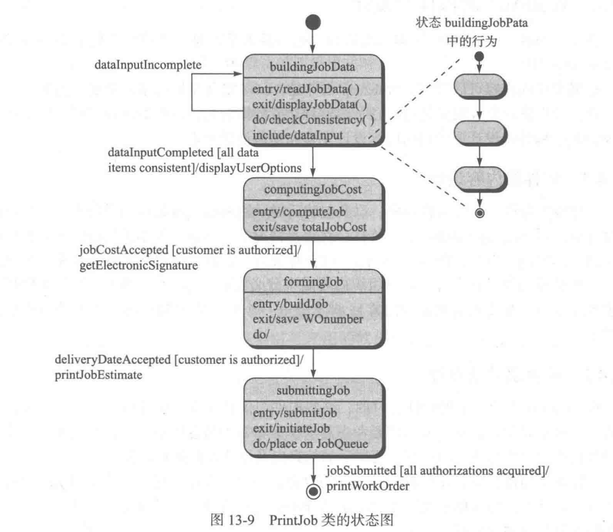

步骤六：细化部署图（配置图）

 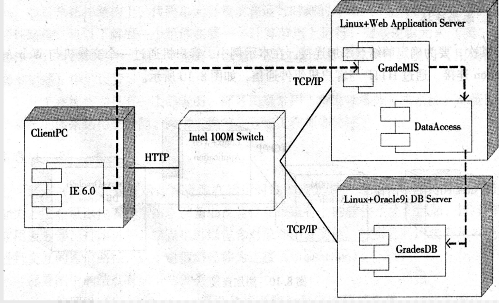
- 配置图：怎么运行，怎么部署，网络这么连

步骤七：对每个构件级的设计表示进行检查refactor。

## 设计类图

设计类包括：用户接口类（界面）、业务域类（服务）、过程类（业务域类下低层业务抽象）、持久类（数据库的数据结构）、系统类（软件管理和控制）

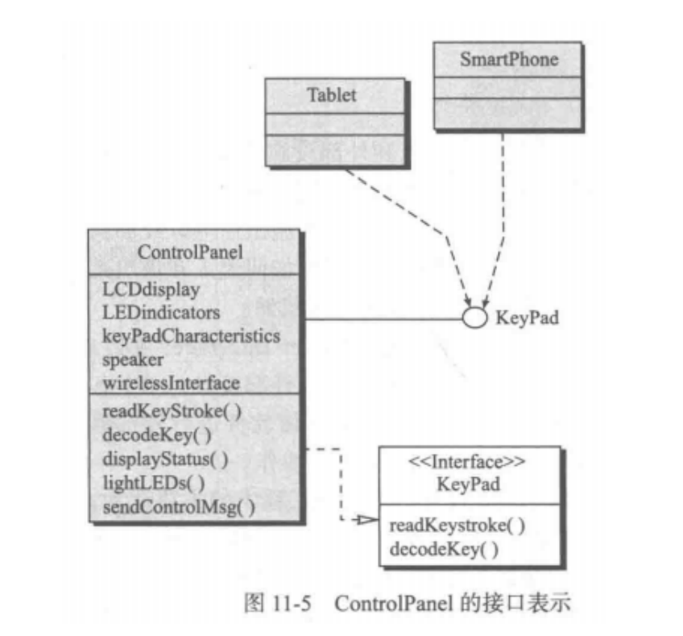

## 设计原则

 （1）开闭原则（The Open-Closed Principle, OCP)。模块（构件）应该对外具有开放性，对修改具有封闭性。

（2）Liskov替换原则（Liskkov Substitution Principle, LSP)。子类可以替换他们的父类。

（3）依赖倒置原则（Dependency Inversion Principle,DIP)。依赖于抽象，而非具体实现。 

（4）接口分离原则（Interface Segregation Principle, ISP)。多个用户专用接口比一个通用接口要好。

# 最后的大题

下面是我收集的资料

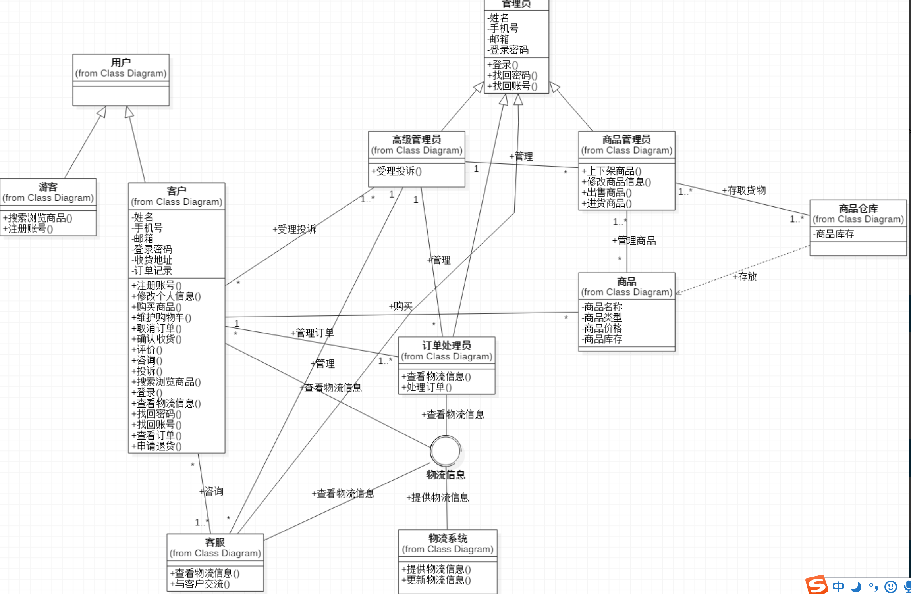

**1.3** **关联描述**

（1）客户——商品

关联名称：购买

关联说明：客户类为主动类，商品类为被动类；每个客户都可以购买任意数量的商品，而每个商品只能被一个客户购买

（2）客户——高级管理员

关联名称：受理投诉

关联说明：客户类为主动类，高级管理员为被动类；每个客户可以向一个或多个高级管理员投诉，高级管理员可以受理任意数量客户的投诉

（3）客户——订单处理员

关联名称：管理订单

关联说明：客户类为主动类，订单处理员员为被动类；每个客户的订单由一个或多个订单管理员来管理订单，每个订单管理员可以管理任意数量客户的订单

（4）客户——客服

关联名称：咨询

关联说明：客户类为主动类，客服类为被动类；每个客户可以向一个或多个客服进行咨询，客服可以向任意数量的客户进行解答

（5）客户——物流信息

关联名称：查看物流信息

关联说明：客户类主动类，物流信息接口类为被动类；每个客户可以通过物流信息接口查看物流系统提供的物流信息

（6）高级管理员——商品管理员

关联名称：管理

关联说明：高级管理员类为主动类，商品管理员为被动类；每个高级管理员管理任意数量的商品管理员，每个商品管理员被唯一一个高级理员管理

（7）高级管理员——订单处理员

关联名称：管理

关联说明：高级管理员类为主动类，订单处理员为被动类；每个高级管理员管理任意数量的订单处理员，每个订单处理员被唯一一个高级管理员管理

（8）高级管理员——客服

关联名称：管理

关联说明：高级管理员类为主动类，客服为被动类；每个高级管理员管理任意数量的客服，每个客服被唯一一个高级管理员管理

（9）订单处理员——物流信息

关联名称：查看物流信息

关联说明：订单处理员类为主动类，物流信息接口类为被动类；每个订单处理员可以通过物流信息接口查看物流系统提供的物流信息

（10）客服——物流信息

关联名称：查看物流信息

关联说明：客服类为主动类，物流信息接口类为被动类；每个客服可以通过物流信息接口查看物流系统提供的物流信息

（11）物流系统——物流信息接口

关联名称：查看物流信息

关联说明：物流系统类为主动类，物流信息接口类为被动类；物理信息系统在每次更新物流信息时，都会提供物流信息给物流信息接口

（12）商品管理员——商品

关联名称：管理商品

关联说明：商品管理员类为主动类，商品类为被动类；每个商品管理员可以管理任意数量的商品，每个商品被至少一个商品管理员管理

（13）商品管理员——商品仓库

关联名称：存取货物

关联说明：商品管理员类为主动类，商品类为被动类；每个商品管理员可以从至少一个商品仓库存取货物，每个商品仓库至少被一个商品管理员管理

 

**1.4** **继承描述**

（1）用户类——游客类

一般类：用户类

特殊类：游客类

（2）用户类——客户类

一般类：用户类

特殊类：客户类

（3）管理员类——高级管理员类

一般类：管理员类

特殊类：高级管理员类

（3）管理员类——商品管理员类

一般类：管理员类

特殊类：商品管理员类

（4）管理员类——订单处理员类

一般类：管理员类

特殊类：订单处理员类

（5）管理员类——客服类

一般类：管理员类

特殊类：客服类

 

**1.5** **依赖描述**

（1）商品仓库→商品

依赖名称：存放

所涉及的类：商品仓库类、商品类

依赖类型：包含

附加说明：商品仓库存放商品，商品的购买、进货等会影响商品仓库的库存
