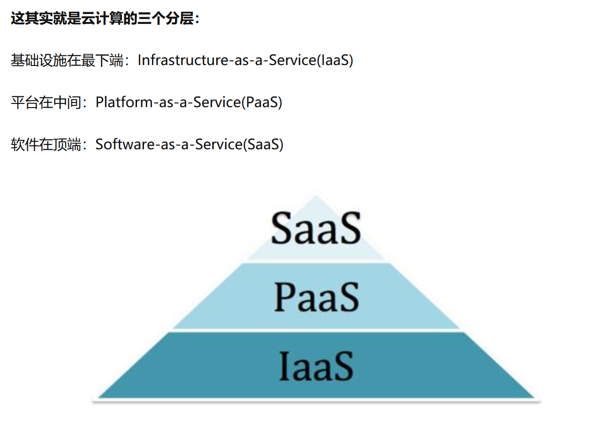
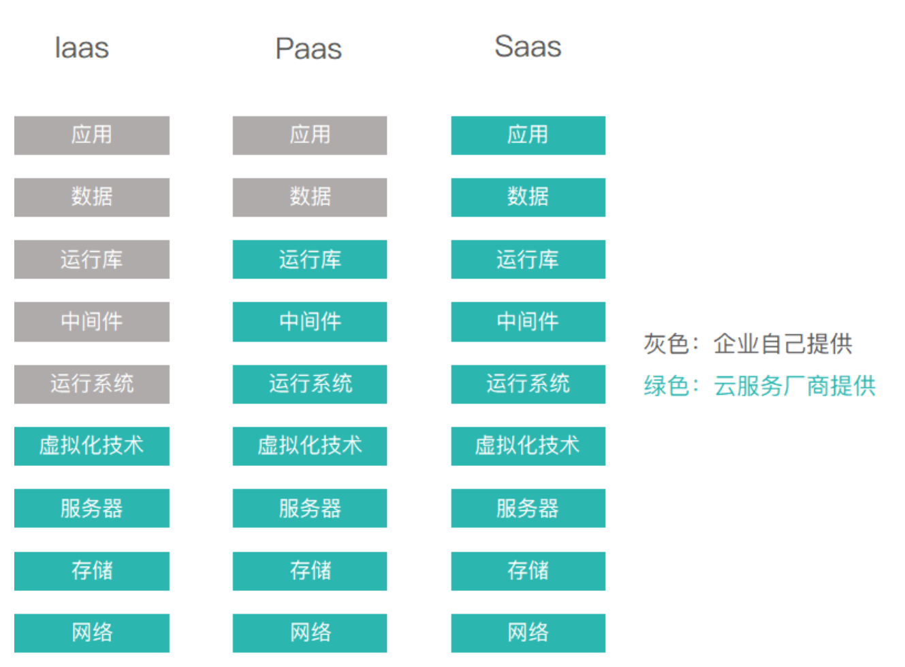

# 复习课

复习顺序：先看笔记，再看ppt，有目的地查下教材。

选择题 多选

看图分析题，举例分析题

一页纸的需求，要看懂

前面写快一点，答到点子上去。

1）构建use case图
2）要定义类的状态图
3）构建类图
4）选择两个业务类组件进行详细设计，定义属性方法
5）

十个选择题  六个大题

# 笔记必考点

## 遗留系统的演化原因

- 需要进行适应性调整
- 升级以实现商业需求
- 扩展使得可以与更多的系统交互
- 架构需要重新部署来适应新环境（例如下面以前没有mobile）

## 云服务

**1.基础设施即服务 (IaaS ： Infrastructure as a Service)**

把计算基础(服务器、网络技术、存储和数据中心空间)作为一项服务提供给客户。它也包括提供操作系统和虚拟化技术、来管理资源。消费者通过Internet可以从完善的计算机基础设施获得服务。

**2.平台即服务(PaaS：Platform as a Service）**

PaaS实际上是指将软件研发的平台作为一种服务，供应商提供超过基础设施的服务，一个作为软件开发和运行环境的整套解决方案，即以SaaS的模式提交给用户。因此，PaaS也是SaaS模式的一种应用。但是，PaaS的出现可以加快SaaS的发展，尤其是加快SaaS应用的开发速度。

虚拟化，对设备、存储虚拟化，同时负责监控、预测、管理、决策。

**3.软件即服务 (SaaS：Software as a Service)**

是一种交付模式，其中应用作为一项服务托管，通过Internet提供给用户;帮助客户更好地管理它们的IT项目和服务、确保它们IT应用的质量和性能，监控它们的在线业务。

本地部署：相当于在家自己做
IaaS：买好速食披萨回家做着吃
PaaS：打电话叫外卖将披萨送到家里
SaaS：在披萨店吃披萨

另一个回答：

中间的这些，就是利用最右边的基础设施搭建出的平台，从而承载最左边的【应用】和【数据】。

不是所有企业都具有独立开发一个软件的资本（钱、人、力缺哪个都不行）。

所以，云服务产生了。

## 导致changing的三个原因

1. correct纠错
2. 适应性修改：法律 adapt
3. enhance：增加性能，功能增强

## Process Pattern

ch3

## Xp

ch5

## Requirement Elicitation

ch8

## IDENTIFYING CLASSES & CRC MODELING

ch10都很重要

## 行为建模

ch11

箭头上面的是事件，蓝色是状态

考试必考7-8分

Key hit按键盘事件发生，开始读密码

Reading：调用读密码的方法（图上没写出来）（最好加一个自反方法：不断读密码）
compare：比较，调用验证方法
locked：如果密码出错超过一定次数锁定
selecting：选择操作，回到显示状态（例如显示启动成功）

## 设计原则

ch12 肯定有考题

