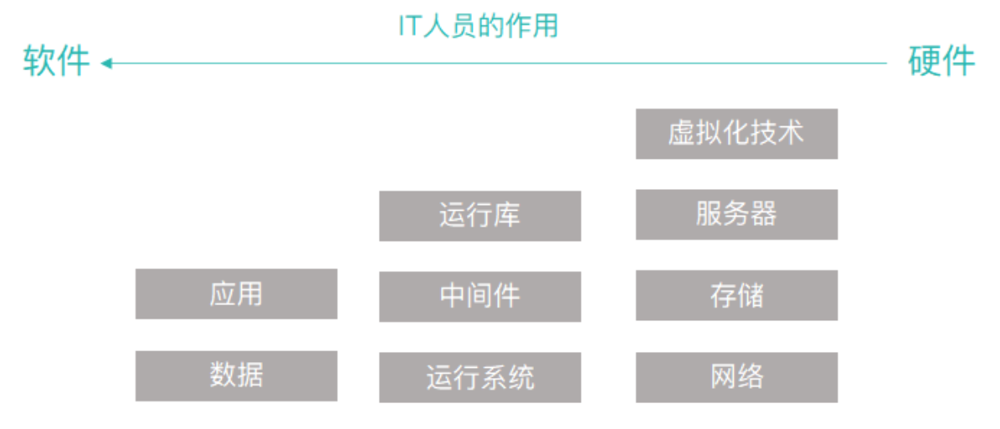
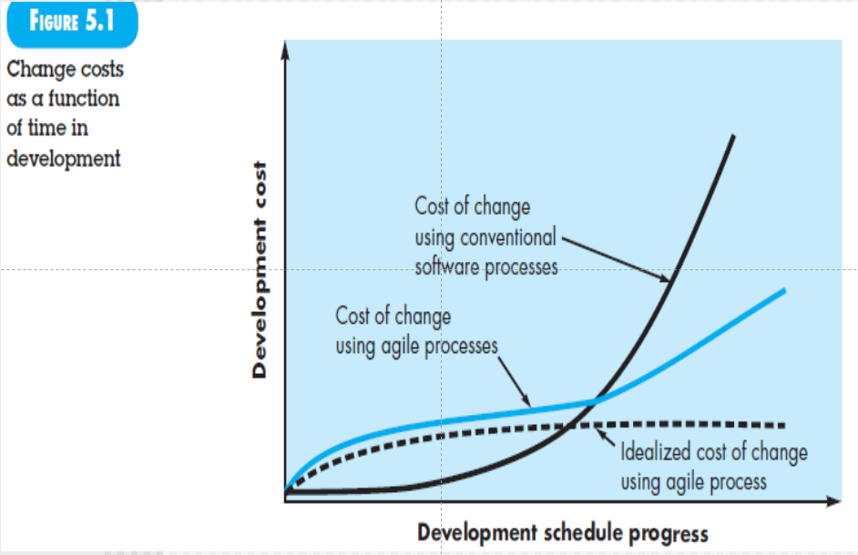

# ch0 课程介绍

## 讲什么

第一章 对软件下定义，分类，发展

第二章 什么是软件工程（软件开发的过程工程化），如何实现软件工程（过程），软件构成，agile&devops，UML+数据结构+数据库概论

（产品/数据/功能/行为建模）》（架构设计/高层设计）

敏捷模型：scrum，xp极限编程

第七章：理论

第八章：怎么获取得到需求

第九章：

## 考什么

从需求调研开始做出一个产品（理论+实践）

软件工程：项目成绩+考试成绩+考勤（创新。。4-5次，缺两次以上没分）+回答问题

软件工程课程设计：项目成绩

# ch1 软件的本质

## 软件的本质

工程化——一个框架

过程化——方法工具化（例如多种UML工具）

**Standard Process**:？？？？

1. 需求调研——requirement specification规约说明书

软件：产品和产品交付载体的双重角色。

软件开发过程中需要：估算模型——需要多长时间，多少人，多少钱

error（交付之前）——> failure（交付之后，运行结果不符合顾客需求）

 failure可能是由于一个或多个error导致，且一个error可能导致多个failure

为了发现error：review评审技术 testing测试

运维：后期维护成本大

MS project——微软的一个工具可以估算工作量

### 定义软件

- 代码/程序：通过执行这些程序可以满足预期的特性和需求、功能。
- 数据结构：使得程序可以合理利用信息。
- 软件描述信息/规约：描述程序的操作、使用等。

硬件和软件的生命周期：

硬件：早期故障多（设计问题）最后期由于磨损问题

软件：失效上升可能是由于错误的扩展性，或者修复某个问题带来的副作用。

### 软件应用领域

软件分类：（各个类别可能有交叉）

- 系统软件：操作系统软件（应用软件运行在这之上）。
- 应用软件：解决特定需求的独立应用程序。
- 工程/科学软件：例如matlab
- 嵌入式软件：例如家电内部的，汽车内部的
- 产品线软件：为不同用户提供特定功能
- Web/移动App：
- 人工智能软件：机器人，博弈，模式识别（语音图像），自动驾驶，自然元素处理（文本）

### 遗留软件

1. 老旧的软件 
2. 不断变更以适应需求⸺变得臃肿 
3. 质量差，代码费解、⽂档混乱

由于数据难以移植，风险较大，所以很少选择重新开发。

遗留系统的演化原因：**（会考！！！）**

- 需要进行适应性调整
- 升级以实现商业需求
- 扩展使得可以与更多的系统交互
- 架构需要重新部署来适应新环境（例如下面以前没有mobile）

（前端）web     mobile

中间层n个接口

后端/服务端（后端内部子系统有很多交互）

现在主流的架构已经从SOA架构转向MS架构（独立配置，耦合性低）

## 软件的变更本质

### WebApp

## 移动App

### 云服务***

**1.基础设施即服务 (IaaS ： Infrastructure as a Service)**

把计算基础(服务器、网络技术、存储和数据中心空间)作为一项服务提供给客户。它也包括提供操作系统和虚拟化技术、来管理资源。消费者通过Internet可以从完善的计算机基础设施获得服务。

**2.平台即服务(PaaS：Platform as a Service）**

PaaS实际上是指将软件研发的平台作为一种服务，供应商提供超过基础设施的服务，一个作为软件开发和运行环境的整套解决方案，即以SaaS的模式提交给用户。因此，PaaS也是SaaS模式的一种应用。但是，PaaS的出现可以加快SaaS的发展，尤其是加快SaaS应用的开发速度。

虚拟化，对设备、存储虚拟化，同时负责监控、预测、管理、决策。

**3.软件即服务 (SaaS：Software as a Service)**

是一种交付模式，其中应用作为一项服务托管，通过Internet提供给用户;帮助客户更好地管理它们的IT项目和服务、确保它们IT应用的质量和性能，监控它们的在线业务。

本地部署：相当于在家自己做
IaaS：买好速食披萨回家做着吃
PaaS：打电话叫外卖将披萨送到家里
SaaS：在披萨店吃披萨

另一个回答：

中间的这些，就是利用最右边的基础设施搭建出的平台，从而承载最左边的【应用】和【数据】。

不是所有企业都具有独立开发一个软件的资本（钱、人、力缺哪个都不行）。

所以，云服务产生了。

### 产品线软件

# ch2 软件工程

## 2.1 软件工程定义

sequence图是在use case上细化

CASE：计算机辅助软件工程

## 2.2 软件过程

一个activity由一个或多个actin构成，action又由多个任务构成。

interface+data

activity：

action：实现宽泛的目标

task：

milestone：两个activity的交付点，前一阶段的action已经检测无误，交付到下一阶段。本阶段的产品已经review了。

### 过程框架

### 普适性活动

risk exposure= loss* possibility

1. 识别风险
2. 计算risk exposure = loss* possibility（概率和损失的乘积）并排序
3. 根据第二步指定的策略实施，动态跟踪风险

### 过程框架

- 对一个preocess要不断分解：activity，action，task
- 为了更好地理解sfw pro——分解为两个维度：pro（制造）+um（保护）

提问过：

1. comunication：requirement modeling

2. Planing：umbrella 

3. Modeling：archtecture & componet desgin

4. Construction：coding & testing

5. Deployment：dilivery & mantainance & feedback

   

   软件开发过程包括很多迭代，并不是线性顺序的模型，而是循环往复。

里面包含什么归约？？？、、

### 普适性活动Umbrella activity***

导致changing的三个原因：提问过

1. correct纠错
2. 适应性修改：法律 adapt
3. enhance：增加性能，功能增强

SQA：查询接口监控

**测量Measurement：**

**可复用管理Reusability management：**例如java底层是跨平台的。再例如做银行开发，这个银行和另一个是一样的——做标准类库，标准接口。refactor重构的目的之一就是标准化。

### 过程的适应性调整

软件工程过程并不是教条的，而应该是灵活可适应的。可根据项目特点，组织文化等进行适应性调整。

## 2.3 软件工程实践

9.26 start

### 实践的精髓

1. **理解问题：**利益相关者（stackholder），功能特性，是否可以划分
2. **策划解决问题：**是否已有解决方法/设计模式可以复用，修改；是否可以划分子问题
3. **实施计划：**
4. **检查结果的正确性：**vailidate？合理？单元测试后做系统测试（是否符合客户需求）

需求工程：

需求归约，文字描述需求---》use case（从用户角度的抽象）

class（数据建模的抽象），activity，state diagram，sequence（动态抽象）

component design：类的设计，有什么类，什么方法，继承关系——复杂的方法用activity diagram画出来

状态图（Statechart Diagram）主要用于描述一个对象在其生存期间的动态行为，表现为一个对象所经历的状态序列，引起状态转移的事件（Event），以及因状态转移而伴随的动作（Action）。——**是软件体系架构的依据。**

由状态图考虑要有什么类，怎样互相架构——**是类设计的重要依据。**

### 通用原则

1. 存在价值
2. 保持简洁
3. 保持愿景
4. 关注使用者
5. 面向未来
6. **提前计划复用**：前瞻性，降低成本
7. 认真思考

9.27 start

## 2.4 软件开发神话

management myth

1. 即使有软件工程这个开发框架也可能会遇到很多问题

customer myth

1. 需求不能随意更改，敏捷开发中需要等到下一个迭代周期才可以更改需求（stories）

Practitioner’s myths

1. 代码要写的慢而精
2. review SOA去找error
3. Software engineering is not about creating documents. It is about creating a quality product.

项目过程中尽量用开源工具

需求管理工具：

测试工具：

outsource

## 2.5 如何开始

# ch3 软件过程

## 3.1 通用过程模型

standard process??

线性

迭代

演化：迭代，螺旋上升

并行：comm和plan并行推进

## 3.2 定义框架活动

针对特定的问题，开发人员和利益相关者，哪些动作适合与框架活动？

例如communication activity中最重要的action打电话，包含的task set为

3和4存在迭代

## 3.3 明确任务集

9.29 satrt

需要选择最能满足最适合开发团队特点的task set

下图是communication阶段的一个action：elicitation

7 用户场景：use case图

9 增量交付：第一次交付发现问题，再改进再次交付（迭代）

11 法律限制、权限限制

上面的步骤并不是线性的，是迭代进行的

**非功能需求：non-function**

1. **性能需求**

   算法，后台架构，数据库设计（冗余，将访问频率最高的表放在不同的table space里），微服务调用依赖关系，前后API接口，前端本身（要适当分担一些后端的任务）

2. **安全需求**

   加密方式？

coding这个activity的action：看成一个action

1. understand component design：理解详细设计
2. 找到核心复杂算法，定义数据结构，完成算法逻辑
3. 选择特定的IDE，并且实现代码
4. 自测试（做好了unit testing甚至可以裁掉）
5. 重构
6. SQA：software quality assurance 检查日志规范、接口、变量名
7. review：group review
8. code finish：0工作量

## 3.4 过程模式

本章最重要 process patterns——一般是公司内部管理

patterns：已证实有用的，抽象成一个模板步骤

代码变量不能用拼音

### process patterns的描述模板

#### Pattern name

名字，英语

#### Force 环境

所需要的实施环境，硬件，网络，版本管理工具

#### Type 三种类型

1. stage pattern ：解决和activity相关的
2. task pattern：指action或者task的
3. phase pattern：the sequence of framework activities，涉及到整个的框架，各种activity都会涉及

#### Initial Context

实施启动条件——之前的活动？进入状态？

#### Problem

这个模式能解决什么问题

#### Solution

如何实现？

#### Resulting Context

接口，就是一个出口条件，那些信息能够提交给接下来的

#### Related Pattern

有同级的也有上下级关系

#### 已知example：

prototype medol：phase pattern帮助搞清需求，过程模型的一种，是一个迭代的模型。做需求，给大家看，再改，再迭代。

调研需求很重要！！！

### 一个实例

BS和CS

- BS:(Browser/Server,浏览器/服务器模式),web应用 可以实现跨平台，客户端零维护，但是个性化能力低，响应速度较慢。
- 
- 
- CS:(Client/Server,客户端/服务器模式),桌面级应用 响应速度快，安全性强，个性化能力强，响应数据较快
- 
- 

## 3.5 Process Assessment& Improvement

对做的过程进行评估&改进

ISO：International Standard Organization

CMM/CMMI

CMMI的全称为Capability Maturity Model Integration，即能力成熟度模型集成。CMMI是CMM模型的最新版本。

**是一个软件开发过程的质量的评估改进的框架**

### CMM

实施CMM的企业很多

CMM是由美国卡内基梅隆大学软件工程研究所1987年研制成功的，是国际上最流行最实用的软件生产过程标准和软件企业成熟度等级认证标准。

其所依据的想法是：只要集中精力持续努力去建立有效的软件工程过程的基础结构，不断进行管理的实践和过程的改进，就可以克服软件生产中的困难。

五个级别：

要达到什么level就要把那个level的KPA以及前面的做到最好。——staged model阶段式模型框架

连续式框架：continues，持续改进，慢慢提高的过程，并不是在这一级就做到最好。

### CMM1：Initial

无政府状态

### CMM2：Repeatable

评估师，主任评估师——给项目做评估

可重复级：做的很多东西、经验可以在其他项目重复使用，例如git配置管理。

KPA：key process area 关键过程域——告诉我们what to do

How to do：1.指南或者模板   2.tools工具   3.监控（做的怎么样）

课后作业：自己研究MS project工具

### CMM3：Defined

定义级

对项目再adjusted & tailor

tailor：delete/edit/modify

七个KPA：

1. 组织过程聚焦：对过程进行全面建模
2. 对过程进行定义：对过程tailor
3. Training Program培训计划：业务培训。例如写高铁，高铁调度啊都要学。
4. 集成的项目管理：配制管理员不可能一直在做配置管理。对零散的工作也要会处理。
5. 产品工程：针对不同的用户和时间做管理，都有模板工具监控
6. 协同开发：很多人一起开发，如何merge、协调
7. 与同行对比：review（大家一起检查代码）

需求工程：requirement elimination+requirement modeling

得到两个归约：Rs，RAs  specification

数组下标，指针什么的，在review中很难发现，很可能到单元测试才能发现

### CMM4：Managd

1. 质量管理：在整个开发过程中，all review的成本+revoke返工 成本+测试成本（unit intergration+？ ）
2. 定量管理：缺陷的数量，规模size，工作量，schedule（工作具体安排，MS project）

项目知识库：假设199个项目。有一个项目发现了100个缺陷，其中由于需求工程引起的有十个。则占总的8%。

现在要做第200个项目——要求：需求归约达到公司平均水平/要提升2%。——》how to do? 要管理

质量管理主要是对缺陷管理

LoC：lines of code 最早的项目规模评估依据，现在不用了——因为现在很多复用和继承。现在用Function Point / Use Case Point（FP/UCP）

### CMM5：Optimizing

1. Process Changing  Management：
2. Technology CM：例如开发用sql server，后来发现不行要换
3. Defect Prevention：找root cause——eg 是详细设计还是概要设计出了问题。通过这个，缺陷数下降，质量提高。

ISO的评估适用于contract project

# ch4 过程模型

过程模型：

迭代程度：迭代层次（回到这层，上一层）

## 瀑布模型

### 特点

1. 按照general/standard process顺序开发，很少迭代：planing是umbrella可以去掉
2. 过程明确，需求清晰
3. 不主张迭代，但也有迭代
4. 用户需要很长时间才能得到成品
5. 某阶段受阻，整个项目都会到blocking states

也叫线性、顺序liner，sequential。因此是一个很经典的模型。

如果需求更改不多，可以使用

### V-model

左——》右：箭头表示以什么什么为依据（单元测试以代码和详细设计为依据）

详细设计ComDes需要流程图，接口，所以使用drawer单元测试。因此单元测试是以CD为基础

对某个代码进行单元测试，需要写几个drawer（每个相当于一个简单的主函数），有对应源代码的输入接口，有输出。作用：1，提供输入界面； 2，提供调用功能  3，返回并显示结果

每个drawer做的任务都很小

InteTest

一个可能做得好，合在一起不一定

AD：概要设计 high level desgin

三个主要组成

1，软件体系结构设计，2，数据库的设计，3，接口设计

systest

已经集成完毕，放在一个真实的系统中进行测试（考虑环境，比如网络、设备等等）

待整理路由

这个V不完整，上面的Rm包括两部分 ：

requirements model

1.  Requirement elicitation需求调研：得到结果是Requirement Specification（需求归约，为主），有文字描述+use case图
2.  requirement analysis modeling：得到结果是Requirement Analysis Specification（sp第三阶段，通过activity图来抽象系统的流程）

AT：验收测试

## 增量过程模型

incremental

特点：

1. 项目主要需求明确（可以先发布核心功能）
2. 每一次增量都是一个mini瀑布模型
3. 每个增量之间可能存在stagger（交错）和parallel
4. 每一次发布都是完全能运行的版本，第一次是核心版本（core product），后续是增强

为什么用

1. 瀑布开发时间太长了
2. 先占领市场
3. 技术原因（新技术还没搞出来，所以先发布没这个技术的部分）

## 演化过程模型

evolutionary model

evolutionary：是迭代演化的

对很大的项目，线性不行，而增量模型的第一版周期可能也很长

市场要求。需求细节不断深入了解增加。

### 原型模型

prototype medol：( phase pattern ) <u>**帮助搞清需求**</u>，过程模型的一种，是一个迭代的模型。做需求，给大家看，再改，再迭代。

使用情况：需求不清楚/需求在特定环境（特定的操作系统、数据库、网络）运行不确定是否合适

在需求清楚之后可以使用其他开发模型例如瀑布或者增量继续开发。

paradigm：model泛型

fuzzy：模糊的

### 螺旋模型

spiral model特点：

1. 适合大项目
2. 风险比较高的项目：每一圈跟踪风险
3. 需求经常变更的项目
4. 要求迭代

每一圈都可以用不同的model

每圈的交点都是arc point milestone

重点；

# ch5 敏捷开发

## Agile概念

适应需求、技术不断地变化

1. 看重团队结构、协作态度
2. 快速交付，不看重中间产品
3. 可使用非正式的开发方法，中间建模尽量简单
4. 和利益相关者在一个敏捷开发团队（命运共同体），roles、responsibility随时调整

横坐标：开发过程中需求不断变化

虚线：需求变化控制在一个理想范围内

蓝色：上升的一个重要原因——regression testing回归测试（这一版和上一版本的修改会有牵连——相关用例）

5.3要看，会提问

## XP极限编程extreme programming

重要！:arrow_down_small:

适合比较大，周期长，风险高的项目

### planning

用户故事：这里story就是requirement，描述将要开发的软件所需要的输出、特性以及功能。故事的单位unit是use case。

权值/优先级value：给故事划分优先级priority，选优先级高的在本次迭代实现

Acceptance test：验收测试，主要看客户需求，需求归约。可以做测试用例的设计（虽然还没code，但需求明确就可以做）

Iteration plan：迭代计划关注两个方面——duration + mini-milestone

### design

> **CRC (Class-Responsibility-Collaborator) **卡建模是一种简单且有效的面向对象的分析技术。XP中用于确定与当前软件增量相关的类。
>
> 它由三部分组成： 
>
> 1. **类 (Class) ：**一个类代表许多类似的对象。而类名在CRC卡的顶部。 
> 2. **职责 (Responsibility)** ：职责是类的方法和属性 （用户的姓名生日）。类需要知道或做的任何事物。这些职责是类自身所知的知识，或类在执行时所知的知识。
> 3. **协作 (Collaborator) ：**协作是类和其他类有交互。指为获取消息，或协助执行活动的其他类。在特定情形下，与指定的类按一个设想共同完成一个(或许多)步骤。例如我需要知道你的成绩，需要getGPA，那么我们俩就有协作关系。

提取业务类====》抽象子系统====》确定调用关系（抽象类负责交互（接口类））

九个类，三个子系统，互相之间可能有调用。

第一次要划分子系统

每一次迭代需要把新增加的类的调用关系标记出来

最终得到软件的体系结构图（模块结构图）（一个树）《体系结构设计、数据库设计、接口设计》

非面向对象的架构：

Spike：某个算法特别复杂，应该拿出来做特定环境下的验证

### coding

团队不是直接开始code，而是先开发包含所有故事的单元测试

refactoring重构，自反，为了代码的质量

pair programming结对编程，尤其是关键性的复用性高的项目。两个人一起写，一起查，一起review

continuous integration集成测试，结对编程之后需要和团队其他人的集成起来

smoking testing：功能基本可以实现，最初来源于汽车行业（保证发动机冒烟）

### test

以类做单元测试，写一个脚本，把类放进去，直接等结果

continues inter：集成测试

## Scrum

适合迭代周期小的，最多4周。  

见pdf文档

# ch7 指导原则

由此开始第二部分

第七章是总结起来最难的，都是概念

7、概念

8、9、10、11：requirement engeerning

8：requirement elistation

9、10、11：requirement analysis modeling

建模的目的：为了抽象，帮助理解，最终目的是为了方便coding

These software engineering principles are likely to serve a professional programmer throughout his or her career.

## 7.2 核心原则

### Principles That Guide Process过程原则

① Principle 1. Be agile. 敏捷开发

② Principle 2. Focus on quality at every step.
每一次向product owner展示的时候就是在评价质量（每一大轮）
每一小轮也要注重质量
每一步都要通过评审、演示、评估管理质量

③ Principle 3. Be ready to adapt. 可以适应

④ Principle 4. Build an effective team. 建立高效团队

⑤Principle 5. Establish mechanisms for communication and coordination.
团队内部沟通协调机制

⑥Principle 6. Manage change. 管理变更

⑦Principle 7. Assess risk. 评估风险

⑧Principle 8. Create work products that provide value for others.  创建对他人有益的工作，例如总结pattern

###  Principles That Guide Practice实践原则

①Principle 1. Divide and conquer.
分而治之，划分子系统

② Principle 2. Understand the use of abstraction.
activity功能逻辑的抽象，类图是数据角度的图像，use case是对产品对用户使用产品的抽象——一个use case是一个功能单元。
所有的建模都是抽象

swimlane也是activity diagram，只不过标记了有哪些类需要协作。

③Principle 3. Strive for consistency.
保持一致，不能出现偏差和矛盾

④Principle 4. Focus on the transfer of information.
输入输出就是信息转换的过程

⑤Principle 5. Build software that exhibits effective modularity. 有效的模块化

⑥Principle 6. Look for patterns. 寻找合适的模式

⑦Principle 7. When possible, represent the problem and its solution from a number of different perspectives.尊重不同观点

⑧Principle 8. Remember that someone will maintain the software. 记住会有人来维护软件

## 7.3 每个activity的原则

### 7.3.1 Communication

①Principle 1. Listen. 聆听

②Principle 2. Prepare before you communicate.
有备而听，不然不了解行业内容会听不懂

③Principle 3. Someone should facilitate the activity.
有协调人安排会面等

④Principle 4. Face-to-face communication is best.最好面对面交流

⑤Principle 5. Take notes and document decisions.记录决议的笔记和文档

⑥Principle 6. Strive for collaboration.努力合作

⑦Principle 7. Stay focused; modularize your discussion. 保持专注，模块化你的决定

⑧Principle 8. If something is unclear, draw a picture.模糊不清的东西画图理解

⑨Principle 9. (a) Once you agree to something, move on. (b) If you can't agree to something, move on. (c) If a feature or function is unclear and cannot be clarifified at the moment, move on.  在不确定的情况下，保持move on

⑩Principle 10. Negotiation is not a contest or a game. It works best when both parties win.  协商不是比赛，最好保持双赢

### 7.3.2 Planning

①Principle 1. Understand the scope and boundry of the project. 理解项目的范围和边界

②Principle 2. Involve stakeholders in the planning activity. 利益相关者要参与策划的过程

③Principle 3. Recognize that planning is iterative. 明确策划是迭代的

④Principle 4. Estimate based on what you know. 估算工作量

⑤Principle 5. Consider risk as you define the plan. 评估风险

⑥Principle 6. Be realistic. 实事求是

⑦Principle 7. Adjust granularity as you define the plan. 调整项目计划的粒度

⑧Principle 8. Define how you intend to ensure quality. 指定计划的时候也要确保质量

⑨Principle 9. Describe how you intend to accommodate change. 描述你打算怎样适应修改

⑩Principle 10. Track the plan frequently and make adjustments as required.时常跟踪计划，制定修改。

### 7.3.3 Modeling

Modeling：分析建模&设计建模（概要&详细）

depicting the software in three different domains:

the information domain，数据建模，主要是类图
the functional domain, 功能建模，活动图
and the behavioral domain. Design，行为建模，状态图

**when perform modeling action and tasks：**

① Principle 1. The primary goal of the software team is to build software, not create models. 团队的目标的制造软件，不是制造模型

② Principle 2. Travel light—don’t create more models than you need. 轻量建模，不要建立过多的模型

③ Principle 3. Strive to produce the simplest model that will describe the problem or the software.  坚持用最简单的模型描述问题或软件

④ Principle 4. Build models in a way that makes them amenable to change.  建造可以修正的模型

⑤ Principle 5. Be able to state an explicit purpose for each model that is created. 每个模型都要有自己明确的目标

⑥ Principle 6. Adapt the models you develop to the system at hand.  将模型适应于系统

⑦ Principle 7. Try to build useful models, but forget about building perfect models.  建立有用的模型而不是完美的模型

⑧ Principle 8. Don’t become dogmatic about the syntax of the model. If it communicates content successfully, representation is secondary.  对于模型的语法不要教条化。如果他能够表述清楚内容，代表什么就是次要的。

⑨ Principle 9. If your instincts tell you a model isn’t right even though it seems okay on paper, you probably have reason to be concerned.  如果直觉告诉你模型是错的，那三思而行。

⑩ Principle 10. Get feedback as soon as you can. 及时获取他人反馈。

> requirement elistation
> requirement analysis modeling
> 这两个在一起是需求工程requirement engeering

**Requirements modeling principles 需求分析建模：**

① Principle 1. The information domain of a problem must be represented and understood.要有数据建模，创建类图

 ② Principle 2. The functions that the software performs must be defined. 要有功能建模

③ Principle 3. The behavior of the software (as a consequence of external events) must be represented.要有行为建模

④ Principle 4. The models that depict information, function, and behavior must be partitioned in a manner that uncovers detail in a layered (or hierarchical) fashion. 不断细化不断分隔

⑤ Principle 5. The analysis task should move from essential information toward implementation detail. 分析要从主要信息转向实现细节

**Design modeling principles 设计建模：**

① Principle 1. Design should be traceable to the requirements model. 设计是以需求为依据的（V-model有体现）

② Principle 2. Always consider the architecture of the system to be built. 架构设计非常非常重要

③ Principle 3. Design of data is as important as design of processing functions. 数据设计也很重要：数据库，数据字典，数据结构，数据仓库

>数据字典：数据的组成方式。例如某个接口输入数据如何对应（送给）后台（类的某个属性/字符串）。也是界面设计的重要基础。

④ Principle 4. Interfaces (both internal and external) must be designed with care. 接口设计要仔细

⑤ Principle 5. User interface design should be tuned to the needs of the end user. However, in every case, it should stress ease of use. 用户界面设计也很重要

⑥ Principle 6. Component-level design should be functionally independent .高内聚

⑦ Principle 7. Components should be loosely coupled to one another and to the external environment . 低耦合（方法之间互相调用的时候参数尽量少）

> **内聚是从功能角度来度量模块内的联系，一个好的内聚模块应当恰好做一件事，它描述的是模块内的功能联系；**
>
> **耦合是软件结构中各模块之间相互连接的一种度量，耦合强弱取决于模块间接口的复杂程度、进入或访问一个模块的点以及通过接口的数据。**

⑧ Principle 8. Design representations (models) should be easily understandable. 好理解

⑨ Principle 9. The design should be developed iteratively . 迭代原则

⑩ Principle 10. Creation of a design model does not preclude an agile approach 可以使用敏捷方法

### 7.3.4 Construction

**Coding Principles:**

Constrain your algorithms by following structured programming practice.通过遵循结构化编程实践来约束算法。

 Consider the use of pair programming. 结对编程

Select data structures that will meet the needs of the design.选择合适的数据结构

Understand the software architecture and create interfaces that are consistent with it. 
写代码的时候注意类与类之间的关系，有接口就要增加方法。

Keep conditional logic as simple as possible.  逻辑简单，避免循环/if嵌套

Create nested loops in a way that makes them easily testable.  便于测试

Select meaningful variable names and follow other local coding standards.  变量命名规范

Write code that is self-documenting. 加注释

Create a visual layout (e.g., indentation and blank lines) that aids understanding.创建一个视觉布局(例如，缩进和空行)来帮助理解。

**Validation Principles**

Conduct a code walkthrough（走查，一种评审的方式，仅仅对代码） when appropriate.

Perform unit tests and correct errors you’ve uncovered. 
IDE继承单元测试，直接运行测试用例。

Refactor the code.代码重构。

> 可以在以下面对代码进行重构： 
>
> 1.重命名：对类，接口，方法，属性等重命名，以使得更易理解
>
> 2.抽取代码：将方法内的一段代码抽取为另一个方法，以使得该段代码可以被其他 方法调用，这是重构中很重要很常用的，此举可以极大的精炼代码，减少方法的 代码行数 
>
> 3.封装字段：将类的某个字段转换成属性，可以更加合理的控制字段的访问 （类如银行的分局号也为一个属性，卡号是另一个属性，用户只访问卡号）
>
> 4.抽取接口：将类的某些属性，方法抽取组成个接口，该类自动实现该接口
>
> 5.提升方法内的局部变量为方法的参数：这主要是在写代码的过程中会使用到 
>
> 6.删除参数：将方法的一个或多个参数删掉 
>
> 7.重排参数：将方法的参数顺序重新排列

**Testing principles**

①Principle 1. All tests should be traceable to customer requirements. 满足用户需求

②Principle 2. Tests should be planned long before testing begins 尽早做

③ Principle 3. The Pareto principle applies to software testing. 82规则

④ Principle 4. Testing should begin “in the small” and progress toward testing “in the large.” 由小到大测试

⑤ Principle 5. Exhaustive testing is not possible. 
穷尽测试是不可能的。

⑥ Principle 6. Apply to each module in the system a testing effort commensurate with its expected **fault density.**  应用与其期望的故障密度相称的测试工作量。

⑦ Principle 7. Static testing techniques can yield high results. 静态测试，代码走查

⑧ Principle 8. Track defects and look for patterns in defects uncovered by testing. 跟踪缺陷，找找有没有通用的方法解决

⑨ Principle 9. Include test cases that demonstrate software is behaving correctly.利用状态图（行为建模）设计测试

### 7.3.5  Deployment Principles

① Principle 1. Customer expectations for the software must be managed. 满足客户期望

② Principle 2. A complete delivery package should be assembled and tested.装配测试好

③ Principle 3. A support regime must be established before the software is delivered. 交付之前必须建立制度

④ Principle 4. Appropriate instructional materials must be provided to end users.向最终用户提供使用指南。  

⑤ Principle 5. Buggy software should be fixed first, delivered later.有问题的软件应该先修复，然后再交付。

## 7.4 工作实践

接口，规范&模板，层次化（比如MVC，抽象成各种层），算法效率，哈希表，云平台，合理的数据库

convention:归约规范

① Interfaces.
② Conventions and templates.
③ Layering.
④ Algorithmic complexity.
⑤ Hashing.
⑥ Caching.
⑦ Concurrency.
⑧ Cloud computing.
⑨ Relational databases.

# ch8 理解需求

## Requirement Engineering

主要说每个活动做什么，要搞清楚。

### 1、启动Inception:

明确项目要解决的问题，构建团队和协调机制

### 2、诱导Elicitation:

establish business goals，
先写出一两页需求，讨论后补充需求
包括创建用例图

创建合适的系统架构（例如CS架构，BS架构，小程序，Web...）

在需求文档中

- Objects：找到所有的名词，如果该名词有属性，则构建成一个对象（或者潜在的类）（例如传感器，有ID，阈值等等）。对于没有属性的名词，可能本身是某个对象的属性（例如电话号码）
- Service：找动词，实义动词，就是系统的服务，功能。
- Constrains：限制，例如花费限制，显示屏限制，业务规则限制
- 其他非功能需求：安全需求，性能需求

用例图

### 3、Elaboration细化

开始做Requirement Analysis Modeling

use case diagram, activity diagram ( function model, depicts the business logic for each use case ).

类建模：对于离散的对象研究归属聚合继承等关系。

行为建模：（事件驱动是指ATM机、打印机等）状态图（附件资料ATM）。大多数系统没有系统级别的状态图，但每个类会有状态图，是类方法定义的基础。

### 4、Negotiation协商

### 5、Specification明确

### 6、Validation校验

附件：正规技术评审过程

### 7、Management管理

讲到ppt第9.10页需求诱导了

# ch9 需求建模

这一章主要讲需求建模和功能建模

use case/activity/swim lane——如何从功能角度细化use case图

## 9.1 REQUIREMENTS ANALYSIS

从左上到右下：客户需求——》需求归约+需求分析归约——》设计建模

Domain Analysis：找到通用的业务类，提取出来定义方法属性。类似pattern
（that are broadly applicable so that they may be reused. /used by many people working on similar but not necessarily the same applications）（属于是umbrella activity：为了提高生产质量）

## 9.2 SCENARIO-BASED MODELING

## 9.3 UML MODELS THAT SUPPLEMENT THE USE CASE

### Activity Diagram

### Swimlane Diagram

两个异常情况就有两个sequence diagram

类图回来再构建swimland

# ch10 类建模

信息数据建模——建模结果：class diagram

以use case图为依据，做类图建模：include classes and objects, attributes, operations, class-responsibility-collaborator (CRC) models, collaboration diagrams, and packages.

## IDENTIFYING ANALYSIS CLASSES

 identify classes by examining the usage scenarios developed as part of the requirements model
用req spe，用需求归约为依据进行类建模

If the class (noun) is required to implement a solution, then it is part of the solution space; otherwise, if a class is necessary only to describe a solution, it is part of the problem space.（e.g., add items to shopping cart）

黑色：方法；蓝色：属性

最后一个大题：35分，提取类，类图，方法属性

对于每一个potential class，满足以下六个特性，就可以定义为类。
Retained information：属性中有系统需要用到的
Needed services：需要方法来改变自身的属性
Multiple attributes：多属性，只有一个属性的时候，和功能相近的潜在类放在一起。 
Common attributes / operations：拥有通用属性方法，可以定义成（父）类
Essential requirements：所有的外部实体

## SPECIFYING ATTRIBUTES

study each use case and select those “things” that reasonably “belong” to the class

What data items (composite and/or elementary) fully define this class in the context（上下文语义关联）

## DEFINING OPERATIONS

行为建模结果：状态图 state diagram

四种类型的方法: (1) operations that manipulate data in some way (e.g., adding, deleting, reformatting,selecting), 增加减少

(2) operations that perform a computation, 计算的方法

(3) operations that inquire about the state of an object, 询问状态get方法

(4) operations that monitor an object for the occurrence of a controlling event. 

有实际意义的动词，并且可以归属到某个类——》方法

软件：数据+代码+文档

## CLASS-RESPONSIBILITY-COLLABORATOR(CRC) MODELING

**<u>Responsibilities</u>** are the attributes and operations that are relevant for the class. 

 **<u>Collaborators</u>** are those classes that are required to provide a class with the information needed to complete a responsibility. In general, a collaboration implies either a request for information or a request for some action.（类和类之间互相提供信息，例如请求信息或者请求某种行动）

### Class

Entity classes：实体类 (也叫业务类，通常在数据库中)

Boundary classes：界面类 (用来创建界面交互)

> objects是实例化以后的。

<u>Controller classes/Interface class</u>：前后端交互的接口类

> 管理 1. 创建对象和接口交互 2. 界面接口类实例化对象化 3. 在实例化对象直接交互 4. 验证

### Responsibilities

这一小节将如何对潜在类优化

1. 类的方法功能是不是和整个系统的开发目标；类的方法属性功能要数量均匀；每个类的功能要有独立性

2. 要考虑继承，定义父类（属性方法具有通用性）

3. 通过构建潜在类的状态图（behavior）优化类和方法的定义

4. 每一个类应该做好自己的事情。不要管其他的。

5. 构建类的聚合关系。例如类Player聚合了PlayerBody,PlayerArms, PlayerLegs, PlayerHead；他们的很多属性方法等是共享的，例如速度，位置等。彼此之间也有colleberation

   > 类的关系：
   >
   > - 关联：双向的，互相可以请求
   > - 依赖：碧如界面依赖摄像头展示界面；
   > - 课程表依赖课程；
   > - 继承：
   > - 聚合

最后35-40分：给一页半页的需求，提取类构建继承聚合关系

### Collaborations

类的协作两种方法：

1. 自己操作自己use its own operations to manipulate its own attributes内部自己调用
2. 和其他类ollaborate with other classes

>  和其他类的三种笼统的关系： (1) the is-part-of relationship, 聚合(2) the has-knowledge-of relationship（双向）, and (3) the depends-upon relationship单向（依赖）

ppt29-30没听

## ASSOCIATIONS AND DEPENDENCIES

没听，好像说了很像ER图

## ANALYSIS PACKAGES

没听

第十章讲完了

# ch11 行为建模&前端需求建模

REQUIREMENTS MODELING: BEHAVIOR, PATTERNS, AND WEB/MOBILE APPS

11.1-11.4 讲行为建模

11.5 讲前端在做界面设计之前的需求分析

## 行为建模

 外部事件驱动的系统是指ATM机、打印机等会有系统状态图（附件资料ATM）。

但另一种系统没有系统级别的状态图，但每个类会有状态图，是类方法定义的基础。

只要系统有功能业务类定义，就有类级别的状态图，是类方法定义的基础。。ATM仍然有系统状态图，也有每一个类的状态图（表示类之间的方法）。

>  c写的：每一个系统的主程序main就是依照系统状态图写的。（专门负责调用）
>  面向对象：每个类会有状态图，是类方法定义的基础。

行为建模的基础：状态图 & 时序图

(1) evaluate all use cases to fully understand the sequence of interaction within the system 

> 和系统的交互

(2) identify events that drive the interaction sequence and understand how these events relate to specific objects,

> 方法实现特定功能，一个方法可以造成很多状态变化，不能单独分开

(3) create a sequence for each use case

(4) build a state diagram for the system or classes

(5) review the behavioral model to verify accuracy and consistency.

P6：要调用某个方法来处理的时候才形成事件（例如密码输入完毕）

潜在类也可以用多个状态图：例如控制面板启动时候有一个，报警处理还有一个

箭头上面的是事件，蓝色是状态

考试必考7-8分

Key hit按键盘事件发生，开始读密码

Reading：调用读密码的方法（图上没写出来）（最好加一个自反方法：不断读密码）
compare：比较，调用验证方法
locked：如果密码出错超过一定次数锁定
selecting：选择操作，回到显示状态（例如显示启动成功）

从一个类上升到一个usecase 如下，形成时序图

通过数据建模得到四个潜在类——》行为建模（对方法属性进行分析，上一个图）——》类之间的协作上升到use case构建时序图（生命线是对象，也可以看成类）

use case：时序图：类之间的协作

状态图：类的方法和属性的定义

Analysis patterns are stored in a repository so that members of the software team can use search facilities to find and reuse them.

## 前端分析设计建模

### Content model

界面上的控件	

> 首先找内容对象，可能是一个视频、文本、可激活的事件（内容对象就是一个包含信息的控件，可以结构）
>
> 
>
> 是内容建模的data tree（不能再分解的叫做数据项）
> 第二列下面两个是子内容对象

内容对象是界面设计的基础

### Interaction model

：交互建模，出发不同内容对象进而产生不同交互，实现不同功能

参考泳道图或活动图时序图

找界面原型开发工具

整个交互建模就是不断和后面的类交互的过程

### Functional model

：功能建模

### Navigation model

：导航建模

### Configuration model

：

# ch12 设计原则

肯定有考题

## 12.1 设计在软件工程上下文的位置

体系结构：

左上角：C#体系结构，与内部管理有接口

左下角：C的体系结构，与ATM机有接口调用

右边：JAVA的体系结构，每一个子系统之间的类有调用关系；一个子系统的类调用另一个子系统的类需要经过控制器，与前端有接口

功能建模：左上

数据建模：下面

行为建模：右上

右边的是软件的体系架构设计

comp：详细设计

arch：概要设计 = 软件架构设计+数据库设计+接口设计

数据字典：数据输入的组合，各种属性的组合（送到后端，识别类调用方法）

https://www.zhihu.com/question/407474596/answer/1344488826

界面：

类外部的接口：以use case为单位

**Component-Level Design:**

**Interface Design：**指User Interface、External Interface、Internal Interface

​		一般把User interface提出去；内部接口是指子系统内部接口、前后端接口、子系统间控制接口、和硬件的接口；内部接口调用依靠状态图设计，类外部接口主要以user case图为单位(即以sequence 图为依据)

​		外部接口指和其他系统交互的接口，不由自己系统维护的接口；

​		所有的界面、界面需要哪些内容，都是从用户接口得到的；界面设计以User Case图为依据；

**Architectural Design:**指software Architectural，一般是软件的架构设计

**Data/Class Design:**数据库设计和数据字典设计；

​		其中数据库表的设计以类图为依据，数据字典就是数据的组合，这些数据和数据库中的字段以及类里的属性对应；和其他系统的接口的数据也叫做数据字典；

​		可能对以前的potential class做细化；

​		和前后端的交互也是数据字典设计的依据

完成类设计最后是在组件设计

## 12.2 设计过程

 an iterative process

FURPS quality attributes：

>  功能性
>  可用性
>  可靠性：失效故障频率&精度&MTTF
>  Performance：g processing speed, response time, resource consumption, throughput, and efficiency.（项目性能测试加分）
>  Supportability：可扩展性、适应性......

## 12.3 DESIGN CONCEPTS

- 抽象
- 体系结构
- 模式
- 分而治之
- 模块化：E1和E2一起做肯定效率低
  - 
  - 模块数量和成本分析；最上面的曲线高度等于下面两个之和。
- 信息隐藏：不需要知道的就不知道
- 功能独立：高内聚低耦合（调用参数简单）high cohesion, low coupling
- Refinement is actually a process of elaboration（细化）
- ....
- 设计类
  - 业务类Business domain classes（潜在类、分析类变成这个）
  - 界面类User interface classes（导航交互内容功能+数据字典）——> 界面设计工具
  - 控制器类/控制接口类Process classes (control class)：<u>**控制类负责处理数据字典，看看送给那个子系统处理，仅起到传递的作用**</u>
  - Persistent classes (如，被Hibernate持久化到数据库中的类,持久化类的实例对象将保存到数据库或者文件中) 一种衍生类，被很多类包含。将重复的可复用的方法抽象成一个类，方便总体运维，该类向需要的类提供访问接口。
  - System classes(如，Java的主类，有Main()方法) ：也是衍生出来的
  - 每个类的方法应该是独一无二的。低耦合（互相调用的参数简单）

# ch13 体系结构设计

architecture deginm（概要设计，high level degin）包括：

1.软件体系结构设计，就是系统环境图中心的部分。类图的基础上构造子系统，增加控制接口类

系统体系结构：就是系统环境图，运行在什么环境里（上级系统），需要访问什么系统，同等级系统？前端系统？

2.数据库设计

数据库类设计

数据字典设计（交互，功能，导航）——输入什么东西，有哪些控件，数据组织？

3.接口设计：

内部接口：（每个类之间方法的调用，有什么形参shican，子系统类间的调用，有什么参数，参数类型）

外部接口设计：系统环境图里面上下级系统的访问，前后端controlor

用户接口user interface：界面也算接口

> 接口类只有方法没有属性，方法负责完成调用转接逻辑，简单的判断逻辑
>
> 标记一下。比如A1通过C1访问B2

## 12.1 软件体系结构

Architectural design begins with data design and then proceeds to the derivation of one or more representations of the architectural structure of the system

以数据建模（类图）为依据

软件体系结构要标记方法调用接口

## 12.2 体系结构类型

## 12.3 体系结构风格

### 以数据为中心的体系结构

### 数据流体系结构

### 调用和返回体系结构

## 12.6 体系结构设计**重要

系统体系建模的结果如下：

一个例子：

系统体系结构+软件体系结构

接口设计：内部+外部

数据库设计：根据类图

# ch14 部件设计

详细设计归约

每个类的方法和数据结构，详细逻辑算法，通信机制不知道——设计出来，以此为依据写代码。

详细设计怎么表示：（分析设计建模有UML标准，设计建模没有）

体系结构：组件之间的组成方式（数据流，callback....上一章的涂鸦是面向对象的体系结构）

本来到分析类，没有组件，但有中间件，数据库啊都可以独立——所以有了组件

## 13.1 什么是构件

组件设计，不仅要有属性也要有方法（本身的方法+和外部交互的方法），也要标记协作

infrastructure基础设施类：前后端接口类，控制接口类，只有属性的常量类，只有方法的类（控制接口类，对数据库操作的类），界面类。

这张图展现了从分析类，到设计类，到详细设计的过程。

PrintJob只列出来和交互的方法，需要调用其他类的（用箭头指向了实现）。内部的方法没有列出来。

callreturn体系：

c语言函数的结构

## 13.3 详细设计过程

步骤一：识别设计类

步骤二：确定基础设施类（需求分析的类图上没有这些东西）

步骤三：细化类

- 定义接口，说明消息细节（类型等）
  - 
  - guard condition：满足某个条件调用（可有可无）
  - 返回值：= 消息名字（参数列表）
  - 一个例子
- 为每个构建确定适当接口
- 细化属性，定义属性和数据结构
  - 
- 详细描述操作数据流
  - 
  - 

步骤四：说明数据源和类

步骤五：细化类和构建的行为表示

- 状态图：系统状态图（面向对象开发可能没有），每个类的状态图
- 看看状态图，检查类的方法属性有没有漏

步骤六：细化部署图（配置图）

- 
- 配置图：怎么运行，怎么部署，网络这么连

步骤七：refactor，看看类啊什么的设计有没有不合理的地方，替换一下。

1.1,1.2

