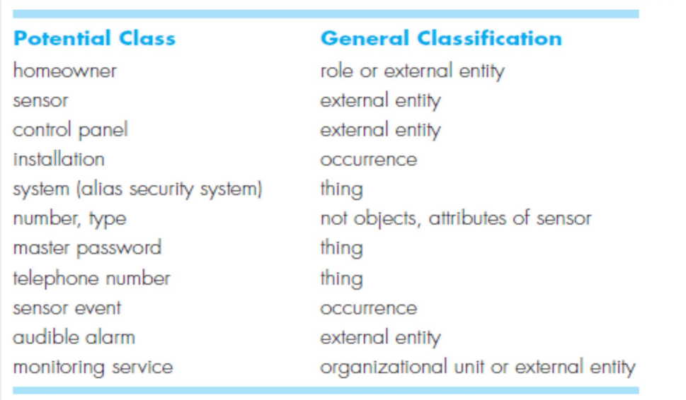

信息数据建模——建模结果：class diagram

以use case图为依据，做类图建模：include classes and objects, attributes, operations, class-responsibility-collaborator (CRC) models, collaboration diagrams, and packages.

# IDENTIFYING ANALYSIS CLASSES

 identify classes by examining the usage scenarios developed as part of the requirements model
用req spe，用需求归约为依据进行类建模

If the class (noun) is required to implement a solution, then it is part of the solution space; otherwise, if a class is necessary only to describe a solution, it is part of the problem space.（e.g., add items to shopping cart）

黑色：方法；蓝色：属性

最后一个大题：35分，提取类，类图，方法属性

对于每一个potential class，满足以下六个特性，就可以定义为类。
Retained information：属性中有系统需要用到的
Needed services：需要方法来改变自身的属性
Multiple attributes：多属性，只有一个属性的时候，和功能相近的潜在类放在一起。 
Common attributes / operations：拥有通用属性方法，可以定义成（父）类
Essential requirements：所有的外部实体

# SPECIFYING ATTRIBUTES

study each use case and select those “things” that reasonably “belong” to the class

What data items (composite and/or elementary) fully define this class in the context（上下文语义关联）

# DEFINING OPERATIONS

行为建模结果：状态图 state diagram

四种类型的方法: (1) operations that manipulate data in some way (e.g., adding, deleting, reformatting,selecting), 增加减少

(2) operations that perform a computation, 计算的方法

(3) operations that inquire about the state of an object, 询问状态get方法

(4) operations that monitor an object for the occurrence of a controlling event. 

有实际意义的动词，并且可以归属到某个类——》方法

软件：数据+代码+文档

# CLASS-RESPONSIBILITY-COLLABORATOR(CRC) MODELING

**<u>Responsibilities</u>** are the attributes and operations that are relevant for the class. 

 **<u>Collaborators</u>** are those classes that are required to provide a class with the information needed to complete a responsibility. In general, a collaboration implies either a request for information or a request for some action.（类和类之间互相提供信息，例如请求信息或者请求某种行动）

## Class

Entity classes：实体类 (也叫业务类，通常在数据库中)

Boundary classes：界面类 (用来创建界面交互)

> objects是实例化以后的。

<u>Controller classes/Interface class</u>：前后端交互的接口类

> 管理 1. 创建对象和接口交互 2. 界面接口类实例化对象化 3. 在实例化对象直接交互 4. 验证

## Responsibilities

这一小节将如何对潜在类优化

1. 类的方法功能是不是和整个系统的开发目标；类的方法属性功能要数量均匀；每个类的功能要有独立性

2. 要考虑继承，定义父类（属性方法具有通用性）

3. 通过构建潜在类的状态图（behavior）优化类和方法的定义

4. 每一个类应该做好自己的事情。不要管其他的。

5. 构建类的聚合关系。例如类Player聚合了PlayerBody,PlayerArms, PlayerLegs, PlayerHead；他们的很多属性方法等是共享的，例如速度，位置等。彼此之间也有colleberation

   > 类的关系：
   >
   > - 关联：双向的，互相可以请求
   > - 依赖：碧如界面依赖摄像头展示界面；
   > - 课程表依赖课程；
   > - 继承：
   > - 聚合

最后35-40分：给一页半页的需求，提取类构建继承聚合关系

## Collaborations

类的协作两种方法：

1. 自己操作自己use its own operations to manipulate its own attributes内部自己调用
2. 和其他类ollaborate with other classes

>  和其他类的三种笼统的关系： (1) the is-part-of relationship, 聚合(2) the has-knowledge-of relationship（双向）, and (3) the depends-upon relationship单向（依赖）

ppt29-30没听

# ASSOCIATIONS AND DEPENDENCIES

没听，好像说了很像ER图

# ANALYSIS PACKAGES

没听

第十章讲完了

