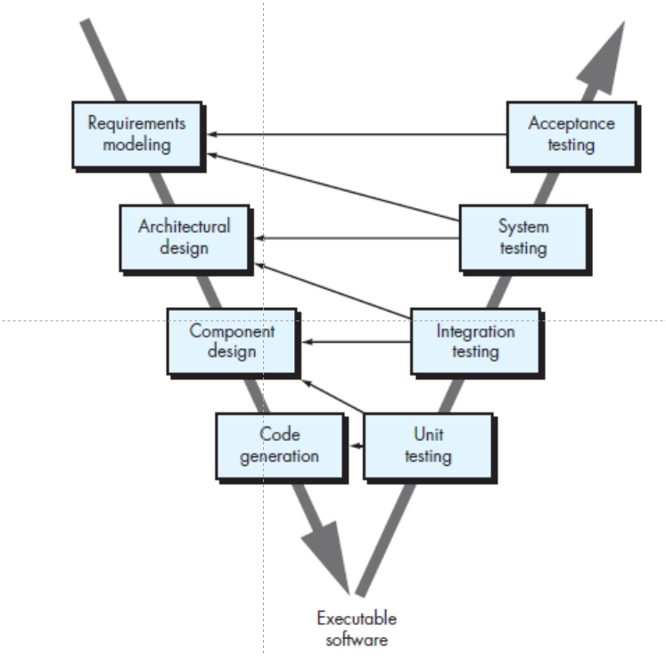

过程模型：

迭代程度：迭代层次（回到这层，上一层）

# 瀑布模型

## 特点

1. 按照general/standard process顺序开发，很少迭代：planing是umbrella可以去掉
2. 过程明确，需求清晰
3. 不主张迭代，但也有迭代
4. 用户需要很长时间才能得到成品
5. 某阶段受阻，整个项目都会到blocking states

也叫线性、顺序liner，sequential。因此是一个很经典的模型。

如果需求更改不多，可以使用

## V-model

左——》右：依据（单元测试以代码和详细设计为依据）

详细设计需要流程图

单元测试，需要写一个drawer，有对应源代码的输入接口，有输出。

# 增量过程模型

# 演化过程模型

